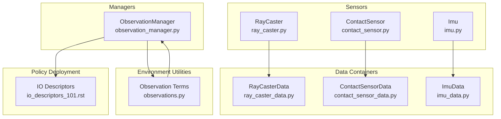
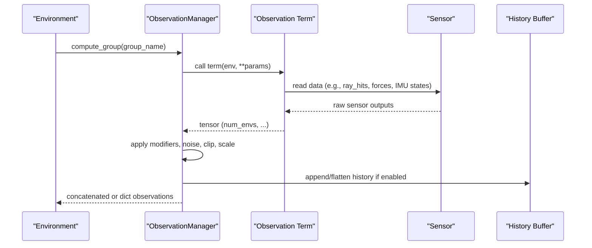
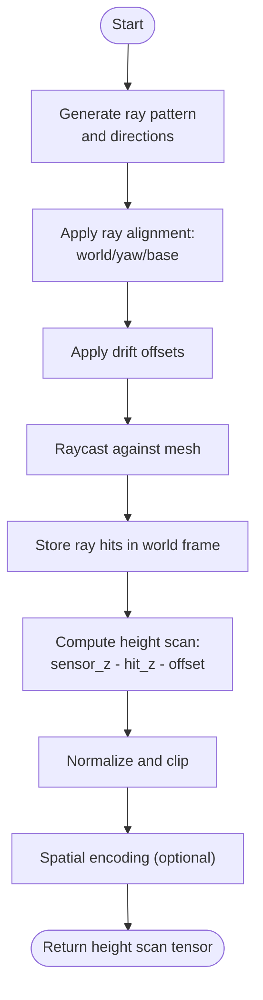
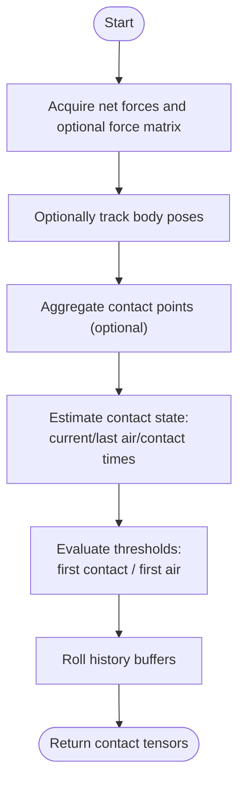
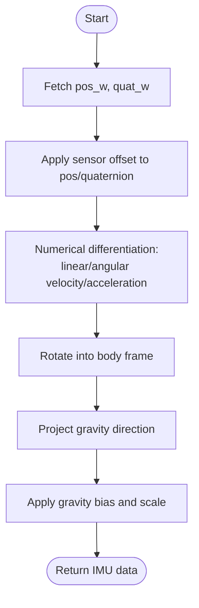
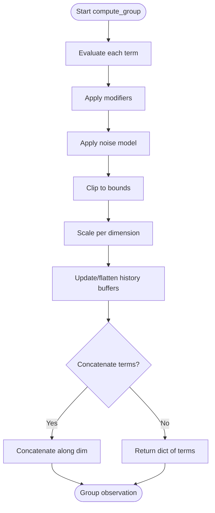
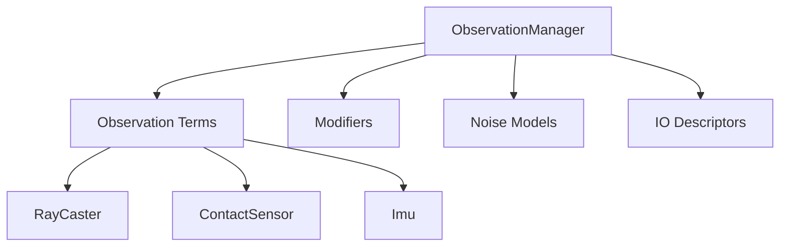

# Data Processing Pipelines

<cite>
**Referenced Files in This Document**
- [ray_caster.py](file://source/isaaclab/isaaclab/sensors/ray_caster/ray_caster.py)
- [ray_caster_data.py](file://source/isaaclab/isaaclab/sensors/ray_caster/ray_caster_data.py)
- [contact_sensor.py](file://source/isaaclab/isaaclab/sensors/contact_sensor/contact_sensor.py)
- [contact_sensor_data.py](file://source/isaaclab/isaaclab/sensors/contact_sensor/contact_sensor_data.py)
- [imu.py](file://source/isaaclab/isaaclab/sensors/imu/imu.py)
- [imu_data.py](file://source/isaaclab/isaaclab/sensors/imu/imu_data.py)
- [observation_manager.py](file://source/isaaclab/isaaclab/managers/observation_manager.py)
- [observations.py](file://source/isaaclab/isaaclab/envs/mdp/observations.py)
- [io_descriptors_101.rst](file://docs/source/policy_deployment/01_io_descriptors/io_descriptors_101.rst)
- [modifier.py](file://source/isaaclab/isaaclab/utils/modifiers/modifier.py)
- [test_noise.py](file://source/isaaclab/test/utils/test_noise.py)
</cite>

## Table of Contents
1. [Introduction](#introduction)
2. [Project Structure](#project-structure)
3. [Core Components](#core-components)
4. [Architecture Overview](#architecture-overview)
5. [Detailed Component Analysis](#detailed-component-analysis)
6. [Dependency Analysis](#dependency-analysis)
7. [Performance Considerations](#performance-considerations)
8. [Troubleshooting Guide](#troubleshooting-guide)
9. [Conclusion](#conclusion)
10. [Appendices](#appendices)

## Introduction
This document explains the sensor data processing pipelines that transform raw sensor measurements into environment observations. It covers:
- Height field processing from ray-cast hits to normalized distance values, including noise filtering, outlier rejection, and spatial encoding strategies
- Contact sensor data processing with threshold detection, temporal filtering, and contact state estimation
- IMU data preprocessing including bias correction, scale factor compensation, and coordinate frame transformations
- Observation concatenation across multiple sensors into unified observation vectors
- Privileged observation processing for curriculum learning and the IO descriptor system for policy deployment
- Practical examples of data transformation functions, normalization techniques, and memory management strategies

## Project Structure
The relevant components are organized under sensors, managers, and environment observation utilities:
- Sensors: Ray-caster, Contact sensor, IMU
- Managers: Observation manager orchestrating observation groups and concatenation
- Environment utilities: Observation terms that compose sensor data into environment observations
- Policy deployment: IO descriptors for policy export and reuse

**Diagram sources**
- [ray_caster.py:35-335](file://source/isaaclab/isaaclab/sensors/ray_caster/ray_caster.py#L35-L335)
- [contact_sensor.py:32-481](file://source/isaaclab/isaaclab/sensors/contact_sensor/contact_sensor.py#L32-L481)
- [imu.py:27-257](file://source/isaaclab/isaaclab/sensors/imu/imu.py#L27-L257)
- [ray_caster_data.py:10-30](file://source/isaaclab/isaaclab/sensors/ray_caster/ray_caster_data.py#L10-L30)
- [contact_sensor_data.py:13-130](file://source/isaaclab/isaaclab/sensors/contact_sensor/contact_sensor_data.py#L13-L130)
- [imu_data.py:12-57](file://source/isaaclab/isaaclab/sensors/imu/imu_data.py#L12-L57)
- [observation_manager.py:27-648](file://source/isaaclab/isaaclab/managers/observation_manager.py#L27-L648)
- [observations.py:289-422](file://source/isaaclab/isaaclab/envs/mdp/observations.py#L289-L422)
- [io_descriptors_101.rst:1-66](file://docs/source/policy_deployment/01_io_descriptors/io_descriptors_101.rst#L1-L66)

**Section sources**
- [ray_caster.py:35-335](file://source/isaaclab/isaaclab/sensors/ray_caster/ray_caster.py#L35-L335)
- [contact_sensor.py:32-481](file://source/isaaclab/isaaclab/sensors/contact_sensor/contact_sensor.py#L32-L481)
- [imu.py:27-257](file://source/isaaclab/isaaclab/sensors/imu/imu.py#L27-L257)
- [observation_manager.py:27-648](file://source/isaaclab/isaaclab/managers/observation_manager.py#L27-L648)
- [observations.py:289-422](file://source/isaaclab/isaaclab/envs/mdp/observations.py#L289-L422)
- [io_descriptors_101.rst:1-66](file://docs/source/policy_deployment/01_io_descriptors/io_descriptors_101.rst#L1-L66)

## Core Components
- RayCaster: Produces ray-hit positions in world coordinates; used to derive height scans and normalized distances
- ContactSensor: Reports normal contact forces, optionally filtered, with temporal air/contact durations and contact points
- Imu: Provides orientation, linear/angular velocity/acceleration in body frame, with gravity projection and numerical derivatives
- ObservationManager: Aggregates, transforms, concatenates, and history-flattens observation terms into groups
- Observation terms: Compose sensor outputs into environment observations (e.g., height_scan, imu_* terms)
- IO descriptors: Export metadata for policy deployment and curriculum learning

Key processing responsibilities:
- Noise filtering and temporal smoothing via modifiers and noise models
- Normalization and clipping for robust RL training
- Concatenation of heterogeneous sensor modalities into unified vectors
- Privileged observations for curriculum and policy portability

**Section sources**
- [ray_caster.py:232-305](file://source/isaaclab/isaaclab/sensors/ray_caster/ray_caster.py#L232-L305)
- [contact_sensor.py:346-438](file://source/isaaclab/isaaclab/sensors/contact_sensor/contact_sensor.py#L346-L438)
- [imu.py:151-195](file://source/isaaclab/isaaclab/sensors/imu/imu.py#L151-L195)
- [observation_manager.py:312-431](file://source/isaaclab/isaaclab/managers/observation_manager.py#L312-L431)
- [observations.py:289-422](file://source/isaaclab/isaaclab/envs/mdp/observations.py#L289-L422)

## Architecture Overview
The pipeline integrates sensor acquisition, per-term processing, and observation composition.

**Diagram sources**
- [observation_manager.py:312-431](file://source/isaaclab/isaaclab/managers/observation_manager.py#L312-L431)
- [observations.py:289-422](file://source/isaaclab/isaaclab/envs/mdp/observations.py#L289-L422)

## Detailed Component Analysis

### Height Field Processing Pipeline (Ray-Caster)
The height field is derived from ray-cast hits and transformed into normalized distance values suitable for downstream tasks.

Processing stages:
- Ray generation and alignment: Rays are generated according to a pattern and aligned to sensor/world/yaw orientations with optional drift offsets
- Ray-casting: Hits are computed against a static mesh; hits are stored in world coordinates
- Height scan derivation: Height scan is computed as sensor height minus hit Z plus an offset
- Normalization and encoding: Observation terms normalize and encode height scans into bounded representations

**Diagram sources**
- [ray_caster.py:212-305](file://source/isaaclab/isaaclab/sensors/ray_caster/ray_caster.py#L212-L305)
- [ray_caster_data.py:10-30](file://source/isaaclab/isaaclab/sensors/ray_caster/ray_caster_data.py#L10-L30)
- [observations.py:289-298](file://source/isaaclab/isaaclab/envs/mdp/observations.py#L289-L298)

Noise filtering and outlier rejection strategies:
- Drift offsets: Horizontal and vertical drift are sampled per environment to simulate sensor variability and reduce deterministic artifacts
- Clipping: Distance values can be clipped to a maximum distance to reject outliers
- Thresholding: Optional zeroing or clipping beyond thresholds to handle invalid hits

Normalization techniques:
- Observation terms can subtract means and scale channels for RGB-like height images
- Distance values can be clipped to a max bound to stabilize training

Memory management:
- Buffers are allocated per-sensor and per-environment; cloning is used to avoid aliasing during reads
- History buffers are managed via circular buffers to limit memory growth

Examples of relevant functions and paths:
- Ray initialization and drift: [ray_caster.py:212-230](file://source/isaaclab/isaaclab/sensors/ray_caster/ray_caster.py#L212-L230)
- Ray-cast and drift application: [ray_caster.py:294-305](file://source/isaaclab/isaaclab/sensors/ray_caster/ray_caster.py#L294-L305)
- Height scan term: [observations.py:289-298](file://source/isaaclab/isaaclab/envs/mdp/observations.py#L289-L298)
- Image normalization helpers: [observations.py:410-422](file://source/isaaclab/isaaclab/envs/mdp/observations.py#L410-L422)

**Section sources**
- [ray_caster.py:212-305](file://source/isaaclab/isaaclab/sensors/ray_caster/ray_caster.py#L212-L305)
- [ray_caster_data.py:10-30](file://source/isaaclab/isaaclab/sensors/ray_caster/ray_caster_data.py#L10-L30)
- [observations.py:289-298](file://source/isaaclab/isaaclab/envs/mdp/observations.py#L289-L298)
- [observations.py:410-422](file://source/isaaclab/isaaclab/envs/mdp/observations.py#L410-L422)

### Contact Sensor Data Processing
Contact sensor captures normal forces, optionally filtered by target bodies, and estimates contact state over time.

Processing stages:
- Force acquisition: Net normal forces and optional filtered force matrix are acquired per body
- Pose tracking: Optional body poses are tracked for visualization and spatial context
- Contact state estimation: Air/contact durations are maintained and air-time thresholds are evaluated to detect first contact and detachment
- Temporal filtering: Rolling histories capture recent force trends

**Diagram sources**
- [contact_sensor.py:346-438](file://source/isaaclab/isaaclab/sensors/contact_sensor/contact_sensor.py#L346-L438)
- [contact_sensor_data.py:13-130](file://source/isaaclab/isaaclab/sensors/contact_sensor/contact_sensor_data.py#L13-L130)

Threshold detection and temporal filtering:
- Force threshold determines contact onset
- First contact: bodies transitioning from air-time to contact-time within a time window
- First air: bodies transitioning from contact-time to air-time within a time window
- History buffers roll to maintain recent samples

Examples of relevant functions and paths:
- First contact detection: [contact_sensor.py:180-215](file://source/isaaclab/isaaclab/sensors/contact_sensor/contact_sensor.py#L180-L215)
- First air detection: [contact_sensor.py:216-250](file://source/isaaclab/isaaclab/sensors/contact_sensor/contact_sensor.py#L216-L250)
- Update buffers and state: [contact_sensor.py:410-438](file://source/isaaclab/isaaclab/sensors/contact_sensor/contact_sensor.py#L410-L438)

**Section sources**
- [contact_sensor.py:180-250](file://source/isaaclab/isaaclab/sensors/contact_sensor/contact_sensor.py#L180-L250)
- [contact_sensor.py:410-438](file://source/isaaclab/isaaclab/sensors/contact_sensor/contact_sensor.py#L410-L438)
- [contact_sensor_data.py:13-130](file://source/isaaclab/isaaclab/sensors/contact_sensor/contact_sensor_data.py#L13-L130)

### IMU Data Preprocessing
IMU provides orientation, velocities, and accelerations in the body frame, with gravity projection and numerical differentiation.

Processing stages:
- Pose retrieval: Position and orientation are fetched from the physics view and adjusted by sensor offset
- Velocity/acceleration computation: Numerical differentiation yields linear/angular velocity/acceleration
- Frame transformations: Rotate and shift to align with the IMU body frame; project gravity direction
- Bias and scale compensation: Gravity bias and optional scale adjustments are applied

**Diagram sources**
- [imu.py:151-195](file://source/isaaclab/isaaclab/sensors/imu/imu.py#L151-L195)
- [imu_data.py:12-57](file://source/isaaclab/isaaclab/sensors/imu/imu_data.py#L12-L57)

Bias correction and coordinate frame transformations:
- Gravity bias compensation: Subtract a configurable bias from linear acceleration
- Scale factor compensation: Optional per-dimension scaling factors
- Coordinate frame alignment: Apply offset rotation and translation to align sensor frame with body frame

Examples of relevant functions and paths:
- Update buffers and differentiation: [imu.py:151-195](file://source/isaaclab/isaaclab/sensors/imu/imu.py#L151-L195)
- Gravity vector storage: [imu.py:142-147](file://source/isaaclab/isaaclab/sensors/imu/imu.py#L142-L147)
- Observation terms for IMU: [observations.py:312-371](file://source/isaaclab/isaaclab/envs/mdp/observations.py#L312-L371)

**Section sources**
- [imu.py:151-195](file://source/isaaclab/isaaclab/sensors/imu/imu.py#L151-L195)
- [imu.py:142-147](file://source/isaaclab/isaaclab/sensors/imu/imu.py#L142-L147)
- [observations.py:312-371](file://source/isaaclab/isaaclab/envs/mdp/observations.py#L312-L371)

### Observation Concatenation and Privileged Observations
ObservationManager aggregates heterogeneous terms into groups, applies modifiers and noise, and concatenates into unified vectors.

Processing stages:
- Term evaluation: Each term computes a tensor sized (num_envs, ...)
- Post-processing: Modifiers, noise, clipping, scaling are applied in sequence
- History management: Optional rolling buffers and flattening
- Group concatenation: Terms concatenated along a specified dimension or returned as a dictionary

**Diagram sources**
- [observation_manager.py:312-431](file://source/isaaclab/isaaclab/managers/observation_manager.py#L312-L431)

Privileged observations and curriculum learning:
- Privileged terms expose internal states (e.g., root state, body poses) for curriculum and imitation
- IO descriptors capture term metadata for policy deployment and external tooling

Examples of relevant functions and paths:
- Term processing and concatenation: [observation_manager.py:388-431](file://source/isaaclab/isaaclab/managers/observation_manager.py#L388-L431)
- IO descriptors export: [observation_manager.py:229-290](file://source/isaaclab/isaaclab/managers/observation_manager.py#L229-L290)
- IO descriptors documentation: [io_descriptors_101.rst:1-66](file://docs/source/policy_deployment/01_io_descriptors/io_descriptors_101.rst#L1-L66)

**Section sources**
- [observation_manager.py:312-431](file://source/isaaclab/isaaclab/managers/observation_manager.py#L312-L431)
- [observation_manager.py:229-290](file://source/isaaclab/isaaclab/managers/observation_manager.py#L229-L290)
- [io_descriptors_101.rst:1-66](file://docs/source/policy_deployment/01_io_descriptors/io_descriptors_101.rst#L1-L66)

### Memory Management Strategies
- Circular buffers: Used for observation histories to cap memory usage
- Cloning: Ensures read-only operations do not alias shared buffers
- Conditional allocations: Optional buffers (pose, contact points, filtered forces) are allocated only when configured

Examples of relevant functions and paths:
- Circular buffer usage: [observation_manager.py:404-421](file://source/isaaclab/isaaclab/managers/observation_manager.py#L404-L421)
- Cloning in ray-caster updates: [ray_caster.py:246-247](file://source/isaaclab/isaaclab/sensors/ray_caster/ray_caster.py#L246-L247)
- Conditional buffer creation: [contact_sensor.py:299-344](file://source/isaaclab/isaaclab/sensors/contact_sensor/contact_sensor.py#L299-L344)

**Section sources**
- [observation_manager.py:404-421](file://source/isaaclab/isaaclab/managers/observation_manager.py#L404-L421)
- [ray_caster.py:246-247](file://source/isaaclab/isaaclab/sensors/ray_caster/ray_caster.py#L246-L247)
- [contact_sensor.py:299-344](file://source/isaaclab/isaaclab/sensors/contact_sensor/contact_sensor.py#L299-L344)

## Dependency Analysis
The following diagram shows key dependencies among components:

**Diagram sources**
- [observation_manager.py:312-431](file://source/isaaclab/isaaclab/managers/observation_manager.py#L312-L431)
- [observations.py:289-422](file://source/isaaclab/isaaclab/envs/mdp/observations.py#L289-L422)
- [modifier.py:67-121](file://source/isaaclab/isaaclab/utils/modifiers/modifier.py#L67-L121)
- [test_noise.py:66-111](file://source/isaaclab/test/utils/test_noise.py#L66-L111)

**Section sources**
- [observation_manager.py:312-431](file://source/isaaclab/isaaclab/managers/observation_manager.py#L312-L431)
- [observations.py:289-422](file://source/isaaclab/isaaclab/envs/mdp/observations.py#L289-L422)
- [modifier.py:67-121](file://source/isaaclab/isaaclab/utils/modifiers/modifier.py#L67-L121)
- [test_noise.py:66-111](file://source/isaaclab/test/utils/test_noise.py#L66-L111)

## Performance Considerations
- Prefer batched operations across environments and sensors to minimize kernel launches
- Use circular buffers for histories to cap memory and avoid fragmentation
- Apply clipping and scaling early to constrain dynamic ranges and improve stability
- Limit per-term history length to balance fidelity and memory footprint
- Use appropriate ray alignment modes (world/yaw/base) to reduce unnecessary rotations

[No sources needed since this section provides general guidance]

## Troubleshooting Guide
Common issues and resolutions:
- Concatenation errors: Ensure observation terms in a group have compatible shapes or disable concatenation
- Contact sensor thresholds: Verify force threshold and update cadence; adjust for noisy environments
- IMU accuracy: Use adequate physics timestep and verify gravity bias configuration
- IO descriptor mismatches: Confirm term order and metadata match exported descriptors

Relevant references:
- Concatenation validation and error messages: [observation_manager.py:103-109](file://source/isaaclab/isaaclab/managers/observation_manager.py#L103-L109)
- Contact sensor threshold usage: [contact_sensor.py:415-416](file://source/isaaclab/isaaclab/sensors/contact_sensor/contact_sensor.py#L415-L416)
- IMU timestep recommendation: [imu.py:35-47](file://source/isaaclab/isaaclab/sensors/imu/imu.py#L35-L47)
- IO descriptor export: [observation_manager.py:229-290](file://source/isaaclab/isaaclab/managers/observation_manager.py#L229-L290)

**Section sources**
- [observation_manager.py:103-109](file://source/isaaclab/isaaclab/managers/observation_manager.py#L103-L109)
- [contact_sensor.py:415-416](file://source/isaaclab/isaaclab/sensors/contact_sensor/contact_sensor.py#L415-L416)
- [imu.py:35-47](file://source/isaaclab/isaaclab/sensors/imu/imu.py#L35-L47)
- [observation_manager.py:229-290](file://source/isaaclab/isaaclab/managers/observation_manager.py#L229-L290)

## Conclusion
The pipeline integrates ray-cast height fields, contact forces, and IMU measurements into robust, normalized observations. ObservationManager orchestrates per-term processing, temporal histories, and concatenation, while IO descriptors enable policy portability and curriculum learning. Proper noise filtering, threshold tuning, and memory management are essential for reliable training and deployment.

[No sources needed since this section summarizes without analyzing specific files]

## Appendices

### Example Data Transformation Functions
- Height scan: [observations.py:289-298](file://source/isaaclab/isaaclab/envs/mdp/observations.py#L289-L298)
- IMU orientation/velocity/acceleration: [observations.py:312-371](file://source/isaaclab/isaaclab/envs/mdp/observations.py#L312-L371)
- Image normalization: [observations.py:410-422](file://source/isaaclab/isaaclab/envs/mdp/observations.py#L410-L422)

### Normalization Techniques
- Constant noise injection: [test_noise.py:90-111](file://source/isaaclab/test/utils/test_noise.py#L90-L111)
- Digital filtering: [modifier.py:67-121](file://source/isaaclab/isaaclab/utils/modifiers/modifier.py#L67-L121)

[No sources needed since this section aggregates previously cited material]