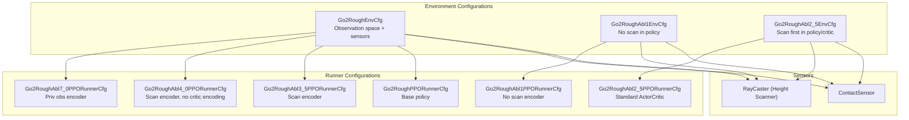
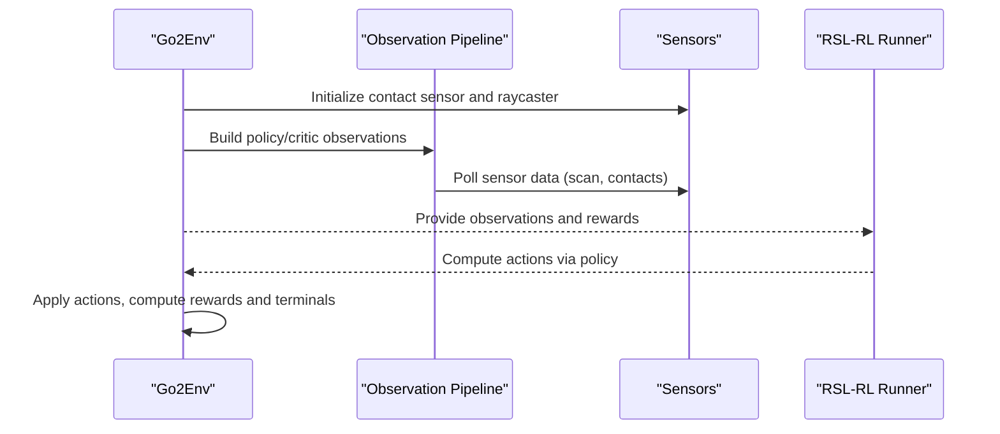
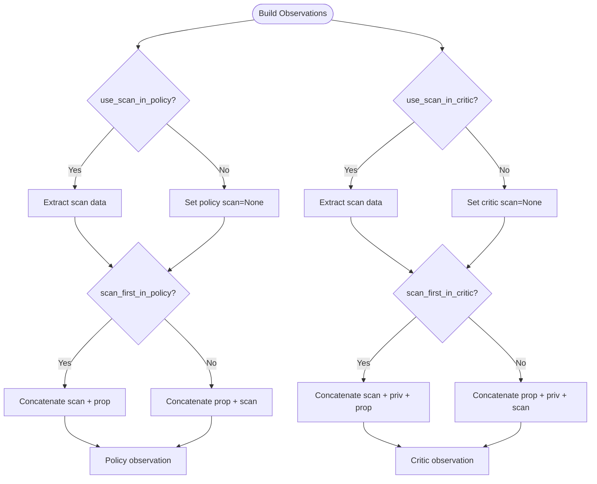
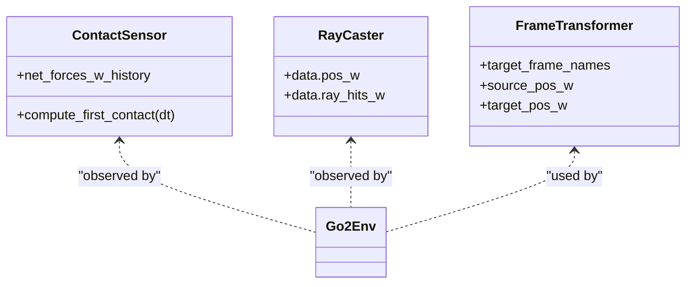
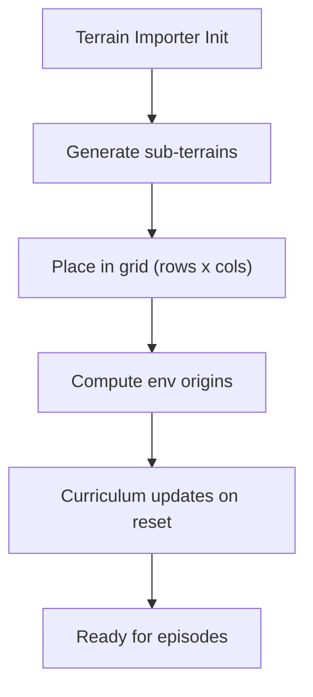
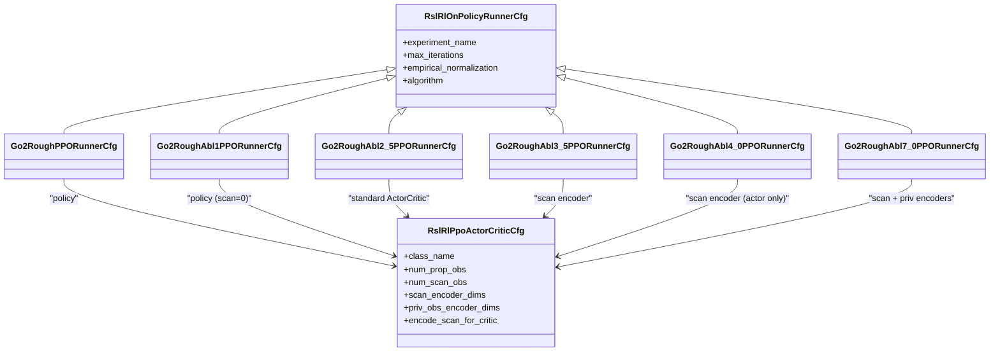
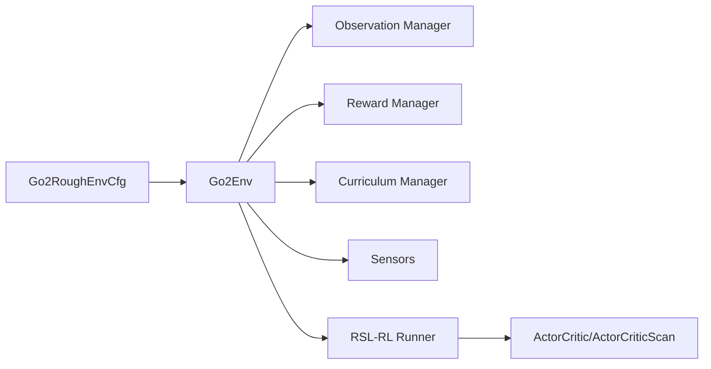

# Integration with Ablation Studies

<cite>
**Referenced Files in This Document**
- [go2_env_cfg.py](file://source/isaaclab_tasks/isaaclab_tasks/direct/go2/go2_env_cfg.py)
- [go2_env.py](file://source/isaaclab_tasks/isaaclab_tasks/direct/go2/go2_env.py)
- [rsl_rl_ppo_cfg.py](file://source/isaaclab_tasks/isaaclab_tasks/direct/go2/agents/rsl_rl_ppo_cfg.py)
- [__init__.py](file://source/isaaclab_tasks/isaaclab_tasks/direct/go2/__init__.py)
- [observations.py](file://source/isaaclab/isaaclab/envs/mdp/observations.py)
- [observation_manager.py](file://source/isaaclab/isaaclab/managers/observation_manager.py)
- [reward_manager.py](file://source/isaaclab/isaaclab/managers/reward_manager.py)
- [curriculum_manager.py](file://source/isaaclab/isaaclab/managers/curriculum_manager.py)
- [terrain_importer.py](file://source/isaaclab/isaaclab/terrains/terrain_importer.py)
- [terrain_generator.py](file://source/isaaclab/isaaclab/terrains/terrain_generator.py)
- [mesh_terrains.py](file://source/isaaclab/isaaclab/terrains/trimesh/mesh_terrains.py)
- [contact_sensor.py](file://source/isaaclab/isaaclab/sensors/contact_sensor/contact_sensor.py)
- [contact_sensor_cfg.py](file://source/isaaclab/isaaclab/sensors/contact_sensor/contact_sensor_cfg.py)
- [raycaster_sensor.py](file://source/isaaclab/isaaclab/sensors/raycaster/raycaster_sensor.py)
- [frame_transformer.py](file://source/isaaclab/isaaclab/sensors/frame_transformer/frame_transformer.py)
- [parse_cfg.py](file://source/isaaclab_tasks/isaaclab_tasks/utils/parse_cfg.py)
- [benchmark_rlgames.py](file://scripts/benchmarks/benchmark_rlgames.py)
- [README.md](file://assets/videos/README.md)
</cite>

## Table of Contents
1. [Introduction](#introduction)
2. [Project Structure](#project-structure)
3. [Core Components](#core-components)
4. [Architecture Overview](#architecture-overview)
5. [Detailed Component Analysis](#detailed-component-analysis)
6. [Dependency Analysis](#dependency-analysis)
7. [Performance Considerations](#performance-considerations)
8. [Troubleshooting Guide](#troubleshooting-guide)
9. [Conclusion](#conclusion)
10. [Appendices](#appendices)

## Introduction
This document explains how the sensor integration system supports systematic ablation studies for quadruped parkour locomotion. It covers environment configuration mechanisms enabling rapid switching among sensor fusion architectures, experimental design principles for controlled comparisons, performance benchmarking across terrain types and task complexities, training protocol modifications for each ablation, and an analysis framework for comparing training curves and final metrics. It concludes with guidelines for replicating ablations with custom sensor configurations and interpreting results for publication.

## Project Structure
The ablation study is centered around the Go2 quadruped environment with multiple configurations and runner setups:
- Environment configurations define observation spaces, sensors, reward functions, and curriculum behavior.
- Runner configurations define neural network architectures and training hyperparameters for each ablation.
- Sensors (contact, raycaster) feed perception data into the policy and/or critic.
- Terrain generators and importers provide controlled, repeatable environments across multiple difficulty levels.

**Diagram sources**
- [go2_env_cfg.py:173-353](file://source/isaaclab_tasks/isaaclab_tasks/direct/go2/go2_env_cfg.py#L173-L353)
- [rsl_rl_ppo_cfg.py:78-155](file://source/isaaclab_tasks/isaaclab_tasks/direct/go2/agents/rsl_rl_ppo_cfg.py#L78-L155)

**Section sources**
- [go2_env_cfg.py:173-353](file://source/isaaclab_tasks/isaaclab_tasks/direct/go2/go2_env_cfg.py#L173-L353)
- [rsl_rl_ppo_cfg.py:78-155](file://source/isaaclab_tasks/isaaclab_tasks/direct/go2/agents/rsl_rl_ppo_cfg.py#L78-L155)

## Core Components
- Environment configurations encapsulate:
  - Observation composition flags (e.g., whether to include scan data in policy/critic).
  - Sensor definitions (contact and raycaster).
  - Reward function scales tailored to terrain and task.
  - Curriculum and command modes for controlled variability.
- Runner configurations encapsulate:
  - Neural network architectures specialized for sensor fusion (e.g., scan encoders, privileged observation encoders).
  - Training hyperparameters (learning rate, KL target, batch sizes).
- Sensors:
  - Contact sensor for contact flags and air-time statistics.
  - RayCaster for height-field scanning used as spatial scan observations.

Key ablation strategies:
- Abl1: Remove scan from policy (no scan-in-policy).
- Abl2.5: Scan-first concatenation in both policy and critic.
- Abl3.5: Shared scan encoder.
- Abl4.0: Scan encoder for actor, but not for critic.
- Abl7.0: Privileged observation encoder alongside scan encoder.

**Section sources**
- [go2_env_cfg.py:333-353](file://source/isaaclab_tasks/isaaclab_tasks/direct/go2/go2_env_cfg.py#L333-L353)
- [rsl_rl_ppo_cfg.py:11-155](file://source/isaaclab_tasks/isaaclab_tasks/direct/go2/agents/rsl_rl_ppo_cfg.py#L11-L155)
- [go2_env.py:293-355](file://source/isaaclab_tasks/isaaclab_tasks/direct/go2/go2_env.py#L293-L355)

## Architecture Overview
The system integrates environment configuration, sensor data pipelines, and training runners to support controlled ablations. The environment builds observations combining proprioceptive signals and optional scan data, while the runner defines how these observations are processed by the policy and critic networks.

**Diagram sources**
- [go2_env.py:212-355](file://source/isaaclab_tasks/isaaclab_tasks/direct/go2/go2_env.py#L212-L355)
- [rsl_rl_ppo_cfg.py:11-155](file://source/isaaclab_tasks/isaaclab_tasks/direct/go2/agents/rsl_rl_ppo_cfg.py#L11-L155)

## Detailed Component Analysis

### Environment Configuration and Observation Composition
- Observation groups:
  - Proprioceptive: joint positions/velocities, gravity projection, base velocities, commands, last action, foot contact flags.
  - Scan: height-field raycast-derived distances.
  - Privileged: domain-randomized mass/com/friction/PD gains.
- Concatenation modes:
  - Policy observation: prop + optional scan (order controlled by flags).
  - Critic observation: prop + privileged + optional scan (order controlled by flags).
- Flags controlling fusion:
  - use_scan_in_policy/use_scan_in_critic toggle inclusion of scan.
  - scan_first_in_policy/scan_first_in_critic control concatenation order.

**Diagram sources**
- [go2_env.py:293-355](file://source/isaaclab_tasks/isaaclab_tasks/direct/go2/go2_env.py#L293-L355)
- [go2_env_cfg.py:333-353](file://source/isaaclab_tasks/isaaclab_tasks/direct/go2/go2_env_cfg.py#L333-L353)

**Section sources**
- [go2_env.py:293-355](file://source/isaaclab_tasks/isaaclab_tasks/direct/go2/go2_env.py#L293-L355)
- [go2_env_cfg.py:333-353](file://source/isaaclab_tasks/isaaclab_tasks/direct/go2/go2_env_cfg.py#L333-L353)

### Reward Function and Termination
- Rewards include tracking terms, penalties for torques/accelerations/action rate, air time, undesired contacts, orientation, base height, stumbling, and work.
- Termination includes death and time-out.
- Reward scales are tuned per terrain and ablation to emphasize relevant behaviors (e.g., base height on rough terrain).

```mermaid
flowchart TD
RStart(["Compute Rewards"]) --> VelErr["Linear velocity tracking error"]
RStart --> YawErr["Yaw rate tracking error"]
RStart --> ZVel["Z velocity penalty"]
RStart --> JTorque["Joint torque penalty"]
RStart --> JAccel["Joint acceleration penalty"]
RStart --> ActionRate["Action rate penalty"]
RStart --> AirTime["Feet air time bonus"]
RStart --> Undesired["Undesired contacts penalty"]
RStart --> FlatOri["Flat orientation penalty"]
RStart --> BaseH["Base height penalty"]
RStart --> Torque["Torque term"]
RStart --> StopLin["Stop penalty (linear)"]
RStart --> StopAng["Stop penalty (angular)"]
RStart --> HipPos["Hip position penalty"]
RStart --> Stumble["Feet stumble penalty"]
RStart --> Work["Work penalty"]
VelErr --> Sum["Sum weighted rewards"]
YawErr --> Sum
ZVel --> Sum
JTorque --> Sum
JAccel --> Sum
ActionRate --> Sum
AirTime --> Sum
Undesired --> Sum
FlatOri --> Sum
BaseH --> Sum
Torque --> Sum
StopLin --> Sum
StopAng --> Sum
HipPos --> Sum
Stumble --> Sum
Work --> Sum
Sum --> ROut["Total reward"]
```

**Diagram sources**
- [go2_env.py:357-465](file://source/isaaclab_tasks/isaaclab_tasks/direct/go2/go2_env.py#L357-L465)

**Section sources**
- [go2_env.py:357-465](file://source/isaaclab_tasks/isaaclab_tasks/direct/go2/go2_env.py#L357-L465)

### Sensor Integration and Data Pipelines
- Contact sensor:
  - Provides contact flags and air-time statistics used in rewards and observations.
  - Supports filtering and visualization markers.
- RayCaster (height scanner):
  - Generates scan data used as spatial observations.
  - Configurable pattern/grid and alignment for footprint coverage.
- Frame transformer sensor:
  - Transforms frames for downstream perception or control.

**Diagram sources**
- [contact_sensor.py](file://source/isaaclab/isaaclab/sensors/contact_sensor/contact_sensor.py)
- [contact_sensor_cfg.py:61-76](file://source/isaaclab/isaaclab/sensors/contact_sensor/contact_sensor_cfg.py#L61-L76)
- [raycaster_sensor.py](file://source/isaaclab/isaaclab/sensors/raycaster/raycaster_sensor.py)
- [frame_transformer.py:346-365](file://source/isaaclab/isaaclab/sensors/frame_transformer/frame_transformer.py#L346-L365)
- [go2_env.py:212-220](file://source/isaaclab_tasks/isaaclab_tasks/direct/go2/go2_env.py#L212-L220)

**Section sources**
- [contact_sensor.py](file://source/isaaclab/isaaclab/sensors/contact_sensor/contact_sensor.py)
- [contact_sensor_cfg.py:61-76](file://source/isaaclab/isaaclab/sensors/contact_sensor/contact_sensor_cfg.py#L61-L76)
- [raycaster_sensor.py](file://source/isaaclab/isaaclab/sensors/raycaster/raycaster_sensor.py)
- [frame_transformer.py:346-365](file://source/isaaclab/isaaclab/sensors/frame_transformer/frame_transformer.py#L346-L365)
- [go2_env.py:212-220](file://source/isaaclab_tasks/isaaclab_tasks/direct/go2/go2_env.py#L212-L220)

### Terrain Generation and Curriculum
- Terrain importer generates environments with mixed sub-terrains and difficulty levels.
- Curriculum manager adjusts environment origins and difficulty based on agent performance.
- Terrain generator supports both random and curriculum-based layouts.

**Diagram sources**
- [terrain_importer.py:329-348](file://source/isaaclab/isaaclab/terrains/terrain_importer.py#L329-L348)
- [terrain_generator.py:230-262](file://source/isaaclab/isaaclab/terrains/terrain_generator.py#L230-L262)
- [mesh_terrains.py:164-1105](file://source/isaaclab/isaaclab/terrains/trimesh/mesh_terrains.py#L164-L1105)

**Section sources**
- [terrain_importer.py:329-348](file://source/isaaclab/isaaclab/terrains/terrain_importer.py#L329-L348)
- [terrain_generator.py:230-262](file://source/isaaclab/isaaclab/terrains/terrain_generator.py#L230-L262)
- [mesh_terrains.py:164-1105](file://source/isaaclab/isaaclab/terrains/trimesh/mesh_terrains.py#L164-L1105)

### Training Protocols and Ablation-Specific Runners
- Base runner:
  - Uses ActorCriticScan with scan encoder and shared privileged encoder.
- Abl1:
  - Removes scan from policy (num_actor_scan_obs=0).
- Abl2.5:
  - Switches to standard ActorCritic (no scan-specific policy).
- Abl3.5:
  - Retains scan encoder for actor.
- Abl4.0:
  - Retains scan encoder for actor, disables scan encoding for critic.
- Abl7.0:
  - Adds privileged observation encoder alongside scan encoder.

**Diagram sources**
- [rsl_rl_ppo_cfg.py:78-155](file://source/isaaclab_tasks/isaaclab_tasks/direct/go2/agents/rsl_rl_ppo_cfg.py#L78-L155)

**Section sources**
- [rsl_rl_ppo_cfg.py:78-155](file://source/isaaclab_tasks/isaaclab_tasks/direct/go2/agents/rsl_rl_ppo_cfg.py#L78-L155)

### Experimental Design Principles
- Baseline comparisons:
  - Use Abl1 (no scan in policy) as a strong baseline to isolate perception benefits.
  - Use Abl2.5 (scan-first) to assess ordering effects.
- Controlled variable testing:
  - Keep terrain layout, curriculum, and reward scales consistent across ablations.
  - Vary only the observation composition flags and runner policy configuration.
- Statistical significance:
  - Run multiple seeds per condition.
  - Report aggregated metrics (mean ± std) and effect sizes.
  - Use appropriate statistical tests (e.g., paired t-tests across seeds).

[No sources needed since this section provides general guidance]

### Performance Benchmarking Methodology
- Metrics:
  - Episode return, success rate (where applicable), convergence steps to target performance, final performance averages.
- Environments:
  - Flat and rough terrains; curriculum on/off conditions.
- Analysis:
  - Compare training curves (rolling windows), final performance, and sample efficiency.
  - Stratify by terrain type and task complexity (e.g., gap/hurdle/stairs/parkour strips).

[No sources needed since this section provides general guidance]

### Training Protocol Modifications for Each Ablation
- Observation space adjustments:
  - Abl1: Set use_scan_in_policy=False; ensure policy observation dimension matches prop-only.
  - Abl2.5: Set scan_first_in_policy/scan_first_in_critic=True; ensure policy/critic concat order is maintained.
  - Abl3.5/Abl4.0/Abl7.0: Configure scan_encoder_dims and encode_scan_for_critic accordingly.
- Reward function adaptations:
  - Tune reward scales per terrain to maintain comparable difficulty and stability across ablations.
- Curriculum and commands:
  - Keep curriculum active for rough terrain; fix commands for evaluation runs.

**Section sources**
- [go2_env_cfg.py:333-353](file://source/isaaclab_tasks/isaaclab_tasks/direct/go2/go2_env_cfg.py#L333-L353)
- [go2_env.py:473-598](file://source/isaaclab_tasks/isaaclab_tasks/direct/go2/go2_env.py#L473-L598)
- [rsl_rl_ppo_cfg.py:114-155](file://source/isaaclab_tasks/isaaclab_tasks/direct/go2/agents/rsl_rl_ppo_cfg.py#L114-L155)

### Analysis Framework for Comparing Strategies
- Training curves:
  - Plot smoothed returns and success rates across seeds.
  - Compare convergence rates and plateau performance.
- Final performance metrics:
  - Aggregate final 10% performance windows.
  - Report confidence intervals.
- Sensitivity analysis:
  - Evaluate robustness to terrain type and command regimes.

[No sources needed since this section provides general guidance]

### Guidelines for Custom Sensor Configurations
- Define new sensors in the environment’s scene and sensors registry.
- Extend observation composition to include new modalities (e.g., RGB camera features).
- Update runner policy to incorporate new observation dimensions and encoders.
- Register new environment variants mirroring existing ablation flags for controlled comparisons.

[No sources needed since this section provides general guidance]

## Dependency Analysis
The ablation system hinges on clean separation between environment configuration, sensor pipelines, and runner policies.

**Diagram sources**
- [go2_env_cfg.py:173-353](file://source/isaaclab_tasks/isaaclab_tasks/direct/go2/go2_env_cfg.py#L173-L353)
- [go2_env.py:212-355](file://source/isaaclab_tasks/isaaclab_tasks/direct/go2/go2_env.py#L212-L355)
- [rsl_rl_ppo_cfg.py:78-155](file://source/isaaclab_tasks/isaaclab_tasks/direct/go2/agents/rsl_rl_ppo_cfg.py#L78-L155)

**Section sources**
- [go2_env_cfg.py:173-353](file://source/isaaclab_tasks/isaaclab_tasks/direct/go2/go2_env_cfg.py#L173-L353)
- [go2_env.py:212-355](file://source/isaaclab_tasks/isaaclab_tasks/direct/go2/go2_env.py#L212-L355)
- [rsl_rl_ppo_cfg.py:78-155](file://source/isaaclab_tasks/isaaclab_tasks/direct/go2/agents/rsl_rl_ppo_cfg.py#L78-L155)

## Performance Considerations
- Observation composition cost:
  - Including scan data increases policy/critic input size; tune hidden dimensions and encoder depths accordingly.
- Curriculum overhead:
  - Terrain origin recomputation and curriculum updates add minor overhead; ensure efficient batching.
- Sensor fidelity:
  - Raycaster resolution and pattern impact scan quality and computational cost; balance accuracy and speed.

[No sources needed since this section provides general guidance]

## Troubleshooting Guide
- Observation dimension mismatches:
  - Verify num_prop_obs, num_scan_obs, and scan_encoder_dims match environment observation construction.
- Sensor initialization errors:
  - Ensure sensor prim paths are valid and match environment namespaces.
- Curriculum instability:
  - Adjust curriculum thresholds and update intervals; confirm terrain origins are computed before resets.
- Training divergence:
  - Reduce learning rate or adjust KL targets; verify reward scales are appropriate for the chosen ablation.

**Section sources**
- [go2_env.py:212-355](file://source/isaaclab_tasks/isaaclab_tasks/direct/go2/go2_env.py#L212-L355)
- [terrain_importer.py:329-348](file://source/isaaclab/isaaclab/terrains/terrain_importer.py#L329-L348)
- [rsl_rl_ppo_cfg.py:78-155](file://source/isaaclab_tasks/isaaclab_tasks/direct/go2/agents/rsl_rl_ppo_cfg.py#L78-L155)

## Conclusion
The sensor integration system enables rigorous, controlled ablation studies by cleanly separating environment configuration, sensor pipelines, and training runners. By systematically varying observation composition and encoder architectures, researchers can isolate the contribution of perception to locomotion performance across diverse terrains and tasks. The provided configurations, training protocols, and analysis framework support reproducible experiments and meaningful comparisons suitable for publication.

## Appendices

### Appendix A: Environment Registration for Ablations
- Gym registration entries map task IDs to environment and runner configurations, enabling easy selection of ablation variants.

**Section sources**
- [__init__.py:49-87](file://source/isaaclab_tasks/isaaclab_tasks/direct/go2/__init__.py#L49-L87)

### Appendix B: Benchmarking and Logging Utilities
- Benchmark scripts demonstrate logging of environment and agent configurations, aiding reproducibility and comparison across runs.

**Section sources**
- [benchmark_rlgames.py:155-179](file://scripts/benchmarks/benchmark_rlgames.py#L155-L179)

### Appendix C: Video Assets for Ablations
- Example video assets illustrate trained behaviors across ablation strategies.

**Section sources**
- [README.md](file://assets/videos/README.md)