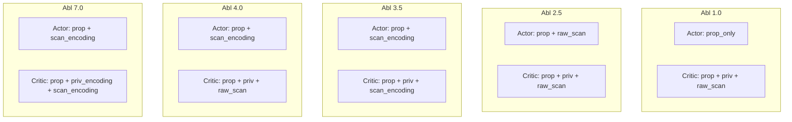
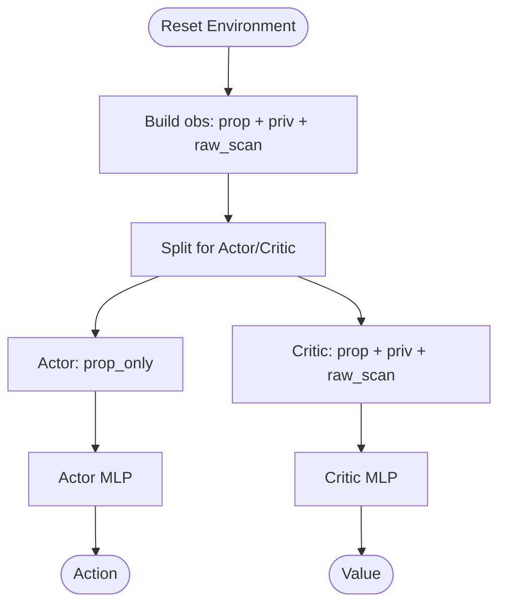
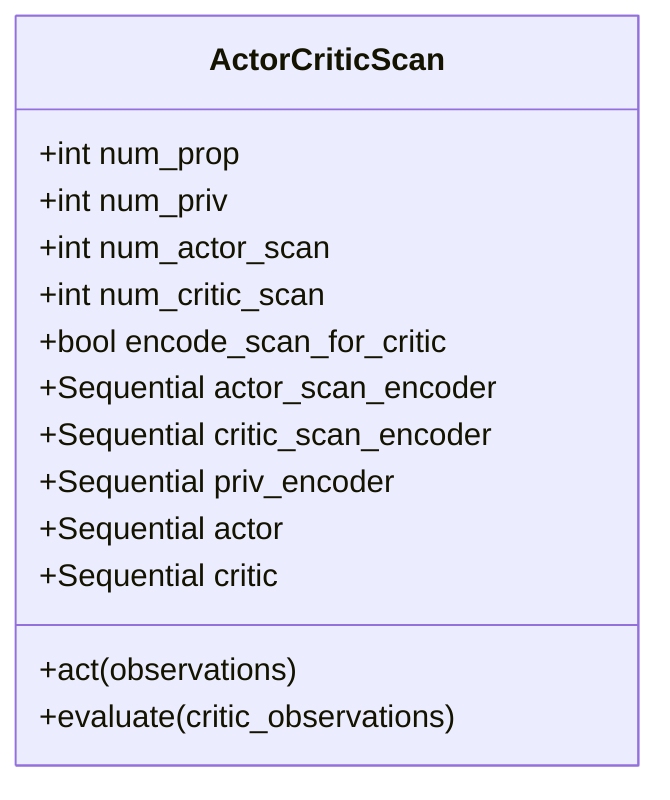
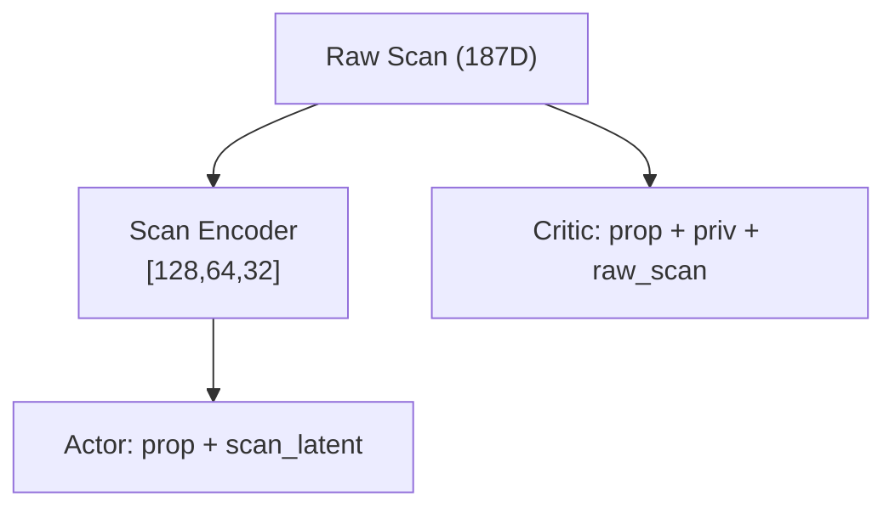
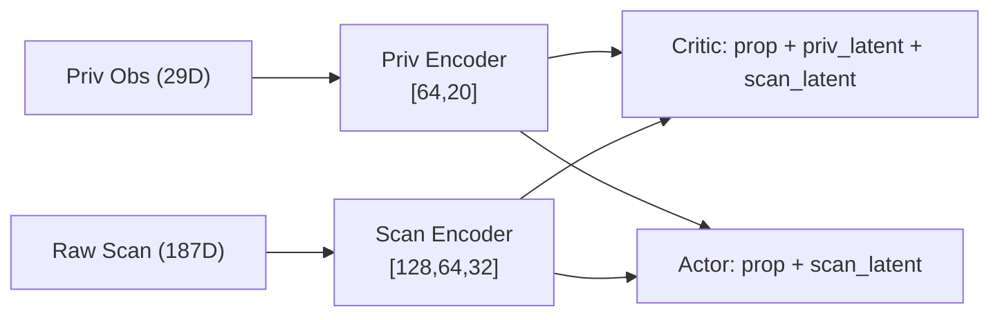
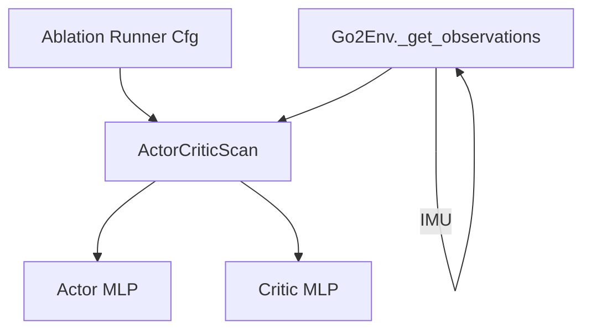

# Sensor Fusion Architectures

<cite>
**Referenced Files in This Document**
- [README.md](file://README.md)
- [go2_env_cfg.py](file://source/isaaclab_tasks/isaaclab_tasks/direct/go2/go2_env_cfg.py)
- [go2_env.py](file://source/isaaclab_tasks/isaaclab_tasks/direct/go2/go2_env.py)
- [actor_critic_scan.py](file://source/isaaclab_tasks/isaaclab_tasks/direct/go2/agents/actor_critic_scan.py)
- [rsl_rl_ppo_cfg.py](file://source/isaaclab_tasks/isaaclab_tasks/direct/go2/agents/rsl_rl_ppo_cfg.py)
- [__init__.py](file://source/isaaclab_tasks/isaaclab_tasks/direct/go2/__init__.py)
- [raycaster_sensor.py](file://scripts/demos/sensors/raycaster_sensor.py)
- [imu.rst](file://docs/source/overview/core-concepts/sensors/imu.rst)
- [imu.py](file://source/isaaclab/isaaclab/sensors/imu/imu.py)
</cite>

## Table of Contents
1. [Introduction](#introduction)
2. [Project Structure](#project-structure)
3. [Core Components](#core-components)
4. [Architecture Overview](#architecture-overview)
5. [Detailed Component Analysis](#detailed-component-analysis)
6. [Dependency Analysis](#dependency-analysis)
7. [Performance Considerations](#performance-considerations)
8. [Troubleshooting Guide](#troubleshooting-guide)
9. [Conclusion](#conclusion)
10. [Appendices](#appendices)

## Introduction
This document explains the five sensor fusion architectures used in the ablation studies for the Go2 extreme parkour locomotion task. It traces the systematic progression from minimal to maximal sensor integration, detailing how each architecture combines proprioceptive observations, height-scanning ray-cast data, contact detection, and IMU measurements. It also documents the raw scan processing in Abl 1.0, the encoded scan representation in Abl 2.5, the privileged observation integration in Abl 3.5, the hierarchical fusion in Abl 4.0, and the comprehensive multi-modal approach in Abl 7.0. For each architecture, we describe the rationale, computational complexity, and performance trade-offs, and provide configuration examples and insights into how sensor data is concatenated and processed through the neural network layers. Finally, we discuss the impact on training convergence, policy generalization, and real-world deployment considerations.

## Project Structure
The ablation study is unified under a single codebase exposing five Gym task IDs. Each task ID corresponds to a specific fusion configuration. The environment defines the sensor pipeline (height scanner, contact sensor), constructs observations, and exposes ablation-specific configurations. The policy is implemented as a modular actor-critic with optional encoders for scan and privileged observations.

```mermaid
graph TB
subgraph "Environment"
Env["Go2Env<br/>Observation construction"]
Scan["Height Scanner (RayCaster)"]
Contact["Contact Sensor"]
IMU["IMU Sensor"]
end
subgraph "Policy"
Policy["ActorCriticScan<br/>MLP + Optional Encoders"]
Act["Actor<br/>Action Head"]
Crit["Critic<br/>Value Head"]
end
subgraph "Runner"
Runner["RSL-RL PPO Runner"]
Cfg["Ablation-Specific Config"]
end
Scan --> Env
Contact --> Env
IMU --> Env
Env --> Policy
Policy --> Act
Policy --> Crit
Runner --> Cfg
Cfg --> Policy
```

**Diagram sources**
- [go2_env.py:293-355](file://source/isaaclab_tasks/isaaclab_tasks/direct/go2/go2_env.py#L293-L355)
- [actor_critic_scan.py:13-262](file://source/isaaclab_tasks/isaaclab_tasks/direct/go2/agents/actor_critic_scan.py#L13-L262)
- [rsl_rl_ppo_cfg.py:78-154](file://source/isaaclab_tasks/isaaclab_tasks/direct/go2/agents/rsl_rl_ppo_cfg.py#L78-L154)

**Section sources**
- [README.md:5-17](file://README.md#L5-L17)
- [__init__.py:49-97](file://source/isaaclab_tasks/isaaclab_tasks/direct/go2/__init__.py#L49-L97)

## Core Components
- Height scanning via a ray-caster sensor generating per-point height differences relative to the ground plane.
- Contact detection via a per-foot contact flag derived from recent net forces.
- Proprioceptive observations including joint positions/velocities, projected gravity, base linear/angular velocities, commanded velocities, previous actions, and contact flags.
- Privileged observations (critic-only) capturing domain randomization parameters such as mass, center of mass, and friction coefficients.
- IMU data (linear/angular velocities/accelerations) available through the IMU sensor interface.
- Neural policy with optional encoders:
  - Scan encoder(s) for raw scan inputs to compress spatial information.
  - Privileged encoder(s) for critic-only privileged observations.
  - Actor and critic receive concatenated inputs: prop + [priv] + [scan].

Key dimensionality:
- Proprioceptive observations: 52 dimensions.
- Raw scan observations: 187 dimensions (grid-based height scans).
- Privileged observations: 29 dimensions (domain randomization parameters).

**Section sources**
- [go2_env_cfg.py:79-85](file://source/isaaclab_tasks/isaaclab_tasks/direct/go2/go2_env_cfg.py#L79-L85)
- [go2_env_cfg.py:180-186](file://source/isaaclab_tasks/isaaclab_tasks/direct/go2/go2_env_cfg.py#L180-L186)
- [go2_env.py:313-351](file://source/isaaclab_tasks/isaaclab_tasks/direct/go2/go2_env.py#L313-L351)

## Architecture Overview
The five architectures progressively integrate sensor modalities and encoders:

- Abl 1.0: Actor receives only proprioceptive observations; Critic receives prop + priv + raw scan.
- Abl 2.5: Actor receives prop + raw scan; Critic receives prop + priv + raw scan.
- Abl 3.5: Actor receives prop + encoded scan; Critic receives prop + priv + encoded scan.
- Abl 4.0: Actor receives prop + encoded scan; Critic receives prop + priv + raw scan.
- Abl 7.0: Actor receives prop + encoded scan; Critic receives prop + encoded priv + encoded scan.



**Diagram sources**
- [README.md:12-17](file://README.md#L12-L17)
- [rsl_rl_ppo_cfg.py:114-154](file://source/isaaclab_tasks/isaaclab_tasks/direct/go2/agents/rsl_rl_ppo_cfg.py#L114-L154)

**Section sources**
- [README.md:12-17](file://README.md#L12-L17)

## Detailed Component Analysis

### Abl 1.0: Minimal Integration (Proprio Only for Actor; Full Observations for Critic)
- Inputs:
  - Actor: proprioceptive observations only (52 dimensions).
  - Critic: prop + priv + raw scan (52 + 29 + 187).
- Processing:
  - No scan encoding for actor.
  - Critic concatenates privileged observations and raw scan without encoding.
- Rationale:
  - Validates whether proprioception alone suffices for policy actions; critic leverages richer observations for value estimation.
- Complexity:
  - Lower computational overhead for actor; critic handles high-dimensional raw scan.
- Trade-offs:
  - Actor lacks spatial context; critic may suffer from noisy value estimates due to raw scan variability.
- Configuration:
  - Task ID: Go2-Rough-Direct-Abl1-v0.
  - Runner config sets actor scan observations to zero.
- Notes:
  - The paper reports failure due to blind walking without scan access.



**Diagram sources**
- [go2_env.py:293-355](file://source/isaaclab_tasks/isaaclab_tasks/direct/go2/go2_env.py#L293-L355)
- [rsl_rl_ppo_cfg.py:114-118](file://source/isaaclab_tasks/isaaclab_tasks/direct/go2/agents/rsl_rl_ppo_cfg.py#L114-L118)

**Section sources**
- [README.md:12-13](file://README.md#L12-L13)
- [rsl_rl_ppo_cfg.py:114-118](file://source/isaaclab_tasks/isaaclab_tasks/direct/go2/agents/rsl_rl_ppo_cfg.py#L114-L118)

### Abl 2.5: Raw Scan in Actor and Critic
- Inputs:
  - Actor: prop + raw scan (52 + 187).
  - Critic: prop + priv + raw scan (52 + 29 + 187).
- Processing:
  - No scan encoding for either actor or critic.
- Rationale:
  - Tests raw scan feasibility for policy actions.
- Complexity:
  - High-dimensional inputs increase MLP computation for both branches.
- Trade-offs:
  - Feature extraction challenges with raw scan; potential instability in policy learning.
- Configuration:
  - Task ID: Go2-Rough-Direct-Abl2_5-v0.
  - Runner config uses the base ActorCritic class (no scan encoder).
- Notes:
  - The paper reports struggles with high-dimensional raw scan.

```mermaid
sequenceDiagram
participant Env as "Environment"
participant Policy as "ActorCriticScan"
participant Actor as "Actor MLP"
participant Critic as "Critic MLP"
Env->>Policy : "prop + raw_scan"
Policy->>Actor : "prop + raw_scan"
Actor-->>Policy : "Actions"
Env->>Policy : "prop + priv + raw_scan"
Policy->>Critic : "prop + priv + raw_scan"
Critic-->>Policy : "Value"
Policy-->>Env : "Actions, Value"
```

**Diagram sources**
- [go2_env.py:293-355](file://source/isaaclab_tasks/isaaclab_tasks/direct/go2/go2_env.py#L293-L355)
- [rsl_rl_ppo_cfg.py:120-131](file://source/isaaclab_tasks/isaaclab_tasks/direct/go2/agents/rsl_rl_ppo_cfg.py#L120-L131)

**Section sources**
- [README.md:13-14](file://README.md#L13-L14)
- [rsl_rl_ppo_cfg.py:120-131](file://source/isaaclab_tasks/isaaclab_tasks/direct/go2/agents/rsl_rl_ppo_cfg.py#L120-L131)

### Abl 3.5: Encoded Scan for Both Actor and Critic
- Inputs:
  - Actor: prop + encoded scan (52 + latent).
  - Critic: prop + priv + encoded scan (52 + 29 + latent).
- Processing:
  - Scan encoding via an MLP encoder; latent dimension shared between actor and critic.
- Rationale:
  - Reduces dimensionality and improves feature representation for both policy and value estimation.
- Complexity:
  - Encoder adds compute; benefits from compact latent space for both branches.
- Trade-offs:
  - Balanced fusion; best-performing architecture according to the paper.
- Configuration:
  - Task ID: Go2-Rough-Direct-Abl3_5-v0.
  - Runner config enables scan encoder with latent dimensions [128, 64, 32].
- Notes:
  - Best mean reward and velocity tracking; stable on hardest terrains.



**Diagram sources**
- [actor_critic_scan.py:13-262](file://source/isaaclab_tasks/isaaclab_tasks/direct/go2/agents/actor_critic_scan.py#L13-L262)

**Section sources**
- [README.md:14-16](file://README.md#L14-L16)
- [rsl_rl_ppo_cfg.py:133-137](file://source/isaaclab_tasks/isaaclab_tasks/direct/go2/agents/rsl_rl_ppo_cfg.py#L133-L137)

### Abl 4.0: Hierarchical Fusion (Encoded Actor, Raw Critic)
- Inputs:
  - Actor: prop + encoded scan.
  - Critic: prop + priv + raw scan.
- Processing:
  - Actor uses encoded scan; critic bypasses scan encoding and uses raw scan.
- Rationale:
  - Leverages compact actor representation while retaining raw scan richness in the critic.
- Complexity:
  - Reduced encoder cost compared to encoding both; critic still processes high-dimensional raw scan.
- Trade-offs:
  - Degrades due to noisy value estimation from raw scan in critic.
- Configuration:
  - Task ID: Go2-Rough-Direct-Abl4_0-v0.
  - Runner config enables scan encoder and disables scan encoding for critic.
- Notes:
  - Paper reports degradation due to noisy value estimation.



**Diagram sources**
- [rsl_rl_ppo_cfg.py:139-146](file://source/isaaclab_tasks/isaaclab_tasks/direct/go2/agents/rsl_rl_ppo_cfg.py#L139-L146)
- [actor_critic_scan.py:66-86](file://source/isaaclab_tasks/isaaclab_tasks/direct/go2/agents/actor_critic_scan.py#L66-L86)

**Section sources**
- [README.md:16](file://README.md#L16)
- [rsl_rl_ppo_cfg.py:139-146](file://source/isaaclab_tasks/isaaclab_tasks/direct/go2/agents/rsl_rl_ppo_cfg.py#L139-L146)

### Abl 7.0: Comprehensive Multi-Modal (Privileged Encoding + Encoded Scan)
- Inputs:
  - Actor: prop + encoded scan.
  - Critic: prop + encoded priv + encoded scan.
- Processing:
  - Privileged observations are encoded via an MLP; scan is encoded as in Abl 3.5.
- Rationale:
  - Full multi-modal fusion with compressed representations for both privileged and spatial data.
- Complexity:
  - Adds encoder cost for privileged observations; increases total input dimensionality.
- Trade-offs:
  - Degrades due to constants overfitting in privileged encoding.
- Configuration:
  - Task ID: Go2-Rough-Direct-Abl7_0-v0.
  - Runner config enables both scan and privileged encoders.
- Notes:
  - Paper reports degradation due to privileged encoding overfitting.



**Diagram sources**
- [rsl_rl_ppo_cfg.py:148-154](file://source/isaaclab_tasks/isaaclab_tasks/direct/go2/agents/rsl_rl_ppo_cfg.py#L148-L154)
- [actor_critic_scan.py:88-97](file://source/isaaclab_tasks/isaaclab_tasks/direct/go2/agents/actor_critic_scan.py#L88-L97)

**Section sources**
- [README.md:17](file://README.md#L17)
- [rsl_rl_ppo_cfg.py:148-154](file://source/isaaclab_tasks/isaaclab_tasks/direct/go2/agents/rsl_rl_ppo_cfg.py#L148-L154)

## Dependency Analysis
The environment constructs observations from sensors and passes them to the policy. The policy composes inputs from three streams: proprioceptive, privileged (critic-only), and scan (optional, with or without encoding). The runner config selects which architecture to train.



**Diagram sources**
- [go2_env.py:293-355](file://source/isaaclab_tasks/isaaclab_tasks/direct/go2/go2_env.py#L293-L355)
- [actor_critic_scan.py:201-229](file://source/isaaclab_tasks/isaaclab_tasks/direct/go2/agents/actor_critic_scan.py#L201-L229)
- [rsl_rl_ppo_cfg.py:114-154](file://source/isaaclab_tasks/isaaclab_tasks/direct/go2/agents/rsl_rl_ppo_cfg.py#L114-L154)

**Section sources**
- [go2_env.py:293-355](file://source/isaaclab_tasks/isaaclab_tasks/direct/go2/go2_env.py#L293-L355)
- [actor_critic_scan.py:201-229](file://source/isaaclab_tasks/isaaclab_tasks/direct/go2/agents/actor_critic_scan.py#L201-L229)

## Performance Considerations
- Computational complexity:
  - Raw scan inputs (187D) significantly increase MLP computations for both actor and critic.
  - Scan encoding reduces dimensionality and can improve stability and convergence speed.
  - Privileged encoding adds another encoder; beneficial if privileged signals are informative but risky if constant or redundant.
- Convergence:
  - Abl 3.5 demonstrates best performance, indicating that compressed spatial features improve policy learning.
  - Abl 4.0 degrades due to raw scan in critic, highlighting the importance of consistent, low-noise inputs to the value function.
  - Abl 7.0 degrades due to privileged encoding overfitting, suggesting caution with constant or overly simplified privileged features.
- Generalization:
  - Encoded scan helps generalize across diverse terrains by focusing on structured features rather than raw sensor noise.
  - Privileged observations should reflect environment variability; otherwise, they risk overfitting to training conditions.

[No sources needed since this section provides general guidance]

## Troubleshooting Guide
- Symptom: Poor performance or unstable training in Abl 2.5.
  - Cause: High-dimensional raw scan inputs without feature extraction.
  - Mitigation: Switch to scan encoding (Abl 3.5) or reduce scan dimensionality.
- Symptom: Value estimates oscillate or degrade in Abl 4.0.
  - Cause: Raw scan in critic introduces noise.
  - Mitigation: Encode scan for critic (Abl 3.5) or remove raw scan from critic.
- Symptom: Overfitting on privileged parameters in Abl 7.0.
  - Cause: Privileged encoding treats constants as learnable features.
  - Mitigation: Simplify or remove privileged encoding; ensure privileged inputs vary across environments.
- Sensor accuracy:
  - IMU accuracy depends on simulation timestep; ensure adequate physics timestep for reliable accelerations.
- Observation mismatch:
  - Verify that scan-first vs prop-first ordering matches configuration flags to prevent misaligned inputs.

**Section sources**
- [README.md:110-118](file://README.md#L110-L118)
- [imu.rst:32-59](file://docs/source/overview/core-concepts/sensors/imu.rst#L32-L59)
- [imu.py:35-62](file://source/isaaclab/isaaclab/sensors/imu/imu.py#L35-L62)

## Conclusion
The ablation study demonstrates that compressed spatial features (scan encoding) are essential for robust policy learning, while raw scan inputs can overwhelm the critic and degrade value estimation. Privileged encoding can help but risks overfitting when privileged signals are constant or uninformative. Abl 3.5 achieves the best balance by encoding scans for both actor and critic, while Abl 4.0 and Abl 7.0 illustrate the pitfalls of inconsistent fusion strategies.

[No sources needed since this section summarizes without analyzing specific files]

## Appendices

### Configuration Examples by Architecture
- Abl 1.0
  - Task ID: Go2-Rough-Direct-Abl1-v0
  - Runner config: Sets actor scan observations to zero.
  - Reference: [rsl_rl_ppo_cfg.py:114-118](file://source/isaaclab_tasks/isaaclab_tasks/direct/go2/agents/rsl_rl_ppo_cfg.py#L114-L118)
- Abl 2.5
  - Task ID: Go2-Rough-Direct-Abl2_5-v0
  - Runner config: Uses base ActorCritic class (no scan encoder).
  - Reference: [rsl_rl_ppo_cfg.py:120-131](file://source/isaaclab_tasks/isaaclab_tasks/direct/go2/agents/rsl_rl_ppo_cfg.py#L120-L131)
- Abl 3.5
  - Task ID: Go2-Rough-Direct-Abl3_5-v0
  - Runner config: Enables scan encoder with latent dimensions [128, 64, 32].
  - Reference: [rsl_rl_ppo_cfg.py:133-137](file://source/isaaclab_tasks/isaaclab_tasks/direct/go2/agents/rsl_rl_ppo_cfg.py#L133-L137)
- Abl 4.0
  - Task ID: Go2-Rough-Direct-Abl4_0-v0
  - Runner config: Enables scan encoder and disables scan encoding for critic.
  - Reference: [rsl_rl_ppo_cfg.py:139-146](file://source/isaaclab_tasks/isaaclab_tasks/direct/go2/agents/rsl_rl_ppo_cfg.py#L139-L146)
- Abl 7.0
  - Task ID: Go2-Rough-Direct-Abl7_0-v0
  - Runner config: Enables both scan and privileged encoders.
  - Reference: [rsl_rl_ppo_cfg.py:148-154](file://source/isaaclab_tasks/isaaclab_tasks/direct/go2/agents/rsl_rl_ppo_cfg.py#L148-L154)

### Sensor Data Concatenation and Processing
- Observation construction:
  - Proprioceptive observations: 52D.
  - Raw scan observations: 187D.
  - Privileged observations: 29D.
  - Contact flags: 4D (derived from recent net forces).
- Concatenation order:
  - Actor: prop (+ scan if enabled).
  - Critic: prop (+ priv if enabled) + scan (encoded or raw depending on config).
- Implementation:
  - Environment builds observations and applies scan-first vs prop-first ordering based on configuration flags.
  - Policy composes inputs and optionally encodes scan and privileged observations before passing to actor/critic MLPs.

**Section sources**
- [go2_env.py:313-351](file://source/isaaclab_tasks/isaaclab_tasks/direct/go2/go2_env.py#L313-L351)
- [actor_critic_scan.py:201-229](file://source/isaaclab_tasks/isaaclab_tasks/direct/go2/agents/actor_critic_scan.py#L201-L229)