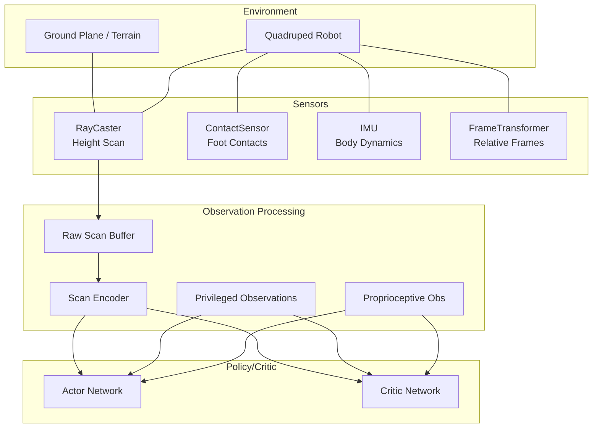
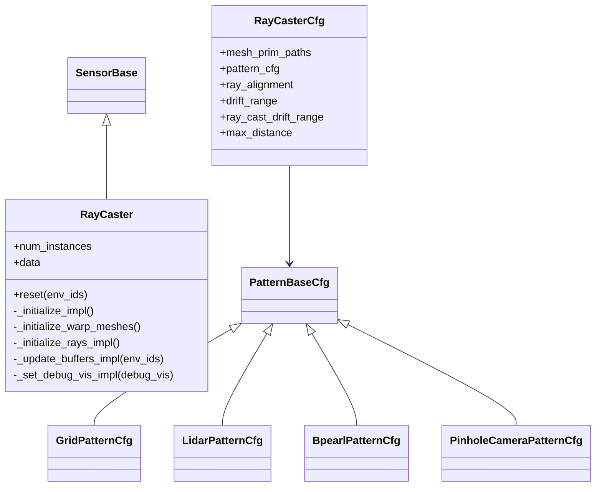
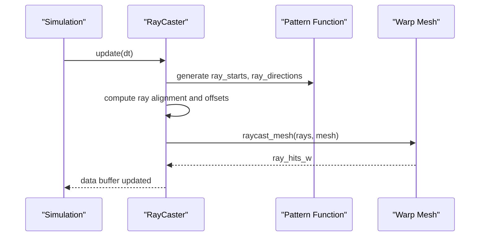
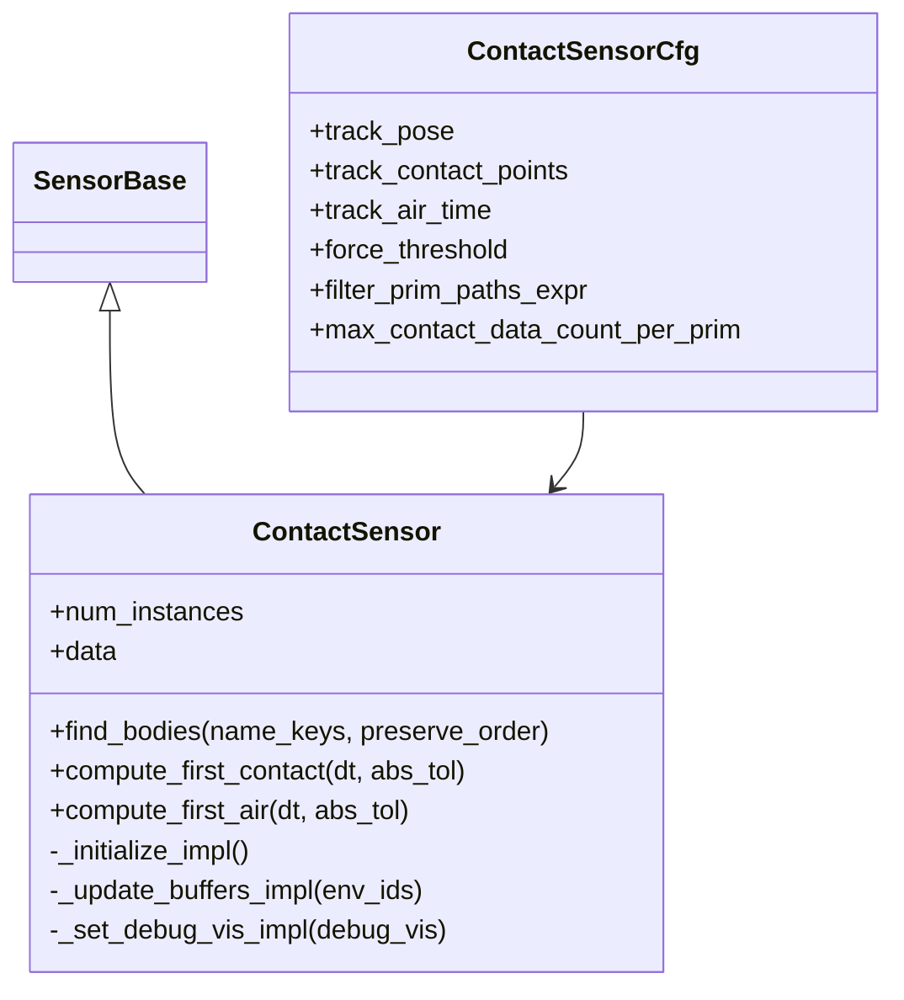
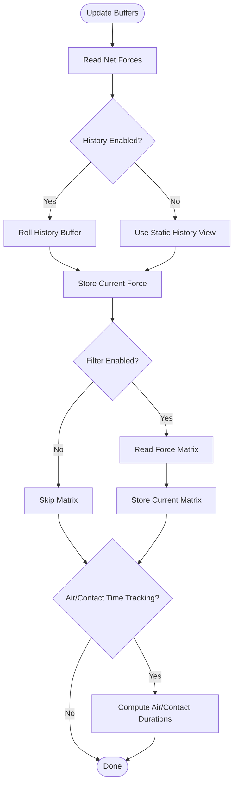
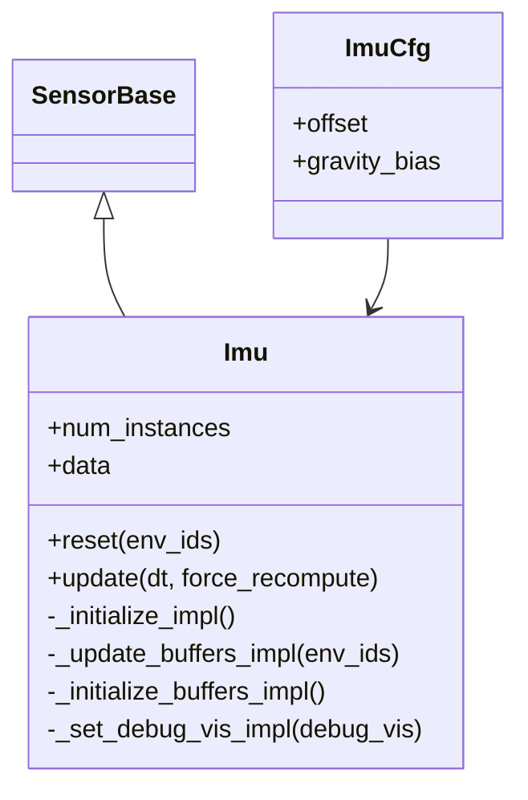
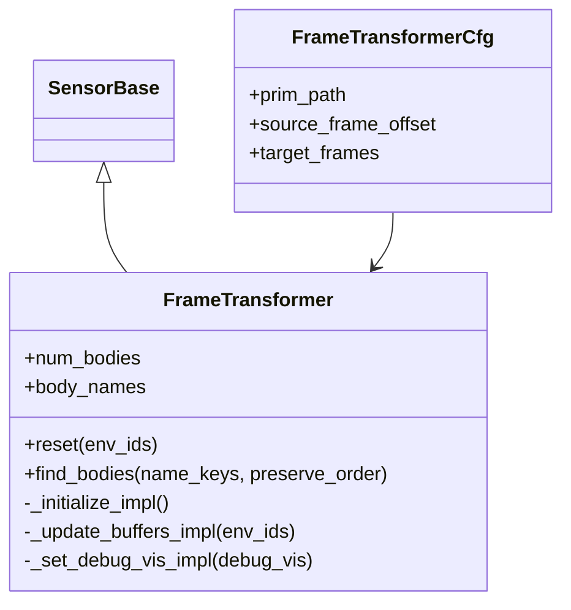
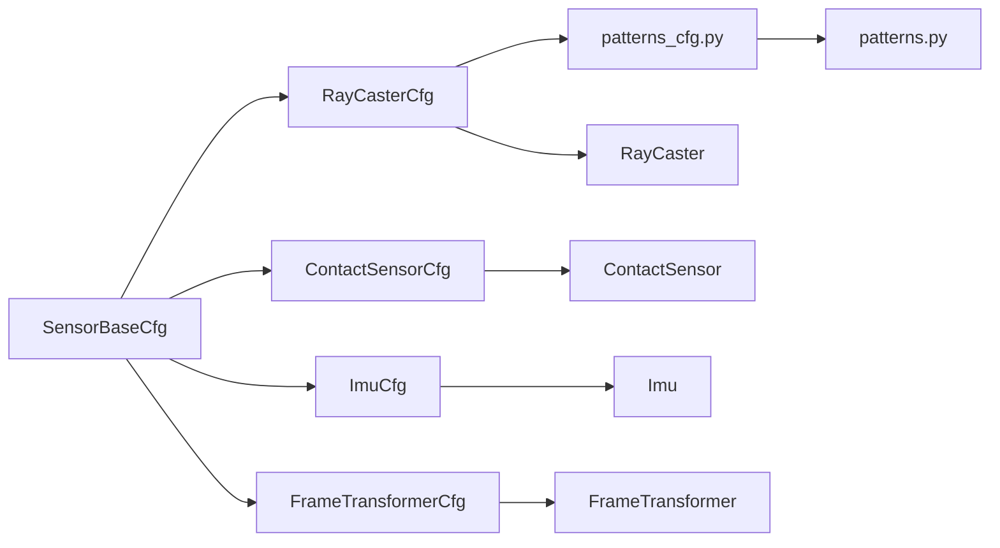

# Sensor Integration System

<cite>
**Referenced Files in This Document**
- [ray_caster.py](file://source/isaaclab/isaaclab/sensors/ray_caster/ray_caster.py)
- [ray_caster_cfg.py](file://source/isaaclab/isaaclab/sensors/ray_caster/ray_caster_cfg.py)
- [patterns.py](file://source/isaaclab/isaaclab/sensors/ray_caster/patterns/patterns.py)
- [patterns_cfg.py](file://source/isaaclab/isaaclab/sensors/ray_caster/patterns/patterns_cfg.py)
- [contact_sensor.py](file://source/isaaclab/isaaclab/sensors/contact_sensor/contact_sensor.py)
- [contact_sensor_cfg.py](file://source/isaaclab/isaaclab/sensors/contact_sensor/contact_sensor_cfg.py)
- [imu.py](file://source/isaaclab/isaaclab/sensors/imu/imu.py)
- [imu_cfg.py](file://source/isaaclab/isaaclab/sensors/imu/imu_cfg.py)
- [frame_transformer.py](file://source/isaaclab/isaaclab/sensors/frame_transformer/frame_transformer.py)
- [frame_transformer_cfg.py](file://source/isaaclab/isaaclab/sensors/frame_transformer/frame_transformer_cfg.py)
- [sensor_base.py](file://source/isaaclab/isaaclab/sensors/sensor_base.py)
- [sensor_base_cfg.py](file://source/isaaclab/isaaclab/sensors/sensor_base_cfg.py)
- [raycaster_sensor.py](file://scripts/demos/sensors/raycaster_sensor.py)
- [contact_sensor.py](file://scripts/demos/sensors/contact_sensor.py)
- [imu_sensor.py](file://scripts/demos/sensors/imu_sensor.py)
- [frame_transformer_sensor.py](file://scripts/demos/sensors/frame_transformer_sensor.py)
- [ray_caster.rst](file://docs/source/overview/core-concepts/sensors/ray_caster.rst)
- [README.md](file://README.md)
</cite>

## Table of Contents
1. [Introduction](#introduction)
2. [Project Structure](#project-structure)
3. [Core Components](#core-components)
4. [Architecture Overview](#architecture-overview)
5. [Detailed Component Analysis](#detailed-component-analysis)
6. [Dependency Analysis](#dependency-analysis)
7. [Performance Considerations](#performance-considerations)
8. [Troubleshooting Guide](#troubleshooting-guide)
9. [Conclusion](#conclusion)
10. [Appendices](#appendices)

## Introduction
This document describes the Sensor Integration System used in the multi-modal sensor fusion ablation studies. It explains the role of each sensor type—height scanning via ray casting, contact detection, inertial measurement units (IMU), and frame transformations—within the observation pipeline. It documents sensor placement strategies, data preprocessing, and integration with the observation processing system. It also details the height field scanning system with resolution parameters, field-of-view specifications, and scan encoding strategies, and covers the contact sensor network for foot-ground interaction detection and the IMU system for dynamic state estimation. Finally, it outlines the fusion methodologies across the five ablation architectures and provides practical configuration and troubleshooting guidance.

## Project Structure
The sensor system is organized around modular sensor classes that inherit from a common base. Each sensor exposes a configuration class and a data class. The ray-caster subsystem includes multiple ray patterns for generating structured scans. Demos illustrate practical sensor placement and usage.

```mermaid
graph TB
subgraph "Sensor Base"
SB["SensorBase<br/>Base class"]
SBCFG["SensorBaseCfg<br/>Base config"]
end
subgraph "Ray Caster"
RC["RayCaster"]
RCCFG["RayCasterCfg"]
PAT["patterns.py<br/>grid/lidar/bpearl/camera"]
PATCFG["patterns_cfg.py<br/>Grid/Lidar/Bpearl/Pinhole"]
end
subgraph "Contact Sensor"
CS["ContactSensor"]
CSCFG["ContactSensorCfg"]
end
subgraph "IMU"
IMU["Imu"]
IMUCFG["ImuCfg"]
end
subgraph "Frame Transformer"
FT["FrameTransformer"]
FTCFG["FrameTransformerCfg"]
end
SB --> RC
SB --> CS
SB --> IMU
SB --> FT
SBCFG --> RCCFG
SBCFG --> CSCFG
SBCFG --> IMUCFG
SBCFG --> FTCFG
RCCFG --> PAT
RCCFG --> PATCFG
```

**Diagram sources**
- [sensor_base.py](file://source/isaaclab/isaaclab/sensors/sensor_base.py)
- [sensor_base_cfg.py](file://source/isaaclab/isaaclab/sensors/sensor_base_cfg.py)
- [ray_caster.py](file://source/isaaclab/isaaclab/sensors/ray_caster/ray_caster.py)
- [ray_caster_cfg.py](file://source/isaaclab/isaaclab/sensors/ray_caster/ray_caster_cfg.py)
- [patterns.py](file://source/isaaclab/isaaclab/sensors/ray_caster/patterns/patterns.py)
- [patterns_cfg.py](file://source/isaaclab/isaaclab/sensors/ray_caster/patterns/patterns_cfg.py)
- [contact_sensor.py](file://source/isaaclab/isaaclab/sensors/contact_sensor/contact_sensor.py)
- [contact_sensor_cfg.py](file://source/isaaclab/isaaclab/sensors/contact_sensor/contact_sensor_cfg.py)
- [imu.py](file://source/isaaclab/isaaclab/sensors/imu/imu.py)
- [imu_cfg.py](file://source/isaaclab/isaaclab/sensors/imu/imu_cfg.py)
- [frame_transformer.py](file://source/isaaclab/isaaclab/sensors/frame_transformer/frame_transformer.py)
- [frame_transformer_cfg.py](file://source/isaaclab/isaaclab/sensors/frame_transformer/frame_transformer_cfg.py)

**Section sources**
- [sensor_base.py](file://source/isaaclab/isaaclab/sensors/sensor_base.py)
- [sensor_base_cfg.py](file://source/isaaclab/isaaclab/sensors/sensor_base_cfg.py)
- [ray_caster.py](file://source/isaaclab/isaaclab/sensors/ray_caster/ray_caster.py)
- [ray_caster_cfg.py](file://source/isaaclab/isaaclab/sensors/ray_caster/ray_caster_cfg.py)
- [patterns.py](file://source/isaaclab/isaaclab/sensors/ray_caster/patterns/patterns.py)
- [patterns_cfg.py](file://source/isaaclab/isaaclab/sensors/ray_caster/patterns/patterns_cfg.py)
- [contact_sensor.py](file://source/isaaclab/isaaclab/sensors/contact_sensor/contact_sensor.py)
- [contact_sensor_cfg.py](file://source/isaaclab/isaaclab/sensors/contact_sensor/contact_sensor_cfg.py)
- [imu.py](file://source/isaaclab/isaaclab/sensors/imu/imu.py)
- [imu_cfg.py](file://source/isaaclab/isaaclab/sensors/imu/imu_cfg.py)
- [frame_transformer.py](file://source/isaaclab/isaaclab/sensors/frame_transformer/frame_transformer.py)
- [frame_transformer_cfg.py](file://source/isaaclab/isaaclab/sensors/frame_transformer/frame_transformer_cfg.py)

## Core Components
- Ray Caster: Generates structured height scans by casting rays against a static mesh, returning collision points per ray. Supports configurable ray alignment modes and multiple ray patterns.
- Contact Sensor: Reports contact forces and optionally filtered force matrices, contact points, and air/contact durations for selected bodies.
- IMU: Provides body-frame linear/angular velocities and accelerations, plus world-frame position/orientation and projected gravity, using numerical differentiation.
- Frame Transformer: Computes relative transforms between a source frame and multiple target frames, with optional offsets for precise attachment.

These sensors integrate into the observation pipeline by exposing structured data buffers consumed by downstream RL or control systems.

**Section sources**
- [ray_caster.py](file://source/isaaclab/isaaclab/sensors/ray_caster/ray_caster.py)
- [contact_sensor.py](file://source/isaaclab/isaaclab/sensors/contact_sensor/contact_sensor.py)
- [imu.py](file://source/isaaclab/isaaclab/sensors/imu/imu.py)
- [frame_transformer.py](file://source/isaaclab/isaaclab/sensors/frame_transformer/frame_transformer.py)

## Architecture Overview
The multi-modal fusion architecture integrates proprioceptive observations, sensor scans, and privileged observations across five ablation variants. The ray-caster generates dense height scans that are either used raw or encoded for actor/critic. Privileged observations (e.g., ground truth state) are integrated differently across ablations to study their impact on learning stability and performance.



[No sources needed since this diagram shows conceptual workflow, not actual code structure]

## Detailed Component Analysis

### Ray Caster: Height Field Scanning and Encoding
Purpose:
- Generate dense height scans for terrain perception using ray casting against a static mesh.
- Support multiple ray patterns for structured sampling.

Key capabilities:
- Ray alignment modes: world, yaw, base.
- Drift parameters for simulating pose estimation uncertainty.
- Multiple ray patterns: grid, lidar, Bpearl, pinhole camera-style.
- Warp-based raycasting for performance.

Configuration highlights:
- mesh_prim_paths: single static mesh supported.
- pattern_cfg: selects grid/lidar/bpearl/pinhole.
- ray_alignment: base/yaw/world.
- drift_range and ray_cast_drift_range: stochastic offsets.
- max_distance: clipping for ray length.

Data output:
- ray_hits_w: collision points per ray in world frame.

Practical configuration example:
- See demo scene configuration for attaching a lidar cage and using a lidar pattern with specified FOVs and resolution.



**Diagram sources**
- [sensor_base.py](file://source/isaaclab/isaaclab/sensors/sensor_base.py)
- [ray_caster.py](file://source/isaaclab/isaaclab/sensors/ray_caster/ray_caster.py)
- [ray_caster_cfg.py](file://source/isaaclab/isaaclab/sensors/ray_caster/ray_caster_cfg.py)
- [patterns.py](file://source/isaaclab/isaaclab/sensors/ray_caster/patterns/patterns.py)
- [patterns_cfg.py](file://source/isaaclab/isaaclab/sensors/ray_caster/patterns/patterns_cfg.py)



**Diagram sources**
- [ray_caster.py](file://source/isaaclab/isaaclab/sensors/ray_caster/ray_caster.py)
- [patterns.py](file://source/isaaclab/isaaclab/sensors/ray_caster/patterns/patterns.py)

Field-of-view and resolution:
- Grid pattern: size (length, width) and resolution (meters).
- Lidar pattern: channels, vertical FOV range, horizontal FOV range, horizontal resolution (degrees).
- Bpearl pattern: 360° horizontal FOV with predefined vertical ray angles.
- Pinhole camera pattern: focal length, horizontal/vertical apertures, width/height; can be derived from intrinsic matrix.

Scan encoding strategies:
- Raw scan: use ray_hits_w directly as observations.
- Encoded scan: pass ray_hits_w through a scan encoder before feeding to actor/critic.

**Section sources**
- [ray_caster.py](file://source/isaaclab/isaaclab/sensors/ray_caster/ray_caster.py)
- [ray_caster_cfg.py](file://source/isaaclab/isaaclab/sensors/ray_caster/ray_caster_cfg.py)
- [patterns.py](file://source/isaaclab/isaaclab/sensors/ray_caster/patterns/patterns.py)
- [patterns_cfg.py](file://source/isaaclab/isaaclab/sensors/ray_caster/patterns/patterns_cfg.py)
- [ray_caster.rst](file://docs/source/overview/core-concepts/sensors/ray_caster.rst)
- [raycaster_sensor.py](file://scripts/demos/sensors/raycaster_sensor.py)

### Contact Sensor: Foot-Ground Interaction Detection
Purpose:
- Report net contact forces and optionally filtered force matrices for selected bodies.
- Track contact points and air/contact durations for gait analysis and control.

Key capabilities:
- Body selection via regex; filter shapes for selective contact reporting.
- Optional history buffers for temporal smoothing.
- Optional tracking of pose, contact points, and air/contact time with thresholds.

Configuration highlights:
- track_pose, track_contact_points, track_air_time.
- force_threshold for contact/non-contact mode duration.
- filter_prim_paths_expr for selective filtering.
- max_contact_data_count_per_prim to manage memory.

Data output:
- net_forces_w, force_matrix_w, contact_pos_w, current/last air/contact times.



**Diagram sources**
- [sensor_base.py](file://source/isaaclab/isaaclab/sensors/sensor_base.py)
- [contact_sensor.py](file://source/isaaclab/isaaclab/sensors/contact_sensor/contact_sensor.py)
- [contact_sensor_cfg.py](file://source/isaaclab/isaaclab/sensors/contact_sensor/contact_sensor_cfg.py)



**Diagram sources**
- [contact_sensor.py](file://source/isaaclab/isaaclab/sensors/contact_sensor/contact_sensor.py)

**Section sources**
- [contact_sensor.py](file://source/isaaclab/isaaclab/sensors/contact_sensor/contact_sensor.py)
- [contact_sensor_cfg.py](file://source/isaaclab/isaaclab/sensors/contact_sensor/contact_sensor_cfg.py)
- [contact_sensor.py](file://scripts/demos/sensors/contact_sensor.py)

### IMU: Dynamic State Estimation
Purpose:
- Provide body-frame linear/angular velocities and accelerations.
- Supply world-frame position/orientation and projected gravity for privileged observations.

Key capabilities:
- Numerical differentiation for accelerations; accuracy depends on physics timestep.
- Optional gravity bias compensation.
- Offset configuration for mounting at arbitrary body locations.

Configuration highlights:
- offset: translation and quaternion offset from parent prim.
- gravity_bias: bias applied to linear acceleration in world frame.

Data output:
- pos_w, quat_w, lin_vel_b, ang_vel_b, lin_acc_b, ang_acc_b, projected_gravity_b.



**Diagram sources**
- [sensor_base.py](file://source/isaaclab/isaaclab/sensors/sensor_base.py)
- [imu.py](file://source/isaaclab/isaaclab/sensors/imu/imu.py)
- [imu_cfg.py](file://source/isaaclab/isaaclab/sensors/imu/imu_cfg.py)

**Section sources**
- [imu.py](file://source/isaaclab/isaaclab/sensors/imu/imu.py)
- [imu_cfg.py](file://source/isaaclab/isaaclab/sensors/imu/imu_cfg.py)
- [imu_sensor.py](file://scripts/demos/sensors/imu_sensor.py)

### Frame Transformer: Relative Pose Estimation
Purpose:
- Compute relative transforms between a source frame and multiple target frames.
- Useful for end-effector tracking, foot poses, or inter-segment relationships.

Key capabilities:
- Regex-based matching for multiple bodies.
- Optional offsets for source and target frames.
- Efficient batching and per-environment reordering.

Data output:
- source_pos_w, source_quat_w, target_pos_w, target_quat_w, target_pos_source, target_quat_source.



**Diagram sources**
- [sensor_base.py](file://source/isaaclab/isaaclab/sensors/sensor_base.py)
- [frame_transformer.py](file://source/isaaclab/isaaclab/sensors/frame_transformer/frame_transformer.py)
- [frame_transformer_cfg.py](file://source/isaaclab/isaaclab/sensors/frame_transformer/frame_transformer_cfg.py)

**Section sources**
- [frame_transformer.py](file://source/isaaclab/isaaclab/sensors/frame_transformer/frame_transformer.py)
- [frame_transformer_cfg.py](file://source/isaaclab/isaaclab/sensors/frame_transformer/frame_transformer_cfg.py)
- [frame_transformer_sensor.py](file://scripts/demos/sensors/frame_transformer_sensor.py)

## Dependency Analysis
- All sensors inherit from SensorBase and SensorBaseCfg, ensuring consistent lifecycle, timing, and data access patterns.
- RayCaster depends on patterns and warp mesh utilities for ray generation and intersection.
- ContactSensor depends on PhysX contact reporting APIs and views for force and contact data.
- IMU depends on rigid-body views and numerical differentiation for accelerations.
- FrameTransformer depends on rigid-body views and frame algebra for relative transforms.



**Diagram sources**
- [sensor_base_cfg.py](file://source/isaaclab/isaaclab/sensors/sensor_base_cfg.py)
- [ray_caster_cfg.py](file://source/isaaclab/isaaclab/sensors/ray_caster/ray_caster_cfg.py)
- [patterns_cfg.py](file://source/isaaclab/isaaclab/sensors/ray_caster/patterns/patterns_cfg.py)
- [patterns.py](file://source/isaaclab/isaaclab/sensors/ray_caster/patterns/patterns.py)
- [contact_sensor_cfg.py](file://source/isaaclab/isaaclab/sensors/contact_sensor/contact_sensor_cfg.py)
- [imu_cfg.py](file://source/isaaclab/isaaclab/sensors/imu/imu_cfg.py)
- [frame_transformer_cfg.py](file://source/isaaclab/isaaclab/sensors/frame_transformer/frame_transformer_cfg.py)

**Section sources**
- [sensor_base.py](file://source/isaaclab/isaaclab/sensors/sensor_base.py)
- [sensor_base_cfg.py](file://source/isaaclab/isaaclab/sensors/sensor_base_cfg.py)
- [ray_caster.py](file://source/isaaclab/isaaclab/sensors/ray_caster/ray_caster.py)
- [contact_sensor.py](file://source/isaaclab/isaaclab/sensors/contact_sensor/contact_sensor.py)
- [imu.py](file://source/isaaclab/isaaclab/sensors/imu/imu.py)
- [frame_transformer.py](file://source/isaaclab/isaaclab/sensors/frame_transformer/frame_transformer.py)

## Performance Considerations
- Ray casting performance: Warp-based raycasting is used for speed; ensure only one static mesh is specified for optimal performance.
- Contact reporting memory: Increase max_contact_data_count_per_prim for highly contact-rich scenarios to avoid dropping contact data.
- IMU accuracy: Numerical differentiation accuracy improves with higher physics timesteps; keep at least 200 Hz for reliable accelerations.
- Sensor update periods: Set update_period appropriately to balance fidelity and throughput.

[No sources needed since this section provides general guidance]

## Troubleshooting Guide
Common issues and resolutions:
- Ray Caster sensor path invalid: Ensure prim path does not contain regex patterns in the leaf; the sensor validates the path and raises an error if invalid.
- No meshes found for ray-casting: Verify mesh_prim_paths point to a valid static mesh or plane; otherwise initialization fails.
- Attach yaw only deprecation: Use ray_alignment instead of the deprecated attach_yaw_only flag.
- Contact sensor contact reporter disabled: Enable activate_contact_sensors in the asset spawner configuration to activate PhysX ContactReporter on rigid bodies.
- Filtering multiple sensor bodies: Filtering works one-to-many; create separate sensors for each sensor body if filtering multiple bodies.
- IMU prim type: Ensure the IMU prim has RigidBodyAPI; otherwise initialization fails.
- Frame transformer mismatch: Ensure the source and target prim paths correspond to rigid bodies; otherwise a ValueError is raised.

**Section sources**
- [ray_caster.py](file://source/isaaclab/isaaclab/sensors/ray_caster/ray_caster.py)
- [contact_sensor.py](file://source/isaaclab/isaaclab/sensors/contact_sensor/contact_sensor.py)
- [imu.py](file://source/isaaclab/isaaclab/sensors/imu/imu.py)
- [frame_transformer.py](file://source/isaaclab/isaaclab/sensors/frame_transformer/frame_transformer.py)

## Conclusion
The Sensor Integration System provides a flexible, high-performance foundation for multi-modal perception in quadruped locomotion. The ray caster delivers dense height scans with configurable patterns and alignment modes; the contact sensor captures foot-ground interactions with optional filtering and temporal tracking; the IMU supplies body-frame dynamics and privileged state; and the frame transformer computes relative poses for control and monitoring. Across the five ablation architectures, the fusion of proprioceptive observations with encoded or raw scans and privileged observations demonstrates the importance of proper scan encoding and judicious use of privileged information.

[No sources needed since this section summarizes without analyzing specific files]

## Appendices

### Ablation Architectures and Fusion Methodologies
- Abl 1: Proprioceptive-only; baseline failure due to blind walking without scan access.
- Abl 2.5: Proprio + raw scan; struggles with high-dimensional raw scan due to feature extraction challenges.
- Abl 3.5 (Best): Proprio + scan encoding for both actor and critic; stable performance on challenging terrains.
- Abl 4.0: Proprio + privileged obs + raw scan; critic receives noisy raw scan, degrading value estimation.
- Abl 7.0: Proprio + privileged encoding + scan encoding; privileged encoding constants cause overfitting.

Recommendations:
- Prefer scan encoding for both actor and critic.
- Avoid privileged encoding for the critic to reduce overfitting.
- Use Abl 3.5 as a strong baseline for rough terrain locomotion.

**Section sources**
- [README.md](file://README.md)

### Practical Sensor Configuration Examples
- Ray Caster: Attach to robot base with a lidar cage and configure a lidar pattern with desired FOVs and resolution; set ray_alignment to yaw for terrain height mapping.
- Contact Sensor: Place on foot bodies; enable filter_prim_paths_expr to isolate ground/object contacts; enable track_air_time for gait analysis.
- IMU: Mount at foot/body origin; adjust gravity_bias to align with expected readings; visualize arrows for acceleration.
- Frame Transformer: Define source frame (e.g., base) and target frames (e.g., feet); use offsets for precise attachment.

**Section sources**
- [raycaster_sensor.py](file://scripts/demos/sensors/raycaster_sensor.py)
- [contact_sensor.py](file://scripts/demos/sensors/contact_sensor.py)
- [imu_sensor.py](file://scripts/demos/sensors/imu_sensor.py)
- [frame_transformer_sensor.py](file://scripts/demos/sensors/frame_transformer_sensor.py)