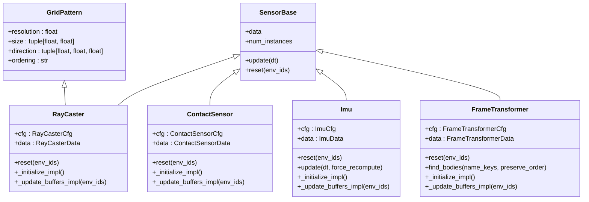
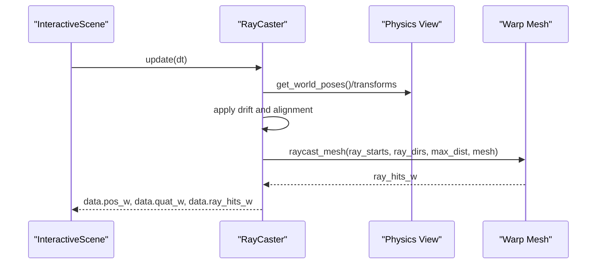
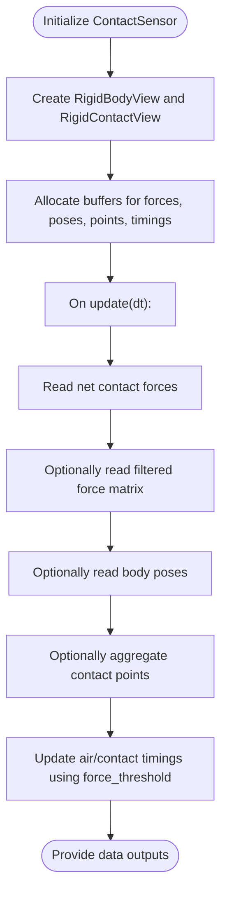
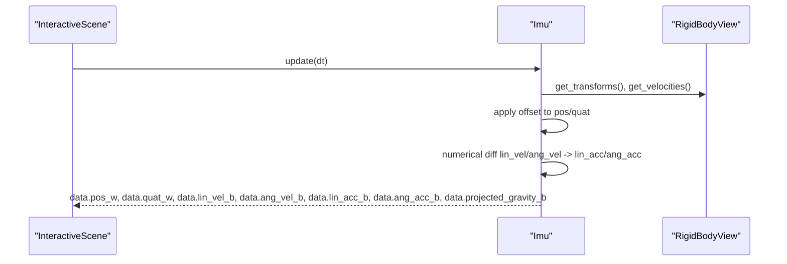
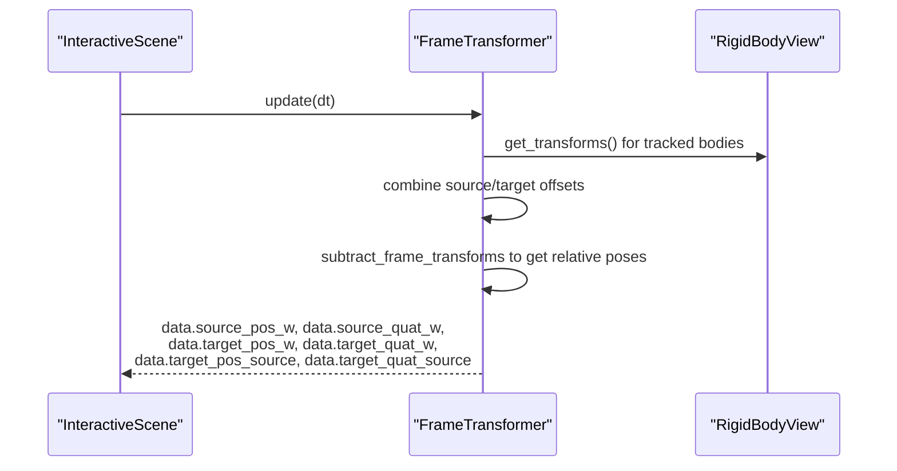
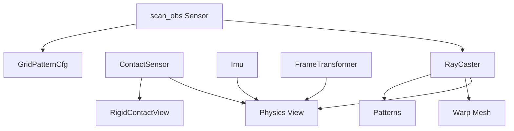

# Sensor Types and Specifications

<cite>
**Referenced Files in This Document**
- [ray_caster.py](file://source/isaaclab/isaaclab/sensors/ray_caster/ray_caster.py)
- [ray_caster_cfg.py](file://source/isaaclab/isaaclab/sensors/ray_caster/ray_caster_cfg.py)
- [patterns.py](file://source/isaaclab/isaaclab/sensors/ray_caster/patterns/patterns.py)
- [patterns_cfg.py](file://source/isaaclab/isaaclab/sensors/ray_caster/patterns/patterns_cfg.py)
- [contact_sensor.py](file://source/isaaclab/isaaclab/sensors/contact_sensor/contact_sensor.py)
- [contact_sensor_cfg.py](file://source/isaaclab/isaaclab/sensors/contact_sensor/contact_sensor_cfg.py)
- [imu.py](file://source/isaaclab/isaaclab/sensors/imu/imu.py)
- [imu_cfg.py](file://source/isaaclab/isaaclab/sensors/imu/imu_cfg.py)
- [frame_transformer.py](file://source/isaaclab/isaaclab/sensors/frame_transformer/frame_transformer.py)
- [frame_transformer_cfg.py](file://source/isaaclab/isaaclab/sensors/frame_transformer/frame_transformer_cfg.py)
- [raycaster_sensor.py](file://scripts/demos/sensors/raycaster_sensor.py)
- [contact_sensor.py](file://scripts/demos/sensors/contact_sensor.py)
- [imu_sensor.py](file://scripts/demos/sensors/imu_sensor.py)
- [frame_transformer_sensor.py](file://scripts/demos/sensors/frame_transformer_sensor.py)
- [actor_critic_scan.py](file://source/isaaclab_tasks/isaaclab_tasks/direct/go2/agents/actor_critic_scan.py)
- [rsl_rl_ppo_cfg.py](file://source/isaaclab_tasks/isaaclab_tasks/direct/go2/agents/rsl_rl_ppo_cfg.py)
- [go2_env_cfg.py](file://source/isaaclab_tasks/isaaclab_tasks/direct/go2/go2_env_cfg.py)
</cite>

## Update Summary
**Changes Made**
- Enhanced documentation for scan_obs sensor specification with detailed physical characteristics
- Added comprehensive technical specifications for the GridPattern configuration used in scan_obs
- Updated RayCaster sensor section to include scan_obs sensor details
- Added physical coverage calculations and measurement point analysis

## Table of Contents
1. [Introduction](#introduction)
2. [Project Structure](#project-structure)
3. [Core Components](#core-components)
4. [Architecture Overview](#architecture-overview)
5. [Detailed Component Analysis](#detailed-component-analysis)
6. [Dependency Analysis](#dependency-analysis)
7. [Performance Considerations](#performance-considerations)
8. [Troubleshooting Guide](#troubleshooting-guide)
9. [Conclusion](#conclusion)
10. [Appendices](#appendices)

## Introduction
This document provides comprehensive technical specifications and usage guidance for the individual sensor types integrated in the system: RayCaster, ContactSensor, IMU, and FrameTransformer. It covers sensor capabilities, configuration parameters, data outputs, integration with meshes and physics views, and practical placement strategies. It also outlines update rates, field-of-view parameters, resolution limits, and accuracy characteristics for each sensor type.

**Updated** Enhanced documentation now includes detailed specifications for the scan_obs sensor, which is implemented using the RayCaster sensor with a specialized GridPattern configuration for height field scanning.

## Project Structure
The sensor implementations are organized by type under the sensors module, with dedicated configuration classes and optional pattern definitions for ray generation. Demos illustrate typical usage and configuration.

```mermaid
graph TB
subgraph "Sensors Module"
RC["RayCaster<br/>ray_caster.py"]
CC["ContactSensor<br/>contact_sensor.py"]
IMU["IMU<br/>imu.py"]
FT["FrameTransformer<br/>frame_transformer.py"]
end
subgraph "Configs"
RCCFG["RayCasterCfg<br/>ray_caster_cfg.py"]
PCFG["PatternsCfg<br/>patterns_cfg.py"]
CCFG["ContactSensorCfg<br/>contact_sensor_cfg.py"]
ICFG["ImuCfg<br/>imu_cfg.py"]
FTCFG["FrameTransformerCfg<br/>frame_transformer_cfg.py"]
end
subgraph "Demos"
DEMO_RC["Demo: RayCaster<br/>raycaster_sensor.py"]
DEMO_CC["Demo: ContactSensor<br/>contact_sensor.py"]
DEMO_IMU["Demo: IMU<br/>imu_sensor.py"]
DEMO_FT["Demo: FrameTransformer<br/>frame_transformer_sensor.py"]
end
subgraph "Scan Obs Implementation"
SCAN_OBS["scan_obs Sensor<br/>GridPatternCfg"]
ACTOR_CRITIC["ActorCriticScan<br/>actor_critic_scan.py"]
END
RC --> RCCFG
RC --> PCFG
CC --> CCFG
IMU --> ICFG
FT --> FTCFG
DEMO_RC --> RC
DEMO_CC --> CC
DEMO_IMU --> IMU
DEMO_FT --> FT
SCAN_OBS --> RC
ACTOR_CRITIC --> SCAN_OBS
```

**Diagram sources**
- [ray_caster.py:35-335](file://source/isaaclab/isaaclab/sensors/ray_caster/ray_caster.py#L35-L335)
- [contact_sensor.py:32-481](file://source/isaaclab/isaaclab/sensors/contact_sensor/contact_sensor.py#L32-L481)
- [imu.py:27-257](file://source/isaaclab/isaaclab/sensors/imu/imu.py#L27-L257)
- [frame_transformer.py:36-527](file://source/isaaclab/isaaclab/sensors/frame_transformer/frame_transformer.py#L36-L527)
- [ray_caster_cfg.py:22-100](file://source/isaaclab/isaaclab/sensors/ray_caster/ray_caster_cfg.py#L22-L100)
- [patterns_cfg.py:20-219](file://source/isaaclab/isaaclab/sensors/ray_caster/patterns/patterns_cfg.py#L20-L219)
- [contact_sensor_cfg.py:15-77](file://source/isaaclab/isaaclab/sensors/contact_sensor/contact_sensor_cfg.py#L15-L77)
- [imu_cfg.py:17-47](file://source/isaaclab/isaaclab/sensors/imu/imu_cfg.py#L17-L47)
- [frame_transformer_cfg.py:26-74](file://source/isaaclab/isaaclab/sensors/frame_transformer/frame_transformer_cfg.py#L26-L74)
- [raycaster_sensor.py:61-71](file://scripts/demos/sensors/raycaster_sensor.py#L61-L71)
- [contact_sensor.py:69-91](file://scripts/demos/sensors/contact_sensor.py#L69-L91)
- [imu_sensor.py:55-58](file://scripts/demos/sensors/imu_sensor.py#L55-L58)
- [frame_transformer_sensor.py:67-86](file://scripts/demos/sensors/frame_transformer_sensor.py#L67-L86)
- [patterns_cfg.py:33-70](file://source/isaaclab/isaaclab/sensors/ray_caster/patterns/patterns_cfg.py#L33-L70)
- [actor_critic_scan.py:30-31](file://source/isaaclab_tasks/isaaclab_tasks/direct/go2/agents/actor_critic_scan.py#L30-L31)
- [rsl_rl_ppo_cfg.py:32](file://source/isaaclab_tasks/isaaclab_tasks/direct/go2/agents/rsl_rl_ppo_cfg.py#L32)
- [go2_env_cfg.py:274](file://source/isaaclab_tasks/isaaclab_tasks/direct/go2/go2_env_cfg.py#L274)

**Section sources**
- [ray_caster.py:35-335](file://source/isaaclab/isaaclab/sensors/ray_caster/ray_caster.py#L35-L335)
- [contact_sensor.py:32-481](file://source/isaaclab/isaaclab/sensors/contact_sensor/contact_sensor.py#L32-L481)
- [imu.py:27-257](file://source/isaaclab/isaaclab/sensors/imu/imu.py#L27-L257)
- [frame_transformer.py:36-527](file://source/isaaclab/isaaclab/sensors/frame_transformer/frame_transformer.py#L36-L527)

## Core Components
- RayCaster: A ray-casting sensor that generates a configurable ray pattern in the sensor's local frame and casts rays against static meshes to produce hit points in world coordinates. Supports drift modeling and multiple ray alignment modes. **Enhanced** Now includes scan_obs sensor implementation with detailed physical specifications.
- ContactSensor: Reports normal contact forces and optionally filtered force matrices against specified bodies, with optional contact point aggregation and air/contact time tracking.
- IMU: Provides body-frame linear/angular velocities and accelerations, plus world-frame position/orientation and projected gravity, using numerical differentiation and optional gravity bias compensation.
- FrameTransformer: Computes relative transforms between a source frame and one or more target frames, with optional offsets for precise mounting configurations.

**Section sources**
- [ray_caster.py:35-335](file://source/isaaclab/isaaclab/sensors/ray_caster/ray_caster.py#L35-L335)
- [contact_sensor.py:32-481](file://source/isaaclab/isaaclab/sensors/contact_sensor/contact_sensor.py#L32-L481)
- [imu.py:27-257](file://source/isaaclab/isaaclab/sensors/imu/imu.py#L27-L257)
- [frame_transformer.py:36-527](file://source/isaaclab/isaaclab/sensors/frame_transformer/frame_transformer.py#L36-L527)

## Architecture Overview
The sensors rely on a shared base class for lifecycle and buffer management, and integrate with the physics simulation view to read transforms, velocities, and contact data. RayCaster additionally converts USD meshes to Warp meshes for efficient raycasting.



**Diagram sources**
- [ray_caster.py:35-335](file://source/isaaclab/isaaclab/sensors/ray_caster/ray_caster.py#L35-L335)
- [contact_sensor.py:32-481](file://source/isaaclab/isaaclab/sensors/contact_sensor/contact_sensor.py#L32-L481)
- [imu.py:27-257](file://source/isaaclab/isaaclab/sensors/imu/imu.py#L27-L257)
- [frame_transformer.py:36-527](file://source/isaaclab/isaaclab/sensors/frame_transformer/frame_transformer.py#L36-L527)
- [patterns_cfg.py:33-70](file://source/isaaclab/isaaclab/sensors/ray_caster/patterns/patterns_cfg.py#L33-L70)

## Detailed Component Analysis

### RayCaster Sensor
- Purpose: Height field scanning via ray casting against static meshes; configurable ray patterns and alignment modes.
- Key configuration parameters:
  - mesh_prim_paths: List of mesh prim paths to ray cast against (currently supports one static mesh).
  - pattern_cfg: Defines ray start positions and directions (grid, pinhole camera, Bpearl, or LiDAR patterns).
  - ray_alignment: "base" (full pose), "yaw" (pose yaw only), or "world" (fixed in world).
  - max_distance: Maximum ray length in meters.
  - drift_range and ray_cast_drift_range: Optional drift modeling for pose and projected ray points.
  - offset: Pose offset of sensor frame relative to parent prim.
- Data outputs:
  - pos_w, quat_w: Sensor world pose.
  - ray_hits_w: Hit points for each ray in world coordinates.
- Mesh integration:
  - Reads USD plane or mesh, applies world transform, and converts to Warp mesh for raycasting.
- Collision detection:
  - Uses warp mesh raycast with provided directions and max distance.
- Update behavior:
  - Drift terms are sampled per instance and applied to ray starts; ray directions optionally rotated according to alignment mode.

**Enhanced** The RayCaster sensor now includes the scan_obs sensor implementation, which uses a specialized GridPattern configuration with specific physical characteristics for height field scanning.



**Diagram sources**
- [ray_caster.py:232-305](file://source/isaaclab/isaaclab/sensors/ray_caster/ray_caster.py#L232-L305)
- [patterns.py:16-179](file://source/isaaclab/isaaclab/sensors/ray_caster/patterns/patterns.py#L16-L179)

Technical specifications
- Update rate: Controlled by update_period in configuration; demo shows 1/60 s.
- Field-of-view parameters:
  - Grid pattern: size (length, width) and resolution (meters).
  - Pinhole camera pattern: focal length (cm), horizontal/vertical aperture (cm), width/height (pixels), intrinsic matrix support.
  - Bpearl pattern: horizontal FOV (degrees), horizontal resolution (degrees), predefined vertical ray angles.
  - LiDAR pattern: channels, vertical FOV range (degrees), horizontal FOV range (degrees), horizontal resolution (degrees).
- Resolution limits:
  - Grid pattern resolution must be > 0; ordering "xy" or "yx".
  - LiDAR excludes overlapping last horizontal point when FOV spans 360°.
- Accuracy characteristics:
  - Raycast against static meshes; accuracy depends on mesh fidelity and ray density.

**Enhanced** Scan Obs Sensor Physical Characteristics:
- Spatial coverage: 1.6m × 1.0m (length × width)
- Resolution: 0.1m per grid point
- Grid layout: 17×11 grid points
- Measurement points: 187 total measurement points
- Calculation: (1.6m ÷ 0.1m) + 1 = 17 points along length, (1.0m ÷ 0.1m) + 1 = 11 points along width, 17 × 11 = 187 points

Mounting and placement
- Mount the sensor prim at the desired location on the robot body.
- Use offset to align sensor frame with the intended sensing location.
- For height field scanning, "yaw" alignment often suffices to track terrain height under the robot's yaw rotation.

**Section sources**
- [ray_caster.py:35-335](file://source/isaaclab/isaaclab/sensors/ray_caster/ray_caster.py#L35-L335)
- [ray_caster_cfg.py:22-100](file://source/isaaclab/isaaclab/sensors/ray_caster/ray_caster_cfg.py#L22-L100)
- [patterns_cfg.py:33-219](file://source/isaaclab/isaaclab/sensors/ray_caster/patterns/patterns_cfg.py#L33-L219)
- [patterns.py:16-179](file://source/isaaclab/isaaclab/sensors/ray_caster/patterns/patterns.py#L16-L179)
- [raycaster_sensor.py:61-71](file://scripts/demos/sensors/raycaster_sensor.py#L61-L71)
- [go2_env_cfg.py:274](file://source/isaaclab_tasks/isaaclab_tasks/direct/go2/go2_env_cfg.py#L274)

### ContactSensor
- Purpose: Foot-ground interaction detection; reports net contact forces and optionally filtered force matrix against specified bodies.
- Key configuration parameters:
  - track_pose: Whether to track sensor origin pose.
  - track_contact_points: Whether to aggregate contact point locations.
  - max_contact_data_count_per_prim: Maximum contact data count across batches.
  - track_air_time: Whether to track durations in air/contact using a force threshold.
  - force_threshold: Norm threshold to decide contact state.
  - filter_prim_paths_expr: Regex expressions to filter contacts against specific bodies.
  - offset: Optional pose offset of sensor frame relative to parent prim.
- Data outputs:
  - net_forces_w: Net contact force per body in world frame.
  - force_matrix_w: Filtered force matrix per body and per filter shape.
  - pos_w, quat_w: Optional body poses.
  - contact_pos_w: Optional aggregated contact point positions.
  - current_air_time, last_air_time, current_contact_time, last_contact_time: Air/contact durations.
- Filtering behavior:
  - One-to-many filtering supported; sensor prim must correspond to a single primitive per environment for filtering to work as expected.



**Diagram sources**
- [contact_sensor.py:255-438](file://source/isaaclab/isaaclab/sensors/contact_sensor/contact_sensor.py#L255-L438)

Technical specifications
- Update rate: Controlled by update_period; demo shows 0.0 (timestep-driven).
- Threshold settings:
  - force_threshold: Determines contact vs. air state for timing computations.
- Contact filtering:
  - filter_prim_paths_expr supports environment namespace regex replacement.
  - Requires single sensor body per environment for reliable filtering.

Mounting and placement
- Attach sensor prim to the foot/body link requiring contact monitoring.
- Enable activate_contact_sensors in asset spawner configuration to expose contact reporter API.
- Use offset to align sensor frame with the contact surface if needed.

**Section sources**
- [contact_sensor.py:32-481](file://source/isaaclab/isaaclab/sensors/contact_sensor/contact_sensor.py#L32-L481)
- [contact_sensor_cfg.py:15-77](file://source/isaaclab/isaaclab/sensors/contact_sensor/contact_sensor_cfg.py#L15-L77)
- [contact_sensor.py:69-91](file://scripts/demos/sensors/contact_sensor.py#L69-L91)

### IMU Sensor
- Purpose: Inertial measurement including linear/angular velocities and accelerations in body frame, plus world-frame pose and projected gravity.
- Key configuration parameters:
  - offset: Pose offset of sensor frame relative to parent rigid body.
  - gravity_bias: Linear acceleration bias (x,y,z) applied in world frame; default subtracts gravity for positive Z reading.
- Data outputs:
  - pos_w, quat_w: World-frame position and orientation.
  - lin_vel_b, ang_vel_b: Body-frame linear and angular velocities.
  - lin_acc_b, ang_acc_b: Body-frame linear and angular accelerations (numerical differentiation).
  - projected_gravity_b: Gravity direction projected into body frame.
- Update behavior:
  - Numerical differentiation of velocities; accuracy depends on physics timestep.
  - Optional offset application to COM and link origin to model sensor mounting.



**Diagram sources**
- [imu.py:151-195](file://source/isaaclab/isaaclab/sensors/imu/imu.py#L151-L195)

Technical specifications
- Update rate: Controlled by update_period; demo shows 0.0 (timestep-driven).
- Accuracy characteristics:
  - Accelerations derived via numerical differentiation; higher fidelity requires smaller physics timesteps.
  - Gravity bias can be disabled by setting gravity_bias to (0,0,0) to observe raw sensor readings.
- Noise models and calibration:
  - No explicit noise model in configuration; gravity bias serves as a calibration adjustment for Z-axis alignment.

Mounting and placement
- Mount sensor prim at the robot's body origin or a designated link; use offset to align with the sensor's sensitive element.
- Prefer non-fixed-joint frames for best accuracy and performance.

**Section sources**
- [imu.py:27-257](file://source/isaaclab/isaaclab/sensors/imu/imu.py#L27-L257)
- [imu_cfg.py:17-47](file://source/isaaclab/isaaclab/sensors/imu/imu_cfg.py#L17-L47)
- [imu_sensor.py:55-58](file://scripts/demos/sensors/imu_sensor.py#L55-L58)

### FrameTransformer Sensor
- Purpose: Report relative transforms between a source frame and one or more target frames, with optional offsets for precise mounting.
- Key configuration parameters:
  - prim_path: Source frame prim path (rigid body).
  - source_frame_offset: Pose offset from source prim frame.
  - target_frames: List of target frames, each with prim_path (regex supported), optional name, and offset.
- Data outputs:
  - source_pos_w, source_quat_w: Source frame pose.
  - target_pos_w, target_quat_w: Target frame poses.
  - target_pos_source, target_quat_source: Relative poses of targets with respect to the source frame.
  - target_frame_names: Names of tracked target frames.
- Update behavior:
  - Resolves prims, validates rigid body API, extracts transforms, applies offsets, computes relative transforms, and updates buffers.



**Diagram sources**
- [frame_transformer.py:361-425](file://source/isaaclab/isaaclab/sensors/frame_transformer/frame_transformer.py#L361-L425)

Technical specifications
- Update rate: Controlled by update_period; demo shows 0.0 (timestep-driven).
- Reference frame definitions:
  - Source and target frames must be rigid bodies; offsets define mounting configurations relative to prim frames.
- Resolution limits:
  - Number of tracked bodies scales with regex matches; ensure reasonable counts for performance.

Mounting and placement
- Use prim_path to select the base link (e.g., robot base) and target_frames to specify end-effectors or foot links.
- Apply offsets to align the measurement frame with the sensor's sensitive element.

**Section sources**
- [frame_transformer.py:36-527](file://source/isaaclab/isaaclab/sensors/frame_transformer/frame_transformer.py#L36-L527)
- [frame_transformer_cfg.py:26-74](file://source/isaaclab/isaaclab/sensors/frame_transformer/frame_transformer_cfg.py#L26-L74)
- [frame_transformer_sensor.py:67-86](file://scripts/demos/sensors/frame_transformer_sensor.py#L67-L86)

## Dependency Analysis
- RayCaster depends on:
  - Physics simulation view for sensor/world poses.
  - Warp mesh conversion and raycasting utilities for mesh intersection.
  - Pattern generators for ray start/direction computation.
- ContactSensor depends on:
  - Physics simulation view and RigidContactView for contact force and matrix retrieval.
  - Regex-based prim matching for body selection and filtering.
- IMU depends on:
  - Physics simulation view for transforms and velocities.
  - Numerical differentiation for accelerations.
- FrameTransformer depends on:
  - Physics simulation view for rigid body transforms.
  - Math utilities for combining and subtracting transforms.



**Diagram sources**
- [ray_caster.py:131-160](file://source/isaaclab/isaaclab/sensors/ray_caster/ray_caster.py#L131-L160)
- [contact_sensor.py:255-288](file://source/isaaclab/isaaclab/sensors/contact_sensor/contact_sensor.py#L255-L288)
- [imu.py:119-141](file://source/isaaclab/isaaclab/sensors/imu/imu.py#L119-L141)
- [frame_transformer.py:242-252](file://source/isaaclab/isaaclab/sensors/frame_transformer/frame_transformer.py#L242-L252)
- [patterns_cfg.py:33-70](file://source/isaaclab/isaaclab/sensors/ray_caster/patterns/patterns_cfg.py#L33-L70)

**Section sources**
- [ray_caster.py:131-160](file://source/isaaclab/isaaclab/sensors/ray_caster/ray_caster.py#L131-L160)
- [contact_sensor.py:255-288](file://source/isaaclab/isaaclab/sensors/contact_sensor/contact_sensor.py#L255-L288)
- [imu.py:119-141](file://source/isaaclab/isaaclab/sensors/imu/imu.py#L119-L141)
- [frame_transformer.py:242-252](file://source/isaaclab/isaaclab/sensors/frame_transformer/frame_transformer.py#L242-L252)

## Performance Considerations
- RayCaster
  - Increase ray density (lower grid resolution or higher LiDAR channels) for finer terrain sampling; this increases computational cost.
  - Use "yaw" alignment for height maps to reduce unnecessary rotations.
  - Limit max_distance to reduce raycast search space.
  - **Enhanced** For scan_obs sensor, the 187-point grid provides optimal balance between resolution and computational efficiency for quadruped locomotion.
- ContactSensor
  - Tune max_contact_data_count_per_prim to prevent out-of-bounds errors in dense contacts; larger values improve accuracy at the cost of memory.
  - Use filtering judiciously; one-to-many filtering is supported but requires single sensor body per environment.
- IMU
  - Smaller physics timesteps improve numerical differentiation accuracy for accelerations.
  - Avoid fixed-joint frames for sensor mounting to maintain accuracy and performance.
- FrameTransformer
  - Regex-based target frame matching scales with environment count; limit wildcard scope to reduce view creation overhead.

## Troubleshooting Guide
- RayCaster
  - Invalid prim path with regex in leaf: Raises runtime error; ensure prim path does not contain regex patterns in the leaf.
  - No meshes found: Ensure mesh_prim_paths resolves to a valid plane or mesh.
  - Unsupported ray_alignment: Raises runtime error for unsupported values.
  - **Enhanced** Grid pattern validation: Ensure resolution > 0 and ordering is "xy" or "yx".
- ContactSensor
  - No bodies with contact reporter API: Enable activate_contact_sensors in asset spawner configuration.
  - Filtering not working: Ensure prim_path corresponds to a single primitive per environment.
  - track_air_time required: Functions compute_first_contact/compute_first_air require track_air_time enabled.
- IMU
  - Non-rigid prim: Raises runtime error if prim lacks RigidBodyAPI.
  - Numerical accuracy: Reduce physics timestep for improved acceleration estimates.
- FrameTransformer
  - No matching prims: Ensure prim_path expressions resolve to rigid bodies.
  - Mixed environment namespaces: Sorting logic accounts for env_ prefixes; ensure consistent namespace usage.

**Section sources**
- [ray_caster.py:60-70](file://source/isaaclab/isaaclab/sensors/ray_caster/ray_caster.py#L60-L70)
- [ray_caster.py:206-210](file://source/isaaclab/isaaclab/sensors/ray_caster/ray_caster.py#L206-L210)
- [ray_caster.py:291-292](file://source/isaaclab/isaaclab/sensors/ray_caster/ray_caster.py#L291-L292)
- [contact_sensor.py:269-273](file://source/isaaclab/isaaclab/sensors/contact_sensor/contact_sensor.py#L269-L273)
- [contact_sensor.py:206-214](file://source/isaaclab/isaaclab/sensors/contact_sensor/contact_sensor.py#L206-L214)
- [contact_sensor.py:241-249](file://source/isaaclab/isaaclab/sensors/contact_sensor/contact_sensor.py#L241-L249)
- [imu.py:137-140](file://source/isaaclab/isaaclab/sensors/imu/imu.py#L137-L140)
- [frame_transformer.py:186-190](file://source/isaaclab/isaaclab/sensors/frame_transformer/frame_transformer.py#L186-L190)
- [frame_transformer.py:296-310](file://source/isaaclab/isaaclab/sensors/frame_transformer/frame_transformer.py#L296-L310)

## Conclusion
The sensor suite offers flexible and powerful capabilities for perception and state estimation:
- RayCaster excels at height field scanning with configurable patterns and alignment modes. **Enhanced** The scan_obs sensor provides 187 measurement points with 0.1m resolution over 1.6m × 1.0m area, optimized for quadruped locomotion.
- ContactSensor enables precise foot-ground interaction monitoring with filtering and timing metrics.
- IMU delivers high-quality body-frame kinematics with numerical differentiation and gravity bias control.
- FrameTransformer simplifies coordinate conversions between arbitrary rigid-body frames with offset-aware computations.

Proper configuration of update periods, patterns, thresholds, and offsets, combined with mindful mounting strategies, ensures accurate and efficient sensor integration.

## Appendices

### Sensor Placement Strategies and Mounting Configurations
- RayCaster
  - Mount on robot base or chassis; use offset to position the sensor above ground.
  - For quadrupeds, place one sensor per foot with "yaw" alignment to capture terrain height under each foot.
  - **Enhanced** For scan_obs sensor implementation, mount at robot base with offset=(0.0, 0.0, 20.0) to achieve optimal height scanning.
- ContactSensor
  - Attach to foot/body links; enable contact reporter on assets.
  - Use filter_prim_paths_expr to isolate interactions with ground or specific objects.
- IMU
  - Mount at robot's base or a major link; use offset to align with the sensor's sensitive element.
  - Calibrate gravity_bias to achieve desired Z-axis sign for acceleration readings.
- FrameTransformer
  - Select base frame (e.g., robot base) as source and end-effector or foot links as targets.
  - Apply offsets to align measurement frames with the sensor or link origins.

### Scan Obs Sensor Technical Specifications
- **Physical Coverage**: 1.6m × 1.0m rectangular area
- **Spatial Resolution**: 0.1m grid spacing
- **Grid Layout**: 17 points × 11 points = 187 total measurement points
- **Calculation Details**:
  - Length dimension: 1.6m ÷ 0.1m = 16 intervals + 1 = 17 points
  - Width dimension: 1.0m ÷ 0.1m = 10 intervals + 1 = 11 points
  - Total points: 17 × 11 = 187 points
- **Field of View**: 1.6m × 1.0m rectangular scanning area
- **Measurement Points**: 187 distinct height measurements per update cycle
- **Update Rate**: Configurable via update_period parameter
- **Integration**: Part of RayCaster sensor with GridPattern configuration

**Section sources**
- [patterns_cfg.py:33-70](file://source/isaaclab/isaaclab/sensors/ray_caster/patterns/patterns_cfg.py#L33-L70)
- [patterns.py:16-58](file://source/isaaclab/isaaclab/sensors/ray_caster/patterns/patterns.py#L16-L58)
- [go2_env_cfg.py:274](file://source/isaaclab_tasks/isaaclab_tasks/direct/go2/go2_env_cfg.py#L274)
- [actor_critic_scan.py:30-31](file://source/isaaclab_tasks/isaaclab_tasks/direct/go2/agents/actor_critic_scan.py#L30-L31)
- [rsl_rl_ppo_cfg.py:32](file://source/isaaclab_tasks/isaaclab_tasks/direct/go2/agents/rsl_rl_ppo_cfg.py#L32)