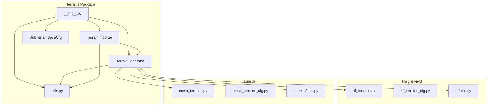
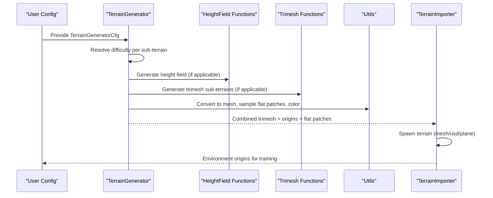
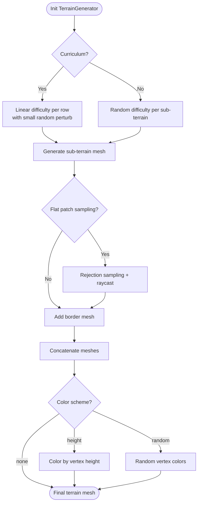
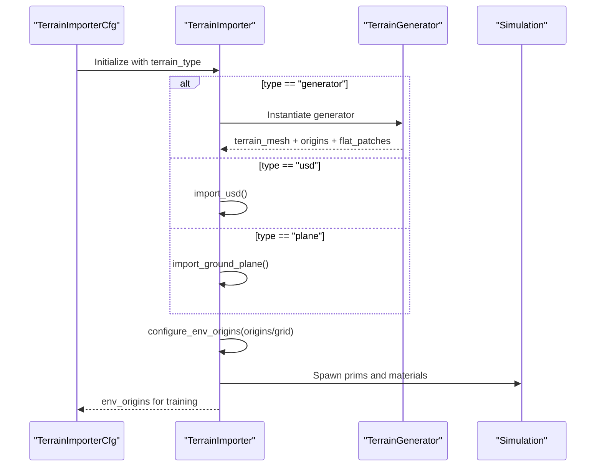
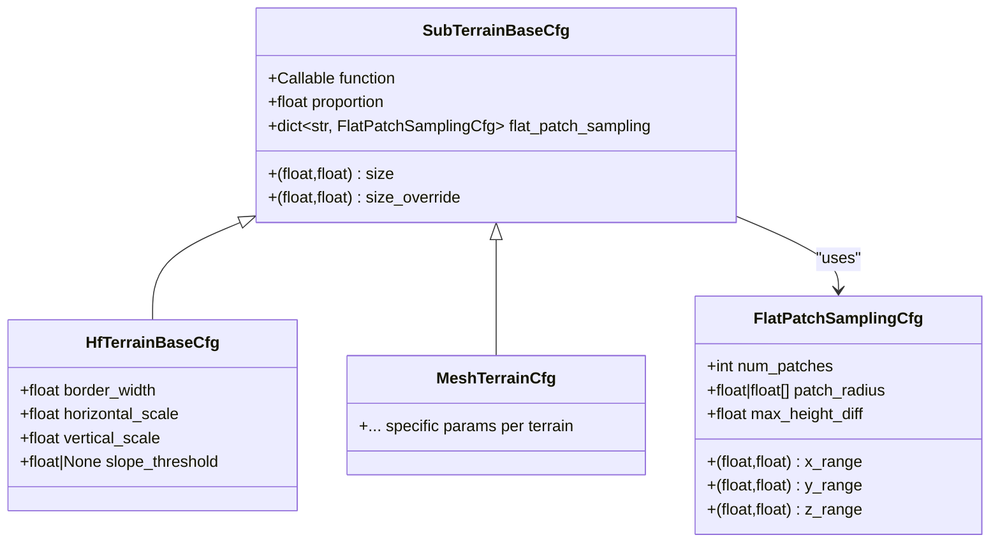
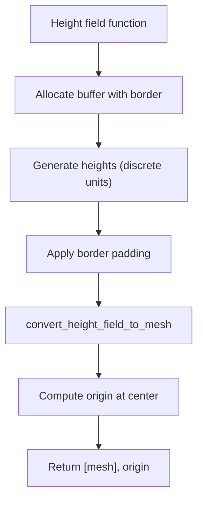
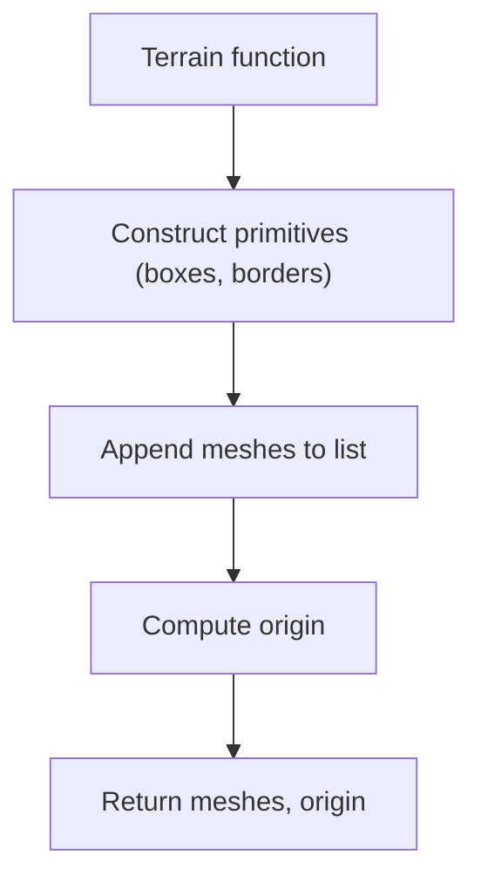
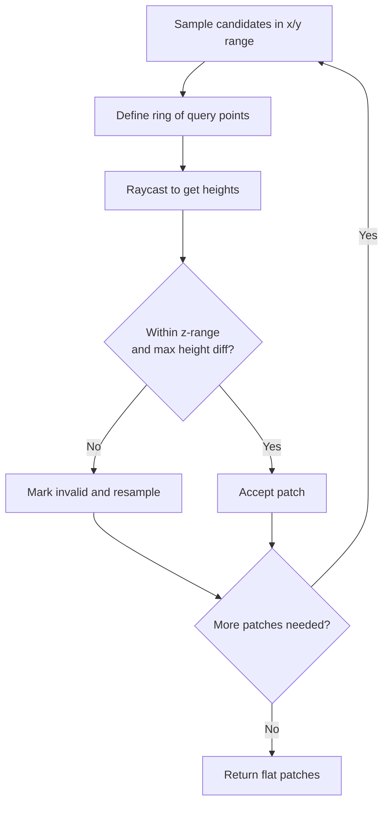
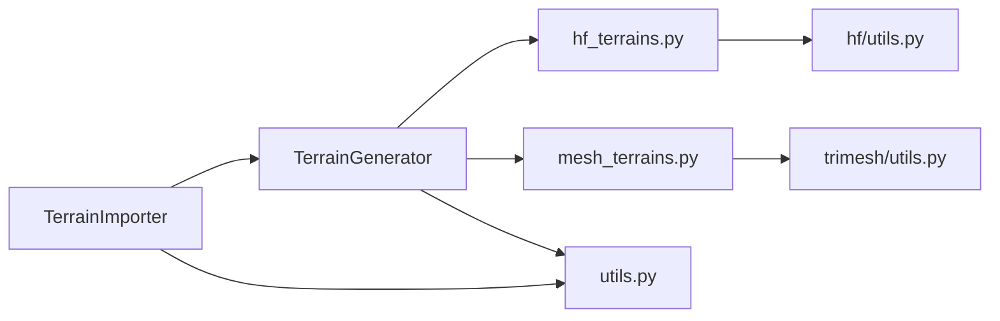

# Terrain Generation System

<cite>
**Referenced Files in This Document**
- [__init__.py](file://source/isaaclab/isaaclab/terrains/__init__.py)
- [terrain_generator.py](file://source/isaaclab/isaaclab/terrains/terrain_generator.py)
- [terrain_generator_cfg.py](file://source/isaaclab/isaaclab/terrains/terrain_generator_cfg.py)
- [terrain_importer.py](file://source/isaaclab/isaaclab/terrains/terrain_importer.py)
- [terrain_importer_cfg.py](file://source/isaaclab/isaaclab/terrains/terrain_importer_cfg.py)
- [utils.py](file://source/isaaclab/isaaclab/terrains/utils.py)
- [sub_terrain_cfg.py](file://source/isaaclab/isaaclab/terrains/sub_terrain_cfg.py)
- [hf_terrains.py](file://source/isaaclab/isaaclab/terrains/height_field/hf_terrains.py)
- [hf_terrains_cfg.py](file://source/isaaclab/isaaclab/terrains/height_field/hf_terrains_cfg.py)
- [utils.py](file://source/isaaclab/isaaclab/terrains/height_field/utils.py)
- [mesh_terrains.py](file://source/isaaclab/isaaclab/terrains/trimesh/mesh_terrains.py)
- [mesh_terrains_cfg.py](file://source/isaaclab/isaaclab/terrains/trimesh/mesh_terrains_cfg.py)
- [utils.py](file://source/isaaclab/isaaclab/terrains/trimesh/utils.py)
- [procedural_terrain.py](file://scripts/demos/procedural_terrain.py)
- [README.md](file://README.md)
</cite>

## Table of Contents
1. [Introduction](#introduction)
2. [Project Structure](#project-structure)
3. [Core Components](#core-components)
4. [Architecture Overview](#architecture-overview)
5. [Detailed Component Analysis](#detailed-component-analysis)
6. [Dependency Analysis](#dependency-analysis)
7. [Performance Considerations](#performance-considerations)
8. [Troubleshooting Guide](#troubleshooting-guide)
9. [Conclusion](#conclusion)
10. [Appendices](#appendices)

## Introduction
This document describes the Terrain Generation System that powers extreme parkour locomotion training for quadrupeds. The system procedurally generates diverse, scalable, and reproducible terrains composed of multiple sub-terrain types. It supports:
- Mixed terrain configurations via configurable proportions
- Curriculum learning integration for progressive difficulty
- Height field and trimesh terrain generation
- Flat patch sampling for safe robot and target placement
- Terrain import from generated meshes, USD files, or a default ground plane
- Validation and performance optimizations for large-scale deployments

The system is designed to support research ablation studies and training regimes where difficulty increases systematically across terrain layouts.

## Project Structure
The terrain system is organized into modules for generation, import, utilities, and terrain-specific generators (height field and trimesh). The high-level structure is:
- Terrains package entry exposing public APIs
- Terrain generator: builds composite terrains and manages difficulty and caching
- Terrain importer: spawns terrains into the simulator and computes environment origins
- Utilities: mesh coloring, flat patch sampling, USD prim creation
- Sub-terrain configuration base classes
- Height field terrains: procedural height fields converted to meshes
- Trimesh terrains: explicit box/cylinder/cone-based terrain compositions

**Diagram sources**
- [__init__.py:1-30](file://source/isaaclab/isaaclab/terrains/__init__.py#L1-L30)
- [terrain_generator.py:29-100](file://source/isaaclab/isaaclab/terrains/terrain_generator.py#L29-L100)
- [terrain_importer.py:25-50](file://source/isaaclab/isaaclab/terrains/terrain_importer.py#L25-L50)
- [utils.py:1-276](file://source/isaaclab/isaaclab/terrains/utils.py#L1-L276)
- [sub_terrain_cfg.py:17-99](file://source/isaaclab/isaaclab/terrains/sub_terrain_cfg.py#L17-L99)
- [hf_terrains.py:1-437](file://source/isaaclab/isaaclab/terrains/height_field/hf_terrains.py#L1-L437)
- [hf_terrains_cfg.py:1-168](file://source/isaaclab/isaaclab/terrains/height_field/hf_terrains_cfg.py#L1-L168)
- [utils.py:19-174](file://source/isaaclab/isaaclab/terrains/height_field/utils.py#L19-L174)
- [mesh_terrains.py:1-1159](file://source/isaaclab/isaaclab/terrains/trimesh/mesh_terrains.py#L1-L1159)
- [mesh_terrains_cfg.py:1-383](file://source/isaaclab/isaaclab/terrains/trimesh/mesh_terrains_cfg.py#L1-L383)
- [utils.py:1-195](file://source/isaaclab/isaaclab/terrains/trimesh/utils.py#L1-L195)

**Section sources**
- [__init__.py:1-30](file://source/isaaclab/isaaclab/terrains/__init__.py#L1-L30)

## Core Components
- TerrainGenerator: Builds a grid of sub-terrains, applies difficulty scaling, caches results, samples flat patches, and produces a combined trimesh terrain.
- TerrainImporter: Imports terrains into the simulator from generated meshes, USD files, or a default ground plane; computes environment origins and supports curriculum-based updates.
- SubTerrainBaseCfg and FlatPatchSamplingCfg: Base configuration classes enabling parameterized sub-terrain generation and flat patch sampling.
- HeightField and Trimesh terrain modules: Provide terrain functions and configuration classes for height field and explicit mesh-based terrains.

Key capabilities:
- Difficulty scaling: Linear curriculum or random difficulty within a range
- Mixed terrain composition: Proportional selection of sub-terrains
- Flat patch sampling: Rejection sampling to find safe, level regions
- Caching: Hash-based reuse of generated sub-terrains
- Coloring: Vertex coloring by height or random colors

**Section sources**
- [terrain_generator.py:29-204](file://source/isaaclab/isaaclab/terrains/terrain_generator.py#L29-L204)
- [terrain_importer.py:25-112](file://source/isaaclab/isaaclab/terrains/terrain_importer.py#L25-L112)
- [sub_terrain_cfg.py:17-99](file://source/isaaclab/isaaclab/terrains/sub_terrain_cfg.py#L17-L99)

## Architecture Overview
The system orchestrates terrain generation and import through a clear pipeline:
- Configuration defines sub-terrains, difficulty range, grid layout, and caching preferences
- TerrainGenerator constructs sub-terrains, applies difficulty, optionally samples flat patches, and combines into a single mesh
- TerrainImporter spawns the terrain into the simulator, computes environment origins, and supports curriculum-driven updates

**Diagram sources**
- [terrain_generator.py:209-397](file://source/isaaclab/isaaclab/terrains/terrain_generator.py#L209-L397)
- [utils.py:135-276](file://source/isaaclab/isaaclab/terrains/utils.py#L135-L276)
- [terrain_importer.py:80-112](file://source/isaaclab/isaaclab/terrains/terrain_importer.py#L80-L112)
- [hf_terrains.py:20-437](file://source/isaaclab/isaaclab/terrains/height_field/hf_terrains.py#L20-L437)
- [mesh_terrains.py:23-1159](file://source/isaaclab/isaaclab/terrains/trimesh/mesh_terrains.py#L23-L1159)

## Detailed Component Analysis

### TerrainGenerator
Purpose:
- Compose a grid of sub-terrains into a single terrain mesh
- Apply difficulty scaling (curriculum or random)
- Sample flat patches for safe spawning
- Support caching and coloring

Key behaviors:
- Curriculum mode: difficulty increases linearly along rows with small random perturbations
- Random mode: difficulty sampled uniformly per sub-terrain
- Flat patch sampling: rejection sampling with raycasting to validate levelness
- Caching: hash-based storage of generated sub-terrains
- Border: optional surrounding border mesh
- Coloring: height-based or random vertex colors

**Diagram sources**
- [terrain_generator.py:230-397](file://source/isaaclab/isaaclab/terrains/terrain_generator.py#L230-L397)
- [utils.py:135-276](file://source/isaaclab/isaaclab/terrains/utils.py#L135-L276)

**Section sources**
- [terrain_generator.py:29-204](file://source/isaaclab/isaaclab/terrains/terrain_generator.py#L29-L204)
- [terrain_generator.py:209-397](file://source/isaaclab/isaaclab/terrains/terrain_generator.py#L209-L397)
- [utils.py:135-276](file://source/isaaclab/isaaclab/terrains/utils.py#L135-L276)

### TerrainImporter
Purpose:
- Import terrains into the simulator
- Compute environment origins for training
- Support curriculum-based updates to terrain levels

Capabilities:
- Import from generator (mesh), USD file, or default ground plane
- Grid-based origin computation or curriculum-aware origins
- Debug visualization of origins
- Update environment origins based on curriculum actions

**Diagram sources**
- [terrain_importer.py:55-112](file://source/isaaclab/isaaclab/terrains/terrain_importer.py#L55-L112)
- [terrain_importer.py:285-363](file://source/isaaclab/isaaclab/terrains/terrain_importer.py#L285-L363)

**Section sources**
- [terrain_importer.py:25-112](file://source/isaaclab/isaaclab/terrains/terrain_importer.py#L25-L112)
- [terrain_importer.py:285-363](file://source/isaaclab/isaaclab/terrains/terrain_importer.py#L285-L363)

### Sub-Terrain Configuration System
- SubTerrainBaseCfg: Base class defining function, size, proportion, and optional flat patch sampling
- FlatPatchSamplingCfg: Defines sampling parameters for flat regions (radii, ranges, max height difference)
- Height field and trimesh terrain configs inherit from the base and define specific parameters

**Diagram sources**
- [sub_terrain_cfg.py:17-99](file://source/isaaclab/isaaclab/terrains/sub_terrain_cfg.py#L17-L99)
- [hf_terrains_cfg.py:14-31](file://source/isaaclab/isaaclab/terrains/height_field/hf_terrains_cfg.py#L14-L31)
- [mesh_terrains_cfg.py:21-383](file://source/isaaclab/isaaclab/terrains/trimesh/mesh_terrains_cfg.py#L21-L383)

**Section sources**
- [sub_terrain_cfg.py:17-99](file://source/isaaclab/isaaclab/terrains/sub_terrain_cfg.py#L17-L99)
- [hf_terrains_cfg.py:14-168](file://source/isaaclab/isaaclab/terrains/height_field/hf_terrains_cfg.py#L14-L168)
- [mesh_terrains_cfg.py:1-383](file://source/isaaclab/isaaclab/terrains/trimesh/mesh_terrains_cfg.py#L1-L383)

### Height Field Terrains
Supported terrains:
- random_uniform_terrain
- pyramid_sloped_terrain and inverted
- pyramid_stairs_terrain and inverted
- discrete_obstacles_terrain
- wave_terrain
- stepping_stones_terrain

Generation pipeline:
- Height field function returns a 2D array of heights
- Decorator converts height field to mesh, applies border, and computes origin
- Optional slope threshold correction to avoid steep vertical surfaces

**Diagram sources**
- [hf_terrains.py:20-437](file://source/isaaclab/isaaclab/terrains/height_field/hf_terrains.py#L20-L437)
- [utils.py:19-174](file://source/isaaclab/isaaclab/terrains/height_field/utils.py#L19-L174)

**Section sources**
- [hf_terrains.py:20-437](file://source/isaaclab/isaaclab/terrains/height_field/hf_terrains.py#L20-L437)
- [hf_terrains_cfg.py:14-168](file://source/isaaclab/isaaclab/terrains/height_field/hf_terrains_cfg.py#L14-L168)
- [utils.py:79-174](file://source/isaaclab/isaaclab/terrains/height_field/utils.py#L79-L174)

### Trimesh Terrains
Supported terrains:
- flat_terrain (plane)
- pyramid_stairs_terrain and inverted
- random_grid_terrain
- rails_terrain
- pit_terrain
- box_terrain
- gap_terrain
- gap_strip_terrain
- hurdle_strip_terrain
- stairs_strip_terrain
- parkour_step_terrain
- Additional reusable primitives (floating ring, star, repeated objects)

Generation pipeline:
- Terrain functions return a list of trimesh meshes and an origin
- Borders and platforms are constructed from boxes and borders
- Side walls and structural elements are added for open edges

**Diagram sources**
- [mesh_terrains.py:23-1159](file://source/isaaclab/isaaclab/terrains/trimesh/mesh_terrains.py#L23-L1159)
- [utils.py:48-97](file://source/isaaclab/isaaclab/terrains/trimesh/utils.py#L48-L97)

**Section sources**
- [mesh_terrains.py:23-1159](file://source/isaaclab/isaaclab/terrains/trimesh/mesh_terrains.py#L23-L1159)
- [mesh_terrains_cfg.py:21-383](file://source/isaaclab/isaaclab/terrains/trimesh/mesh_terrains_cfg.py#L21-L383)
- [utils.py:15-195](file://source/isaaclab/isaaclab/terrains/trimesh/utils.py#L15-L195)

### Flat Patch Sampling
Purpose:
- Find safe, level regions on generated terrains for spawning robots or targets

Method:
- Rejection sampling within x/y ranges around a center
- Ring of query points around each candidate location
- Raycast downward to validate height and height difference thresholds
- Iterative refinement until all requested patches are valid

**Diagram sources**
- [utils.py:135-276](file://source/isaaclab/isaaclab/terrains/utils.py#L135-L276)

**Section sources**
- [utils.py:135-276](file://source/isaaclab/isaaclab/terrains/utils.py#L135-L276)

### Terrain Import Functionality
Options:
- generator: Uses TerrainGenerator to produce a mesh
- usd: Imports a USD terrain file
- plane: Spawns a default ground plane

Behavior:
- Applies visual and physics materials
- Creates USD prims with mesh geometry and optional vertex colors
- Computes environment origins either from grid spacing or curriculum-aware mapping

**Section sources**
- [terrain_importer.py:182-280](file://source/isaaclab/isaaclab/terrains/terrain_importer.py#L182-L280)
- [utils.py:61-133](file://source/isaaclab/isaaclab/terrains/utils.py#L61-L133)

## Dependency Analysis
High-level dependencies:
- TerrainGenerator depends on sub-terrain functions (height field and trimesh), Warp mesh utilities, and caching
- TerrainImporter depends on TerrainGenerator and simulation prim creation utilities
- Utilities depend on trimesh, numpy, and Warp for raycasting and mesh operations

**Diagram sources**
- [terrain_generator.py:29-100](file://source/isaaclab/isaaclab/terrains/terrain_generator.py#L29-L100)
- [terrain_importer.py:25-50](file://source/isaaclab/isaaclab/terrains/terrain_importer.py#L25-L50)
- [hf_terrains.py:1-437](file://source/isaaclab/isaaclab/terrains/height_field/hf_terrains.py#L1-L437)
- [mesh_terrains.py:1-1159](file://source/isaaclab/isaaclab/terrains/trimesh/mesh_terrains.py#L1-L1159)
- [utils.py:1-276](file://source/isaaclab/isaaclab/terrains/utils.py#L1-L276)
- [utils.py:1-174](file://source/isaaclab/isaaclab/terrains/height_field/utils.py#L1-L174)
- [utils.py:1-195](file://source/isaaclab/isaaclab/terrains/trimesh/utils.py#L1-L195)

**Section sources**
- [terrain_generator.py:29-100](file://source/isaaclab/isaaclab/terrains/terrain_generator.py#L29-L100)
- [terrain_importer.py:25-50](file://source/isaaclab/isaaclab/terrains/terrain_importer.py#L25-L50)

## Performance Considerations
- Caching: Enable use_cache to avoid regenerating identical sub-terrains; ensure deterministic seeds for reproducibility
- Difficulty scaling: Curriculum mode reduces variance across sub-terrains by increasing difficulty along rows
- Mesh merging: Concatenating many meshes can be expensive; consider reducing sub-terrain count or simplifying geometry
- Flat patch sampling: Increase max iterations cautiously; adjust ranges and patch radii to improve acceptance rate
- Slope threshold correction: Helps avoid steep vertical faces; tune to balance realism and simulation stability
- Large-scale generation: Use grid sizes appropriate for hardware; leverage border widths judiciously

[No sources needed since this section provides general guidance]

## Troubleshooting Guide
Common issues and resolutions:
- Cache without seed: If caching is enabled but seed is not set, generation may not be reproducible; set a seed in TerrainGeneratorCfg
- Invalid color scheme: Ensure color_scheme is one of "height", "random", or "none"
- Flat patch sampling failures: If runtime errors occur, verify ranges and max_height_diff; reduce difficulty or increase sampling area
- Border width validation: For height field terrains, border width must be greater than or equal to horizontal scale
- Environment origins not configured: When using grid-like spawning, env_spacing must be specified

**Section sources**
- [terrain_generator.py:127-132](file://source/isaaclab/isaaclab/terrains/terrain_generator.py#L127-L132)
- [terrain_generator.py:171-174](file://source/isaaclab/isaaclab/terrains/terrain_generator.py#L171-L174)
- [utils.py:266-272](file://source/isaaclab/isaaclab/terrains/utils.py#L266-L272)
- [utils.py:38-42](file://source/isaaclab/isaaclab/terrains/height_field/utils.py#L38-L42)
- [terrain_importer.py:303-306](file://source/isaaclab/isaaclab/terrains/terrain_importer.py#L303-L306)

## Conclusion
The Terrain Generation System provides a flexible, scalable, and reproducible framework for creating challenging environments tailored to quadruped parkour training. By combining height field and trimesh terrain generation, curriculum learning, flat patch sampling, and robust import mechanisms, it supports both research ablation studies and large-scale training campaigns. The modular design enables easy customization and extension for specialized research scenarios.

[No sources needed since this section summarizes without analyzing specific files]

## Appendices

### Practical Examples

- Procedural terrain demo usage
  - Launch with different color schemes and curriculum options
  - Example commands and flags are demonstrated in the demo script

- Mixed terrain configuration
  - Define multiple sub-terrains with distinct proportions and difficulty ranges
  - Use curriculum mode to progressively increase difficulty across rows

- Difficulty progression setup
  - Set difficulty_range and enable curriculum in TerrainGeneratorCfg
  - Use TerrainImporter to compute environment origins aligned with terrain levels

- Custom terrain creation
  - Implement a new sub-terrain function returning a list of meshes and origin
  - Register it via a new configuration class inheriting from SubTerrainBaseCfg
  - Optionally integrate flat patch sampling for safe spawning

**Section sources**
- [procedural_terrain.py:36-175](file://scripts/demos/procedural_terrain.py#L36-L175)
- [terrain_generator_cfg.py:26-130](file://source/isaaclab/isaaclab/terrains/terrain_generator_cfg.py#L26-L130)
- [terrain_importer_cfg.py:20-104](file://source/isaaclab/isaaclab/terrains/terrain_importer_cfg.py#L20-L104)
- [sub_terrain_cfg.py:17-99](file://source/isaaclab/isaaclab/terrains/sub_terrain_cfg.py#L17-L99)

### Terrain Types and Parameter Ranges (from Ablation Study)
The ablation study documents the seven terrain types used in training:
- boxes: scattered box bumps (bump height: 0.025–0.10 m)
- random_rough: noisy rough surface (noise amplitude: 0.01–0.06 m, step 0.01)
- debris_field: sparse rocks/boxes/cylinders (count: 20–40; box L/W/T: 0.5–2.0 / 0.2–0.6 / 0.05–0.25; cyl R/L: 0.05–0.20 / 0.5–2.0)
- gap_bar: run-up then gaps (gap width: 0.1–0.8 m; landing: 0.45 m; run-up: 8.0 m)
- hurdle_strip: repeated hurdles (height: 0.05–0.30 m; gap: 0.7–2.0 m; thickness: 0.2 m; run-up: 3.0 m)
- stairs_strip: up/down stairs (step height: 0.05–0.23 m; segment: 5.0 m; steps: 10; run-up: 3.0 m)
- parkour_step: extreme stepping stones (height: 0.1–0.45 m; step length: 0.3–1.5 m; steps: 6; run-up: 3.0 m)

These ranges inform how to configure sub-terrain parameters for realistic and challenging training environments.

**Section sources**
- [README.md:98-107](file://README.md#L98-L107)