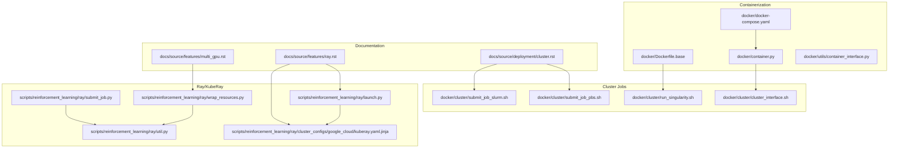
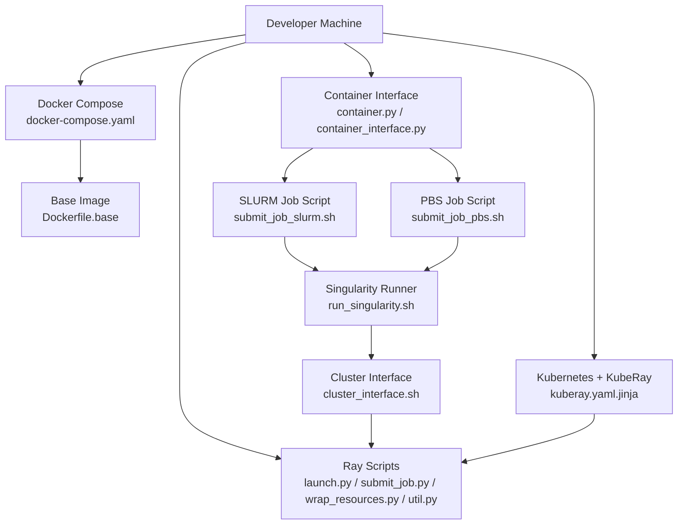
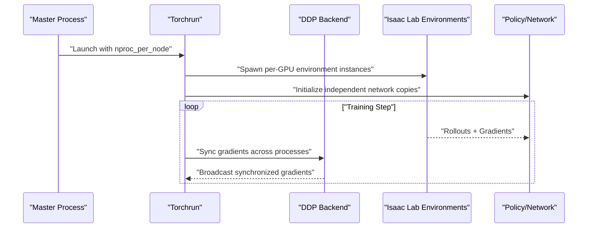
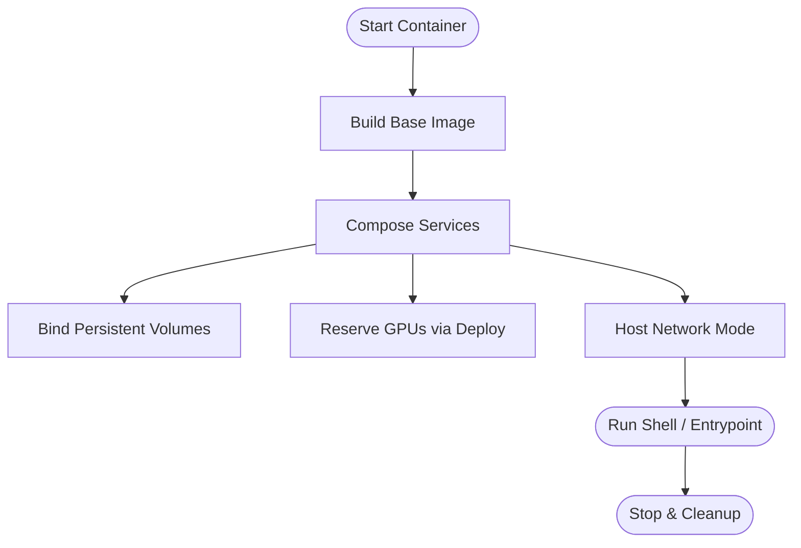
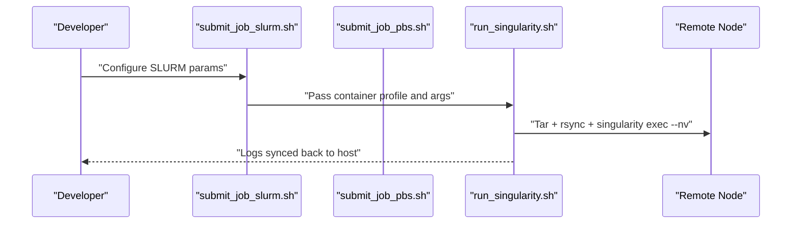
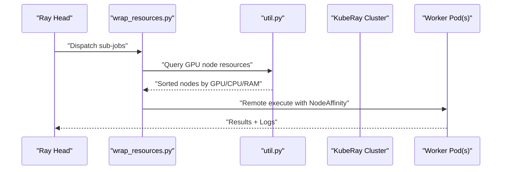
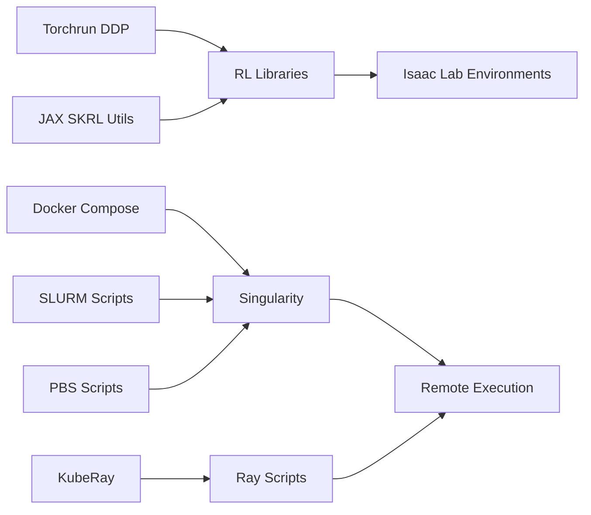

# Distributed Training Infrastructure

<cite>
**Referenced Files in This Document**
- [multi_gpu.rst](file://docs/source/features/multi_gpu.rst)
- [cluster.rst](file://docs/source/deployment/cluster.rst)
- [submit_job_slurm.sh](file://docker/cluster/submit_job_slurm.sh)
- [submit_job_pbs.sh](file://docker/cluster/submit_job_pbs.sh)
- [run_singularity.sh](file://docker/cluster/run_singularity.sh)
- [cluster_interface.sh](file://docker/cluster/cluster_interface.sh)
- [Dockerfile.base](file://docker/Dockerfile.base)
- [docker-compose.yaml](file://docker/docker-compose.yaml)
- [container.py](file://docker/container.py)
- [container_interface.py](file://docker/utils/container_interface.py)
- [launch.py](file://scripts/reinforcement_learning/ray/launch.py)
- [submit_job.py](file://scripts/reinforcement_learning/ray/submit_job.py)
- [wrap_resources.py](file://scripts/reinforcement_learning/ray/wrap_resources.py)
- [util.py](file://scripts/reinforcement_learning/ray/util.py)
- [kuberay.yaml.jinja](file://scripts/reinforcement_learning/ray/cluster_configs/google_cloud/kuberay.yaml.jinja)
- [ray.rst](file://docs/source/features/ray.rst)
</cite>

## Table of Contents
1. [Introduction](#introduction)
2. [Project Structure](#project-structure)
3. [Core Components](#core-components)
4. [Architecture Overview](#architecture-overview)
5. [Detailed Component Analysis](#detailed-component-analysis)
6. [Dependency Analysis](#dependency-analysis)
7. [Performance Considerations](#performance-considerations)
8. [Troubleshooting Guide](#troubleshooting-guide)
9. [Conclusion](#conclusion)
10. [Appendices](#appendices)

## Introduction
This document explains the distributed training infrastructure for large-scale reinforcement learning experiments. It covers multi-GPU training with Torchrun and JAX, containerization with Docker and Singularity for cluster deployment, job submission via SLURM and PBS, and cloud auto-scaling with Ray/KubeRay on Kubernetes. It also addresses device allocation strategies, seed diversification, memory optimization, fault tolerance, synchronization, and monitoring.

## Project Structure
The repository provides:
- Documentation for multi-GPU and cluster deployment
- Docker/Singularity tooling for containerization and cluster execution
- Ray/KubeRay scripts for cloud auto-scaling and job orchestration
- Cluster job scripts for SLURM and PBS

**Diagram sources**
- [multi_gpu.rst:1-222](file://docs/source/features/multi_gpu.rst#L1-L222)
- [cluster.rst:1-195](file://docs/source/deployment/cluster.rst#L1-L195)
- [Dockerfile.base:1-112](file://docker/Dockerfile.base#L1-L112)
- [docker-compose.yaml:1-154](file://docker/docker-compose.yaml#L1-L154)
- [container.py:1-143](file://docker/container.py#L1-L143)
- [container_interface.py:1-317](file://docker/utils/container_interface.py#L1-L317)
- [submit_job_slurm.sh:1-25](file://docker/cluster/submit_job_slurm.sh#L1-L25)
- [submit_job_pbs.sh:1-23](file://docker/cluster/submit_job_pbs.sh#L1-L23)
- [run_singularity.sh:54-82](file://docker/cluster/run_singularity.sh#L54-L82)
- [cluster_interface.sh:45-76](file://docker/cluster/cluster_interface.sh#L45-L76)
- [launch.py:1-181](file://scripts/reinforcement_learning/ray/launch.py#L1-L181)
- [submit_job.py:1-149](file://scripts/reinforcement_learning/ray/submit_job.py#L1-L149)
- [wrap_resources.py:1-151](file://scripts/reinforcement_learning/ray/wrap_resources.py#L1-L151)
- [util.py:1-484](file://scripts/reinforcement_learning/ray/util.py#L1-L484)
- [kuberay.yaml.jinja:1-203](file://scripts/reinforcement_learning/ray/cluster_configs/google_cloud/kuberay.yaml.jinja#L1-L203)

**Section sources**
- [multi_gpu.rst:1-222](file://docs/source/features/multi_gpu.rst#L1-L222)
- [cluster.rst:1-195](file://docs/source/deployment/cluster.rst#L1-L195)
- [Dockerfile.base:1-112](file://docker/Dockerfile.base#L1-L112)
- [docker-compose.yaml:1-154](file://docker/docker-compose.yaml#L1-L154)
- [container.py:1-143](file://docker/container.py#L1-L143)
- [container_interface.py:1-317](file://docker/utils/container_interface.py#L1-L317)
- [submit_job_slurm.sh:1-25](file://docker/cluster/submit_job_slurm.sh#L1-L25)
- [submit_job_pbs.sh:1-23](file://docker/cluster/submit_job_pbs.sh#L1-L23)
- [run_singularity.sh:54-82](file://docker/cluster/run_singularity.sh#L54-L82)
- [cluster_interface.sh:45-76](file://docker/cluster/cluster_interface.sh#L45-L76)
- [launch.py:1-181](file://scripts/reinforcement_learning/ray/launch.py#L1-L181)
- [submit_job.py:1-149](file://scripts/reinforcement_learning/ray/submit_job.py#L1-L149)
- [wrap_resources.py:1-151](file://scripts/reinforcement_learning/ray/wrap_resources.py#L1-L151)
- [util.py:1-484](file://scripts/reinforcement_learning/ray/util.py#L1-L484)
- [kuberay.yaml.jinja:1-203](file://scripts/reinforcement_learning/ray/cluster_configs/google_cloud/kuberay.yaml.jinja#L1-L203)

## Core Components
- Multi-GPU training with Torchrun and JAX for RL-Games, RSL-RL, and SKRL workflows.
- Docker-based containerization with GPU passthrough and persistent caches.
- Singularity conversion and cluster execution via SLURM/PBS wrappers.
- Ray/KubeRay auto-scaling on Kubernetes with GPU-aware scheduling and resource isolation.
- Job orchestration utilities for cluster submission, resource wrapping, and monitoring.

**Section sources**
- [multi_gpu.rst:16-222](file://docs/source/features/multi_gpu.rst#L16-L222)
- [Dockerfile.base:69-112](file://docker/Dockerfile.base#L69-L112)
- [docker-compose.yaml:77-104](file://docker/docker-compose.yaml#L77-L104)
- [cluster.rst:126-195](file://docs/source/deployment/cluster.rst#L126-L195)
- [launch.py:1-181](file://scripts/reinforcement_learning/ray/launch.py#L1-L181)
- [wrap_resources.py:1-151](file://scripts/reinforcement_learning/ray/wrap_resources.py#L1-L151)
- [util.py:310-461](file://scripts/reinforcement_learning/ray/util.py#L310-L461)

## Architecture Overview
The distributed training pipeline integrates:
- Local or CI-managed Docker builds
- Cluster job wrappers for SLURM/PBS
- Singularity execution on remote nodes with GPU passthrough
- Ray/KubeRay clusters for auto-scaling and resource isolation
- Monitoring via TensorBoard logs and Ray dashboard

**Diagram sources**
- [docker-compose.yaml:85-137](file://docker/docker-compose.yaml#L85-L137)
- [Dockerfile.base:10-112](file://docker/Dockerfile.base#L10-L112)
- [container.py:93-143](file://docker/container.py#L93-L143)
- [container_interface.py:111-188](file://docker/utils/container_interface.py#L111-L188)
- [submit_job_slurm.sh:8-24](file://docker/cluster/submit_job_slurm.sh#L8-L24)
- [submit_job_pbs.sh:8-22](file://docker/cluster/submit_job_pbs.sh#L8-L22)
- [run_singularity.sh:54-82](file://docker/cluster/run_singularity.sh#L54-L82)
- [cluster_interface.sh:74-116](file://docker/cluster/cluster_interface.sh#L74-L116)
- [kuberay.yaml.jinja:1-203](file://scripts/reinforcement_learning/ray/cluster_configs/google_cloud/kuberay.yaml.jinja#L1-L203)
- [launch.py:40-84](file://scripts/reinforcement_learning/ray/launch.py#L40-L84)
- [submit_job.py:79-127](file://scripts/reinforcement_learning/ray/submit_job.py#L79-L127)
- [wrap_resources.py:68-122](file://scripts/reinforcement_learning/ray/wrap_resources.py#L68-L122)
- [util.py:310-461](file://scripts/reinforcement_learning/ray/util.py#L310-L461)

## Detailed Component Analysis

### Multi-GPU Training Setup
- Torchrun-based DDP for PyTorch with per-process GPU assignment and gradient synchronization.
- JAX-based SKRL distributed training with explicit process orchestration.
- Device allocation: one process per GPU; environment instances are independent per process.
- Gradient synchronization occurs only during DDP sync points.

**Diagram sources**
- [multi_gpu.rst:24-61](file://docs/source/features/multi_gpu.rst#L24-L61)

**Section sources**
- [multi_gpu.rst:16-222](file://docs/source/features/multi_gpu.rst#L16-L222)

### Containerization with Docker and GPU Passthrough
- Base image builds with Isaac Sim and installs dependencies; sets aliases and working directory.
- Persistent caches for Omniverse, pip, GL, Compute, logs, and data are mounted via volumes.
- GPU passthrough via device reservations in compose; host networking for performance.
- Container interface supports building, starting, entering, stopping, and copying artifacts.

**Diagram sources**
- [Dockerfile.base:69-112](file://docker/Dockerfile.base#L69-L112)
- [docker-compose.yaml:77-104](file://docker/docker-compose.yaml#L77-L104)
- [container.py:111-136](file://docker/container.py#L111-L136)
- [container_interface.py:111-188](file://docker/utils/container_interface.py#L111-L188)

**Section sources**
- [Dockerfile.base:1-112](file://docker/Dockerfile.base#L1-L112)
- [docker-compose.yaml:1-154](file://docker/docker-compose.yaml#L1-L154)
- [container.py:1-143](file://docker/container.py#L1-L143)
- [container_interface.py:1-317](file://docker/utils/container_interface.py#L1-L317)

### Cluster Job Submission (SLURM and PBS)
- SLURM/PBS scripts define resource requests (CPUs, GPUs, memory, time).
- Job wrappers generate job scripts and submit via sbatch/qsub.
- Remote execution uses Singularity with GPU passthrough and cache sync.

**Diagram sources**
- [submit_job_slurm.sh:8-24](file://docker/cluster/submit_job_slurm.sh#L8-L24)
- [submit_job_pbs.sh:8-22](file://docker/cluster/submit_job_pbs.sh#L8-L22)
- [run_singularity.sh:54-82](file://docker/cluster/run_singularity.sh#L54-L82)

**Section sources**
- [cluster.rst:126-195](file://docs/source/deployment/cluster.rst#L126-L195)
- [submit_job_slurm.sh:1-25](file://docker/cluster/submit_job_slurm.sh#L1-L25)
- [submit_job_pbs.sh:1-23](file://docker/cluster/submit_job_pbs.sh#L1-L23)
- [run_singularity.sh:54-82](file://docker/cluster/run_singularity.sh#L54-L82)
- [cluster_interface.sh:45-76](file://docker/cluster/cluster_interface.sh#L45-L76)

### Ray/KubeRay Auto-Scaling and Resource Isolation
- KubeRay cluster manifests define head and worker groups with GPU node selectors and tolerations.
- Resource wrapping dispatches sub-jobs to workers with per-worker GPU/CPU/RAM isolation.
- Job submission cycles through clusters; logs are fetched and monitored via Ray dashboard and TensorBoard.

**Diagram sources**
- [kuberay.yaml.jinja:17-160](file://scripts/reinforcement_learning/ray/cluster_configs/google_cloud/kuberay.yaml.jinja#L17-L160)
- [wrap_resources.py:68-122](file://scripts/reinforcement_learning/ray/wrap_resources.py#L68-L122)
- [util.py:310-461](file://scripts/reinforcement_learning/ray/util.py#L310-L461)
- [submit_job.py:79-127](file://scripts/reinforcement_learning/ray/submit_job.py#L79-L127)

**Section sources**
- [ray.rst:222-301](file://docs/source/features/ray.rst#L222-L301)
- [launch.py:1-181](file://scripts/reinforcement_learning/ray/launch.py#L1-L181)
- [wrap_resources.py:1-151](file://scripts/reinforcement_learning/ray/wrap_resources.py#L1-L151)
- [util.py:1-484](file://scripts/reinforcement_learning/ray/util.py#L1-L484)
- [kuberay.yaml.jinja:1-203](file://scripts/reinforcement_learning/ray/cluster_configs/google_cloud/kuberay.yaml.jinja#L1-L203)

## Dependency Analysis
- Multi-GPU training depends on PyTorch DDP and JAX distributed utilities.
- Containerization depends on Docker Compose and base image definitions.
- Cluster execution depends on Singularity and job scripts.
- Ray/KubeRay depends on Kubernetes CRDs and GPU operator for scheduling.

**Diagram sources**
- [multi_gpu.rst:24-61](file://docs/source/features/multi_gpu.rst#L24-L61)
- [docker-compose.yaml:77-104](file://docker/docker-compose.yaml#L77-L104)
- [submit_job_slurm.sh:8-24](file://docker/cluster/submit_job_slurm.sh#L8-L24)
- [submit_job_pbs.sh:8-22](file://docker/cluster/submit_job_pbs.sh#L8-L22)
- [kuberay.yaml.jinja:1-203](file://scripts/reinforcement_learning/ray/cluster_configs/google_cloud/kuberay.yaml.jinja#L1-L203)
- [util.py:310-461](file://scripts/reinforcement_learning/ray/util.py#L310-L461)

**Section sources**
- [multi_gpu.rst:16-222](file://docs/source/features/multi_gpu.rst#L16-L222)
- [docker-compose.yaml:77-104](file://docker/docker-compose.yaml#L77-L104)
- [submit_job_slurm.sh:1-25](file://docker/cluster/submit_job_slurm.sh#L1-L25)
- [submit_job_pbs.sh:1-23](file://docker/cluster/submit_job_pbs.sh#L1-L23)
- [kuberay.yaml.jinja:1-203](file://scripts/reinforcement_learning/ray/cluster_configs/google_cloud/kuberay.yaml.jinja#L1-L203)
- [util.py:310-461](file://scripts/reinforcement_learning/ray/util.py#L310-L461)

## Performance Considerations
- Multi-node DDP is constrained by inter-node communication latency; single-node multi-GPU often scales better.
- GPU passthrough and host networking reduce virtualization overhead.
- Persistent caches minimize repeated downloads and accelerate startup.
- Ray/KubeRay autoscaling ensures GPU utilization; node affinity prevents cross-node interference.

[No sources needed since this section provides general guidance]

## Troubleshooting Guide
- GPU visibility mismatch: The utility validates GPU counts via nvidia-smi and PyTorch, resetting CUDA_VISIBLE_DEVICES when needed.
- Job submission failures: Ensure cluster credentials, Ray dashboard accessibility, and GPU operator installation.
- Logs extraction: TensorBoard logs are parsed for latest scalars; Ray dashboard URLs are printed upon completion.
- Cluster readiness: Confirm nodes, CRDs, and drivers; verify node selectors and tolerations for GPU accelerators.

**Section sources**
- [util.py:151-200](file://scripts/reinforcement_learning/ray/util.py#L151-L200)
- [submit_job.py:79-107](file://scripts/reinforcement_learning/ray/submit_job.py#L79-L107)
- [ray.rst:265-280](file://docs/source/features/ray.rst#L265-L280)
- [kuberay.yaml.jinja:147-153](file://scripts/reinforcement_learning/ray/cluster_configs/google_cloud/kuberay.yaml.jinja#L147-L153)

## Conclusion
The infrastructure combines multi-GPU training with robust containerization, cluster job submission, and cloud auto-scaling. It emphasizes GPU isolation, resource-aware scheduling, and monitoring to achieve reliable, scalable reinforcement learning experiments.

[No sources needed since this section summarizes without analyzing specific files]

## Appendices

### Practical Examples and Commands
- Multi-GPU training with Torchrun and JAX are documented in the multi-GPU guide.
- SLURM/PBS job parameters are defined in the cluster guide and job scripts.
- Ray/KubeRay cluster creation and job submission are scripted and templated.

**Section sources**
- [multi_gpu.rst:86-222](file://docs/source/features/multi_gpu.rst#L86-L222)
- [cluster.rst:126-195](file://docs/source/deployment/cluster.rst#L126-L195)
- [submit_job_slurm.sh:8-24](file://docker/cluster/submit_job_slurm.sh#L8-L24)
- [submit_job_pbs.sh:8-22](file://docker/cluster/submit_job_pbs.sh#L8-L22)
- [launch.py:1-181](file://scripts/reinforcement_learning/ray/launch.py#L1-L181)
- [submit_job.py:1-149](file://scripts/reinforcement_learning/ray/submit_job.py#L1-L149)