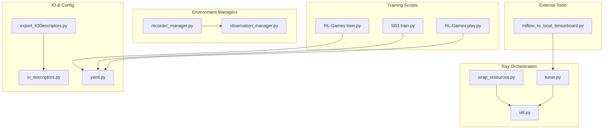
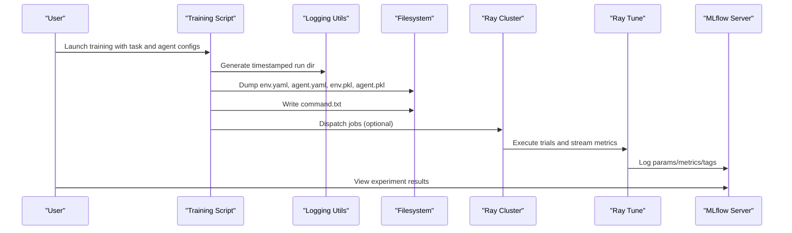
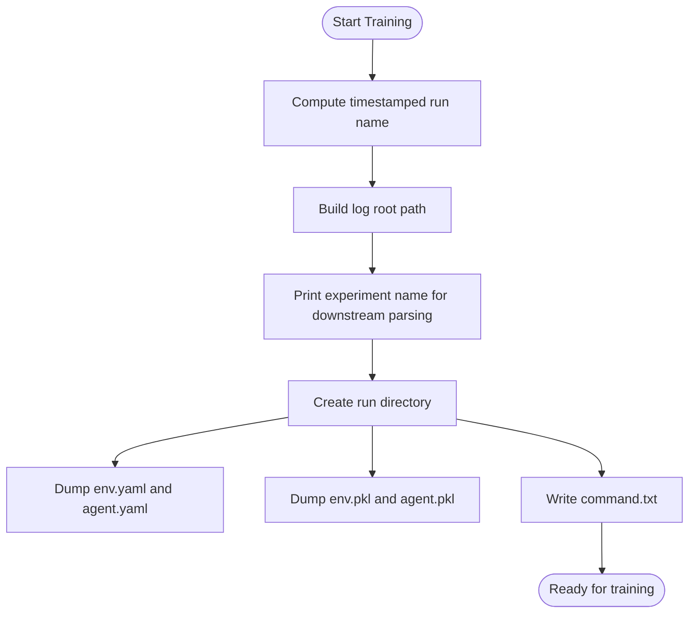
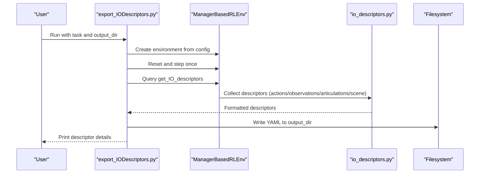
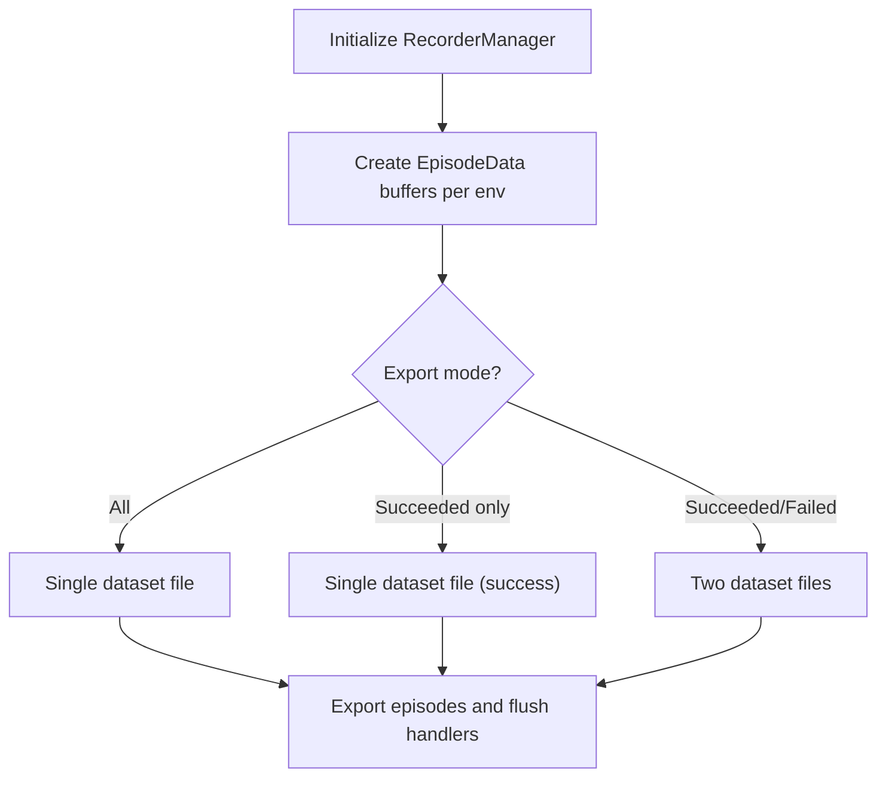
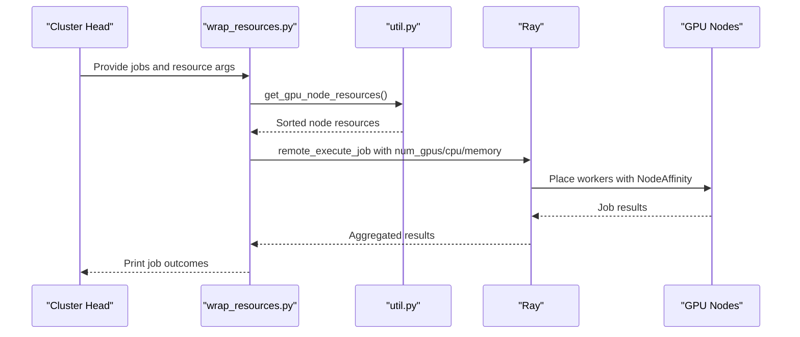
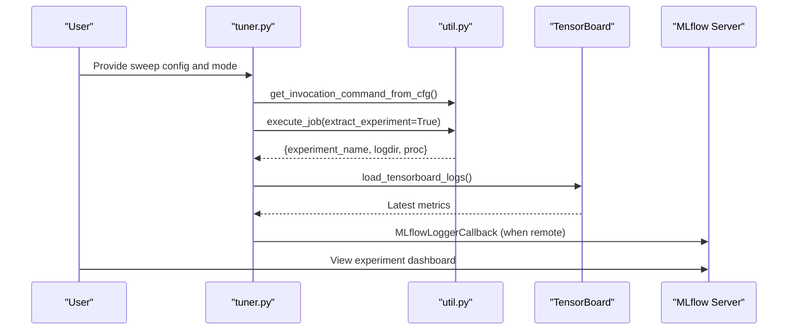
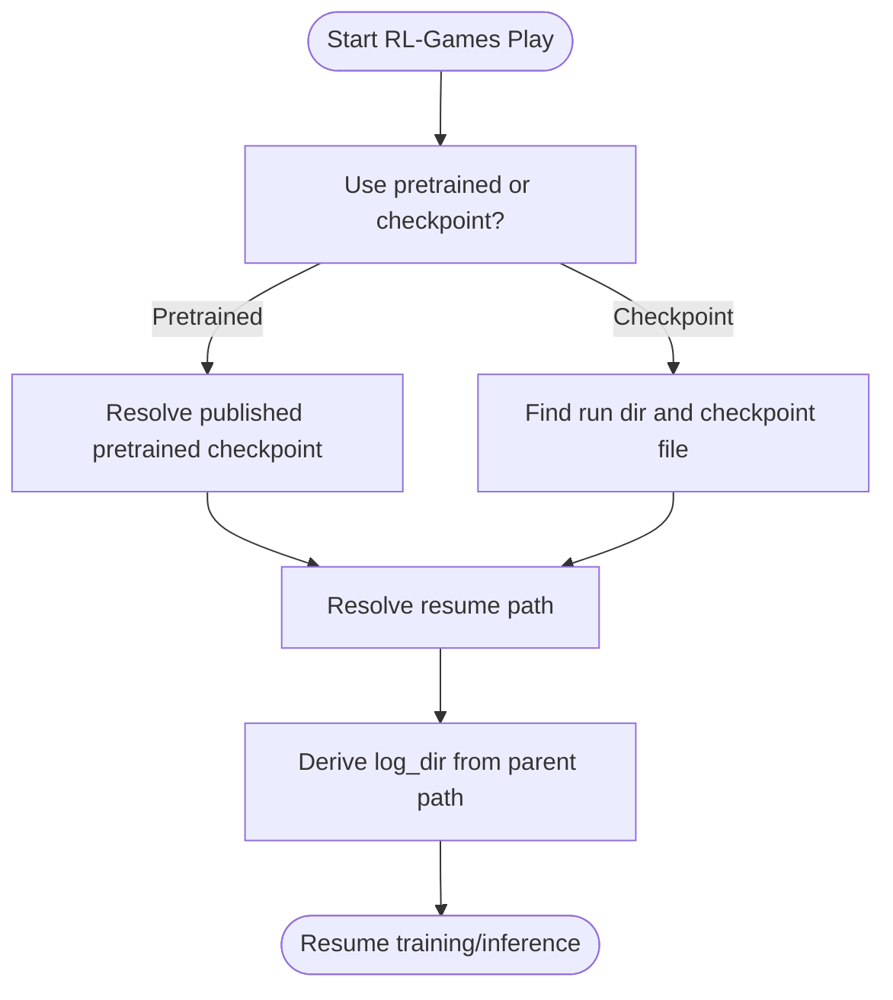
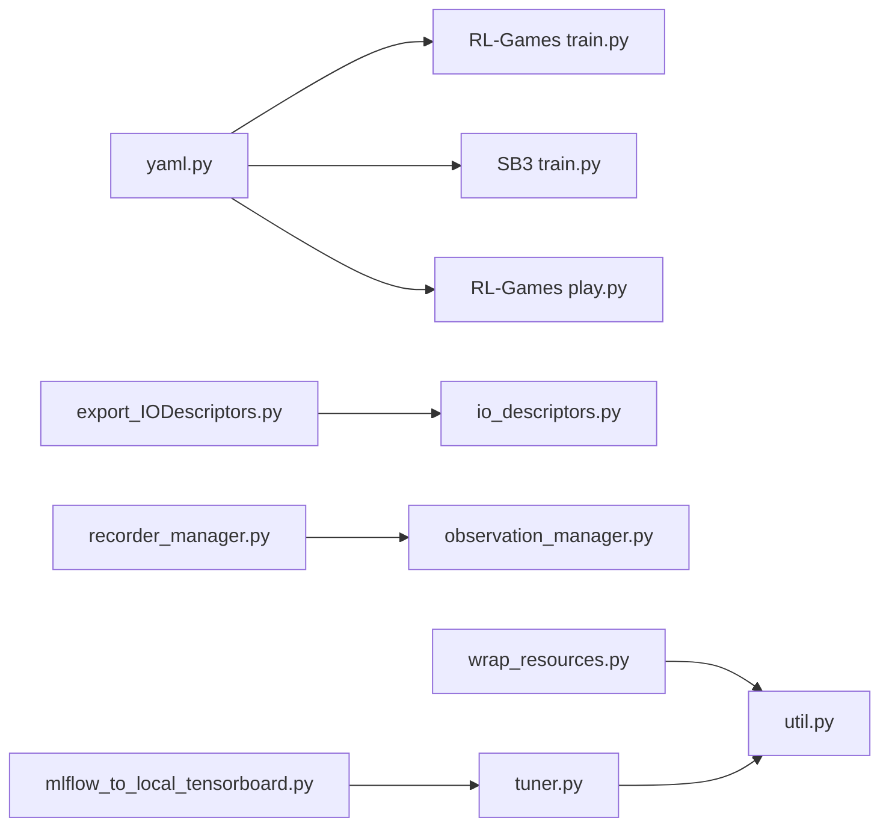

# Experiment Management and Tracking

<cite>
**Referenced Files in This Document**
- [export_IODescriptors.py](file://scripts/environments/export_IODescriptors.py)
- [io_descriptors.py](file://source/isaaclab/isaaclab/envs/utils/io_descriptors.py)
- [recorder_manager.py](file://source/isaaclab/isaaclab/managers/recorder_manager.py)
- [observation_manager.py](file://source/isaaclab/isaaclab/managers/observation_manager.py)
- [yaml.py](file://source/isaaclab/isaaclab/utils/io/yaml.py)
- [wrap_resources.py](file://scripts/reinforcement_learning/ray/wrap_resources.py)
- [util.py](file://scripts/reinforcement_learning/ray/util.py)
- [tuner.py](file://scripts/reinforcement_learning/ray/tuner.py)
- [mlflow_to_local_tensorboard.py](file://scripts/reinforcement_learning/ray/mlflow_to_local_tensorboard.py)
- [train.py (RL-Games)](file://scripts/reinforcement_learning/rl_games/train.py)
- [train.py (SB3)](file://scripts/reinforcement_learning/sb3/train.py)
- [play.py (RL-Games)](file://scripts/reinforcement_learning/rl_games/play.py)
- [benchmark_cameras.py](file://scripts/benchmarks/benchmark_cameras.py)
- [app_launcher.py](file://source/isaaclab/isaaclab/app/app_launcher.py)
</cite>

## Table of Contents
1. [Introduction](#introduction)
2. [Project Structure](#project-structure)
3. [Core Components](#core-components)
4. [Architecture Overview](#architecture-overview)
5. [Detailed Component Analysis](#detailed-component-analysis)
6. [Dependency Analysis](#dependency-analysis)
7. [Performance Considerations](#performance-considerations)
8. [Troubleshooting Guide](#troubleshooting-guide)
9. [Conclusion](#conclusion)
10. [Appendices](#appendices)

## Introduction
This document explains the experiment management and tracking system used in the repository. It covers:
- Logging infrastructure: experiment directories, timestamp-based run naming, and configuration persistence via YAML and pickle.
- IO descriptor export for policy deployment preparation.
- Checkpoint management and resumption across distributed training.
- Resource wrapping for efficient GPU utilization and environment scaling.
- Practical workflows for experiment configuration, run organization, and result tracking.
- Reproducibility measures and integration with external tools such as MLflow.

## Project Structure
The experiment management spans scripts for training and tuning, utilities for resource orchestration, and core environment managers for data recording and IO descriptors.

**Diagram sources**
- [train.py (RL-Games):127-145](file://scripts/reinforcement_learning/rl_games/train.py#L127-L145)
- [train.py (SB3):123-144](file://scripts/reinforcement_learning/sb3/train.py#L123-L144)
- [play.py (RL-Games):108-131](file://scripts/reinforcement_learning/rl_games/play.py#L108-L131)
- [wrap_resources.py:68-122](file://scripts/reinforcement_learning/ray/wrap_resources.py#L68-L122)
- [util.py:115-307](file://scripts/reinforcement_learning/ray/util.py#L115-L307)
- [tuner.py:66-160](file://scripts/reinforcement_learning/ray/tuner.py#L66-L160)
- [recorder_manager.py:127-497](file://source/isaaclab/isaaclab/managers/recorder_manager.py#L127-L497)
- [observation_manager.py:271-290](file://source/isaaclab/isaaclab/managers/observation_manager.py#L271-L290)
- [export_IODescriptors.py:40-94](file://scripts/environments/export_IODescriptors.py#L40-L94)
- [io_descriptors.py:116-228](file://source/isaaclab/isaaclab/envs/utils/io_descriptors.py#L116-L228)
- [yaml.py:33-55](file://source/isaaclab/isaaclab/utils/io/yaml.py#L33-L55)
- [mlflow_to_local_tensorboard.py:67-126](file://scripts/reinforcement_learning/ray/mlflow_to_local_tensorboard.py#L67-L126)

**Section sources**
- [train.py (RL-Games):127-145](file://scripts/reinforcement_learning/rl_games/train.py#L127-L145)
- [train.py (SB3):123-144](file://scripts/reinforcement_learning/sb3/train.py#L123-L144)
- [wrap_resources.py:68-122](file://scripts/reinforcement_learning/ray/wrap_resources.py#L68-L122)
- [util.py:115-307](file://scripts/reinforcement_learning/ray/util.py#L115-L307)
- [tuner.py:66-160](file://scripts/reinforcement_learning/ray/tuner.py#L66-L160)
- [recorder_manager.py:127-497](file://source/isaaclab/isaaclab/managers/recorder_manager.py#L127-L497)
- [observation_manager.py:271-290](file://source/isaaclab/isaaclab/managers/observation_manager.py#L271-L290)
- [export_IODescriptors.py:40-94](file://scripts/environments/export_IODescriptors.py#L40-L94)
- [io_descriptors.py:116-228](file://source/isaaclab/isaaclab/envs/utils/io_descriptors.py#L116-L228)
- [yaml.py:33-55](file://source/isaaclab/isaaclab/utils/io/yaml.py#L33-L55)
- [mlflow_to_local_tensorboard.py:67-126](file://scripts/reinforcement_learning/ray/mlflow_to_local_tensorboard.py#L67-L126)

## Core Components
- Logging and configuration persistence:
  - Timestamp-based run naming and structured experiment directories.
  - YAML and pickle dumps of environment and agent configurations.
  - Command-line preservation for reproducibility.
- IO descriptors:
  - Export of action/observation terms and articulation/scene metadata for policy deployment.
- Recording and datasets:
  - Episode recording and export modes for successful/failed episodes.
- Resource orchestration:
  - Automatic GPU node discovery, worker placement, and resource isolation for distributed runs.
- Tuning and MLflow integration:
  - Ray Tune-based hyperparameter sweeps with MLflow logging and TensorBoard conversion.

**Section sources**
- [train.py (RL-Games):127-145](file://scripts/reinforcement_learning/rl_games/train.py#L127-L145)
- [train.py (SB3):123-144](file://scripts/reinforcement_learning/sb3/train.py#L123-L144)
- [yaml.py:33-55](file://source/isaaclab/isaaclab/utils/io/yaml.py#L33-L55)
- [export_IODescriptors.py:40-94](file://scripts/environments/export_IODescriptors.py#L40-L94)
- [io_descriptors.py:116-228](file://source/isaaclab/isaaclab/envs/utils/io_descriptors.py#L116-L228)
- [recorder_manager.py:26-49](file://source/isaaclab/isaaclab/managers/recorder_manager.py#L26-L49)
- [wrap_resources.py:68-122](file://scripts/reinforcement_learning/ray/wrap_resources.py#L68-L122)
- [tuner.py:66-160](file://scripts/reinforcement_learning/ray/tuner.py#L66-L160)
- [mlflow_to_local_tensorboard.py:67-126](file://scripts/reinforcement_learning/ray/mlflow_to_local_tensorboard.py#L67-L126)

## Architecture Overview
The system organizes experiments into timestamped directories, persists configurations, and supports distributed execution with resource-aware job dispatch. Results are logged locally or exported to MLflow and can be converted for TensorBoard visualization.

**Diagram sources**
- [train.py (RL-Games):127-145](file://scripts/reinforcement_learning/rl_games/train.py#L127-L145)
- [train.py (SB3):123-144](file://scripts/reinforcement_learning/sb3/train.py#L123-L144)
- [yaml.py:33-55](file://source/isaaclab/isaaclab/utils/io/yaml.py#L33-L55)
- [wrap_resources.py:68-122](file://scripts/reinforcement_learning/ray/wrap_resources.py#L68-L122)
- [tuner.py:206-292](file://scripts/reinforcement_learning/ray/tuner.py#L206-L292)
- [mlflow_to_local_tensorboard.py:67-126](file://scripts/reinforcement_learning/ray/mlflow_to_local_tensorboard.py#L67-L126)

## Detailed Component Analysis

### Logging Infrastructure and Configuration Persistence
- Timestamp-based run naming:
  - Training scripts construct a run directory using a timestamp pattern and print a dedicated line consumed by downstream tools.
- Configuration persistence:
  - YAML and pickle files are saved for both environment and agent configurations.
  - Command invocation is captured to preserve exact launch parameters.
- Directory layout:
  - Root logs directory organized by framework and task/config name; run subdirectory contains params and command artifacts.

**Diagram sources**
- [train.py (RL-Games):127-145](file://scripts/reinforcement_learning/rl_games/train.py#L127-L145)
- [train.py (SB3):123-144](file://scripts/reinforcement_learning/sb3/train.py#L123-L144)
- [yaml.py:33-55](file://source/isaaclab/isaaclab/utils/io/yaml.py#L33-L55)

**Section sources**
- [train.py (RL-Games):127-145](file://scripts/reinforcement_learning/rl_games/train.py#L127-L145)
- [train.py (SB3):123-144](file://scripts/reinforcement_learning/sb3/train.py#L123-L144)
- [yaml.py:33-55](file://source/isaaclab/isaaclab/utils/io/yaml.py#L33-L55)

### IO Descriptor Export for Policy Deployment
- Purpose:
  - Export action and observation descriptors along with articulation and scene metadata to a YAML file for deployment.
- Workflow:
  - Parse environment configuration, instantiate environment, query IO descriptors, and write a YAML file.
- Descriptor mechanics:
  - Generic descriptors capture metadata such as shape, dtype, and optional hooks to record joint/body names or offsets.

**Diagram sources**
- [export_IODescriptors.py:40-94](file://scripts/environments/export_IODescriptors.py#L40-L94)
- [io_descriptors.py:116-228](file://source/isaaclab/isaaclab/envs/utils/io_descriptors.py#L116-L228)
- [observation_manager.py:271-290](file://source/isaaclab/isaaclab/managers/observation_manager.py#L271-L290)

**Section sources**
- [export_IODescriptors.py:40-94](file://scripts/environments/export_IODescriptors.py#L40-L94)
- [io_descriptors.py:116-228](file://source/isaaclab/isaaclab/envs/utils/io_descriptors.py#L116-L228)
- [observation_manager.py:271-290](file://source/isaaclab/isaaclab/managers/observation_manager.py#L271-L290)

### Recording and Dataset Export
- Recorder manager:
  - Supports four recording stages: pre-reset, post-reset, pre-step, post-step.
  - Stores episode data per environment and exports episodes according to configurable modes (all, succeeded-only, succeeded/failed separate).
- Observation manager formatting:
  - Normalizes descriptors for export, converting tensors and tuples to JSON-safe structures.

**Diagram sources**
- [recorder_manager.py:127-497](file://source/isaaclab/isaaclab/managers/recorder_manager.py#L127-L497)
- [observation_manager.py:271-290](file://source/isaaclab/isaaclab/managers/observation_manager.py#L271-L290)

**Section sources**
- [recorder_manager.py:26-49](file://source/isaaclab/isaaclab/managers/recorder_manager.py#L26-L49)
- [recorder_manager.py:127-497](file://source/isaaclab/isaaclab/managers/recorder_manager.py#L127-L497)
- [observation_manager.py:271-290](file://source/isaaclab/isaaclab/managers/observation_manager.py#L271-L290)

### Resource Wrapping and Distributed Execution
- Resource discovery:
  - Detects GPU-enabled nodes and sorts them by available resources.
- Worker placement:
  - Distributes jobs across nodes with optional splitting per node into multiple workers.
- Isolation:
  - Uses Ray’s node affinity and resource requests to ensure GPU isolation.

**Diagram sources**
- [wrap_resources.py:68-122](file://scripts/reinforcement_learning/ray/wrap_resources.py#L68-L122)
- [util.py:310-366](file://scripts/reinforcement_learning/ray/util.py#L310-L366)
- [util.py:99-124](file://scripts/reinforcement_learning/ray/util.py#L99-L124)

**Section sources**
- [wrap_resources.py:68-122](file://scripts/reinforcement_learning/ray/wrap_resources.py#L68-L122)
- [util.py:310-366](file://scripts/reinforcement_learning/ray/util.py#L310-L366)
- [util.py:99-124](file://scripts/reinforcement_learning/ray/util.py#L99-L124)

### Hyperparameter Tuning and MLflow Integration
- Ray Tune:
  - Converts sweep configurations into invocations, executes trials, and streams metrics from TensorBoard logs.
- MLflow:
  - Logs parameters, metrics, and tags to a remote MLflow server; a utility converts MLflow runs to TensorBoard format for visualization.

**Diagram sources**
- [tuner.py:66-160](file://scripts/reinforcement_learning/ray/tuner.py#L66-L160)
- [util.py:55-96](file://scripts/reinforcement_learning/ray/util.py#L55-L96)
- [util.py:115-307](file://scripts/reinforcement_learning/ray/util.py#L115-L307)
- [mlflow_to_local_tensorboard.py:67-126](file://scripts/reinforcement_learning/ray/mlflow_to_local_tensorboard.py#L67-L126)

**Section sources**
- [tuner.py:66-160](file://scripts/reinforcement_learning/ray/tuner.py#L66-L160)
- [util.py:55-96](file://scripts/reinforcement_learning/ray/util.py#L55-L96)
- [util.py:115-307](file://scripts/reinforcement_learning/ray/util.py#L115-L307)
- [mlflow_to_local_tensorboard.py:67-126](file://scripts/reinforcement_learning/ray/mlflow_to_local_tensorboard.py#L67-L126)

### Checkpoint Management and Experiment Resumption
- RL-Games training:
  - Creates timestamped run directories and persists YAML/pickle configurations for reproducibility.
- RL-Games playback/resume:
  - Loads the most recent or best checkpoint based on configuration and logs the resolved path.

**Diagram sources**
- [play.py (RL-Games):108-131](file://scripts/reinforcement_learning/rl_games/play.py#L108-L131)

**Section sources**
- [play.py (RL-Games):108-131](file://scripts/reinforcement_learning/rl_games/play.py#L108-L131)

### Practical Workflows

- Experiment configuration and run organization:
  - Launch training with a task and agent configuration; the script creates a timestamped run directory, dumps YAML/pickle configs, and writes the command used to start the run.
- Result tracking:
  - For local runs, monitor TensorBoard logs; for remote runs, use MLflow dashboards or convert MLflow logs to TensorBoard using the provided utility.
- IO descriptor export:
  - Run the export script with a task and output directory to produce a YAML file describing actions, observations, articulations, and scene parameters.

**Section sources**
- [train.py (RL-Games):127-145](file://scripts/reinforcement_learning/rl_games/train.py#L127-L145)
- [train.py (SB3):123-144](file://scripts/reinforcement_learning/sb3/train.py#L123-L144)
- [mlflow_to_local_tensorboard.py:67-126](file://scripts/reinforcement_learning/ray/mlflow_to_local_tensorboard.py#L67-L126)
- [export_IODescriptors.py:40-94](file://scripts/environments/export_IODescriptors.py#L40-L94)

## Dependency Analysis
The following diagram highlights key dependencies among components involved in experiment management.

**Diagram sources**
- [yaml.py:33-55](file://source/isaaclab/isaaclab/utils/io/yaml.py#L33-L55)
- [train.py (RL-Games):127-145](file://scripts/reinforcement_learning/rl_games/train.py#L127-L145)
- [train.py (SB3):123-144](file://scripts/reinforcement_learning/sb3/train.py#L123-L144)
- [play.py (RL-Games):108-131](file://scripts/reinforcement_learning/rl_games/play.py#L108-L131)
- [export_IODescriptors.py:40-94](file://scripts/environments/export_IODescriptors.py#L40-L94)
- [io_descriptors.py:116-228](file://source/isaaclab/isaaclab/envs/utils/io_descriptors.py#L116-L228)
- [recorder_manager.py:127-497](file://source/isaaclab/isaaclab/managers/recorder_manager.py#L127-L497)
- [observation_manager.py:271-290](file://source/isaaclab/isaaclab/managers/observation_manager.py#L271-L290)
- [wrap_resources.py:68-122](file://scripts/reinforcement_learning/ray/wrap_resources.py#L68-L122)
- [util.py:115-307](file://scripts/reinforcement_learning/ray/util.py#L115-L307)
- [tuner.py:66-160](file://scripts/reinforcement_learning/ray/tuner.py#L66-L160)
- [mlflow_to_local_tensorboard.py:67-126](file://scripts/reinforcement_learning/ray/mlflow_to_local_tensorboard.py#L67-L126)

**Section sources**
- [yaml.py:33-55](file://source/isaaclab/isaaclab/utils/io/yaml.py#L33-L55)
- [wrap_resources.py:68-122](file://scripts/reinforcement_learning/ray/wrap_resources.py#L68-L122)
- [util.py:115-307](file://scripts/reinforcement_learning/ray/util.py#L115-L307)
- [tuner.py:66-160](file://scripts/reinforcement_learning/ray/tuner.py#L66-L160)
- [recorder_manager.py:127-497](file://source/isaaclab/isaaclab/managers/recorder_manager.py#L127-L497)
- [observation_manager.py:271-290](file://source/isaaclab/isaaclab/managers/observation_manager.py#L271-L290)
- [export_IODescriptors.py:40-94](file://scripts/environments/export_IODescriptors.py#L40-L94)
- [io_descriptors.py:116-228](file://source/isaaclab/isaaclab/envs/utils/io_descriptors.py#L116-L228)
- [mlflow_to_local_tensorboard.py:67-126](file://scripts/reinforcement_learning/ray/mlflow_to_local_tensorboard.py#L67-L126)

## Performance Considerations
- GPU utilization and memory:
  - Monitor CPU, RAM, and GPU utilization and memory during experiments using system diagnostics utilities.
- Resource allocation:
  - Use the resource wrapper to distribute jobs across nodes and split resources per worker to maximize throughput while maintaining isolation.
- Logging overhead:
  - Tune reporting intervals and disable periodic checkpoints when streaming metrics via TensorBoard to reduce I/O overhead.

**Section sources**
- [benchmark_cameras.py:534-573](file://scripts/benchmarks/benchmark_cameras.py#L534-L573)
- [wrap_resources.py:68-122](file://scripts/reinforcement_learning/ray/wrap_resources.py#L68-L122)
- [tuner.py:121-159](file://scripts/reinforcement_learning/ray/tuner.py#L121-L159)

## Troubleshooting Guide
- Cannot extract experiment logs:
  - The execution utility searches for specific patterns printed by training scripts; ensure the training script prints the expected lines for experiment name and log directory.
- GPU isolation issues:
  - Use the test mode of the resource wrapper to verify GPU visibility and counts; adjust environment variables if counts differ between detection mechanisms.
- MLflow/TensorBoard mismatch:
  - Convert MLflow runs to TensorBoard format using the provided utility to visualize metrics locally.

**Section sources**
- [util.py:215-307](file://scripts/reinforcement_learning/ray/util.py#L215-L307)
- [wrap_resources.py:96-121](file://scripts/reinforcement_learning/ray/wrap_resources.py#L96-L121)
- [mlflow_to_local_tensorboard.py:67-126](file://scripts/reinforcement_learning/ray/mlflow_to_local_tensorboard.py#L67-L126)

## Conclusion
The repository provides a robust, reproducible, and scalable experiment management system:
- Structured logging with timestamped runs and persisted configurations.
- IO descriptors enabling seamless policy deployment.
- Recording and dataset export for downstream analysis.
- Distributed execution with precise resource wrapping and Ray-based orchestration.
- Integration with MLflow for centralized tracking and visualization.

## Appendices

### Appendix A: Reproducibility Measures
- Preserve the exact command used to launch experiments.
- Store YAML and pickle configurations alongside logs.
- Use timestamped run directories to avoid collisions and enable deterministic comparisons.

**Section sources**
- [train.py (RL-Games):127-145](file://scripts/reinforcement_learning/rl_games/train.py#L127-L145)
- [train.py (SB3):123-144](file://scripts/reinforcement_learning/sb3/train.py#L123-L144)
- [yaml.py:33-55](file://source/isaaclab/isaaclab/utils/io/yaml.py#L33-L55)

### Appendix B: Environment Scaling Procedures
- Use the resource wrapper to discover GPU nodes and allocate workers per node or split resources for multi-GPU machines.
- Validate GPU visibility and counts using the test mode before submitting production jobs.

**Section sources**
- [wrap_resources.py:68-122](file://scripts/reinforcement_learning/ray/wrap_resources.py#L68-L122)
- [util.py:310-366](file://scripts/reinforcement_learning/ray/util.py#L310-L366)

### Appendix C: External Tool Integrations
- MLflow:
  - Enable remote logging in Ray Tune and view results via MLflow dashboards.
- TensorBoard:
  - Convert MLflow logs to TensorBoard format for local visualization.

**Section sources**
- [tuner.py:252-266](file://scripts/reinforcement_learning/ray/tuner.py#L252-L266)
- [mlflow_to_local_tensorboard.py:67-126](file://scripts/reinforcement_learning/ray/mlflow_to_local_tensorboard.py#L67-L126)