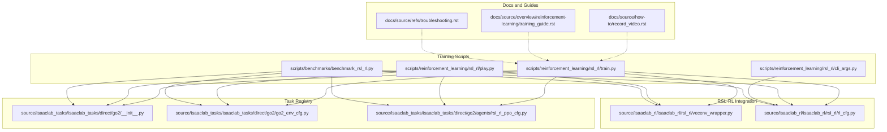
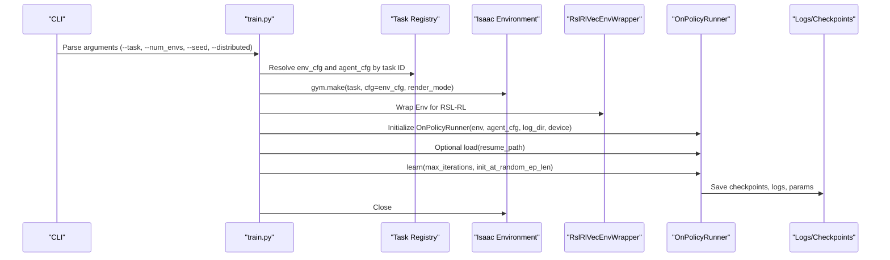
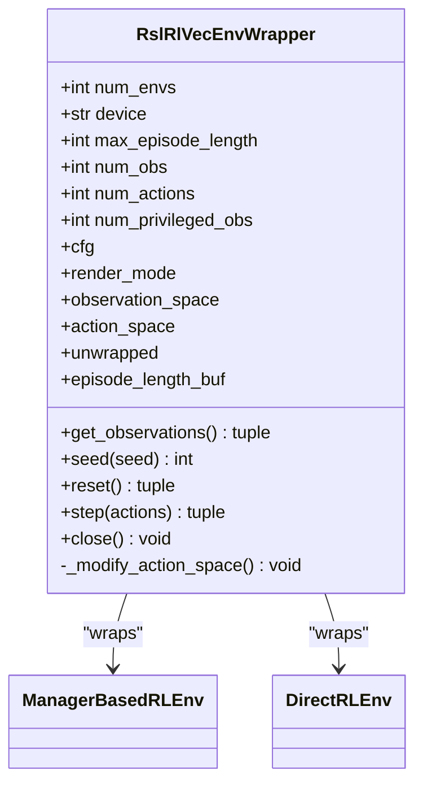
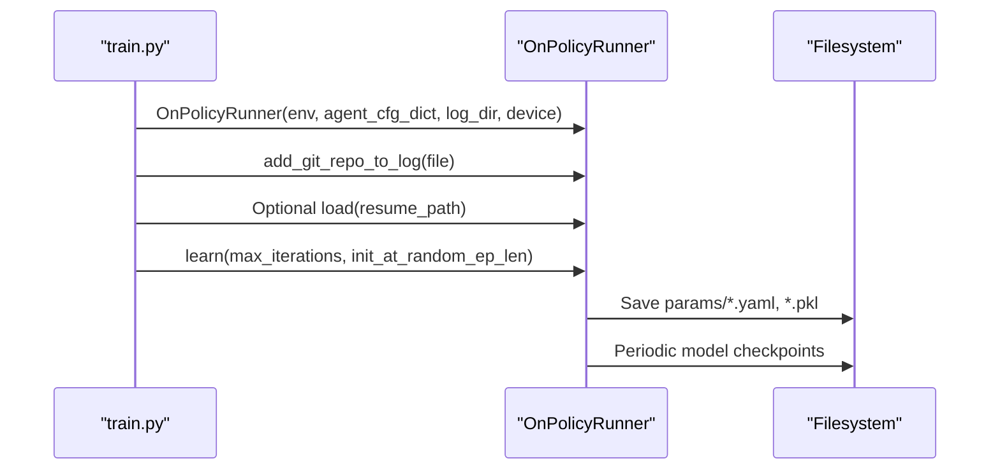
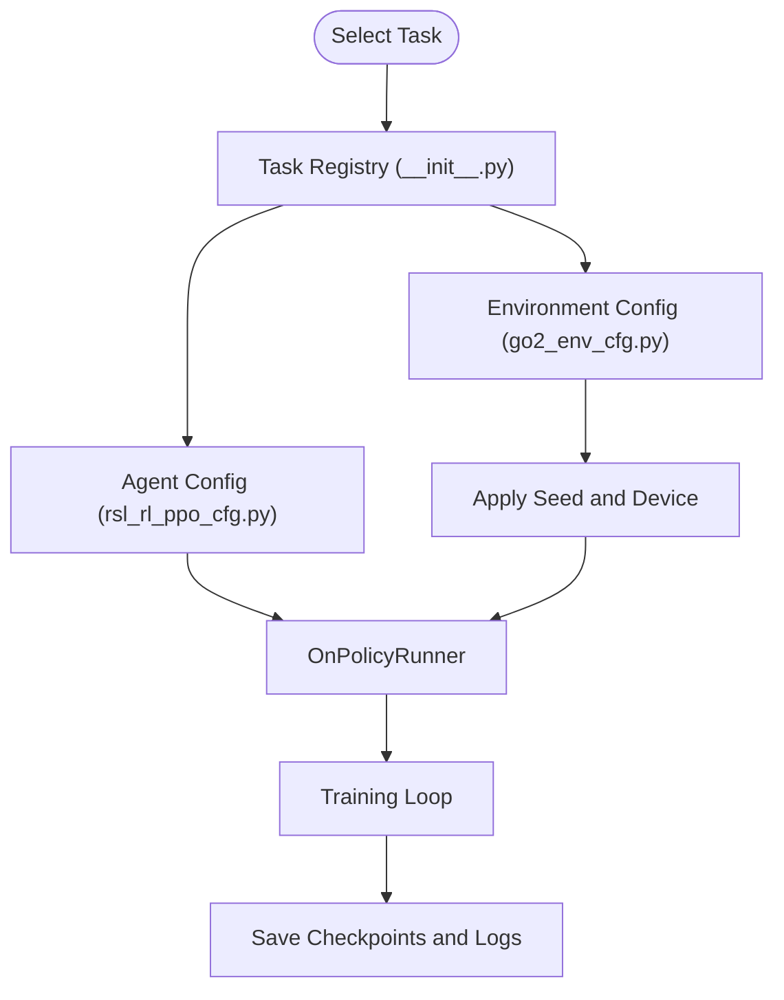
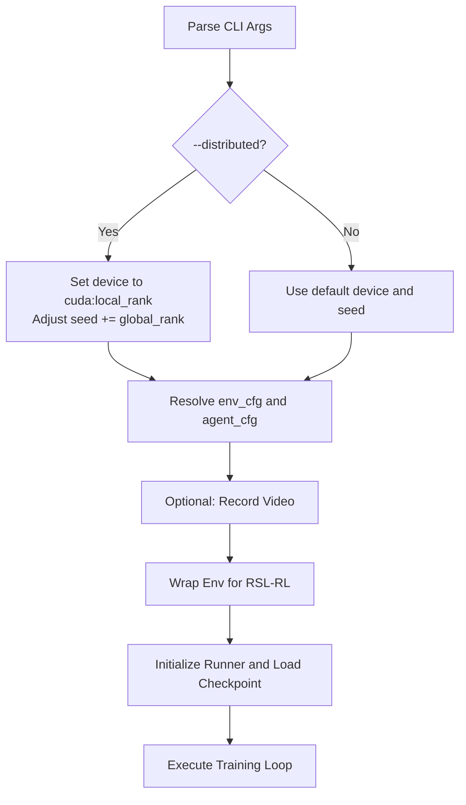
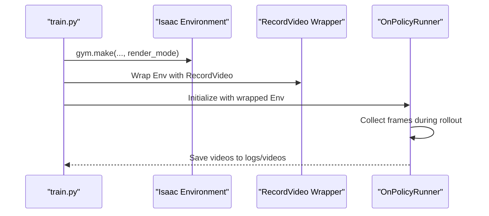
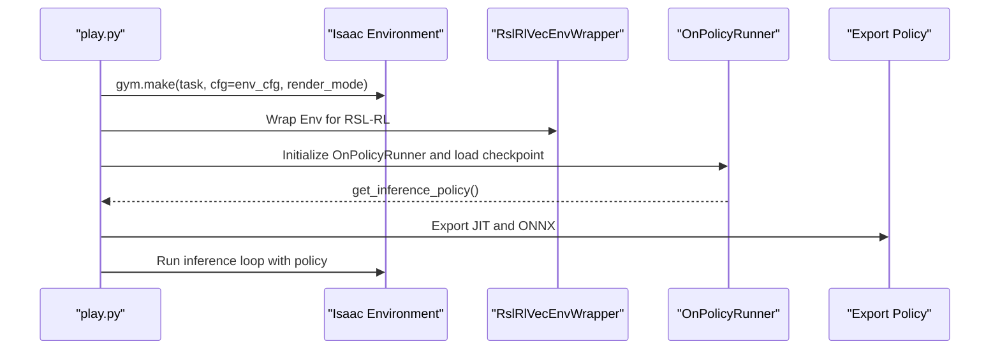
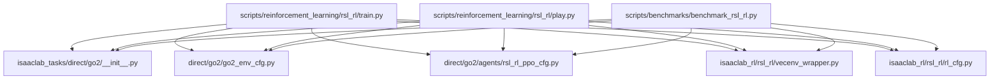

# Training Pipeline Orchestration

<cite>
**Referenced Files in This Document**
- [train.py](file://scripts/reinforcement_learning/rsl_rl/train.py)
- [cli_args.py](file://scripts/reinforcement_learning/rsl_rl/cli_args.py)
- [play.py](file://scripts/reinforcement_learning/rsl_rl/play.py)
- [vecenv_wrapper.py](file://source/isaaclab_rl/isaaclab_rl/rsl_rl/vecenv_wrapper.py)
- [rl_cfg.py](file://source/isaaclab_rl/isaaclab_rl/rsl_rl/rl_cfg.py)
- [go2_env_cfg.py](file://source/isaaclab_tasks/isaaclab_tasks/direct/go2/go2_env_cfg.py)
- [rsl_rl_ppo_cfg.py](file://source/isaaclab_tasks/isaaclab_tasks/direct/go2/agents/rsl_rl_ppo_cfg.py)
- [__init__.py](file://source/isaaclab_tasks/isaaclab_tasks/direct/go2/__init__.py)
- [benchmark_rsl_rl.py](file://scripts/benchmarks/benchmark_rsl_rl.py)
- [record_video.rst](file://docs/source/how-to/record_video.rst)
- [training_guide.rst](file://docs/source/overview/reinforcement-learning/training_guide.rst)
- [troubleshooting.rst](file://docs/source/refs/troubleshooting.rst)
- [README.md](file://README.md)
</cite>

## Table of Contents
1. [Introduction](#introduction)
2. [Project Structure](#project-structure)
3. [Core Components](#core-components)
4. [Architecture Overview](#architecture-overview)
5. [Detailed Component Analysis](#detailed-component-analysis)
6. [Dependency Analysis](#dependency-analysis)
7. [Performance Considerations](#performance-considerations)
8. [Troubleshooting Guide](#troubleshooting-guide)
9. [Conclusion](#conclusion)
10. [Appendices](#appendices)

## Introduction
This document explains the training pipeline orchestration system for the extreme quadruped parkour project, focusing on the end-to-end workflow from environment initialization to policy training and evaluation. It documents the RSL-RL integration, including OnPolicyRunner configuration, environment wrapping, and checkpoint management. It also details the ablation study training procedures for five sensor fusion architectures (Abl 1.0, 2.5, 3.5, 4.0, 7.0), the CLI argument system for training customization, distributed training setup with GPU allocation, and video recording capabilities. Practical examples, environment seeding strategies, performance optimization techniques, convergence monitoring, checkpoint saving/loading mechanisms, and troubleshooting common training issues are included.

## Project Structure
The training pipeline spans several modules:
- Training entry points: scripts for RSL-RL training and evaluation
- Environment and task registration: task IDs and environment configurations
- Agent configuration: policy and algorithm settings for ablations
- RSL-RL integration: environment wrapper and runner configuration
- Utilities: CLI argument parsing, benchmarking, and documentation

**Diagram sources**
- [train.py:119-212](file://scripts/reinforcement_learning/rsl_rl/train.py#L119-L212)
- [play.py:93-154](file://scripts/reinforcement_learning/rsl_rl/play.py#L93-L154)
- [cli_args.py:16-92](file://scripts/reinforcement_learning/rsl_rl/cli_args.py#L16-L92)
- [benchmark_rsl_rl.py:127-253](file://scripts/benchmarks/benchmark_rsl_rl.py#L127-L253)
- [__init__.py:49-127](file://source/isaaclab_tasks/isaaclab_tasks/direct/go2/__init__.py#L49-L127)
- [go2_env_cfg.py:172-352](file://source/isaaclab_tasks/isaaclab_tasks/direct/go2/go2_env_cfg.py#L172-L352)
- [rsl_rl_ppo_cfg.py:78-155](file://source/isaaclab_tasks/isaaclab_tasks/direct/go2/agents/rsl_rl_ppo_cfg.py#L78-L155)
- [vecenv_wrapper.py:14-210](file://source/isaaclab_rl/isaaclab_rl/rsl_rl/vecenv_wrapper.py#L14-L210)
- [rl_cfg.py:22-231](file://source/isaaclab_rl/isaaclab_rl/rsl_rl/rl_cfg.py#L22-L231)

**Section sources**
- [train.py:1-220](file://scripts/reinforcement_learning/rsl_rl/train.py#L1-L220)
- [play.py:1-206](file://scripts/reinforcement_learning/rsl_rl/play.py#L1-L206)
- [cli_args.py:1-92](file://scripts/reinforcement_learning/rsl_rl/cli_args.py#L1-L92)
- [benchmark_rsl_rl.py:1-261](file://scripts/benchmarks/benchmark_rsl_rl.py#L1-L261)
- [__init__.py:49-127](file://source/isaaclab_tasks/isaaclab_tasks/direct/go2/__init__.py#L49-L127)

## Core Components
- RSL-RL OnPolicyRunner: orchestrates training loops, logging, and checkpointing
- Environment Wrapper: adapts Isaac Lab environments to RSL-RL’s vectorized interface
- Task Registration: registers ablation-specific tasks and agent configurations
- CLI Argument System: controls training parameters, logging, and distributed execution
- Benchmarking Script: measures performance and logs training statistics

Key responsibilities:
- Environment initialization and seeding
- Multi-GPU device assignment and seed diversification
- Video recording during training and evaluation
- Checkpoint loading and saving
- Convergence monitoring via logs and optional external loggers

**Section sources**
- [train.py:119-212](file://scripts/reinforcement_learning/rsl_rl/train.py#L119-L212)
- [play.py:93-154](file://scripts/reinforcement_learning/rsl_rl/play.py#L93-L154)
- [vecenv_wrapper.py:14-210](file://source/isaaclab_rl/isaaclab_rl/rsl_rl/vecenv_wrapper.py#L14-L210)
- [rl_cfg.py:162-231](file://source/isaaclab_rl/isaaclab_rl/rsl_rl/rl_cfg.py#L162-L231)
- [cli_args.py:16-92](file://scripts/reinforcement_learning/rsl_rl/cli_args.py#L16-L92)

## Architecture Overview
The training pipeline integrates the following stages:
1. Application launch and environment setup
2. Task selection and configuration resolution
3. Environment creation and optional video recording wrapper
4. RSL-RL environment vectorization
5. Runner instantiation and checkpoint loading
6. Training loop execution with iteration control
7. Logging, checkpoint saving, and environment teardown

**Diagram sources**
- [train.py:119-212](file://scripts/reinforcement_learning/rsl_rl/train.py#L119-L212)
- [__init__.py:49-127](file://source/isaaclab_tasks/isaaclab_tasks/direct/go2/__init__.py#L49-L127)
- [vecenv_wrapper.py:14-210](file://source/isaaclab_rl/isaaclab_rl/rsl_rl/vecenv_wrapper.py#L14-L210)
- [rl_cfg.py:162-231](file://source/isaaclab_rl/isaaclab_rl/rsl_rl/rl_cfg.py#L162-L231)

## Detailed Component Analysis

### RSL-RL Integration and Environment Wrapping
The RSL-RL environment wrapper adapts Isaac Lab environments to RSL-RL’s expectations:
- Determines observation/action/privileged observation dimensions
- Clips actions and resets the environment at startup
- Exposes episode length buffer for random episode length initialization
- Supports both ManagerBased and Direct RL environments

**Diagram sources**
- [vecenv_wrapper.py:14-210](file://source/isaaclab_rl/isaaclab_rl/rsl_rl/vecenv_wrapper.py#L14-L210)

**Section sources**
- [vecenv_wrapper.py:14-210](file://source/isaaclab_rl/isaaclab_rl/rsl_rl/vecenv_wrapper.py#L14-L210)

### OnPolicyRunner Configuration and Checkpoint Management
The runner encapsulates training logic:
- Initializes with environment, agent configuration, log directory, and device
- Adds git state to logs
- Loads checkpoints when resuming or using distillation
- Saves configurations and checkpoints at intervals
- Executes the learning loop with configurable iterations

**Diagram sources**
- [train.py:192-212](file://scripts/reinforcement_learning/rsl_rl/train.py#L192-L212)
- [rl_cfg.py:162-231](file://source/isaaclab_rl/isaaclab_rl/rsl_rl/rl_cfg.py#L162-L231)

**Section sources**
- [train.py:192-212](file://scripts/reinforcement_learning/rsl_rl/train.py#L192-L212)
- [rl_cfg.py:162-231](file://source/isaaclab_rl/isaaclab_rl/rsl_rl/rl_cfg.py#L162-L231)

### Ablation Study Training Procedures
Five sensor fusion architectures are exposed via task IDs and environment-specific configurations:
- Abl 1.0: Actor uses prop-only; Critic uses prop + priv + raw scan
- Abl 2.5: Actor and Critic use prop + raw scan
- Abl 3.5: Actor and Critic use prop + scan encoding
- Abl 4.0: Actor uses prop + scan encoding; Critic uses prop + priv + raw scan
- Abl 7.0: Actor uses prop + scan encoding; Critic uses prop + priv encoding + scan encoding

Task registration maps each task ID to environment and agent configurations. Agent configurations define policy and algorithm settings, including scan encoder dimensions and whether to encode scan for the critic.

**Diagram sources**
- [__init__.py:49-127](file://source/isaaclab_tasks/isaaclab_tasks/direct/go2/__init__.py#L49-L127)
- [go2_env_cfg.py:333-352](file://source/isaaclab_tasks/isaaclab_tasks/direct/go2/go2_env_cfg.py#L333-L352)
- [rsl_rl_ppo_cfg.py:114-155](file://source/isaaclab_tasks/isaaclab_tasks/direct/go2/agents/rsl_rl_ppo_cfg.py#L114-L155)

**Section sources**
- [README.md:5-152](file://README.md#L5-L152)
- [__init__.py:49-127](file://source/isaaclab_tasks/isaaclab_tasks/direct/go2/__init__.py#L49-L127)
- [go2_env_cfg.py:333-352](file://source/isaaclab_tasks/isaaclab_tasks/direct/go2/go2_env_cfg.py#L333-L352)
- [rsl_rl_ppo_cfg.py:114-155](file://source/isaaclab_tasks/isaaclab_tasks/direct/go2/agents/rsl_rl_ppo_cfg.py#L114-L155)

### CLI Argument System and Distributed Training
The CLI system supports:
- Task selection and environment/device overrides
- Seed sampling and random seed selection
- Resume and checkpoint loading
- Logger selection (TensorBoard, Neptune, Weights & Biases)
- Distributed training with GPU allocation per rank
- Video recording toggles and parameters

Distributed training adjusts device assignment and seeds per local/global rank to ensure diversity across workers.

**Diagram sources**
- [train.py:135-144](file://scripts/reinforcement_learning/rsl_rl/train.py#L135-L144)
- [cli_args.py:16-92](file://scripts/reinforcement_learning/rsl_rl/cli_args.py#L16-L92)

**Section sources**
- [train.py:30-50](file://scripts/reinforcement_learning/rsl_rl/train.py#L30-L50)
- [cli_args.py:16-92](file://scripts/reinforcement_learning/rsl_rl/cli_args.py#L16-L92)

### Video Recording Capabilities
Video recording can be enabled during training and evaluation:
- Uses gymnasium RecordVideo wrapper with configurable step triggers and lengths
- Saves videos under the experiment log directory
- Requires enabling cameras in headless mode

**Diagram sources**
- [train.py:177-187](file://scripts/reinforcement_learning/rsl_rl/train.py#L177-L187)
- [play.py:133-143](file://scripts/reinforcement_learning/rsl_rl/play.py#L133-L143)
- [record_video.rst:1-25](file://docs/source/how-to/record_video.rst#L1-L25)

**Section sources**
- [train.py:177-187](file://scripts/reinforcement_learning/rsl_rl/train.py#L177-L187)
- [play.py:133-143](file://scripts/reinforcement_learning/rsl_rl/play.py#L133-L143)
- [record_video.rst:1-25](file://docs/source/how-to/record_video.rst#L1-L25)

### Evaluation and Inference
The evaluation script loads a trained checkpoint, wraps the environment for RSL-RL, obtains an inference policy, and optionally exports the policy to JIT and ONNX formats. It supports real-time playback and video recording for demonstrations.

**Diagram sources**
- [play.py:145-170](file://scripts/reinforcement_learning/rsl_rl/play.py#L145-L170)

**Section sources**
- [play.py:93-170](file://scripts/reinforcement_learning/rsl_rl/play.py#L93-L170)

## Dependency Analysis
The training pipeline exhibits clear layering:
- Training scripts depend on task registry, environment configs, agent configs, and RSL-RL integration
- Environment configs define sensor fusion and observation dimensions
- Agent configs define policy architecture and algorithm hyperparameters
- CLI arguments override defaults and coordinate distributed execution

**Diagram sources**
- [train.py:119-212](file://scripts/reinforcement_learning/rsl_rl/train.py#L119-L212)
- [play.py:93-154](file://scripts/reinforcement_learning/rsl_rl/play.py#L93-L154)
- [benchmark_rsl_rl.py:127-253](file://scripts/benchmarks/benchmark_rsl_rl.py#L127-L253)
- [__init__.py:49-127](file://source/isaaclab_tasks/isaaclab_tasks/direct/go2/__init__.py#L49-L127)
- [go2_env_cfg.py:172-352](file://source/isaaclab_tasks/isaaclab_tasks/direct/go2/go2_env_cfg.py#L172-L352)
- [rsl_rl_ppo_cfg.py:78-155](file://source/isaaclab_tasks/isaaclab_tasks/direct/go2/agents/rsl_rl_ppo_cfg.py#L78-L155)
- [vecenv_wrapper.py:14-210](file://source/isaaclab_rl/isaaclab_rl/rsl_rl/vecenv_wrapper.py#L14-L210)
- [rl_cfg.py:22-231](file://source/isaaclab_rl/isaaclab_rl/rsl_rl/rl_cfg.py#L22-L231)

**Section sources**
- [train.py:119-212](file://scripts/reinforcement_learning/rsl_rl/train.py#L119-L212)
- [play.py:93-154](file://scripts/reinforcement_learning/rsl_rl/play.py#L93-L154)
- [benchmark_rsl_rl.py:127-253](file://scripts/benchmarks/benchmark_rsl_rl.py#L127-L253)

## Performance Considerations
- Multi-GPU and multi-node training: adjust device assignment per rank and diversify seeds to avoid identical random states
- Headless execution: use headless mode to reduce rendering overhead
- Environment scaling: balance number of environments against available GPU memory and bandwidth
- Benchmarking: use the benchmark script to measure collection and learning times and derive effective FPS
- System tuning: set CPU governor to performance mode for improved throughput (with adequate cooling)

[No sources needed since this section provides general guidance]

## Troubleshooting Guide
Common issues and remedies:
- Rendering slowdowns: enabling video/recording adds rendering overhead; use headless mode for training
- Long startup times: first run compiles shaders and loads assets; subsequent runs are faster
- Distributed training bottlenecks: multi-node training can be limited by inter-node communication latency
- Insufficient exploration: increase environment count or horizon length when reducing parallel environments
- Debugging NaNs: review reward shaping and ensure numerical stability in value estimation

**Section sources**
- [record_video.rst:1-25](file://docs/source/how-to/record_video.rst#L1-L25)
- [troubleshooting.rst:81-113](file://docs/source/refs/troubleshooting.rst#L81-L113)
- [training_guide.rst:47-54](file://docs/source/overview/reinforcement-learning/training_guide.rst#L47-L54)

## Conclusion
The training pipeline orchestrates a robust RSL-RL workflow integrated with Isaac Lab environments. It supports comprehensive ablation studies, flexible CLI-driven customization, distributed training, and video recording. Checkpoint management, convergence monitoring, and performance benchmarking are built-in. Following the documented practices ensures reliable training, efficient resource utilization, and reproducible results across the five sensor fusion architectures.

[No sources needed since this section summarizes without analyzing specific files]

## Appendices

### Practical Training Command Examples
- Abl 1.0: Train with prop-only actor and raw scan in critic
  - Command: see [README.md:122-126](file://README.md#L122-L126)
- Abl 2.5: Train with raw scan for both actor and critic
  - Command: see [README.md:128-133](file://README.md#L128-L133)
- Abl 3.5: Train with scan encoding for both actor and critic
  - Command: see [README.md:135-138](file://README.md#L135-L138)
- Abl 4.0: Train with scan encoding for actor and raw scan for critic
  - Command: see [README.md:140-145](file://README.md#L140-L145)
- Abl 7.0: Train with scan encoding for both and priv encoding for critic
  - Command: see [README.md:147-152](file://README.md#L147-L152)

Environment seeding strategies:
- Seed selection: CLI supports fixed seed or random sampling; distributed training adds rank offset to seeds
- Curriculum and commands: environment configurations define command modes and curriculum behavior

Checkpoint saving/loading:
- Automatic saving at intervals defined in agent configuration
- Resume from latest matching checkpoint or specific checkpoint path
- Export trained policy to JIT and ONNX for deployment

Convergence monitoring:
- TensorBoard logs and optional Weights & Biases or Neptune integrations
- Benchmark script parses logs and computes performance metrics

**Section sources**
- [README.md:120-152](file://README.md#L120-L152)
- [train.py:135-144](file://scripts/reinforcement_learning/rsl_rl/train.py#L135-L144)
- [cli_args.py:70-92](file://scripts/reinforcement_learning/rsl_rl/cli_args.py#L70-L92)
- [rl_cfg.py:162-231](file://source/isaaclab_rl/isaaclab_rl/rsl_rl/rl_cfg.py#L162-L231)
- [benchmark_rsl_rl.py:207-250](file://scripts/benchmarks/benchmark_rsl_rl.py#L207-L250)