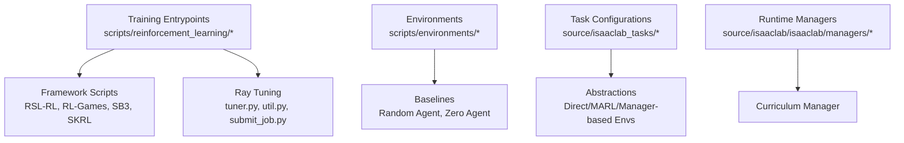
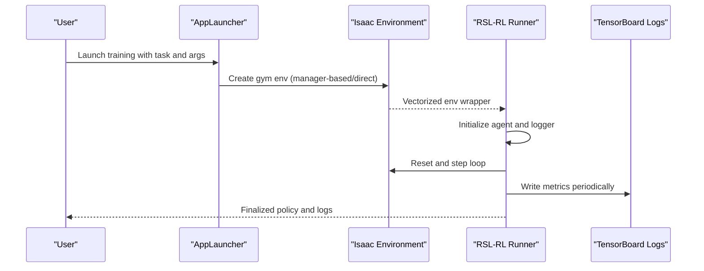
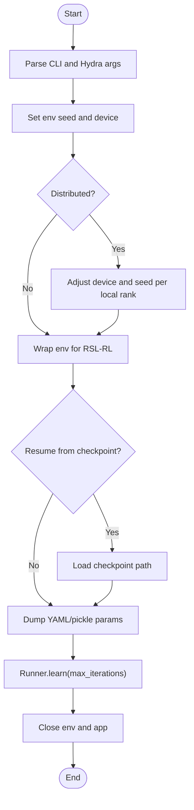
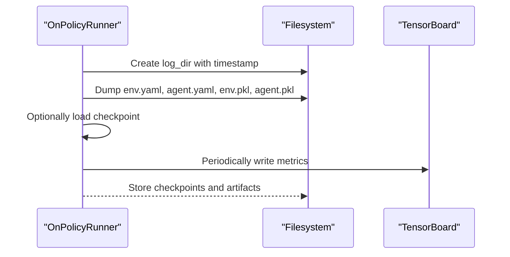
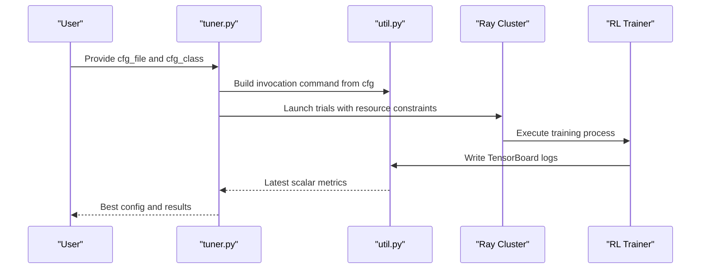
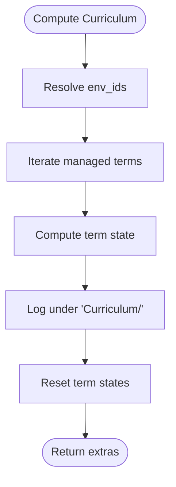
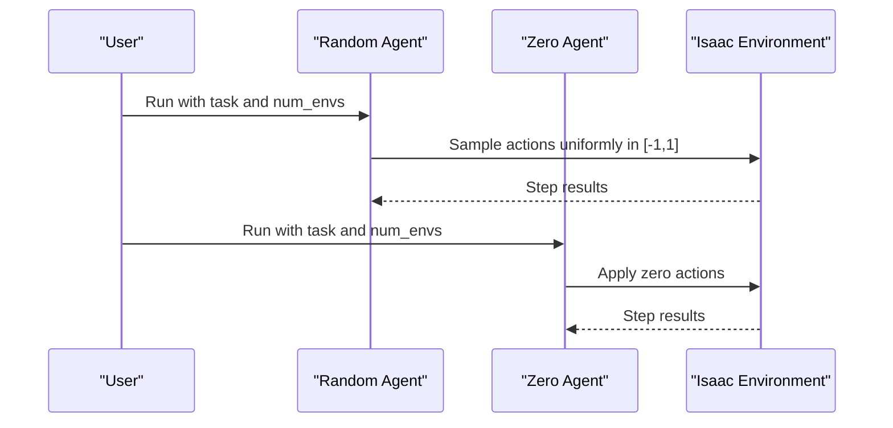
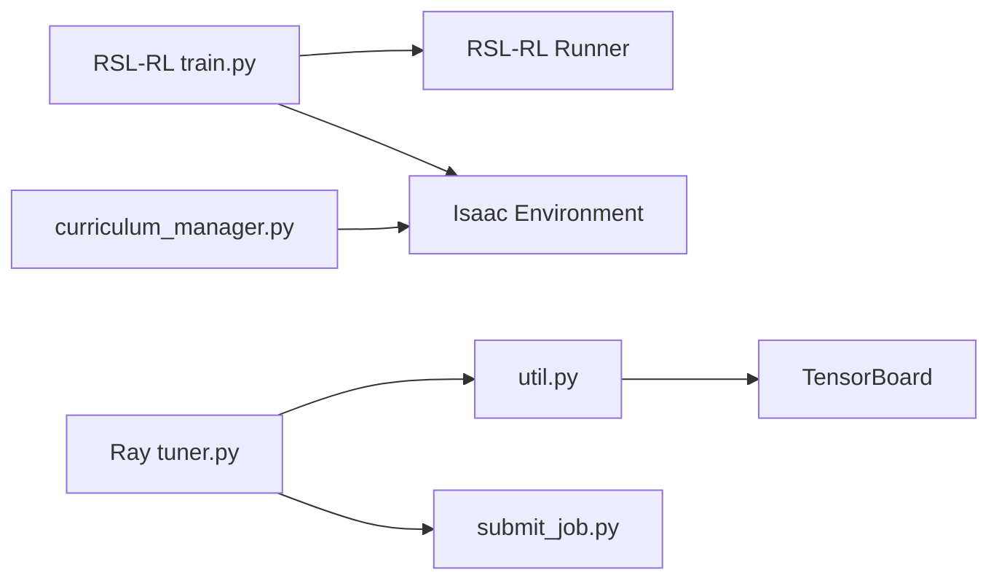

# Training and Experimentation

<cite>
**Referenced Files in This Document**
- [README.md](file://README.md)
- [train.py](file://scripts/reinforcement_learning/rsl_rl/train.py)
- [cli_args.py](file://scripts/reinforcement_learning/rsl_rl/cli_args.py)
- [random_agent.py](file://scripts/environments/random_agent.py)
- [zero_agent.py](file://scripts/environments/zero_agent.py)
- [tuner.py](file://scripts/reinforcement_learning/ray/tuner.py)
- [util.py](file://scripts/reinforcement_learning/ray/util.py)
- [submit_job.py](file://scripts/reinforcement_learning/ray/submit_job.py)
- [wrap_resources.py](file://scripts/reinforcement_learning/ray/wrap_resources.py)
- [vision_cfg.py](file://scripts/reinforcement_learning/ray/hyperparameter_tuning/vision_cfg.py)
- [benchmark_rlgames.py](file://scripts/benchmarks/benchmark_rlgames.py)
- [train.py](file://scripts/reinforcement_learning/rl_games/train.py)
- [curriculum_manager.py](file://source/isaaclab/isaaclab/managers/curriculum_manager.py)
</cite>

## Table of Contents
1. [Introduction](#introduction)
2. [Project Structure](#project-structure)
3. [Core Components](#core-components)
4. [Architecture Overview](#architecture-overview)
5. [Detailed Component Analysis](#detailed-component-analysis)
6. [Dependency Analysis](#dependency-analysis)
7. [Performance Considerations](#performance-considerations)
8. [Troubleshooting Guide](#troubleshooting-guide)
9. [Conclusion](#conclusion)
10. [Appendices](#appendices)

## Introduction
This document explains the Training and Experimentation workflows used to support the ablation study methodology for five Go2 parkour network architectures. It covers environment initialization, policy training loops, evaluation procedures, experiment management (configuration, checkpoints, and result tracking), hyperparameter optimization, curriculum learning, performance benchmarking against baseline agents, distributed training infrastructure for 4096 environments, validation/testing with random and zero agents, and practical examples for configuration and result analysis.

## Project Structure
The repository organizes training and experimentation under:
- scripts/reinforcement_learning: framework-specific training scripts and Ray-based hyperparameter tuning
- scripts/environments: baseline agents for validation (random and zero actions)
- source/isaaclab_tasks: task definitions and ablation-specific environment configurations
- source/isaaclab: runtime components such as curriculum management

**Section sources**
- [README.md:120-172](file://README.md#L120-L172)

## Core Components
- RSL-RL training pipeline: initializes the simulation app, constructs environment and runner, handles distributed training, logs parameters, and executes learning iterations.
- Ray hyperparameter tuning: orchestrates distributed sweeps, manages resource placement, and monitors metrics via TensorBoard logs.
- Baseline agents: random and zero-action agents for sanity checks and ablation comparisons.
- Curriculum manager: computes and logs curriculum terms for adaptive difficulty.
- Benchmarking utilities: multi-GPU configuration and logging for performance comparisons.

**Section sources**
- [train.py:119-213](file://scripts/reinforcement_learning/rsl_rl/train.py#L119-L213)
- [tuner.py:66-160](file://scripts/reinforcement_learning/ray/tuner.py#L66-L160)
- [util.py:20-53](file://scripts/reinforcement_learning/ray/util.py#L20-L53)
- [random_agent.py:41-65](file://scripts/environments/random_agent.py#L41-L65)
- [zero_agent.py:41-65](file://scripts/environments/zero_agent.py#L41-L65)
- [curriculum_manager.py:100-203](file://source/isaaclab/isaaclab/managers/curriculum_manager.py#L100-L203)

## Architecture Overview
The training and experimentation architecture integrates framework-specific runners with a unified environment abstraction and optional Ray orchestration for distributed tuning.

**Diagram sources**
- [train.py:119-213](file://scripts/reinforcement_learning/rsl_rl/train.py#L119-L213)

**Section sources**
- [train.py:119-213](file://scripts/reinforcement_learning/rsl_rl/train.py#L119-L213)

## Detailed Component Analysis

### RSL-RL Training Pipeline
- Environment initialization: selects task, applies CLI overrides, sets seeds/devices for deterministic runs.
- Distributed training: adjusts device per local rank and seeds across ranks.
- Logging and checkpoints: dumps YAML/pickle configs, optionally records videos, resumes from checkpoints.
- Learning loop: invokes runner learn with iteration count.

**Diagram sources**
- [train.py:119-213](file://scripts/reinforcement_learning/rsl_rl/train.py#L119-L213)

**Section sources**
- [train.py:119-213](file://scripts/reinforcement_learning/rsl_rl/train.py#L119-L213)

### Experiment Management (Configuration, Checkpoints, Results)
- Experiment naming: timestamped directory with optional run name; printed for downstream parsing.
- Parameter persistence: env and agent configs saved as YAML and pickle.
- Checkpoint loading: resolves checkpoint path for resume or distillation.
- Video logging: optional video recording during training.

**Diagram sources**
- [train.py:145-206](file://scripts/reinforcement_learning/rsl_rl/train.py#L145-L206)

**Section sources**
- [train.py:145-206](file://scripts/reinforcement_learning/rsl_rl/train.py#L145-L206)

### Hyperparameter Optimization with Ray
- Tuner workflow: builds invocation commands from sweep configs, executes trials, and streams metrics from TensorBoard logs.
- Resource orchestration: discovers GPU node resources, packs workers, and supports heterogeneous clusters.
- Submission: distributes aggregate jobs across clusters defined in a cluster config file.

**Diagram sources**
- [tuner.py:66-160](file://scripts/reinforcement_learning/ray/tuner.py#L66-L160)
- [util.py:55-96](file://scripts/reinforcement_learning/ray/util.py#L55-L96)
- [util.py:310-366](file://scripts/reinforcement_learning/ray/util.py#L310-L366)
- [submit_job.py:79-107](file://scripts/reinforcement_learning/ray/submit_job.py#L79-L107)

**Section sources**
- [tuner.py:206-292](file://scripts/reinforcement_learning/ray/tuner.py#L206-L292)
- [util.py:20-53](file://scripts/reinforcement_learning/ray/util.py#L20-L53)
- [util.py:310-366](file://scripts/reinforcement_learning/ray/util.py#L310-L366)
- [submit_job.py:79-107](file://scripts/reinforcement_learning/ray/submit_job.py#L79-L107)

### Curriculum Learning Implementation
- Computes curriculum terms per environment IDs, logs them under a dedicated namespace, and resets term states after logging.
- Supports iterable active terms for downstream reporting.

**Diagram sources**
- [curriculum_manager.py:124-173](file://source/isaaclab/isaaclab/managers/curriculum_manager.py#L124-L173)

**Section sources**
- [curriculum_manager.py:100-203](file://source/isaaclab/isaaclab/managers/curriculum_manager.py#L100-L203)

### Distributed Training Infrastructure and Scalability
- Multi-GPU training: adjusts device and seeds per local rank; updates environment device accordingly.
- Benchmarking: mirrors distributed setup for performance comparisons across frameworks.
- Resource wrapping: discovers node resources, normalizes heterogeneous lists, and schedules jobs with explicit GPU/CPU/RAM allocations.

**Diagram sources**
- [train.py:99-125](file://scripts/reinforcement_learning/rl_games/train.py#L99-L125)
- [benchmark_rlgames.py:155-179](file://scripts/benchmarks/benchmark_rlgames.py#L155-L179)
- [util.py:310-366](file://scripts/reinforcement_learning/ray/util.py#L310-L366)
- [wrap_resources.py:86-116](file://scripts/reinforcement_learning/ray/wrap_resources.py#L86-L116)

**Section sources**
- [train.py:99-125](file://scripts/reinforcement_learning/rl_games/train.py#L99-L125)
- [benchmark_rlgames.py:155-179](file://scripts/benchmarks/benchmark_rlgames.py#L155-L179)
- [util.py:420-461](file://scripts/reinforcement_learning/ray/util.py#L420-L461)
- [wrap_resources.py:86-116](file://scripts/reinforcement_learning/ray/wrap_resources.py#L86-L116)

### Validation and Testing with Baselines
- Random agent: samples uniform random actions in [-1, 1] for vectorized environments.
- Zero agent: applies zero actions deterministically.
- Both run in the Isaac Lab environment and can be used to establish baselines for ablation comparisons.

**Diagram sources**
- [random_agent.py:41-65](file://scripts/environments/random_agent.py#L41-L65)
- [zero_agent.py:41-65](file://scripts/environments/zero_agent.py#L41-L65)

**Section sources**
- [random_agent.py:41-65](file://scripts/environments/random_agent.py#L41-L65)
- [zero_agent.py:41-65](file://scripts/environments/zero_agent.py#L41-L65)

### Practical Training Configuration Examples (Ablations)
- Abl 1: Actor uses prop-only; Critic uses prop + private + raw scan.
- Abl 2.5: Actor uses prop + raw scan; Critic uses prop + private + raw scan.
- Abl 3.5 (best): Actor and Critic both use prop + scan encoding.
- Abl 4.0: Actor uses prop + scan encoding; Critic uses prop + private + raw scan.
- Abl 7.0: Actor uses prop + scan encoding; Critic uses prop + private encoding + scan encoding.

Training commands and environment counts are documented in the repository’s README for headless and non-headless runs.

**Section sources**
- [README.md:120-172](file://README.md#L120-L172)

### Experiment Setup Workflows
- Single-run training: use the RSL-RL training script with task IDs and environment counts.
- Distributed runs: enable the distributed flag to adjust device and seeds per rank.
- Hyperparameter tuning: define sweep configurations and run the Ray tuner; aggregate jobs can be submitted to clusters.

**Section sources**
- [train.py:135-144](file://scripts/reinforcement_learning/rsl_rl/train.py#L135-L144)
- [tuner.py:206-292](file://scripts/reinforcement_learning/ray/tuner.py#L206-L292)
- [submit_job.py:129-149](file://scripts/reinforcement_learning/ray/submit_job.py#L129-L149)

### Result Analysis Procedures
- Metrics: TensorBoard logs are parsed periodically by the tuner to report metrics.
- Best configurations: selection criteria depend on the chosen metric and mode (max/min).
- Baselines: compare ablation curves against random and zero agents to assess meaningful policy improvement.

**Section sources**
- [util.py:20-53](file://scripts/reinforcement_learning/ray/util.py#L20-L53)
- [tuner.py:233-282](file://scripts/reinforcement_learning/ray/tuner.py#L233-L282)

## Dependency Analysis
- Training scripts depend on the Isaac Lab AppLauncher and environment/task registration.
- RSL-RL runner depends on environment wrappers and configuration objects.
- Ray tuning depends on resource discovery and job submission clients.
- Curriculum manager integrates with environment instances to compute and log difficulty metrics.

**Diagram sources**
- [train.py:95-101](file://scripts/reinforcement_learning/rsl_rl/train.py#L95-L101)
- [tuner.py:66-160](file://scripts/reinforcement_learning/ray/tuner.py#L66-L160)
- [util.py:20-53](file://scripts/reinforcement_learning/ray/util.py#L20-L53)
- [submit_job.py:79-107](file://scripts/reinforcement_learning/ray/submit_job.py#L79-L107)
- [curriculum_manager.py:124-173](file://source/isaaclab/isaaclab/managers/curriculum_manager.py#L124-L173)

**Section sources**
- [train.py:95-101](file://scripts/reinforcement_learning/rsl_rl/train.py#L95-L101)
- [tuner.py:66-160](file://scripts/reinforcement_learning/ray/tuner.py#L66-L160)
- [util.py:20-53](file://scripts/reinforcement_learning/ray/util.py#L20-L53)
- [submit_job.py:79-107](file://scripts/reinforcement_learning/ray/submit_job.py#L79-L107)
- [curriculum_manager.py:124-173](file://source/isaaclab/isaaclab/managers/curriculum_manager.py#L124-L173)

## Performance Considerations
- Headless training reduces overhead for large-scale environments.
- Multi-GPU training requires adjusting seeds and devices per rank to maintain diversity.
- Resource normalization ensures efficient packing of heterogeneous clusters.
- Benchmarking utilities mirror distributed setups to compare across frameworks.

[No sources needed since this section provides general guidance]

## Troubleshooting Guide
- Version compatibility: RSL-RL distributed training requires a minimum version; install the correct version if mismatched.
- Log extraction errors: tuner raises a specific error when experiment logs cannot be extracted; verify training script prints the expected lines and check timeouts.
- Cluster submission: ensure cluster config file exists and Ray dashboard URLs are reachable; logs are fetched post-execution.
- Resource misalignment: when PyTorch and GPU detection disagree, reset CUDA_VISIBLE_DEVICES to align visibility.

**Section sources**
- [train.py:70-83](file://scripts/reinforcement_learning/rsl_rl/train.py#L70-L83)
- [tuner.py:173-204](file://scripts/reinforcement_learning/ray/tuner.py#L173-L204)
- [util.py:109-112](file://scripts/reinforcement_learning/ray/util.py#L109-L112)
- [util.py:151-200](file://scripts/reinforcement_learning/ray/util.py#L151-L200)
- [submit_job.py:58-76](file://scripts/reinforcement_learning/ray/submit_job.py#L58-L76)

## Conclusion
The repository provides a comprehensive, modular training and experimentation framework supporting ablation studies across five Go2 parkour architectures. It integrates framework-specific runners, distributed orchestration via Ray, curriculum learning, and robust experiment management. Baseline agents and benchmarking utilities enable rigorous validation and performance comparisons, while practical examples and configuration guidance streamline reproducible workflows at scale.

[No sources needed since this section summarizes without analyzing specific files]

## Appendices

### Appendix A: Ablation Specifications and Training Commands
- Abl 1: Actor = prop_obs only; Critic = prop_obs + priv_obs + raw scan
- Abl 2.5: Actor = prop_obs + raw scan; Critic = prop_obs + priv_obs + raw scan
- Abl 3.5 (best): Actor = prop_obs + scan encoding; Critic = prop_obs + priv_obs + scan encoding
- Abl 4.0: Actor = prop_obs + scan encoding; Critic = prop_obs + priv_obs + raw scan
- Abl 7.0: Actor = prop_obs + scan encoding; Critic = prop_obs + priv_obs encoding + scan encoding

Training commands and environment counts are provided in the repository’s README.

**Section sources**
- [README.md:120-172](file://README.md#L120-L172)

### Appendix B: Hyperparameter Sweep Example
- Example sweep configuration demonstrates varying environment counts and horizon lengths, selecting compatible mini-batch sizes derived from total batch constraints.

**Section sources**
- [vision_cfg.py:34-59](file://scripts/reinforcement_learning/ray/hyperparameter_tuning/vision_cfg.py#L34-L59)