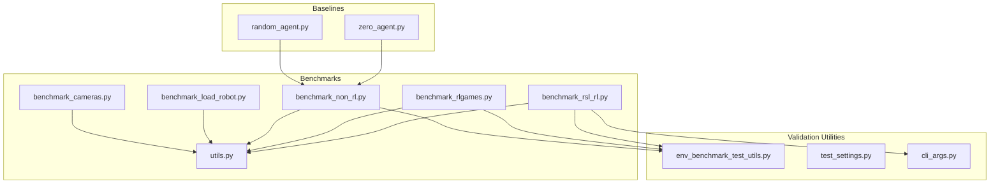
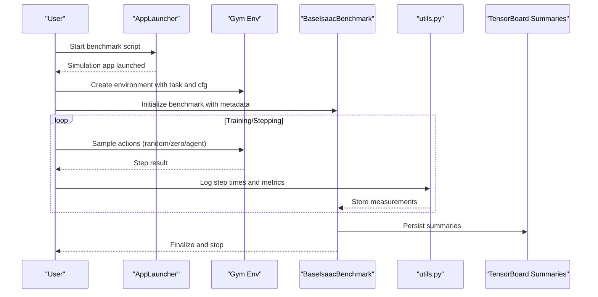
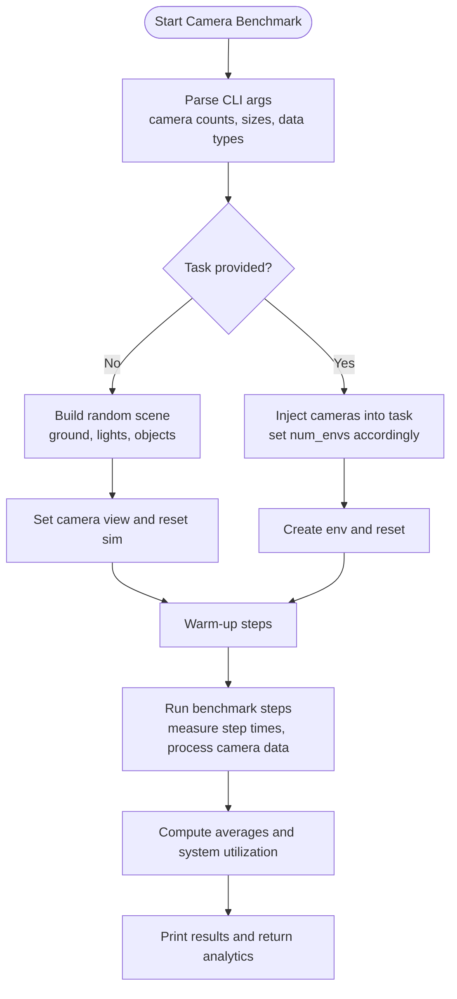
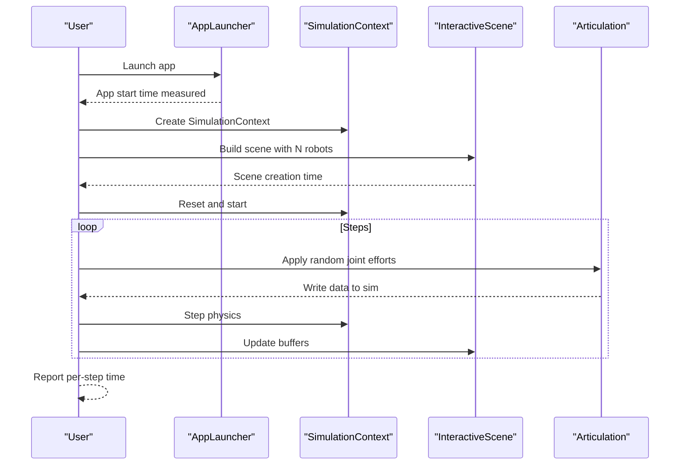
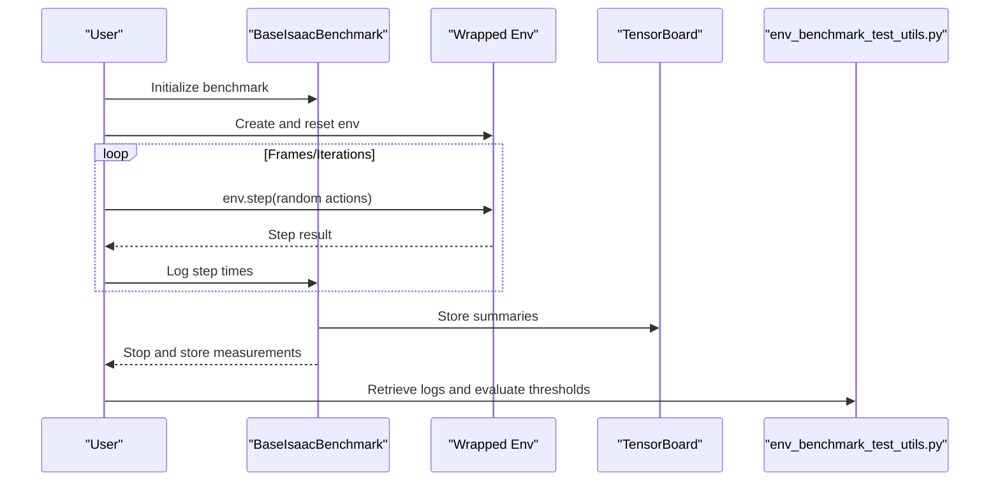
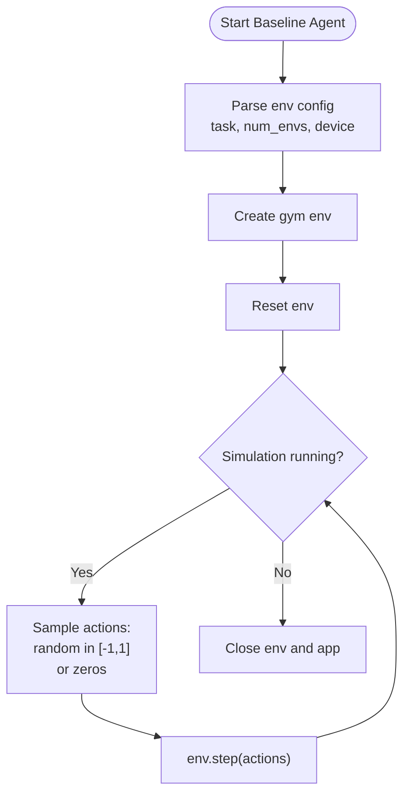
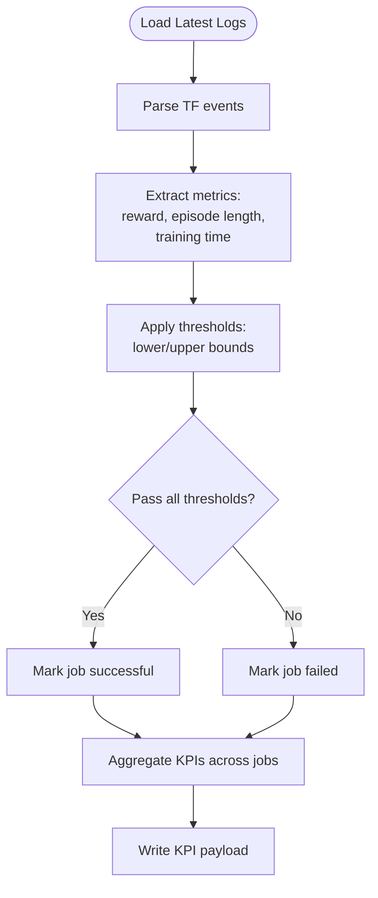
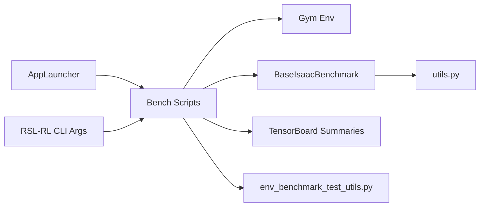

# Validation and Benchmarking Procedures

<cite>
**Referenced Files in This Document**
- [benchmark_cameras.py](file://scripts/benchmarks/benchmark_cameras.py)
- [benchmark_load_robot.py](file://scripts/benchmarks/benchmark_load_robot.py)
- [benchmark_non_rl.py](file://scripts/benchmarks/benchmark_non_rl.py)
- [benchmark_rlgames.py](file://scripts/benchmarks/benchmark_rlgames.py)
- [benchmark_rsl_rl.py](file://scripts/benchmarks/benchmark_rsl_rl.py)
- [utils.py](file://scripts/benchmarks/utils.py)
- [random_agent.py](file://scripts/environments/random_agent.py)
- [zero_agent.py](file://scripts/environments/zero_agent.py)
- [env_benchmark_test_utils.py](file://source/isaaclab_tasks/test/benchmarking/env_benchmark_test_utils.py)
- [test_settings.py](file://tools/test_settings.py)
- [cli_args.py](file://scripts/reinforcement_learning/rsl_rl/cli_args.py)
</cite>

## Table of Contents
1. [Introduction](#introduction)
2. [Project Structure](#project-structure)
3. [Core Components](#core-components)
4. [Architecture Overview](#architecture-overview)
5. [Detailed Component Analysis](#detailed-component-analysis)
6. [Dependency Analysis](#dependency-analysis)
7. [Performance Considerations](#performance-considerations)
8. [Troubleshooting Guide](#troubleshooting-guide)
9. [Conclusion](#conclusion)
10. [Appendices](#appendices)

## Introduction
This document describes the validation and benchmarking procedures used to ensure experimental reliability and performance assessment in the repository. It covers:
- Baseline agent testing using random and zero agents as control conditions
- Statistical significance testing and performance metrics computation
- The benchmarking suite for camera performance, robot loading efficiency, and training throughput
- Validation protocols for ablation architectures, including convergence criteria, reward threshold assessment, and skill demonstration verification
- Practical examples for setting up experiments, interpreting results, and establishing baselines
- Statistical analysis procedures, confidence intervals, comparative analysis across sensor fusion strategies
- Integration with automated testing pipelines and continuous validation workflows

## Project Structure
The validation and benchmarking capabilities are primarily implemented under:
- scripts/benchmarks: end-to-end benchmarking scripts for cameras, robot loading, and training frameworks
- scripts/environments: baseline agents (random and zero) for control conditions
- scripts/benchmarks/utils.py: shared utilities for logging and parsing benchmark metrics
- source/isaaclab_tasks/test/benchmarking: utilities for evaluating jobs and extracting KPIs from logs
- tools/test_settings.py: global test configuration and timeouts used by automated pipelines
- scripts/reinforcement_learning/rsl_rl/cli_args.py: RSL-RL-specific CLI augmentation for benchmarking

**Diagram sources**
- [benchmark_cameras.py:1-869](file://scripts/benchmarks/benchmark_cameras.py#L1-L869)
- [benchmark_load_robot.py:1-177](file://scripts/benchmarks/benchmark_load_robot.py#L1-L177)
- [benchmark_non_rl.py:1-207](file://scripts/benchmarks/benchmark_non_rl.py#L1-L207)
- [benchmark_rlgames.py:1-262](file://scripts/benchmarks/benchmark_rlgames.py#L1-L262)
- [benchmark_rsl_rl.py:1-261](file://scripts/benchmarks/benchmark_rsl_rl.py#L1-L261)
- [utils.py:1-105](file://scripts/benchmarks/utils.py#L1-L105)
- [random_agent.py:1-73](file://scripts/environments/random_agent.py#L1-L73)
- [zero_agent.py:1-73](file://scripts/environments/zero_agent.py#L1-L73)
- [env_benchmark_test_utils.py:1-239](file://source/isaaclab_tasks/test/benchmarking/env_benchmark_test_utils.py#L1-L239)
- [test_settings.py:1-66](file://tools/test_settings.py#L1-L66)
- [cli_args.py:1-92](file://scripts/reinforcement_learning/rsl_rl/cli_args.py#L1-L92)

**Section sources**
- [benchmark_cameras.py:1-869](file://scripts/benchmarks/benchmark_cameras.py#L1-L869)
- [benchmark_load_robot.py:1-177](file://scripts/benchmarks/benchmark_load_robot.py#L1-L177)
- [benchmark_non_rl.py:1-207](file://scripts/benchmarks/benchmark_non_rl.py#L1-L207)
- [benchmark_rlgames.py:1-262](file://scripts/benchmarks/benchmark_rlgames.py#L1-L262)
- [benchmark_rsl_rl.py:1-261](file://scripts/benchmarks/benchmark_rsl_rl.py#L1-L261)
- [utils.py:1-105](file://scripts/benchmarks/utils.py#L1-L105)
- [random_agent.py:1-73](file://scripts/environments/random_agent.py#L1-L73)
- [zero_agent.py:1-73](file://scripts/environments/zero_agent.py#L1-L73)
- [env_benchmark_test_utils.py:1-239](file://source/isaaclab_tasks/test/benchmarking/env_benchmark_test_utils.py#L1-L239)
- [test_settings.py:1-66](file://tools/test_settings.py#L1-L66)
- [cli_args.py:1-92](file://scripts/reinforcement_learning/rsl_rl/cli_args.py#L1-L92)

## Core Components
- Camera benchmarking: measures per-step timing, system utilization, and throughput for tiled, standard, and ray-caster cameras; supports autotuning to find maximum sustainable camera counts.
- Robot loading benchmarking: evaluates scene creation and per-step simulation time for multiple robot instances.
- Non-RL benchmarking: measures environment step times and FPS with random actions, enabling baseline performance characterization.
- RL training benchmarks: RL-Games and RSL-RL wrappers that log training and inference timings, rewards, and episode lengths via TensorBoard summaries.
- Baseline agents: random and zero-action agents for control conditions and sanity checks.
- Metrics utilities: standardized logging of startup times, runtime step times, and RL metrics; parsing of TensorBoard logs.
- Job evaluation utilities: extraction and aggregation of KPIs from logs, threshold-based pass/fail evaluation, and summary statistics.

**Section sources**
- [benchmark_cameras.py:581-733](file://scripts/benchmarks/benchmark_cameras.py#L581-L733)
- [benchmark_load_robot.py:96-141](file://scripts/benchmarks/benchmark_load_robot.py#L96-L141)
- [benchmark_non_rl.py:150-196](file://scripts/benchmarks/benchmark_non_rl.py#L150-L196)
- [benchmark_rlgames.py:220-251](file://scripts/benchmarks/benchmark_rlgames.py#L220-L251)
- [benchmark_rsl_rl.py:215-250](file://scripts/benchmarks/benchmark_rsl_rl.py#L215-L250)
- [random_agent.py:56-62](file://scripts/environments/random_agent.py#L56-L62)
- [zero_agent.py:56-62](file://scripts/environments/zero_agent.py#L56-L62)
- [utils.py:15-105](file://scripts/benchmarks/utils.py#L15-L105)
- [env_benchmark_test_utils.py:54-98](file://source/isaaclab_tasks/test/benchmarking/env_benchmark_test_utils.py#L54-L98)

## Architecture Overview
The benchmarking pipeline integrates:
- AppLauncher for initializing the simulation environment
- Environment creation and optional video recording
- Measurement loops capturing per-step durations and system metrics
- Logging to benchmark services and TensorBoard summaries
- Post-run evaluation utilities for KPI extraction and threshold validation

**Diagram sources**
- [benchmark_non_rl.py:95-196](file://scripts/benchmarks/benchmark_non_rl.py#L95-L196)
- [benchmark_rlgames.py:110-251](file://scripts/benchmarks/benchmark_rlgames.py#L110-L251)
- [benchmark_rsl_rl.py:113-250](file://scripts/benchmarks/benchmark_rsl_rl.py#L113-L250)
- [utils.py:44-105](file://scripts/benchmarks/utils.py#L44-L105)

## Detailed Component Analysis

### Camera Performance Evaluation
Key capabilities:
- Create and inject tiled, standard, and ray-caster cameras into scenes or tasks
- Autotuning to determine maximum sustainable camera counts under system utilization thresholds
- Per-step timing analysis and system utilization reporting
- Depth processing and optional point cloud generation

**Diagram sources**
- [benchmark_cameras.py:735-733](file://scripts/benchmarks/benchmark_cameras.py#L735-L733)

Practical guidance:
- Use a single camera type per benchmark to isolate effects
- Configure data types carefully to balance fidelity and throughput
- Use autotune with appropriate utilization thresholds to find feasible limits

**Section sources**
- [benchmark_cameras.py:312-410](file://scripts/benchmarks/benchmark_cameras.py#L312-L410)
- [benchmark_cameras.py:581-733](file://scripts/benchmarks/benchmark_cameras.py#L581-L733)

### Robot Loading Efficiency
Measures:
- App start time, Python imports time, scene creation time, simulation start time
- Average per-step simulation time across many robot instances

**Diagram sources**
- [benchmark_load_robot.py:143-170](file://scripts/benchmarks/benchmark_load_robot.py#L143-L170)

**Section sources**
- [benchmark_load_robot.py:96-141](file://scripts/benchmarks/benchmark_load_robot.py#L96-L141)

### Training Throughput Measurement
Non-RL baseline:
- Runs environments with random actions for a fixed number of frames
- Logs environment step times and computes FPS per environment and effective FPS

RL-Games and RSL-RL:
- Wrap environments for respective frameworks
- Parse TensorBoard summaries to extract performance metrics (step times, FPS, training times)
- Log startup and runtime metrics via benchmark services

**Diagram sources**
- [benchmark_non_rl.py:150-196](file://scripts/benchmarks/benchmark_non_rl.py#L150-L196)
- [benchmark_rlgames.py:220-251](file://scripts/benchmarks/benchmark_rlgames.py#L220-L251)
- [benchmark_rsl_rl.py:215-250](file://scripts/benchmarks/benchmark_rsl_rl.py#L215-L250)
- [env_benchmark_test_utils.py:149-182](file://source/isaaclab_tasks/test/benchmarking/env_benchmark_test_utils.py#L149-L182)

**Section sources**
- [benchmark_non_rl.py:150-196](file://scripts/benchmarks/benchmark_non_rl.py#L150-L196)
- [benchmark_rlgames.py:220-251](file://scripts/benchmarks/benchmark_rlgames.py#L220-L251)
- [benchmark_rsl_rl.py:215-250](file://scripts/benchmarks/benchmark_rsl_rl.py#L215-L250)
- [env_benchmark_test_utils.py:54-98](file://source/isaaclab_tasks/test/benchmarking/env_benchmark_test_utils.py#L54-L98)

### Baseline Agent Testing (Random and Zero Agents)
Purpose:
- Establish control baselines for reliability and sanity checks
- Validate environment determinism and basic stepping behavior

**Diagram sources**
- [random_agent.py:41-66](file://scripts/environments/random_agent.py#L41-L66)
- [zero_agent.py:41-66](file://scripts/environments/zero_agent.py#L41-L66)

**Section sources**
- [random_agent.py:56-62](file://scripts/environments/random_agent.py#L56-L62)
- [zero_agent.py:56-62](file://scripts/environments/zero_agent.py#L56-L62)

### Validation Protocols for Ablation Architectures
Guidelines:
- Convergence criteria: monitor reward thresholds and episode lengths over rolling windows
- Reward threshold assessment: compare averaged top-K rewards against configured thresholds
- Skill demonstration verification: ensure minimum performance metrics are met before considering skills demonstrated
- Comparative analysis: use KPIs extracted from logs to compare sensor fusion strategies

**Diagram sources**
- [env_benchmark_test_utils.py:54-133](file://source/isaaclab_tasks/test/benchmarking/env_benchmark_test_utils.py#L54-L133)
- [env_benchmark_test_utils.py:172-238](file://source/isaaclab_tasks/test/benchmarking/env_benchmark_test_utils.py#L172-L238)

**Section sources**
- [env_benchmark_test_utils.py:54-98](file://source/isaaclab_tasks/test/benchmarking/env_benchmark_test_utils.py#L54-L98)
- [env_benchmark_test_utils.py:101-133](file://source/isaaclab_tasks/test/benchmarking/env_benchmark_test_utils.py#L101-L133)
- [env_benchmark_test_utils.py:185-238](file://source/isaaclab_tasks/test/benchmarking/env_benchmark_test_utils.py#L185-L238)

## Dependency Analysis
Key dependencies and relationships:
- AppLauncher initializes the simulation environment consistently across all benchmarks
- Environment wrappers integrate with RL frameworks (RL-Games, RSL-RL) and Gym
- Metrics utilities depend on benchmark services and TensorBoard parsing
- Job evaluation utilities rely on log file discovery and parsing

**Diagram sources**
- [benchmark_non_rl.py:50-106](file://scripts/benchmarks/benchmark_non_rl.py#L50-L106)
- [benchmark_rlgames.py:57-121](file://scripts/benchmarks/benchmark_rlgames.py#L57-L121)
- [benchmark_rsl_rl.py:88-124](file://scripts/benchmarks/benchmark_rsl_rl.py#L88-L124)
- [utils.py:10-12](file://scripts/benchmarks/utils.py#L10-L12)
- [env_benchmark_test_utils.py:149-169](file://source/isaaclab_tasks/test/benchmarking/env_benchmark_test_utils.py#L149-L169)
- [cli_args.py:16-92](file://scripts/reinforcement_learning/rsl_rl/cli_args.py#L16-L92)

**Section sources**
- [benchmark_non_rl.py:50-106](file://scripts/benchmarks/benchmark_non_rl.py#L50-L106)
- [benchmark_rlgames.py:57-121](file://scripts/benchmarks/benchmark_rlgames.py#L57-L121)
- [benchmark_rsl_rl.py:88-124](file://scripts/benchmarks/benchmark_rsl_rl.py#L88-L124)
- [utils.py:10-12](file://scripts/benchmarks/utils.py#L10-L12)
- [env_benchmark_test_utils.py:149-169](file://source/isaaclab_tasks/test/benchmarking/env_benchmark_test_utils.py#L149-L169)
- [cli_args.py:16-92](file://scripts/reinforcement_learning/rsl_rl/cli_args.py#L16-L92)

## Performance Considerations
- Camera throughput: prioritize single-camera-type benchmarks; tune resolution and data types to balance fidelity and speed
- Robot scaling: measure per-step time across increasing numbers of robots to establish linear scaling expectations
- Training throughput: leverage effective FPS computed from step times, environment count, and world size for multi-GPU setups
- Determinism: use fixed seeds and deterministic modes where applicable to reduce variance in comparisons

[No sources needed since this section provides general guidance]

## Troubleshooting Guide
Common issues and remedies:
- No log files found: ensure benchmark backend is enabled and logging directories exist
- Autotune not stopping: verify utilization thresholds and confirm NVML availability for GPU metrics
- Environment not finishing: check training iterations, seed stability, and environment configuration
- Video recording issues: confirm camera enablement and video wrapper configuration

**Section sources**
- [env_benchmark_test_utils.py:149-169](file://source/isaaclab_tasks/test/benchmarking/env_benchmark_test_utils.py#L149-L169)
- [benchmark_cameras.py:231-233](file://scripts/benchmarks/benchmark_cameras.py#L231-L233)
- [benchmark_non_rl.py:129-141](file://scripts/benchmarks/benchmark_non_rl.py#L129-L141)

## Conclusion
The repository provides a comprehensive benchmarking and validation toolkit:
- Baseline agents for control conditions
- Camera, robot loading, and training throughput benchmarks
- Standardized metrics logging and TensorBoard integration
- Automated job evaluation with threshold-based pass/fail logic
These components enable reliable experimental validation, performance assessment, and continuous monitoring across ablation studies and sensor fusion strategies.

[No sources needed since this section summarizes without analyzing specific files]

## Appendices

### Practical Examples

- Camera benchmarking
  - Run a single camera type at target resolution and data types; review average step time and system utilization
  - Use autotune to discover maximum sustainable camera counts under defined thresholds

- Robot loading benchmarking
  - Scale number of robots and observe per-step time; expect near-linear scaling with GPU resources

- Training throughput benchmarking
  - For non-RL: measure environment step times and effective FPS
  - For RL: parse TensorBoard summaries to compare step, inference, and update times across frameworks

- Validation and KPI evaluation
  - Use job evaluation utilities to extract rewards and episode lengths, apply thresholds, and aggregate results

**Section sources**
- [benchmark_cameras.py:735-800](file://scripts/benchmarks/benchmark_cameras.py#L735-L800)
- [benchmark_load_robot.py:143-170](file://scripts/benchmarks/benchmark_load_robot.py#L143-L170)
- [benchmark_non_rl.py:150-196](file://scripts/benchmarks/benchmark_non_rl.py#L150-L196)
- [benchmark_rlgames.py:220-251](file://scripts/benchmarks/benchmark_rlgames.py#L220-L251)
- [benchmark_rsl_rl.py:215-250](file://scripts/benchmarks/benchmark_rsl_rl.py#L215-L250)
- [env_benchmark_test_utils.py:54-98](file://source/isaaclab_tasks/test/benchmarking/env_benchmark_test_utils.py#L54-L98)

### Statistical Analysis and Confidence Intervals
- Compute mean and standard deviation of step times across multiple runs
- Use bootstrapping or replicate runs to estimate confidence intervals for FPS and reward metrics
- Compare distributions using appropriate statistical tests (e.g., two-sample t-tests) for differences between sensor fusion strategies

[No sources needed since this section provides general guidance]

### Continuous Validation Workflows
- Integrate benchmark scripts into CI/CD pipelines with defined timeouts and failure thresholds
- Use automated job evaluation to gate merges based on KPI pass/fail criteria
- Maintain test settings with explicit timeouts and skip lists for unstable tests

**Section sources**
- [test_settings.py:18-36](file://tools/test_settings.py#L18-L36)
- [env_benchmark_test_utils.py:101-133](file://source/isaaclab_tasks/test/benchmarking/env_benchmark_test_utils.py#L101-L133)