# Advanced Research Methodologies

<cite>
**Referenced Files in This Document**
- [curriculum_manager.py](file://source/isaaclab/isaaclab/managers/curriculum_manager.py)
- [curriculums.py](file://source/isaaclab/isaaclab/envs/mdp/curriculums.py)
- [import_new_asset.rst](file://docs/source/how-to/import_new_asset.rst)
- [optimize_stage_creation.rst](file://docs/source/how-to/optimize_stage_creation.rst)
- [record_video.rst](file://docs/source/how-to/record_video.rst)
- [save_camera_output.rst](file://docs/source/how-to/save_camera_output.rst)
- [record_demos.py](file://scripts/tools/record_demos.py)
- [replay_demos.py](file://scripts/tools/replay_demos.py)
- [hdf5_to_mp4.py](file://scripts/tools/hdf5_to_mp4.py)
- [run_usd_camera.py](file://scripts/tutorials/04_sensors/run_usd_camera.py)
- [io_descriptors_101.rst](file://docs/source/policy_deployment/01_io_descriptors/io_descriptors_101.rst)
- [manager_based_env.py](file://source/isaaclab/isaaclab/envs/manager_based_env.py)
- [io_descriptors.py](file://source/isaaclab/isaaclab/envs/utils/io_descriptors.py)
- [benchmark_rsl_rl.py](file://scripts/benchmarks/benchmark_rsl_rl.py)
- [utils.py](file://scripts/benchmarks/utils.py)
- [estimate_how_many_cameras_can_run.rst](file://docs/source/how-to/estimate_how_many_cameras_can_run.rst)
- [reproducibility.rst](file://docs/source/features/reproducibility.rst)
- [automate_algo_utils.py](file://source/isaaclab_tasks/isaaclab_tasks/direct/automate/automate_algo_utils.py)
- [bc.json](file://source/isaaclab_tasks/isaaclab_tasks/manager_based/manipulation/lift/config/franka/agents/robomimic/bc.json)
- [bc_rnn_low_dim.json](file://source/isaaclab_tasks/isaaclab_tasks/manager_based/manipulation/pick_place/agents/robomimic/bc_rnn_low_dim.json)
- [teleop_imitation.rst](file://docs/source/overview/teleop_imitation.rst)
</cite>

## Table of Contents
1. [Introduction](#introduction)
2. [Project Structure](#project-structure)
3. [Core Components](#core-components)
4. [Architecture Overview](#architecture-overview)
5. [Detailed Component Analysis](#detailed-component-analysis)
6. [Dependency Analysis](#dependency-analysis)
7. [Performance Considerations](#performance-considerations)
8. [Troubleshooting Guide](#troubleshooting-guide)
9. [Conclusion](#conclusion)
10. [Appendices](#appendices)

## Introduction
This document presents advanced research methodologies for high-level robotics research using the Isaac Lab ecosystem. It consolidates practical workflows for curriculum learning, asset import and stage creation optimization, video and camera output workflows, and demo recording/replay systems. It further covers IO descriptor export, custom environment development, performance benchmarking, and research-grade data collection and analysis pipelines. Advanced topics include multi-modal learning configurations, sensor fusion considerations, and best practices for reproducibility and publication-ready methodology documentation.

## Project Structure
The repository organizes research workflows across:
- Core framework modules for environments, managers, sensors, and utilities
- Documentation for how-to guides, tutorials, and policy deployment
- Scripts for demos, benchmarking, and data conversion
- Tasks and agents configurations for imitation learning and manipulation

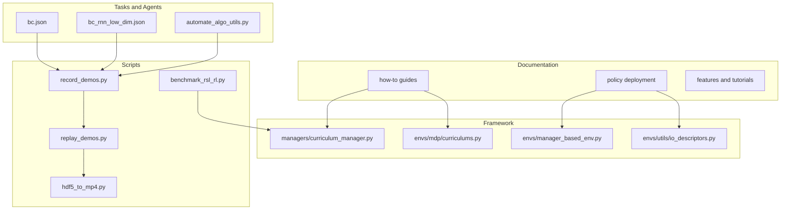

**Diagram sources**
- [curriculum_manager.py](file://source/isaaclab/isaaclab/managers/curriculum_manager.py)
- [curriculums.py](file://source/isaaclab/isaaclab/envs/mdp/curriculums.py)
- [manager_based_env.py](file://source/isaaclab/isaaclab/envs/manager_based_env.py)
- [io_descriptors.py](file://source/isaaclab/isaaclab/envs/utils/io_descriptors.py)
- [record_demos.py](file://scripts/tools/record_demos.py)
- [replay_demos.py](file://scripts/tools/replay_demos.py)
- [hdf5_to_mp4.py](file://scripts/tools/hdf5_to_mp4.py)
- [benchmark_rsl_rl.py](file://scripts/benchmarks/benchmark_rsl_rl.py)
- [bc.json](file://source/isaaclab_tasks/isaaclab_tasks/manager_based/manipulation/lift/config/franka/agents/robomimic/bc.json)
- [bc_rnn_low_dim.json](file://source/isaaclab_tasks/isaaclab_tasks/manager_based/manipulation/pick_place/agents/robomimic/bc_rnn_low_dim.json)
- [automate_algo_utils.py](file://source/isaaclab_tasks/isaaclab_tasks/direct/automate/automate_algo_utils.py)

**Section sources**
- [curriculum_manager.py](file://source/isaaclab/isaaclab/managers/curriculum_manager.py)
- [curriculums.py](file://source/isaaclab/isaaclab/envs/mdp/curriculums.py)
- [manager_based_env.py](file://source/isaaclab/isaaclab/envs/manager_based_env.py)
- [io_descriptors.py](file://source/isaaclab/isaaclab/envs/utils/io_descriptors.py)
- [record_demos.py](file://scripts/tools/record_demos.py)
- [replay_demos.py](file://scripts/tools/replay_demos.py)
- [hdf5_to_mp4.py](file://scripts/tools/hdf5_to_mp4.py)
- [benchmark_rsl_rl.py](file://scripts/benchmarks/benchmark_rsl_rl.py)
- [bc.json](file://source/isaaclab_tasks/isaaclab_tasks/manager_based/manipulation/lift/config/franka/agents/robomimic/bc.json)
- [bc_rnn_low_dim.json](file://source/isaaclab_tasks/isaaclab_tasks/manager_based/manipulation/pick_place/agents/robomimic/bc_rnn_low_dim.json)
- [automate_algo_utils.py](file://source/isaaclab_tasks/isaaclab_tasks/direct/automate/automate_algo_utils.py)

## Core Components
- Curriculum learning: Dynamic modification of reward weights and environment parameters during training via curriculum terms.
- Asset import and preparation: Converting URDF/MJCF/mesh assets to USD and ensuring instanceable formats for efficient large-scale simulation.
- Stage creation optimization: Fabric cloning and stage-in-memory features to accelerate environment instantiation.
- Video and camera output: Saving camera outputs and converting HDF5 demos to MP4 for analysis and presentation.
- Demo recording and replay: Human teleoperation-driven data capture and deterministic replay with optional state validation.
- IO descriptors: Exporting policy I/O descriptors from manager-based environments for external deployment.
- Benchmarking: RL performance metrics extraction and logging for reproducible evaluation.
- Multi-modal learning: JSON configurations for low-dimensional and visual modalities in imitation learning agents.
- Reproducibility: Deterministic seeds and determinism caveats for consistent experimental results.

**Section sources**
- [curriculums.py](file://source/isaaclab/isaaclab/envs/mdp/curriculums.py)
- [curriculum_manager.py](file://source/isaaclab/isaaclab/managers/curriculum_manager.py)
- [import_new_asset.rst](file://docs/source/how-to/import_new_asset.rst)
- [optimize_stage_creation.rst](file://docs/source/how-to/optimize_stage_creation.rst)
- [record_video.rst](file://docs/source/how-to/record_video.rst)
- [save_camera_output.rst](file://docs/source/how-to/save_camera_output.rst)
- [record_demos.py](file://scripts/tools/record_demos.py)
- [replay_demos.py](file://scripts/tools/replay_demos.py)
- [hdf5_to_mp4.py](file://scripts/tools/hdf5_to_mp4.py)
- [run_usd_camera.py](file://scripts/tutorials/04_sensors/run_usd_camera.py)
- [io_descriptors_101.rst](file://docs/source/policy_deployment/01_io_descriptors/io_descriptors_101.rst)
- [manager_based_env.py](file://source/isaaclab/isaaclab/envs/manager_based_env.py)
- [io_descriptors.py](file://source/isaaclab/isaaclab/envs/utils/io_descriptors.py)
- [benchmark_rsl_rl.py](file://scripts/benchmarks/benchmark_rsl_rl.py)
- [utils.py](file://scripts/benchmarks/utils.py)
- [estimate_how_many_cameras_can_run.rst](file://docs/source/how-to/estimate_how_many_cameras_can_run.rst)
- [reproducibility.rst](file://docs/source/features/reproducibility.rst)
- [bc.json](file://source/isaaclab_tasks/isaaclab_tasks/manager_based/manipulation/lift/config/franka/agents/robomimic/bc.json)
- [bc_rnn_low_dim.json](file://source/isaaclab_tasks/isaaclab_tasks/manager_based/manipulation/pick_place/agents/robomimic/bc_rnn_low_dim.json)
- [automate_algo_utils.py](file://source/isaaclab_tasks/isaaclab_tasks/direct/automate/automate_algo_utils.py)
- [teleop_imitation.rst](file://docs/source/overview/teleop_imitation.rst)

## Architecture Overview
The research workflow integrates curriculum-driven training, environment instantiation, sensor data capture, and data lifecycle management (recording, replay, conversion).

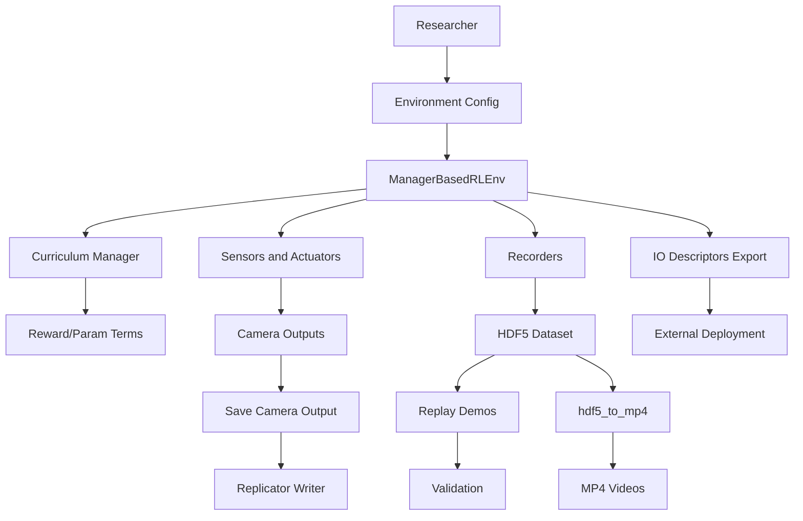

**Diagram sources**
- [curriculum_manager.py](file://source/isaaclab/isaaclab/managers/curriculum_manager.py)
- [curriculums.py](file://source/isaaclab/isaaclab/envs/mdp/curriculums.py)
- [manager_based_env.py](file://source/isaaclab/isaaclab/envs/manager_based_env.py)
- [io_descriptors.py](file://source/isaaclab/isaaclab/envs/utils/io_descriptors.py)
- [record_demos.py](file://scripts/tools/record_demos.py)
- [replay_demos.py](file://scripts/tools/replay_demos.py)
- [hdf5_to_mp4.py](file://scripts/tools/hdf5_to_mp4.py)
- [run_usd_camera.py](file://scripts/tutorials/04_sensors/run_usd_camera.py)

## Detailed Component Analysis

### Curriculum Learning Implementation
- Curriculum terms enable dynamic modification of reward weights and environment parameters during training.
- The curriculum manager aggregates terms, computes states, and resets logged extras for experiment tracking.
- Example utilities include modifying reward weights and environment parameters via dotted-path accessors.

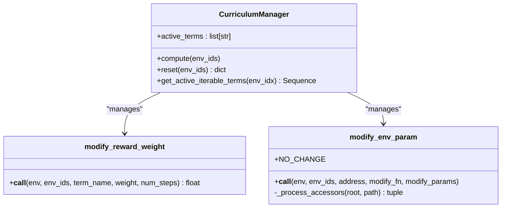

**Diagram sources**
- [curriculum_manager.py](file://source/isaaclab/isaaclab/managers/curriculum_manager.py)
- [curriculums.py](file://source/isaaclab/isaaclab/envs/mdp/curriculums.py)

**Section sources**
- [curriculum_manager.py](file://source/isaaclab/isaaclab/managers/curriculum_manager.py)
- [curriculums.py](file://source/isaaclab/isaaclab/envs/mdp/curriculums.py)

### Asset Import Procedures
- Recommended workflow: Convert URDF/MJCF/mesh assets to USD using provided converters, then ensure instanceable format for memory efficiency.
- Command-line examples and configuration parameters are documented for URDF/MJCF importers and mesh conversion.

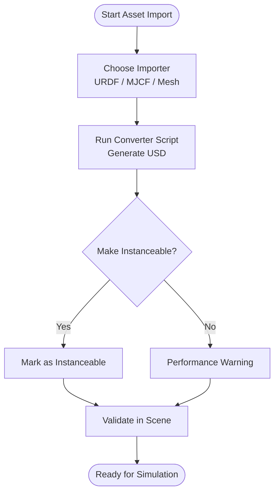

**Diagram sources**
- [import_new_asset.rst](file://docs/source/how-to/import_new_asset.rst)

**Section sources**
- [import_new_asset.rst](file://docs/source/how-to/import_new_asset.rst)

### Stage Creation Optimization Strategies
- Fabric cloning and stage-in-memory reduce environment instantiation overhead.
- Practical toggles and usage examples are provided for enabling these features in environment configurations.

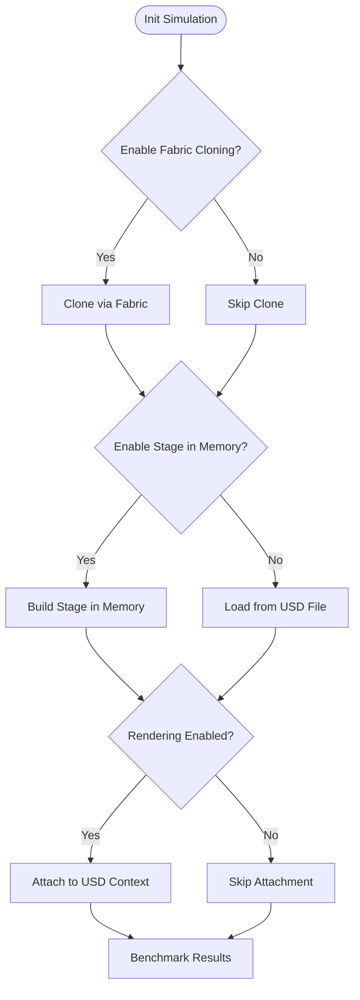

**Diagram sources**
- [optimize_stage_creation.rst](file://docs/source/how-to/optimize_stage_creation.rst)

**Section sources**
- [optimize_stage_creation.rst](file://docs/source/how-to/optimize_stage_creation.rst)

### Video Recording Workflows and Camera Output Saving
- Camera outputs can be saved using Replicator writer integration and annotated render products.
- Demonstrations captured via teleoperation are stored in HDF5 and later converted to MP4 for visualization.

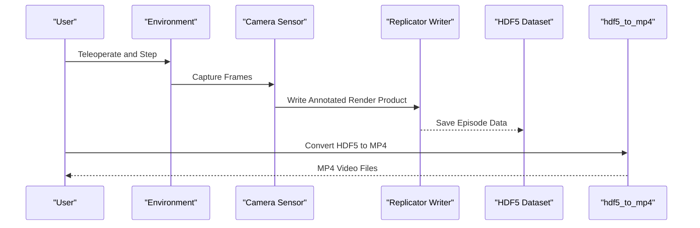

**Diagram sources**
- [run_usd_camera.py](file://scripts/tutorials/04_sensors/run_usd_camera.py)
- [record_demos.py](file://scripts/tools/record_demos.py)
- [hdf5_to_mp4.py](file://scripts/tools/hdf5_to_mp4.py)

**Section sources**
- [run_usd_camera.py](file://scripts/tutorials/04_sensors/run_usd_camera.py)
- [record_demos.py](file://scripts/tools/record_demos.py)
- [hdf5_to_mp4.py](file://scripts/tools/hdf5_to_mp4.py)

### Demo Recording and Replay Systems
- Recording script orchestrates teleoperation, environment stepping, and dataset export with success termination handling.
- Replay script loads episodes, steps actions, and optionally validates states against dataset.

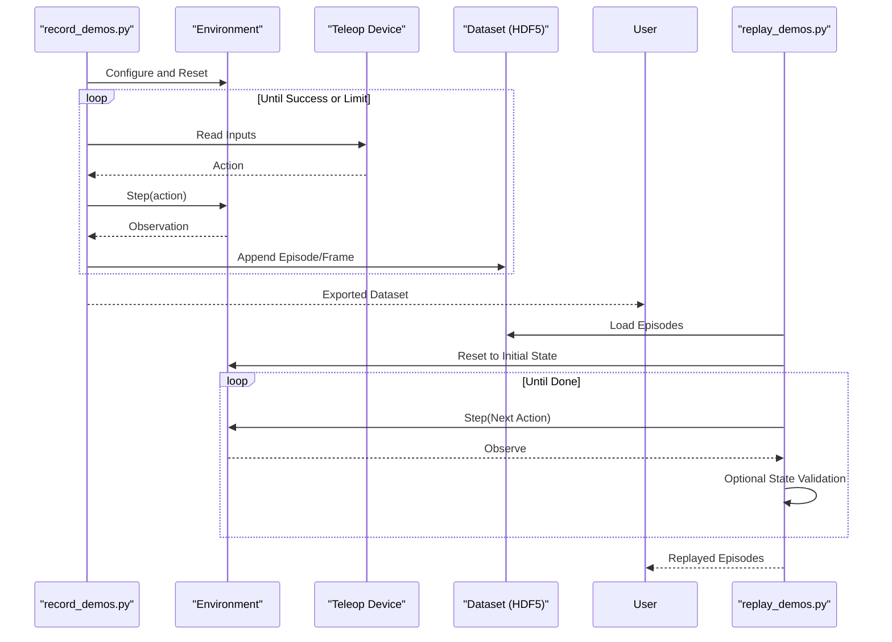

**Diagram sources**
- [record_demos.py](file://scripts/tools/record_demos.py)
- [replay_demos.py](file://scripts/tools/replay_demos.py)

**Section sources**
- [record_demos.py](file://scripts/tools/record_demos.py)
- [replay_demos.py](file://scripts/tools/replay_demos.py)

### IO Descriptor Export and Custom Environment Development
- IO descriptors describe policy inputs/outputs for manager-based RL environments and can be exported to YAML for external deployment.
- Decorators and hooks assist in capturing shapes and metadata during inspection.

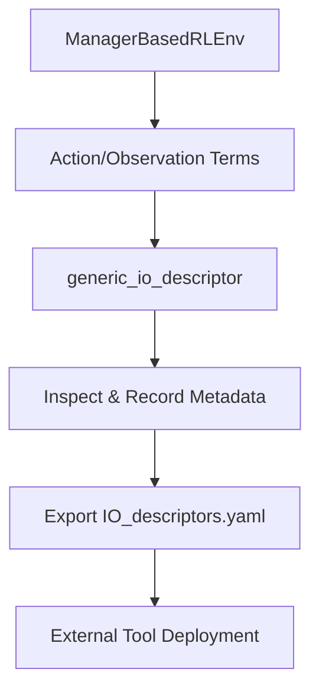

**Diagram sources**
- [io_descriptors_101.rst](file://docs/source/policy_deployment/01_io_descriptors/io_descriptors_101.rst)
- [manager_based_env.py](file://source/isaaclab/isaaclab/envs/manager_based_env.py)
- [io_descriptors.py](file://source/isaaclab/isaaclab/envs/utils/io_descriptors.py)

**Section sources**
- [io_descriptors_101.rst](file://docs/source/policy_deployment/01_io_descriptors/io_descriptors_101.rst)
- [manager_based_env.py](file://source/isaaclab/isaaclab/envs/manager_based_env.py)
- [io_descriptors.py](file://source/isaaclab/isaaclab/envs/utils/io_descriptors.py)

### Performance Benchmarking Techniques
- Benchmark scripts parse TensorBoard logs and compute RL performance metrics such as collection FPS and learning times.
- Utilities log startup and runtime measurements for comprehensive evaluation.

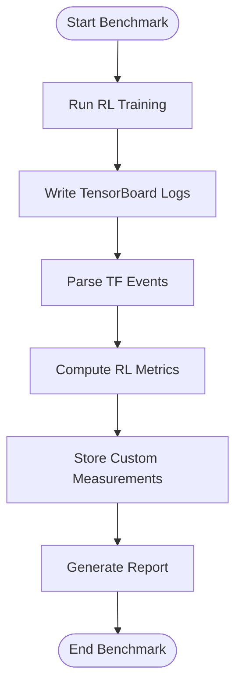

**Diagram sources**
- [benchmark_rsl_rl.py](file://scripts/benchmarks/benchmark_rsl_rl.py)
- [utils.py](file://scripts/benchmarks/utils.py)

**Section sources**
- [benchmark_rsl_rl.py](file://scripts/benchmarks/benchmark_rsl_rl.py)
- [utils.py](file://scripts/benchmarks/utils.py)

### Advanced Topics: Multi-Modal Learning and Sensor Fusion
- Multi-modal configurations define observation modalities (low-dim, rgb, depth) for imitation learning agents.
- Automated algorithms demonstrate statistical modeling of success distributions for environment design and sampling.

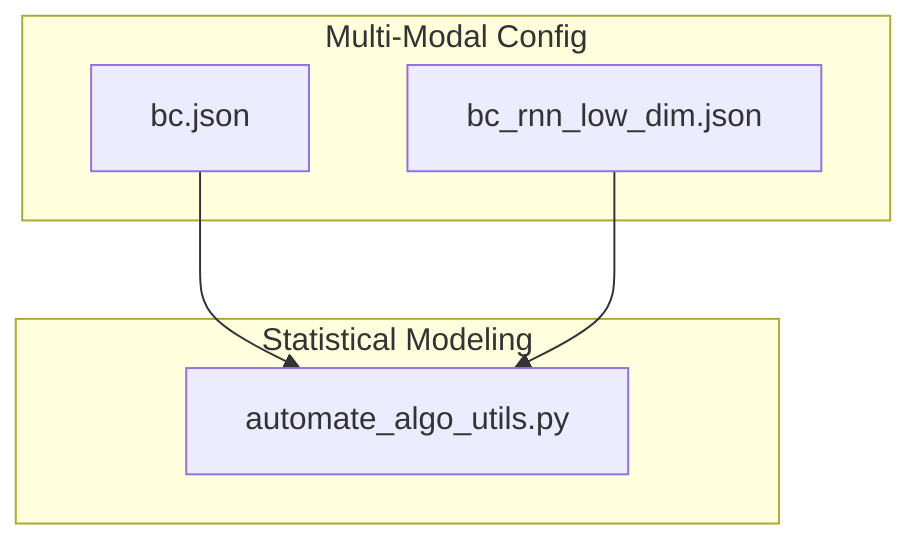

**Diagram sources**
- [bc.json](file://source/isaaclab_tasks/isaaclab_tasks/manager_based/manipulation/lift/config/franka/agents/robomimic/bc.json)
- [bc_rnn_low_dim.json](file://source/isaaclab_tasks/isaaclab_tasks/manager_based/manipulation/pick_place/agents/robomimic/bc_rnn_low_dim.json)
- [automate_algo_utils.py](file://source/isaaclab_tasks/isaaclab_tasks/direct/automate/automate_algo_utils.py)

**Section sources**
- [bc.json](file://source/isaaclab_tasks/isaaclab_tasks/manager_based/manipulation/lift/config/franka/agents/robomimic/bc.json)
- [bc_rnn_low_dim.json](file://source/isaaclab_tasks/isaaclab_tasks/manager_based/manipulation/pick_place/agents/robomimic/bc_rnn_low_dim.json)
- [automate_algo_utils.py](file://source/isaaclab_tasks/isaaclab_tasks/direct/automate/automate_algo_utils.py)

## Dependency Analysis
Key dependencies and relationships:
- Curriculum utilities depend on the curriculum manager and environment reward/event managers.
- Demo recording relies on environment configuration, recorder manager, and teleoperation devices.
- IO descriptor export depends on manager-based environments and descriptor utilities.
- Benchmarking depends on TensorBoard event parsing and RL training logs.

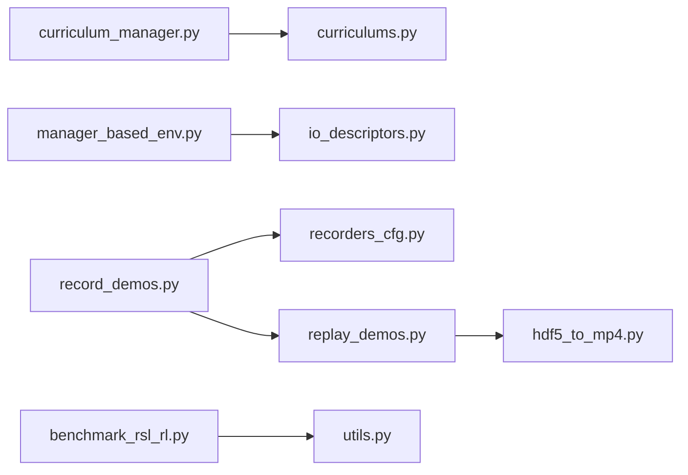

**Diagram sources**
- [curriculum_manager.py](file://source/isaaclab/isaaclab/managers/curriculum_manager.py)
- [curriculums.py](file://source/isaaclab/isaaclab/envs/mdp/curriculums.py)
- [manager_based_env.py](file://source/isaaclab/isaaclab/envs/manager_based_env.py)
- [io_descriptors.py](file://source/isaaclab/isaaclab/envs/utils/io_descriptors.py)
- [record_demos.py](file://scripts/tools/record_demos.py)
- [replay_demos.py](file://scripts/tools/replay_demos.py)
- [hdf5_to_mp4.py](file://scripts/tools/hdf5_to_mp4.py)
- [benchmark_rsl_rl.py](file://scripts/benchmarks/benchmark_rsl_rl.py)
- [utils.py](file://scripts/benchmarks/utils.py)

**Section sources**
- [curriculum_manager.py](file://source/isaaclab/isaaclab/managers/curriculum_manager.py)
- [curriculums.py](file://source/isaaclab/isaaclab/envs/mdp/curriculums.py)
- [manager_based_env.py](file://source/isaaclab/isaaclab/envs/manager_based_env.py)
- [io_descriptors.py](file://source/isaaclab/isaaclab/envs/utils/io_descriptors.py)
- [record_demos.py](file://scripts/tools/record_demos.py)
- [replay_demos.py](file://scripts/tools/replay_demos.py)
- [hdf5_to_mp4.py](file://scripts/tools/hdf5_to_mp4.py)
- [benchmark_rsl_rl.py](file://scripts/benchmarks/benchmark_rsl_rl.py)
- [utils.py](file://scripts/benchmarks/utils.py)

## Performance Considerations
- Camera throughput estimation and system tuning guidelines are provided to balance rendering load and resource usage.
- Stage creation optimization via fabric cloning and stage-in-memory yields measurable performance improvements in large-scale deployments.

**Section sources**
- [estimate_how_many_cameras_can_run.rst](file://docs/source/how-to/estimate_how_many_cameras_can_run.rst)
- [optimize_stage_creation.rst](file://docs/source/how-to/optimize_stage_creation.rst)

## Troubleshooting Guide
- Camera output saving requires annotator metadata and on-time triggers for Replicator writer.
- Demo replay validation compares articulated and rigid object states; mismatches indicate non-determinism or configuration differences.
- Teleoperation and demo workflows highlight non-deterministic replay caveats and best practices for smooth demonstrations.

**Section sources**
- [run_usd_camera.py](file://scripts/tutorials/04_sensors/run_usd_camera.py)
- [replay_demos.py](file://scripts/tools/replay_demos.py)
- [teleop_imitation.rst](file://docs/source/overview/teleop_imitation.rst)

## Conclusion
This document outlined advanced research methodologies leveraging curriculum learning, optimized stage creation, robust demo capture and replay, IO descriptor export, and performance benchmarking. By combining these capabilities with multi-modal learning configurations and rigorous reproducibility practices, researchers can design scalable, reproducible, and publication-ready robotics experiments.

## Appendices

### Best Practices for Research Reproducibility
- Use fixed seeds for simulation and physics engines to ensure deterministic runs.
- Prefer setup-time parameter changes over runtime modifications to avoid GPU scheduling-induced variations.
- Document environment configurations, curriculum schedules, and data collection parameters.

**Section sources**
- [reproducibility.rst](file://docs/source/features/reproducibility.rst)