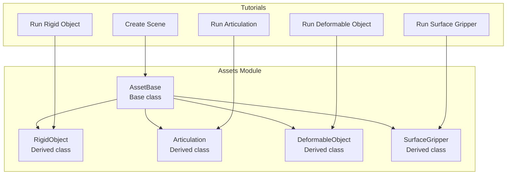
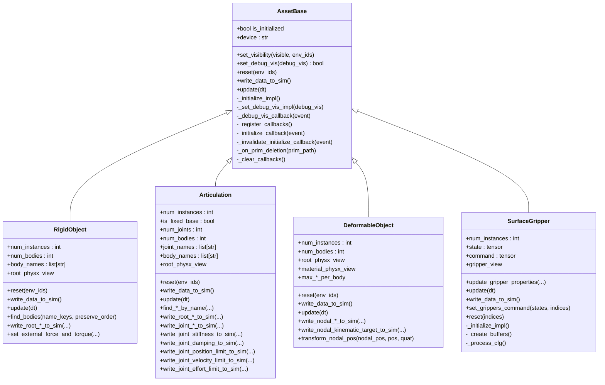
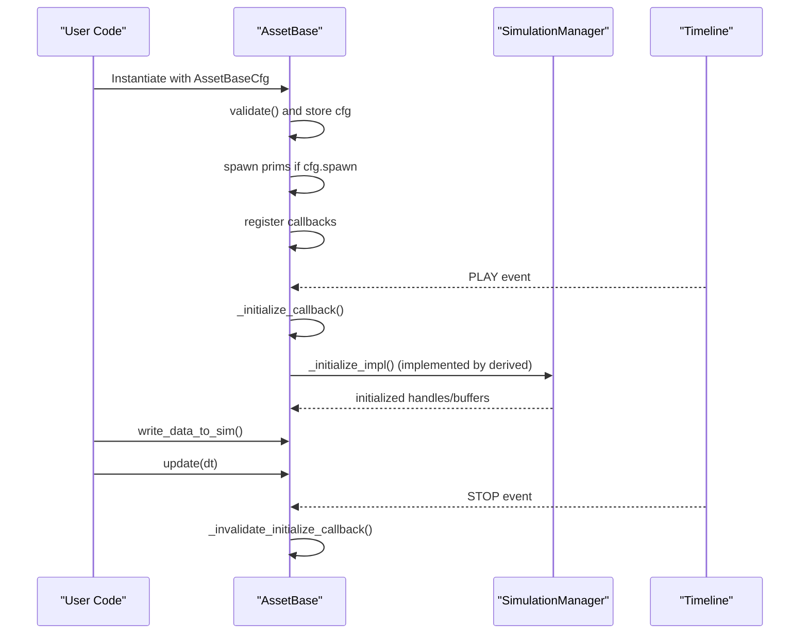
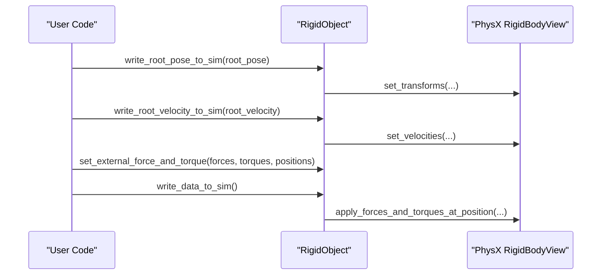
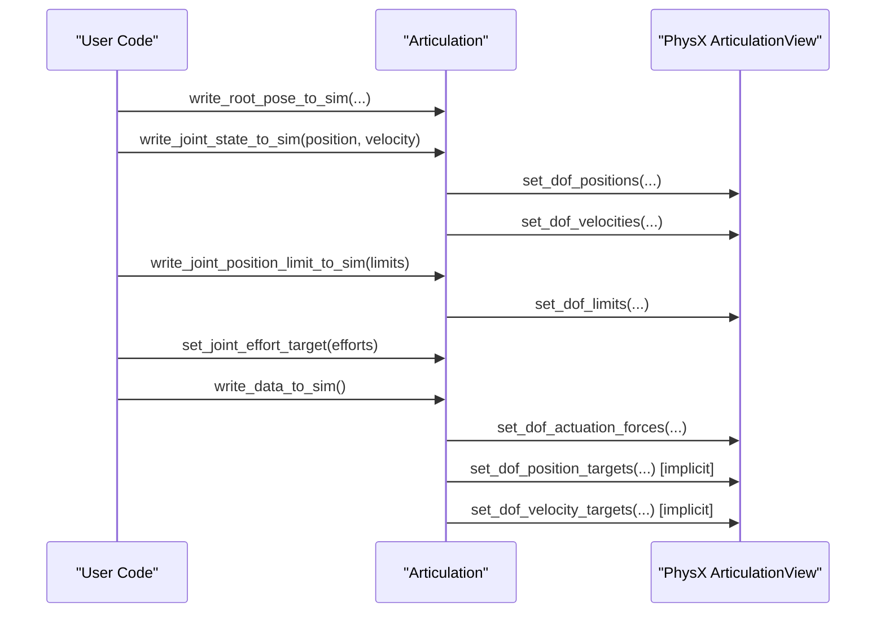
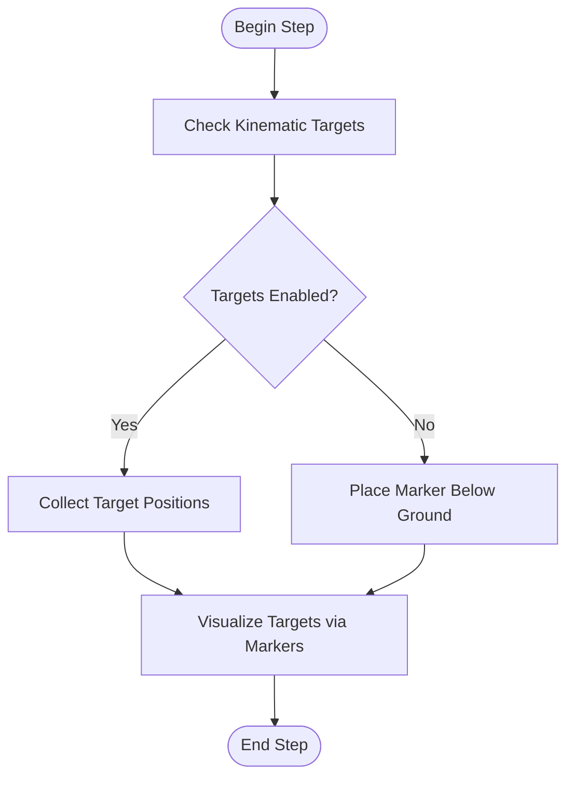
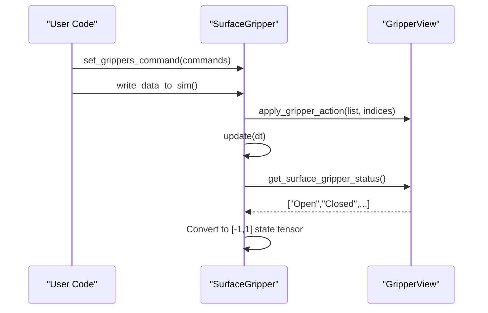
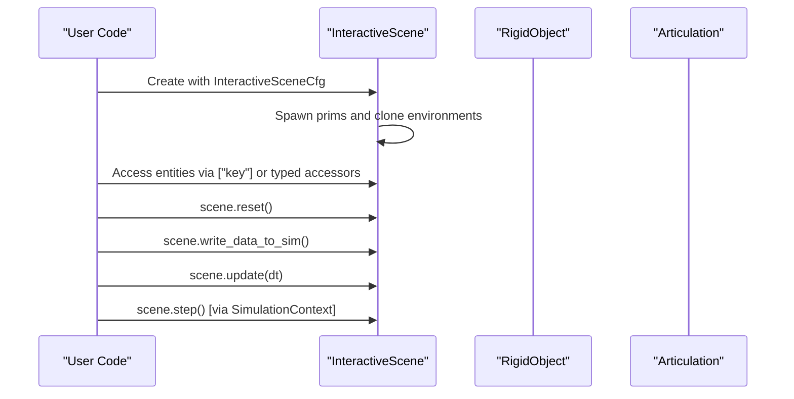
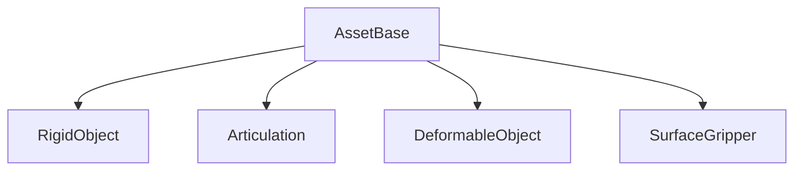

# Environment and Assets Tutorials

<cite>
**Referenced Files in This Document**
- [asset_base.py](file://source/isaaclab/isaaclab/assets/asset_base.py)
- [asset_base_cfg.py](file://source/isaaclab/isaaclab/assets/asset_base_cfg.py)
- [rigid_object.py](file://source/isaaclab/isaaclab/assets/rigid_object/rigid_object.py)
- [articulation.py](file://source/isaaclab/isaaclab/assets/articulation/articulation.py)
- [deformable_object.py](file://source/isaaclab/isaaclab/assets/deformable_object/deformable_object.py)
- [surface_gripper.py](file://source/isaaclab/isaaclab/assets/surface_gripper/surface_gripper.py)
- [run_rigid_object.py](file://scripts/tutorials/01_assets/run_rigid_object.py)
- [run_articulation.py](file://scripts/tutorials/01_assets/run_articulation.py)
- [run_deformable_object.py](file://scripts/tutorials/01_assets/run_deformable_object.py)
- [run_surface_gripper.py](file://scripts/tutorials/01_assets/run_surface_gripper.py)
- [create_scene.py](file://scripts/tutorials/02_scene/create_scene.py)
</cite>

## Table of Contents
1. [Introduction](#introduction)
2. [Project Structure](#project-structure)
3. [Core Components](#core-components)
4. [Architecture Overview](#architecture-overview)
5. [Detailed Component Analysis](#detailed-component-analysis)
6. [Dependency Analysis](#dependency-analysis)
7. [Performance Considerations](#performance-considerations)
8. [Troubleshooting Guide](#troubleshooting-guide)
9. [Conclusion](#conclusion)
10. [Appendices](#appendices)

## Introduction
This document provides a comprehensive tutorial for environment and asset management in the simulation framework. It covers the complete workflow from asset integration to scene creation, focusing on the AssetBase class and its derivatives: RigidObject, Articulation, DeformableObject, and SurfaceGripper. You will learn how to:
- Configure assets and their physics properties
- Spawn and integrate assets into scenes
- Manage complex environments using InteractiveScene
- Add new robots and run different asset types
- Work with deformable objects and grippers
- Handle collision detection, material assignment, and performance optimization
- Troubleshoot common asset-related issues and follow best practices for large-scale scene management

## Project Structure
The repository organizes asset-related functionality under the isaaclab package, with dedicated submodules for each asset type. Tutorials demonstrate practical usage patterns for spawning and interacting with assets, and how to build scalable scenes using InteractiveScene.

**Diagram sources**
- [asset_base.py:29-364](file://source/isaaclab/isaaclab/assets/asset_base.py#L29-L364)
- [rigid_object.py:28-560](file://source/isaaclab/isaaclab/assets/rigid_object/rigid_object.py#L28-L560)
- [articulation.py:35-800](file://source/isaaclab/isaaclab/assets/articulation/articulation.py#L35-L800)
- [deformable_object.py:28-412](file://source/isaaclab/isaaclab/assets/deformable_object/deformable_object.py#L28-L412)
- [surface_gripper.py:24-394](file://source/isaaclab/isaaclab/assets/surface_gripper/surface_gripper.py#L24-L394)
- [run_rigid_object.py:46-149](file://scripts/tutorials/01_assets/run_rigid_object.py#L46-L149)
- [run_articulation.py:49-144](file://scripts/tutorials/01_assets/run_articulation.py#L49-L144)
- [run_deformable_object.py:46-169](file://scripts/tutorials/01_assets/run_deformable_object.py#L46-L169)
- [run_surface_gripper.py:50-184](file://scripts/tutorials/01_assets/run_surface_gripper.py#L50-L184)
- [create_scene.py:50-133](file://scripts/tutorials/02_scene/create_scene.py#L50-L133)

**Section sources**
- [asset_base.py:29-364](file://source/isaaclab/isaaclab/assets/asset_base.py#L29-L364)
- [asset_base_cfg.py:15-78](file://source/isaaclab/isaaclab/assets/asset_base_cfg.py#L15-L78)
- [rigid_object.py:28-560](file://source/isaaclab/isaaclab/assets/rigid_object/rigid_object.py#L28-L560)
- [articulation.py:35-800](file://source/isaaclab/isaaclab/assets/articulation/articulation.py#L35-L800)
- [deformable_object.py:28-412](file://source/isaaclab/isaaclab/assets/deformable_object/deformable_object.py#L28-L412)
- [surface_gripper.py:24-394](file://source/isaaclab/isaaclab/assets/surface_gripper/surface_gripper.py#L24-L394)
- [run_rigid_object.py:46-149](file://scripts/tutorials/01_assets/run_rigid_object.py#L46-L149)
- [run_articulation.py:49-144](file://scripts/tutorials/01_assets/run_articulation.py#L49-L144)
- [run_deformable_object.py:46-169](file://scripts/tutorials/01_assets/run_deformable_object.py#L46-L169)
- [run_surface_gripper.py:50-184](file://scripts/tutorials/01_assets/run_surface_gripper.py#L50-L184)
- [create_scene.py:50-133](file://scripts/tutorials/02_scene/create_scene.py#L50-L133)

## Core Components
This section introduces the foundational AssetBase class and its configuration, followed by each asset derivative and their primary capabilities.

- AssetBase
  - Provides the base interface for assets, handling spawning, initialization, callbacks, debug visualization, and buffer updates.
  - Manages timeline and prim deletion callbacks to initialize/invalidate assets on play/stop.
  - Exposes abstract methods for reset, write_data_to_sim, and update, ensuring derived classes implement asset-specific behavior.
  - Supports debug visualization toggling and visibility control for prims.

- AssetBaseCfg
  - Defines common asset configuration fields: prim_path (supports regex expressions), spawn configuration, initial state, collision group, and debug_vis.
  - Ensures validation and proper defaults for asset instantiation.

- RigidObject
  - Represents rigid bodies with root PhysX view, body names, and methods to write root pose/velocity and apply external forces/torques.
  - Supports finding bodies by name keys and resetting external wrench buffers.

- Articulation
  - Represents articulated systems with joint, body, and tendon counts, plus actuator model integration.
  - Provides state writers for root/link/com poses/velocities, joint positions/velocities, and stiffness/damping/limits.
  - Applies actuator models and writes joint commands, effort targets, and implicit position/velocity targets.

- DeformableObject
  - Handles deformable bodies with nodal positions/velocities and optional material properties.
  - Supports writing nodal states, kinematic targets, and transforming nodal positions.
  - Includes debug visualization for kinematic targets via markers.

- SurfaceGripper
  - Implements a surface gripper actuator using a specialized gripper view.
  - Manages gripper state/command buffers, updates gripper status, and writes commands to the gripper view.
  - Requires CPU backend and exposes property updates for max grip distance, force limits, and retry interval.

**Section sources**
- [asset_base.py:29-364](file://source/isaaclab/isaaclab/assets/asset_base.py#L29-L364)
- [asset_base_cfg.py:15-78](file://source/isaaclab/isaaclab/assets/asset_base_cfg.py#L15-L78)
- [rigid_object.py:28-560](file://source/isaaclab/isaaclab/assets/rigid_object/rigid_object.py#L28-L560)
- [articulation.py:35-800](file://source/isaaclab/isaaclab/assets/articulation/articulation.py#L35-L800)
- [deformable_object.py:28-412](file://source/isaaclab/isaaclab/assets/deformable_object/deformable_object.py#L28-L412)
- [surface_gripper.py:24-394](file://source/isaaclab/isaaclab/assets/surface_gripper/surface_gripper.py#L24-L394)

## Architecture Overview
The asset system follows a layered architecture:
- AssetBase encapsulates common lifecycle and interaction patterns.
- Derived asset classes implement physics-specific views and data buffers.
- Tutorials demonstrate spawning, configuration, and runtime interaction.
- InteractiveScene orchestrates asset instantiation and environment cloning for scalable simulations.

**Diagram sources**
- [asset_base.py:29-364](file://source/isaaclab/isaaclab/assets/asset_base.py#L29-L364)
- [rigid_object.py:28-560](file://source/isaaclab/isaaclab/assets/rigid_object/rigid_object.py#L28-L560)
- [articulation.py:35-800](file://source/isaaclab/isaaclab/assets/articulation/articulation.py#L35-L800)
- [deformable_object.py:28-412](file://source/isaaclab/isaaclab/assets/deformable_object/deformable_object.py#L28-L412)
- [surface_gripper.py:24-394](file://source/isaaclab/isaaclab/assets/surface_gripper/surface_gripper.py#L24-L394)

## Detailed Component Analysis

### AssetBase Lifecycle and Interaction
AssetBase manages asset initialization, callbacks, and debug visualization. It spawns prims based on configuration, registers timeline/play callbacks, and handles prim deletion events. Derived classes override _initialize_impl to set up physics views and buffers.

**Diagram sources**
- [asset_base.py:58-102](file://source/isaaclab/isaaclab/assets/asset_base.py#L58-L102)
- [asset_base.py:304-330](file://source/isaaclab/isaaclab/assets/asset_base.py#L304-L330)

**Section sources**
- [asset_base.py:58-102](file://source/isaaclab/isaaclab/assets/asset_base.py#L58-L102)
- [asset_base.py:304-330](file://source/isaaclab/isaaclab/assets/asset_base.py#L304-L330)

### RigidObject: Physics and Controls
RigidObject provides root state writers, external force/torque application, and body finding utilities. It uses a PhysX rigid body view and maintains default mass/inertia and external wrench buffers.

**Diagram sources**
- [rigid_object.py:160-247](file://source/isaaclab/isaaclab/assets/rigid_object/rigid_object.py#L160-L247)
- [rigid_object.py:366-451](file://source/isaaclab/isaaclab/assets/rigid_object/rigid_object.py#L366-L451)
- [rigid_object.py:108-133](file://source/isaaclab/isaaclab/assets/rigid_object/rigid_object.py#L108-L133)

**Section sources**
- [rigid_object.py:28-560](file://source/isaaclab/isaaclab/assets/rigid_object/rigid_object.py#L28-L560)

### Articulation: Joints, Limits, and Actuators
Articulation manages joint state writers, stiffness/damping/limits, and actuator models. It writes joint commands and implicit targets to the PhysX articulation view.

**Diagram sources**
- [articulation.py:316-403](file://source/isaaclab/isaaclab/assets/articulation/articulation.py#L316-L403)
- [articulation.py:517-603](file://source/isaaclab/isaaclab/assets/articulation/articulation.py#L517-L603)
- [articulation.py:666-725](file://source/isaaclab/isaaclab/assets/articulation/articulation.py#L666-L725)
- [articulation.py:184-221](file://source/isaaclab/isaaclab/assets/articulation/articulation.py#L184-L221)

**Section sources**
- [articulation.py:35-800](file://source/isaaclab/isaaclab/assets/articulation/articulation.py#L35-L800)

### DeformableObject: Nodal States and Kinematic Targets
DeformableObject manages nodal positions/velocities and optional material properties. It supports writing nodal states and kinematic targets, and transforms nodal positions for pose changes.

**Diagram sources**
- [deformable_object.py:394-406](file://source/isaaclab/isaaclab/assets/deformable_object/deformable_object.py#L394-L406)

**Section sources**
- [deformable_object.py:28-412](file://source/isaaclab/isaaclab/assets/deformable_object/deformable_object.py#L28-L412)

### SurfaceGripper: Commands and State
SurfaceGripper manages gripper state and commands, converting numeric commands to gripper actions and updating state from the gripper view.

**Diagram sources**
- [surface_gripper.py:203-239](file://source/isaaclab/isaaclab/assets/surface_gripper/surface_gripper.py#L203-L239)
- [surface_gripper.py:183-202](file://source/isaaclab/isaaclab/assets/surface_gripper/surface_gripper.py#L183-L202)
- [surface_gripper.py:159-182](file://source/isaaclab/isaaclab/assets/surface_gripper/surface_gripper.py#L159-L182)

**Section sources**
- [surface_gripper.py:24-394](file://source/isaaclab/isaaclab/assets/surface_gripper/surface_gripper.py#L24-L394)

### InteractiveScene: Building Scalable Environments
InteractiveScene centralizes asset spawning and management, enabling environment cloning and unified reset/update/write cycles.

**Diagram sources**
- [create_scene.py:50-133](file://scripts/tutorials/02_scene/create_scene.py#L50-L133)

**Section sources**
- [create_scene.py:50-133](file://scripts/tutorials/02_scene/create_scene.py#L50-L133)

## Dependency Analysis
Asset classes depend on AssetBase for lifecycle and callbacks, and on physics views for simulation interaction. Tutorials demonstrate usage patterns and environment orchestration.

**Diagram sources**
- [asset_base.py:29-364](file://source/isaaclab/isaaclab/assets/asset_base.py#L29-L364)
- [rigid_object.py:28-560](file://source/isaaclab/isaaclab/assets/rigid_object/rigid_object.py#L28-L560)
- [articulation.py:35-800](file://source/isaaclab/isaaclab/assets/articulation/articulation.py#L35-L800)
- [deformable_object.py:28-412](file://source/isaaclab/isaaclab/assets/deformable_object/deformable_object.py#L28-L412)
- [surface_gripper.py:24-394](file://source/isaaclab/isaaclab/assets/surface_gripper/surface_gripper.py#L24-L394)

**Section sources**
- [asset_base.py:29-364](file://source/isaaclab/isaaclab/assets/asset_base.py#L29-L364)
- [rigid_object.py:28-560](file://source/isaaclab/isaaclab/assets/rigid_object/rigid_object.py#L28-L560)
- [articulation.py:35-800](file://source/isaaclab/isaaclab/assets/articulation/articulation.py#L35-L800)
- [deformable_object.py:28-412](file://source/isaaclab/isaaclab/assets/deformable_object/deformable_object.py#L28-L412)
- [surface_gripper.py:24-394](file://source/isaaclab/isaaclab/assets/surface_gripper/surface_gripper.py#L24-L394)

## Performance Considerations
- Prefer batched operations: Use environment slices and vectorized tensor operations to minimize per-entity overhead.
- Minimize debug visualization: Keep debug_vis disabled unless needed; it subscribes to post-update events and can add overhead.
- Control visibility: Hide unused prims using set_visibility to reduce rendering costs.
- Use appropriate backends: SurfaceGripper requires CPU; ensure device alignment to avoid runtime errors.
- Limit per-step writes: Group writes (e.g., root pose/velocity, joint states) and call write_data_to_sim once per step.
- Optimize collision groups: Use collision_group -1 for global collisions or 0 for local groups to control broad-phase filtering.

[No sources needed since this section provides general guidance]

## Troubleshooting Guide
Common issues and resolutions:
- Asset not found at prim path
  - Ensure prim_path matches existing prims or use spawn configuration to create them.
  - Verify regex patterns and environment namespace placeholders.
  - See spawn and path resolution in AssetBase initialization.

- Rigid body initialization failures
  - Confirm USD RigidBodyAPI is applied to the root prim.
  - Ensure only one rigid body exists under the resolved prim tree.
  - Check that articulation roots are disabled for rigid object assets.

- Articulation root mismatches
  - Verify USD ArticulationRootAPI presence.
  - Ensure joint types and DOF counts align with expectations.

- Deformable body material binding
  - If material is not bound, defaults are used and runtime modification is not supported.
  - Bind a compatible deformable material to enable runtime property updates.

- Surface gripper unsupported version/device
  - Requires IsaacSim 5.0+ and CPU backend.
  - Use --device cpu when launching the script.

- Debug visualization not appearing
  - Ensure debug_vis is enabled in configuration.
  - Confirm derived class implements _set_debug_vis_impl and _debug_vis_callback.

**Section sources**
- [asset_base.py:82-94](file://source/isaaclab/isaaclab/assets/asset_base.py#L82-L94)
- [rigid_object.py:455-507](file://source/isaaclab/isaaclab/assets/rigid_object/rigid_object.py#L455-L507)
- [articulation.py:35-80](file://source/isaaclab/isaaclab/assets/articulation/articulation.py#L35-L80)
- [deformable_object.py:264-352](file://source/isaaclab/isaaclab/assets/deformable_object/deformable_object.py#L264-L352)
- [surface_gripper.py:244-292](file://source/isaaclab/isaaclab/assets/surface_gripper/surface_gripper.py#L244-L292)

## Conclusion
This tutorial demonstrated how to integrate and manage assets—from rigid bodies and articulated systems to deformable objects and grippers—within a scalable simulation environment using InteractiveScene. By leveraging AssetBase’s lifecycle and derived classes’ specialized capabilities, you can efficiently configure physics properties, control assets at runtime, and optimize performance for large-scale scenes.

[No sources needed since this section summarizes without analyzing specific files]

## Appendices

### Step-by-Step: Adding a New Robot (Articulation)
- Prepare URDF/MJCF or USD with ArticulationRootAPI and joint definitions.
- Define an ArticulationCfg with prim_path pointing to the robot prim(s).
- Instantiate Articulation and use write_root_* and write_joint_* methods to set states.
- Apply actions via set_joint_effort_target or actuator models and call write_data_to_sim each step.

**Section sources**
- [run_articulation.py:49-144](file://scripts/tutorials/01_assets/run_articulation.py#L49-L144)
- [articulation.py:316-403](file://source/isaaclab/isaaclab/assets/articulation/articulation.py#L316-L403)

### Step-by-Step: Running Different Asset Types
- RigidObject: Configure spawn with geometry and mass properties; use write_root_* and set_external_force_and_torque.
- Articulation: Set joint targets and limits; apply efforts and update state.
- DeformableObject: Write nodal states and kinematic targets; transform nodal positions for pose changes.
- SurfaceGripper: Set gripper commands and update state; ensure CPU backend.

**Section sources**
- [run_rigid_object.py:46-149](file://scripts/tutorials/01_assets/run_rigid_object.py#L46-L149)
- [run_articulation.py:49-144](file://scripts/tutorials/01_assets/run_articulation.py#L49-L144)
- [run_deformable_object.py:46-169](file://scripts/tutorials/01_assets/run_deformable_object.py#L46-L169)
- [run_surface_gripper.py:50-184](file://scripts/tutorials/01_assets/run_surface_gripper.py#L50-L184)

### Step-by-Step: Integrating Deformable Objects and Grippers
- Deformable objects: Use DeformableObjectCfg with deformable props and material; write nodal states and kinematic targets.
- Grippers: Use SurfaceGripperCfg with prim_expr; set gripper properties; send commands and read state.

**Section sources**
- [run_deformable_object.py:46-169](file://scripts/tutorials/01_assets/run_deformable_object.py#L46-L169)
- [run_surface_gripper.py:50-184](file://scripts/tutorials/01_assets/run_surface_gripper.py#L50-L184)

### Best Practices for Large-Scale Scenes
- Use InteractiveScene to clone environments and manage assets centrally.
- Batch operations and minimize per-step writes.
- Disable debug visualization and visibility for off-screen assets.
- Align device backends with asset requirements (e.g., SurfaceGripper on CPU).
- Use collision_group to control broad-phase filtering and reduce unnecessary contacts.

[No sources needed since this section provides general guidance]