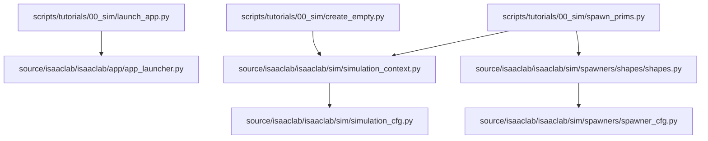
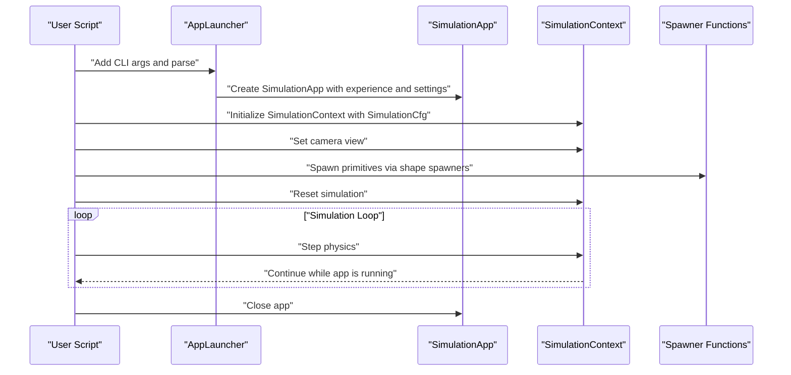
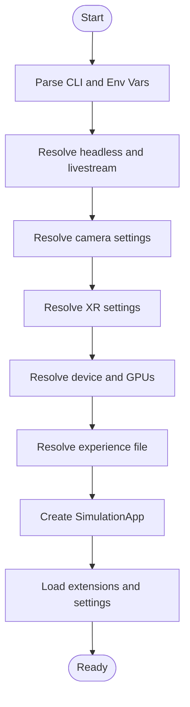
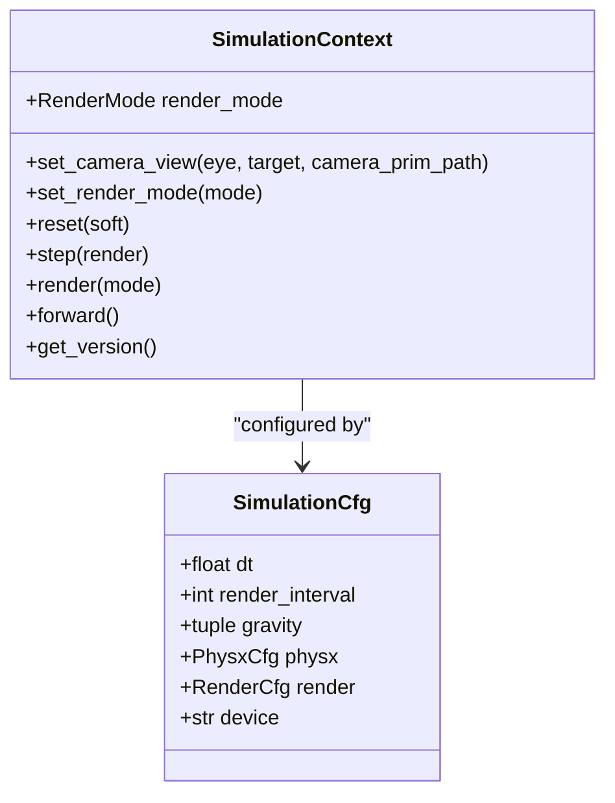
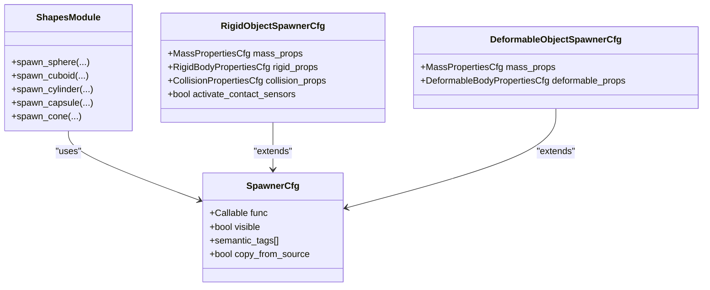
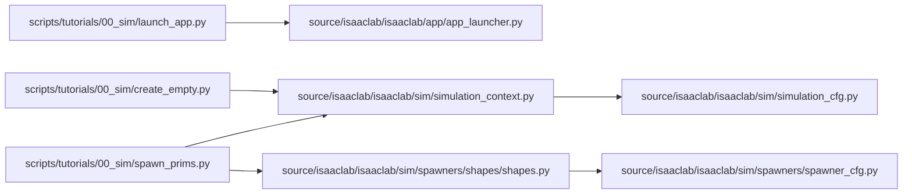

# Getting Started Tutorials

<cite>
**Referenced Files in This Document**
- [README.md](file://README.md)
- [launch_app.py](file://scripts/tutorials/00_sim/launch_app.py)
- [spawn_prims.py](file://scripts/tutorials/00_sim/spawn_prims.py)
- [create_empty.py](file://scripts/tutorials/00_sim/create_empty.py)
- [app_launcher.py](file://source/isaaclab/isaaclab/app/app_launcher.py)
- [simulation_context.py](file://source/isaaclab/isaaclab/sim/simulation_context.py)
- [simulation_cfg.py](file://source/isaaclab/isaaclab/sim/simulation_cfg.py)
- [spawner_cfg.py](file://source/isaaclab/isaaclab/sim/spawners/spawner_cfg.py)
- [shapes.py](file://source/isaaclab/isaaclab/sim/spawners/shapes/shapes.py)
- [isaaclab.sim.spawners.rst](file://docs/source/api/lab/isaaclab.sim.spawners.rst)
- [spawn_prims.rst](file://docs/source/tutorials/00_sim/spawn_prims.rst)
</cite>

## Table of Contents
1. [Introduction](#introduction)
2. [Project Structure](#project-structure)
3. [Core Components](#core-components)
4. [Architecture Overview](#architecture-overview)
5. [Detailed Component Analysis](#detailed-component-analysis)
6. [Dependency Analysis](#dependency-analysis)
7. [Performance Considerations](#performance-considerations)
8. [Troubleshooting Guide](#troubleshooting-guide)
9. [Conclusion](#conclusion)
10. [Appendices](#appendices)

## Introduction
This guide provides a practical, step-by-step path to get started with the Isaac Lab simulation environment. It covers environment setup, launching simulations with different configurations, spawning primitive objects, and understanding the basic APIs. You will learn how to use the AppLauncher to configure and start the simulator, how to initialize a SimulationContext to control physics and rendering, and how to spawn geometric primitives and assets into the scene using the spawner classes. The tutorial includes beginner-friendly explanations of core concepts such as simulation contexts, object spawning, and basic scene interaction, along with verification steps and next steps for progressing to more advanced tutorials.

## Project Structure
The repository organizes tutorials under scripts/tutorials and core libraries under source/isaaclab. The tutorials demonstrate:
- Launching the simulator with AppLauncher
- Creating a minimal stage
- Spawning primitive objects into the scene

**Diagram sources**
- [launch_app.py:1-97](file://scripts/tutorials/00_sim/launch_app.py#L1-L97)
- [create_empty.py:1-62](file://scripts/tutorials/00_sim/create_empty.py#L1-L62)
- [spawn_prims.py:1-117](file://scripts/tutorials/00_sim/spawn_prims.py#L1-L117)
- [app_launcher.py:1-800](file://source/isaaclab/isaaclab/app/app_launcher.py#L1-L800)
- [simulation_context.py:1-800](file://source/isaaclab/isaaclab/sim/simulation_context.py#L1-L800)
- [simulation_cfg.py:1-348](file://source/isaaclab/isaaclab/sim/simulation_cfg.py#L1-L348)
- [spawner_cfg.py:1-119](file://source/isaaclab/isaaclab/sim/spawners/spawner_cfg.py#L1-L119)
- [shapes.py:1-312](file://source/isaaclab/isaaclab/sim/spawners/shapes/shapes.py#L1-L312)

**Section sources**
- [README.md:30-42](file://README.md#L30-L42)
- [launch_app.py:1-97](file://scripts/tutorials/00_sim/launch_app.py#L1-L97)
- [create_empty.py:1-62](file://scripts/tutorials/00_sim/create_empty.py#L1-L62)
- [spawn_prims.py:1-117](file://scripts/tutorials/00_sim/spawn_prims.py#L1-L117)

## Core Components
This section introduces the foundational building blocks you will use in your first simulations.

- AppLauncher
  - Purpose: Configure and launch the Isaac Sim application with headless, GUI, camera, XR, and rendering mode options.
  - Key capabilities: Adds CLI arguments for headless, livestream, enable_cameras, XR, device selection, experience file, rendering mode, and kit arguments; resolves environment variables and CLI flags; creates the SimulationApp instance and loads extensions.
  - Practical usage: Use AppLauncher.add_app_launcher_args(parser) to add standard options, then parse arguments and construct AppLauncher(args). Access the launched SimulationApp via app_launcher.app.

- SimulationContext
  - Purpose: Control simulation lifecycle, physics stepping, rendering, and camera view.
  - Key capabilities: Initialize with SimulationCfg, manage render modes (no GUI, partial, full), set camera view, step and render the simulation, and apply physics/rendering settings.
  - Practical usage: Create SimulationContext(sim_cfg), set camera view, design the scene, call reset(), and then loop sim.step() while the app is running.

- Spawner Classes (Primitives)
  - Purpose: Spawn geometric primitives and assets into the scene with configurable properties.
  - Key capabilities: Shape spawners (sphere, cuboid, cylinder, capsule, cone) with visual and physics materials; rigid and deformable body properties; cloning support for regex prim paths.
  - Practical usage: Instantiate shape configuration classes (e.g., CuboidCfg), call the corresponding spawn function (e.g., spawn_cuboid) with prim path and transformations.

**Section sources**
- [app_launcher.py:177-368](file://source/isaaclab/isaaclab/app/app_launcher.py#L177-L368)
- [simulation_context.py:41-116](file://source/isaaclab/isaaclab/sim/simulation_context.py#L41-L116)
- [simulation_context.py:463-484](file://source/isaaclab/isaaclab/sim/simulation_context.py#L463-L484)
- [spawner_cfg.py:17-119](file://source/isaaclab/isaaclab/sim/spawners/spawner_cfg.py#L17-L119)
- [shapes.py:20-104](file://source/isaaclab/isaaclab/sim/spawners/shapes/shapes.py#L20-L104)

## Architecture Overview
The high-level workflow connects the AppLauncher to the SimulationContext and spawner classes to build and run a simulation.

**Diagram sources**
- [launch_app.py:34-41](file://scripts/tutorials/00_sim/launch_app.py#L34-L41)
- [launch_app.py:72-84](file://scripts/tutorials/00_sim/launch_app.py#L72-L84)
- [spawn_prims.py:94-104](file://scripts/tutorials/00_sim/spawn_prims.py#L94-L104)
- [simulation_context.py:579-639](file://source/isaaclab/isaaclab/sim/simulation_context.py#L579-L639)
- [app_launcher.py:775-800](file://source/isaaclab/isaaclab/app/app_launcher.py#L775-L800)

## Detailed Component Analysis

### AppLauncher: Environment Setup and Application Launch
- Responsibilities
  - Merge environment variables and CLI arguments into a unified configuration.
  - Resolve headless, livestream, camera, XR, viewport, device, experience file, and kit arguments.
  - Create the SimulationApp with the resolved settings and load extensions.
  - Apply rendering mode presets and animation recording settings.
- Best practices
  - Always call AppLauncher.add_app_launcher_args(parser) before parsing.
  - Use --headless for server or CI runs; use --enable_cameras for camera sensors in headless mode.
  - Choose --rendering_mode performance/balanced/quality to match your hardware and needs.
- Verification
  - Confirm the app is running via simulation_app.is_running() in your main loop.
  - Verify device selection and GPU usage via AppLauncher’s device_id and launcher_args.

**Diagram sources**
- [app_launcher.py:469-500](file://source/isaaclab/isaaclab/app/app_launcher.py#L469-L500)
- [app_launcher.py:556-641](file://source/isaaclab/isaaclab/app/app_launcher.py#L556-L641)
- [app_launcher.py:694-751](file://source/isaaclab/isaaclab/app/app_launcher.py#L694-L751)
- [app_launcher.py:775-800](file://source/isaaclab/isaaclab/app/app_launcher.py#L775-L800)

**Section sources**
- [app_launcher.py:177-368](file://source/isaaclab/isaaclab/app/app_launcher.py#L177-L368)
- [app_launcher.py:469-500](file://source/isaaclab/isaaclab/app/app_launcher.py#L469-L500)
- [app_launcher.py:556-641](file://source/isaaclab/isaaclab/app/app_launcher.py#L556-L641)
- [app_launcher.py:694-751](file://source/isaaclab/isaaclab/app/app_launcher.py#L694-L751)

### SimulationContext: Simulation Control and Rendering
- Responsibilities
  - Configure physics timestep, render interval, gravity, and solver parameters.
  - Manage render modes: NO_GUI_OR_RENDERING, NO_RENDERING, PARTIAL_RENDERING, FULL_RENDERING.
  - Set camera view and step/render the simulation.
  - Apply physics and rendering settings from configuration and presets.
- Best practices
  - Initialize with SimulationCfg and set dt and render_interval appropriate for your use case.
  - Use set_camera_view to position the viewport for inspection or capture.
  - Call reset() once after scene setup; then loop step() while the app is running.
- Verification
  - Confirm the stage exists and the context is initialized before stepping.
  - Check render mode transitions and viewport updates when toggling GUI.

**Diagram sources**
- [simulation_context.py:41-116](file://source/isaaclab/isaaclab/sim/simulation_context.py#L41-L116)
- [simulation_context.py:463-484](file://source/isaaclab/isaaclab/sim/simulation_context.py#L463-L484)
- [simulation_context.py:579-639](file://source/isaaclab/isaaclab/sim/simulation_context.py#L579-L639)
- [simulation_cfg.py:264-348](file://source/isaaclab/isaaclab/sim/simulation_cfg.py#L264-L348)

**Section sources**
- [simulation_context.py:41-116](file://source/isaaclab/isaaclab/sim/simulation_context.py#L41-L116)
- [simulation_context.py:463-484](file://source/isaaclab/isaaclab/sim/simulation_context.py#L463-L484)
- [simulation_context.py:579-639](file://source/isaaclab/isaaclab/sim/simulation_context.py#L579-L639)
- [simulation_cfg.py:264-348](file://source/isaaclab/isaaclab/sim/simulation_cfg.py#L264-L348)

### Spawner Classes: Primitive Object Spawning
- Responsibilities
  - Provide spawn functions for geometric primitives (sphere, cuboid, cylinder, capsule, cone).
  - Support visual materials, physics materials, mass and rigid/deformable properties.
  - Clone prims using regex patterns via the @clone decorator.
- Best practices
  - Create configuration instances (e.g., CuboidCfg) and pass them to spawn functions with prim path and transforms.
  - Use Xform parent containers to organize spawned objects.
  - For rigid bodies, set rigid_props, mass_props, and optional collision_props.
- Verification
  - Ensure prim paths do not collide; the spawn helpers validate existence.
  - Confirm materials and properties are applied by inspecting the USD stage.

**Diagram sources**
- [spawner_cfg.py:17-119](file://source/isaaclab/isaaclab/sim/spawners/spawner_cfg.py#L17-L119)
- [shapes.py:20-104](file://source/isaaclab/isaaclab/sim/spawners/shapes/shapes.py#L20-L104)

**Section sources**
- [spawner_cfg.py:17-119](file://source/isaaclab/isaaclab/sim/spawners/spawner_cfg.py#L17-L119)
- [shapes.py:20-104](file://source/isaaclab/isaaclab/sim/spawners/shapes/shapes.py#L20-L104)
- [isaaclab.sim.spawners.rst:1-89](file://docs/source/api/lab/isaaclab.sim.spawners.rst#L1-L89)
- [spawn_prims.rst:52-79](file://docs/source/tutorials/00_sim/spawn_prims.rst#L52-L79)

## Dependency Analysis
The following diagram shows how the tutorial scripts depend on the core library components.

**Diagram sources**
- [launch_app.py:19-41](file://scripts/tutorials/00_sim/launch_app.py#L19-L41)
- [create_empty.py:34-47](file://scripts/tutorials/00_sim/create_empty.py#L34-L47)
- [spawn_prims.py:34-104](file://scripts/tutorials/00_sim/spawn_prims.py#L34-L104)
- [simulation_context.py:117-139](file://source/isaaclab/isaaclab/sim/simulation_context.py#L117-L139)
- [simulation_cfg.py:19-348](file://source/isaaclab/isaaclab/sim/simulation_cfg.py#L19-L348)
- [spawner_cfg.py:17-119](file://source/isaaclab/isaaclab/sim/spawners/spawner_cfg.py#L17-L119)
- [shapes.py:1-312](file://source/isaaclab/isaaclab/sim/spawners/shapes/shapes.py#L1-L312)

**Section sources**
- [launch_app.py:19-41](file://scripts/tutorials/00_sim/launch_app.py#L19-L41)
- [create_empty.py:34-47](file://scripts/tutorials/00_sim/create_empty.py#L34-L47)
- [spawn_prims.py:34-104](file://scripts/tutorials/00_sim/spawn_prims.py#L34-L104)
- [simulation_context.py:117-139](file://source/isaaclab/isaaclab/sim/simulation_context.py#L117-L139)
- [simulation_cfg.py:19-348](file://source/isaaclab/isaaclab/sim/simulation_cfg.py#L19-L348)
- [spawner_cfg.py:17-119](file://source/isaaclab/isaaclab/sim/spawners/spawner_cfg.py#L17-L119)
- [shapes.py:1-312](file://source/isaaclab/isaaclab/sim/spawners/shapes/shapes.py#L1-L312)

## Performance Considerations
- Rendering modes
  - NO_GUI_OR_RENDERING: Disable GUI and rendering for maximum throughput in headless batch runs.
  - PARTIAL_RENDERING: Keep camera updates without viewport rendering for off-screen capture.
  - FULL_RENDERING: Update viewports and UI for interactive sessions.
- Device selection
  - Prefer GPU with device "cuda:0" or "cuda:N" for large scenes and many primitives.
  - For XR or CPU-bound workflows, select "cpu" via AppLauncher --device.
- Fabric and scene query
  - Enable use_fabric for GPU simulations to reduce USD sync overhead.
  - Enable enable_scene_query_support when you need raycast/sweep/overlap queries.
- Buffer sizing for GPU PhysX
  - Tune PhysX GPU buffers in SimulationCfg.physx to avoid runtime failures in large simulations.

[No sources needed since this section provides general guidance]

## Troubleshooting Guide
- App fails to launch or exits immediately
  - Verify AppLauncher arguments and environment variables. Ensure --experience matches available kits and paths.
  - Confirm the experience file exists and is resolvable by AppLauncher.
- Simulation does not render or appears frozen
  - Check render mode and viewport settings. Use set_render_mode to switch modes.
  - Ensure reset() is called after scene setup and before stepping.
- Primitives not appearing or spawning fails
  - Validate prim paths do not collide; spawn helpers raise errors if paths exist.
  - Confirm material and property configurations are applied before stepping.
- Headless vs GUI behavior differences
  - In headless mode, GUI-dependent features are disabled. Use PARTIAL_RENDERING for off-screen rendering.
- Livestream and camera sensors
  - Enable --enable_cameras in headless mode to render camera sensors; livestream implies headless.

**Section sources**
- [app_launcher.py:749-751](file://source/isaaclab/isaaclab/app/app_launcher.py#L749-L751)
- [simulation_context.py:579-639](file://source/isaaclab/isaaclab/sim/simulation_context.py#L579-L639)
- [shapes.py:269-274](file://source/isaaclab/isaaclab/sim/spawners/shapes/shapes.py#L269-L274)

## Conclusion
You now have the essentials to launch simulations, configure rendering and physics, spawn primitive objects, and control the simulation loop. Proceed to advanced tutorials to explore environments, sensors, controllers, and reinforcement learning workflows. Keep experimenting with AppLauncher options, SimulationContext render modes, and spawner configurations to tailor your simulation to specific needs.

[No sources needed since this section summarizes without analyzing specific files]

## Appendices

### Quick Start: Step-by-Step Walkthrough
- Environment setup
  - Install prerequisites and dependencies as described in the repository README.
  - Launch the environment shell and install Isaac Sim as instructed.
- Run a minimal simulation
  - Execute the empty stage script to verify the setup.
  - Observe the default camera view and step loop.
- Launch with AppLauncher
  - Use the launch_app script to configure headless, rendering mode, and viewport size.
  - Verify the app is running and stepping.
- Spawn primitives
  - Use the spawn_prims script to add ground plane, lights, and various shapes.
  - Inspect the USD stage and confirm materials and properties are applied.
- Next steps
  - Explore environment tutorials for RL and robotics tasks.
  - Review API documentation for spawners and simulation controls.

**Section sources**
- [README.md:30-42](file://README.md#L30-L42)
- [create_empty.py:37-55](file://scripts/tutorials/00_sim/create_empty.py#L37-L55)
- [launch_app.py:69-91](file://scripts/tutorials/00_sim/launch_app.py#L69-L91)
- [spawn_prims.py:91-111](file://scripts/tutorials/00_sim/spawn_prims.py#L91-L111)