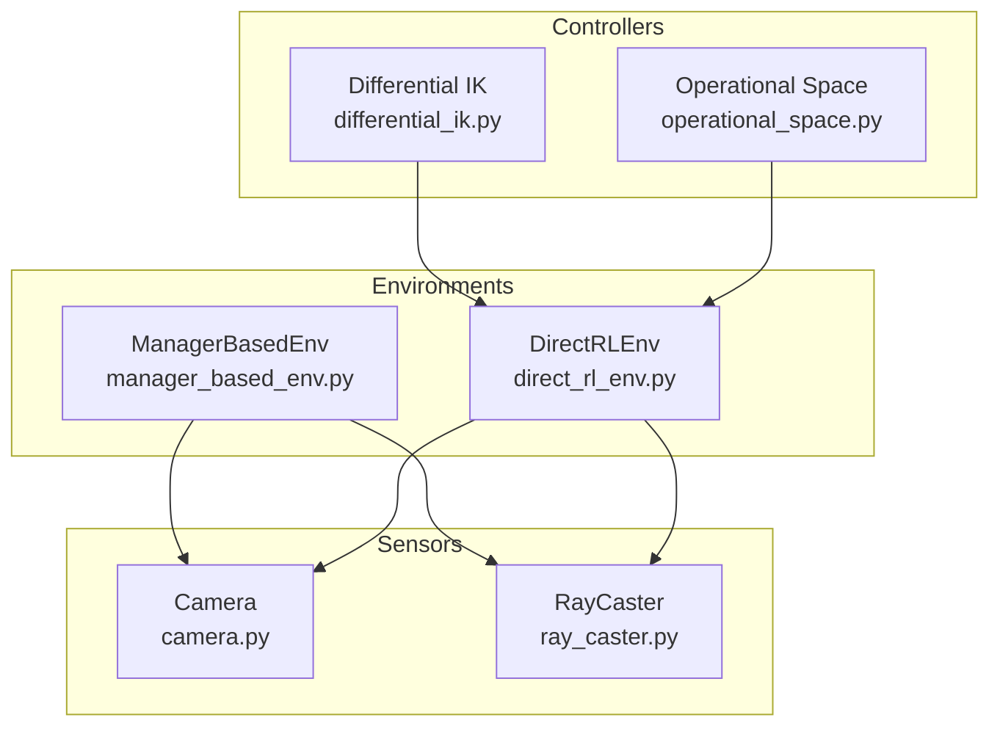
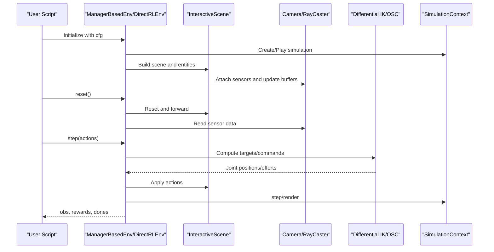
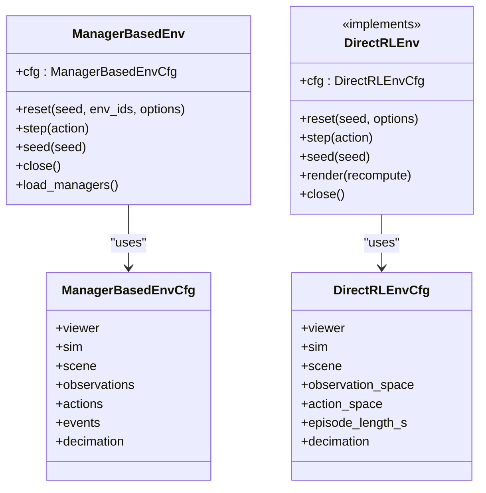
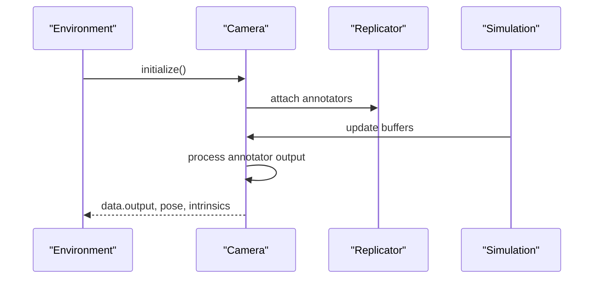
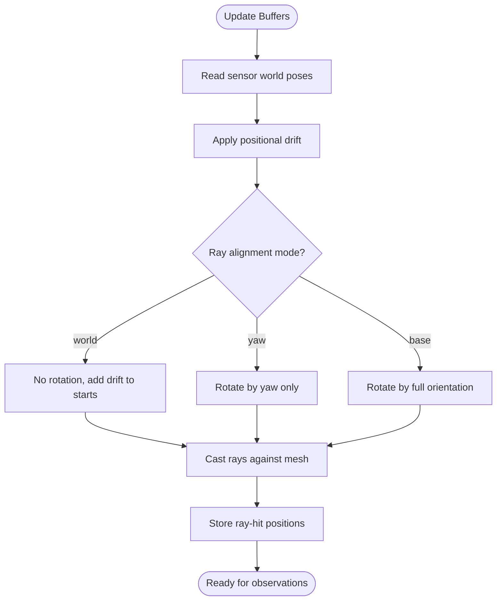
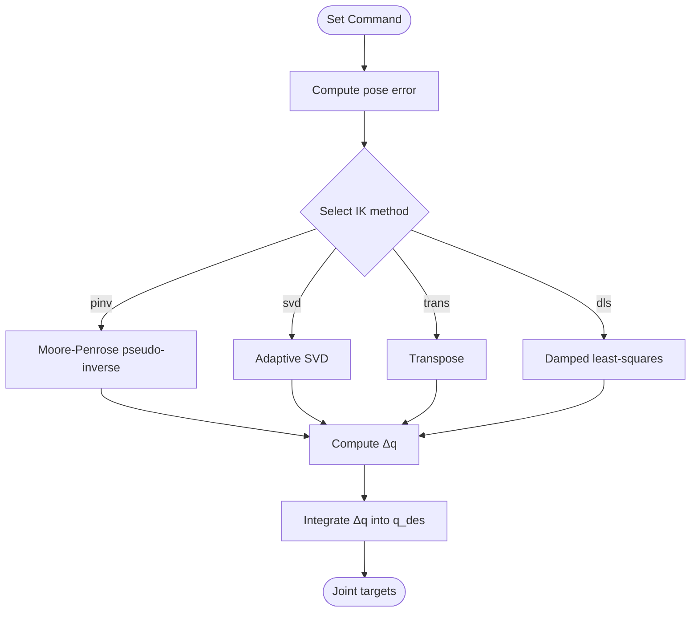
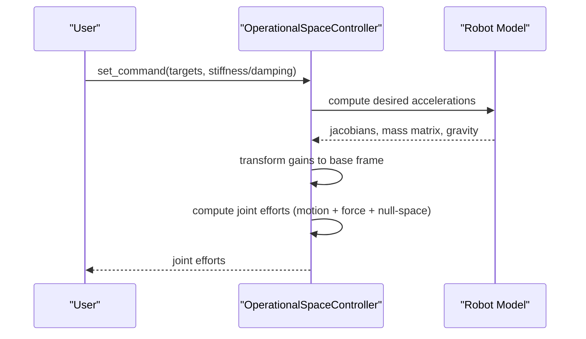
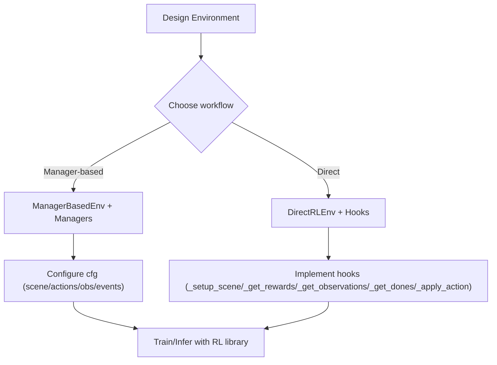
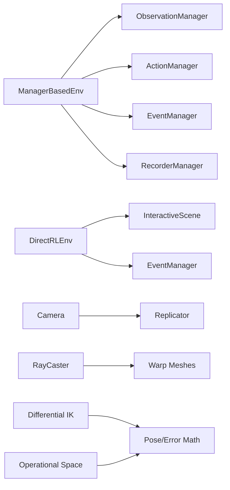

# Sensor and Control System Tutorials

<cite>
**Referenced Files in This Document**
- [manager_based_env.py](file://source/isaaclab/isaaclab/envs/manager_based_env.py)
- [direct_rl_env.py](file://source/isaaclab/isaaclab/envs/direct_rl_env.py)
- [manager_based_env_cfg.py](file://source/isaaclab/isaaclab/envs/manager_based_env_cfg.py)
- [direct_rl_env_cfg.py](file://source/isaaclab/isaaclab/envs/direct_rl_env_cfg.py)
- [camera.py](file://source/isaaclab/isaaclab/sensors/camera/camera.py)
- [ray_caster.py](file://source/isaaclab/isaaclab/sensors/ray_caster/ray_caster.py)
- [differential_ik.py](file://source/isaaclab/isaaclab/controllers/differential_ik.py)
- [operational_space.py](file://source/isaaclab/isaaclab/controllers/operational_space.py)
- [create_manager_base_env.rst](file://docs/source/tutorials/03_envs/create_manager_base_env.rst)
- [create_direct_rl_env.rst](file://docs/source/tutorials/03_envs/create_direct_rl_env.rst)
- [add_sensors_on_robot.rst](file://docs/source/tutorials/04_sensors/add_sensors_on_robot.rst)
- [run_diff_ik.rst](file://docs/source/tutorials/05_controllers/run_diff_ik.rst)
- [run_osc.rst](file://docs/source/tutorials/05_controllers/run_osc.rst)
</cite>

## Table of Contents
1. [Introduction](#introduction)
2. [Project Structure](#project-structure)
3. [Core Components](#core-components)
4. [Architecture Overview](#architecture-overview)
5. [Detailed Component Analysis](#detailed-component-analysis)
6. [Dependency Analysis](#dependency-analysis)
7. [Performance Considerations](#performance-considerations)
8. [Troubleshooting Guide](#troubleshooting-guide)
9. [Conclusion](#conclusion)
10. [Appendices](#appendices)

## Introduction
This document provides comprehensive tutorials for integrating sensors and implementing control systems in research-grade robotics simulations. It covers the complete workflow from environment design to advanced control techniques, focusing on:
- ManagerBasedEnv and DirectRLEnv classes for environment configuration and RL integration
- Sensor integration patterns for Camera and RayCaster, including placement strategies and calibration
- Control system tutorials for differential IK and operational space control
- Step-by-step guides for environment modification, reward customization, and policy inference in USD
- Examples of sensor fusion, control parameter tuning, and performance optimization
- Common integration challenges, debugging techniques, and best practices

## Project Structure
The repository organizes core simulation components into modular packages:
- Environment abstractions: ManagerBasedEnv and DirectRLEnv
- Sensor implementations: Camera and RayCaster
- Controllers: Differential IK and Operational Space Control
- Tutorials and documentation for environment design, sensor integration, and control usage



**Diagram sources**
- [manager_based_env.py:30-561](file://source/isaaclab/isaaclab/envs/manager_based_env.py#L30-L561)
- [direct_rl_env.py:40-697](file://source/isaaclab/isaaclab/envs/direct_rl_env.py#L40-L697)
- [camera.py:40-720](file://source/isaaclab/isaaclab/sensors/camera/camera.py#L40-L720)
- [ray_caster.py:35-335](file://source/isaaclab/isaaclab/sensors/ray_caster/ray_caster.py#L35-L335)
- [differential_ik.py:17-241](file://source/isaaclab/isaaclab/controllers/differential_ik.py#L17-L241)
- [operational_space.py:23-549](file://source/isaaclab/isaaclab/controllers/operational_space.py#L23-L549)

**Section sources**
- [manager_based_env.py:30-561](file://source/isaaclab/isaaclab/envs/manager_based_env.py#L30-L561)
- [direct_rl_env.py:40-697](file://source/isaaclab/isaaclab/envs/direct_rl_env.py#L40-L697)
- [camera.py:40-720](file://source/isaaclab/isaaclab/sensors/camera/camera.py#L40-L720)
- [ray_caster.py:35-335](file://source/isaaclab/isaaclab/sensors/ray_caster/ray_caster.py#L35-L335)
- [differential_ik.py:17-241](file://source/isaaclab/isaaclab/controllers/differential_ik.py#L17-L241)
- [operational_space.py:23-549](file://source/isaaclab/isaaclab/controllers/operational_space.py#L23-L549)

## Core Components
This section introduces the primary building blocks for environment design and control.

- ManagerBasedEnv
  - Base environment that encapsulates simulation scene and managers for observation, action, events, and recording
  - Provides deterministic setup, device configuration, and time-stepping mechanics
  - Supports UI live visualization and IO descriptor export for policy deployment

- DirectRLEnv
  - Direct workflow environment for RL tasks with full control over reward, observation, and reset logic
  - Exposes hooks for scene setup, action application, reward computation, and done conditions
  - Integrates with gymnasium-compatible RL libraries

- SensorBase Implementations
  - Camera: RGB/depth/segmentation acquisition via USD camera and Replicator API
  - RayCaster: Physics-based ray-casting for terrain height and collision detection

- Controllers
  - Differential IK: Task-space pose tracking with multiple pseudo-inverse methods
  - Operational Space Control: Combined motion/force control with inertia decoupling and null-space management

**Section sources**
- [manager_based_env.py:30-561](file://source/isaaclab/isaaclab/envs/manager_based_env.py#L30-L561)
- [direct_rl_env.py:40-697](file://source/isaaclab/isaaclab/envs/direct_rl_env.py#L40-L697)
- [camera.py:40-720](file://source/isaaclab/isaaclab/sensors/camera/camera.py#L40-L720)
- [ray_caster.py:35-335](file://source/isaaclab/isaaclab/sensors/ray_caster/ray_caster.py#L35-L335)
- [differential_ik.py:17-241](file://source/isaaclab/isaaclab/controllers/differential_ik.py#L17-L241)
- [operational_space.py:23-549](file://source/isaaclab/isaaclab/controllers/operational_space.py#L23-L549)

## Architecture Overview
The system architecture connects environment managers with sensors and controllers to form a cohesive RL/teleoperation pipeline.



**Diagram sources**
- [manager_based_env.py:427-477](file://source/isaaclab/isaaclab/envs/manager_based_env.py#L427-L477)
- [direct_rl_env.py:313-400](file://source/isaaclab/isaaclab/envs/direct_rl_env.py#L313-L400)
- [camera.py:382-531](file://source/isaaclab/isaaclab/sensors/camera/camera.py#L382-L531)
- [ray_caster.py:232-305](file://source/isaaclab/isaaclab/sensors/ray_caster/ray_caster.py#L232-L305)
- [differential_ik.py:148-174](file://source/isaaclab/isaaclab/controllers/differential_ik.py#L148-L174)
- [operational_space.py:345-396](file://source/isaaclab/isaaclab/controllers/operational_space.py#L345-L396)

## Detailed Component Analysis

### ManagerBasedEnv and DirectRLEnv
- ManagerBasedEnv
  - Manages scene creation, event scheduling, observation/action/recording managers
  - Handles decimation-based stepping and render timing
  - Supports IO descriptor export for policy deployment workflows

- DirectRLEnv
  - Requires user-implemented hooks for scene setup, actions, rewards, and observations
  - Provides deterministic seeds, noise models, and gymnasium metadata
  - Supports finite/infinite horizon episode handling



**Diagram sources**
- [manager_based_env.py:71-561](file://source/isaaclab/isaaclab/envs/manager_based_env.py#L71-L561)
- [direct_rl_env.py:73-697](file://source/isaaclab/isaaclab/envs/direct_rl_env.py#L73-L697)
- [manager_based_env_cfg.py:39-134](file://source/isaaclab/isaaclab/envs/manager_based_env_cfg.py#L39-L134)
- [direct_rl_env_cfg.py:19-232](file://source/isaaclab/isaaclab/envs/direct_rl_env_cfg.py#L19-L232)

**Section sources**
- [manager_based_env.py:71-561](file://source/isaaclab/isaaclab/envs/manager_based_env.py#L71-L561)
- [direct_rl_env.py:73-697](file://source/isaaclab/isaaclab/envs/direct_rl_env.py#L73-L697)
- [manager_based_env_cfg.py:39-134](file://source/isaaclab/isaaclab/envs/manager_based_env_cfg.py#L39-L134)
- [direct_rl_env_cfg.py:19-232](file://source/isaaclab/isaaclab/envs/direct_rl_env_cfg.py#L19-L232)

### Sensor Integration Patterns

#### Camera Sensor
- Wraps USDGeom Camera and Replicator annotators for RGB, depth, normals, segmentation
- Supports intrinsic matrix calibration and pose setting in multiple conventions
- Provides per-sensor update periods and debug visualization



**Diagram sources**
- [camera.py:382-531](file://source/isaaclab/isaaclab/sensors/camera/camera.py#L382-L531)
- [camera.py:556-708](file://source/isaaclab/isaaclab/sensors/camera/camera.py#L556-L708)

#### RayCaster Sensor
- Virtual sensor using Warp ray-casting kernels against static meshes
- Supports configurable ray patterns, alignment modes (world/yaw/base), and drift
- Visualizes ray hits for debugging



**Diagram sources**
- [ray_caster.py:232-305](file://source/isaaclab/isaaclab/sensors/ray_caster/ray_caster.py#L232-L305)

**Section sources**
- [camera.py:40-720](file://source/isaaclab/isaaclab/sensors/camera/camera.py#L40-L720)
- [ray_caster.py:35-335](file://source/isaaclab/isaaclab/sensors/ray_caster/ray_caster.py#L35-L335)

### Control System Tutorials

#### Differential IK
- Computes desired joint positions to track end-effector pose using pseudo-inverse, SVD, transpose, or damped least-squares
- Supports absolute and relative pose commands with configurable gains



**Diagram sources**
- [differential_ik.py:180-241](file://source/isaaclab/isaaclab/controllers/differential_ik.py#L180-L241)

#### Operational Space Control
- Enables combined motion/force control in task space with inertia decoupling and null-space management
- Supports variable stiffness/damping and closed-loop force control



**Diagram sources**
- [operational_space.py:345-549](file://source/isaaclab/isaaclab/controllers/operational_space.py#L345-L549)

**Section sources**
- [differential_ik.py:17-241](file://source/isaaclab/isaaclab/controllers/differential_ik.py#L17-L241)
- [operational_space.py:23-549](file://source/isaaclab/isaaclab/controllers/operational_space.py#L23-L549)

### Environment Modification and RL Integration
- Manager-based environments: Configure scene, actions, observations, and events via configuration classes; leverage managers for modular behavior
- Direct RL environments: Implement hooks for scene setup, actions, rewards, observations, and resets; integrate with gymnasium-compatible RL frameworks



**Diagram sources**
- [create_manager_base_env.rst:1-221](file://docs/source/tutorials/03_envs/create_manager_base_env.rst#L1-L221)
- [create_direct_rl_env.rst:1-340](file://docs/source/tutorials/03_envs/create_direct_rl_env.rst#L1-L340)

**Section sources**
- [create_manager_base_env.rst:1-221](file://docs/source/tutorials/03_envs/create_manager_base_env.rst#L1-L221)
- [create_direct_rl_env.rst:1-340](file://docs/source/tutorials/03_envs/create_direct_rl_env.rst#L1-L340)

### Sensor Fusion, Reward Customization, and Policy Inference in USD
- Sensor fusion: Combine Camera RGB/depth with RayCaster height scans to build richer observations; align sensor frames and calibrate intrinsics
- Reward customization: Define reward terms in DirectRLEnv; use noise models for action/observation robustness
- Policy inference in USD: Export IO descriptors and use them for policy deployment workflows

```mermaid
graph TB
subgraph "Sensors"
Cam["Camera"]
RC["RayCaster"]
end
subgraph "Fusion"
Fuse["Sensor Fusion Layer"]
end
subgraph "Policy"
Policy["Policy Network"]
IO["IO Descriptors"]
end
Cam --> Fuse
RC --> Fuse
Fuse --> Policy
Policy --> IO
```

**Diagram sources**
- [camera.py:223-280](file://source/isaaclab/isaaclab/sensors/camera/camera.py#L223-L280)
- [ray_caster.py:212-231](file://source/isaaclab/isaaclab/sensors/ray_caster/ray_caster.py#L212-L231)
- [manager_based_env.py:228-266](file://source/isaaclab/isaaclab/envs/manager_based_env.py#L228-L266)

**Section sources**
- [camera.py:223-280](file://source/isaaclab/isaaclab/sensors/camera/camera.py#L223-L280)
- [ray_caster.py:212-231](file://source/isaaclab/isaaclab/sensors/ray_caster/ray_caster.py#L212-L231)
- [manager_based_env.py:228-266](file://source/isaaclab/isaaclab/envs/manager_based_env.py#L228-L266)

## Dependency Analysis
The following diagram highlights key dependencies among environment classes, sensors, and controllers.



**Diagram sources**
- [manager_based_env.py:271-305](file://source/isaaclab/isaaclab/envs/manager_based_env.py#L271-L305)
- [direct_rl_env.py:144-153](file://source/isaaclab/isaaclab/envs/direct_rl_env.py#L144-L153)
- [camera.py:399-487](file://source/isaaclab/isaaclab/sensors/camera/camera.py#L399-L487)
- [ray_caster.py:162-211](file://source/isaaclab/isaaclab/sensors/ray_caster/ray_caster.py#L162-L211)
- [differential_ik.py:11-11](file://source/isaaclab/isaaclab/controllers/differential_ik.py#L11-L11)
- [operational_space.py:11-17](file://source/isaaclab/isaaclab/controllers/operational_space.py#L11-L17)

**Section sources**
- [manager_based_env.py:271-305](file://source/isaaclab/isaaclab/envs/manager_based_env.py#L271-L305)
- [direct_rl_env.py:144-153](file://source/isaaclab/isaaclab/envs/direct_rl_env.py#L144-L153)
- [camera.py:399-487](file://source/isaaclab/isaaclab/sensors/camera/camera.py#L399-L487)
- [ray_caster.py:162-211](file://source/isaaclab/isaaclab/sensors/ray_caster/ray_caster.py#L162-L211)
- [differential_ik.py:11-11](file://source/isaaclab/isaaclab/controllers/differential_ik.py#L11-L11)
- [operational_space.py:11-17](file://source/isaaclab/isaaclab/controllers/operational_space.py#L11-L17)

## Performance Considerations
- Decimation and render intervals: Tune decimation to balance control frequency and simulation stability; adjust render_interval to reduce rendering overhead
- Sensor update rates: Lower update periods for sensors that do not require high-frequency updates
- Batched computations: Use vectorized operations and device-aware buffers to minimize CPU/GPU transfers
- Memory management: Disable instancing for specific segmentation outputs when required by the simulator version
- Inertia decoupling: Enable partial/full inertia decoupling in OSC for accurate motion control at higher speeds

[No sources needed since this section provides general guidance]

## Troubleshooting Guide
- Cameras not initializing: Ensure the --enable_cameras flag is set; verify camera prim paths and data types
- RayCaster misalignment: Use ray_alignment modes ("world"/"yaw"/"base") and verify drift ranges
- IK solver failures: Switch IK method (pinv/svd/trans/dls); adjust damping/gains; ensure proper command frames
- OSC null-space errors: Confirm robot redundancy and provide required mass matrix/inverse for dynamically consistent pseudo-inverse
- Deterministic runs: Set seeds in environment configs; avoid autograd overhead by using inference contexts

**Section sources**
- [camera.py:392-397](file://source/isaaclab/isaaclab/sensors/camera/camera.py#L392-L397)
- [ray_caster.py:254-292](file://source/isaaclab/isaaclab/sensors/ray_caster/ray_caster.py#L254-L292)
- [differential_ik.py:194-238](file://source/isaaclab/isaaclab/controllers/differential_ik.py#L194-L238)
- [operational_space.py:496-503](file://source/isaaclab/isaaclab/controllers/operational_space.py#L496-L503)

## Conclusion
This guide demonstrated how to build research-grade control systems using ManagerBasedEnv and DirectRLEnv, integrate Camera and RayCaster sensors, and implement differential IK and operational space control. By following the step-by-step tutorials and leveraging the provided patterns for sensor fusion, reward customization, and policy deployment, you can develop robust, high-performance robotic simulations.

[No sources needed since this section summarizes without analyzing specific files]

## Appendices

### Practical Tutorials Index
- Environment design: Manager-based and Direct workflows
- Sensor integration: Camera and RayCaster placement and calibration
- Control: Differential IK and Operational Space Control
- Deployment: IO descriptors and policy inference in USD

**Section sources**
- [create_manager_base_env.rst:1-221](file://docs/source/tutorials/03_envs/create_manager_base_env.rst#L1-L221)
- [create_direct_rl_env.rst:1-340](file://docs/source/tutorials/03_envs/create_direct_rl_env.rst#L1-L340)
- [add_sensors_on_robot.rst:1-211](file://docs/source/tutorials/04_sensors/add_sensors_on_robot.rst#L1-L211)
- [run_diff_ik.rst:1-160](file://docs/source/tutorials/05_controllers/run_diff_ik.rst#L1-L160)
- [run_osc.rst:1-192](file://docs/source/tutorials/05_controllers/run_osc.rst#L1-L192)