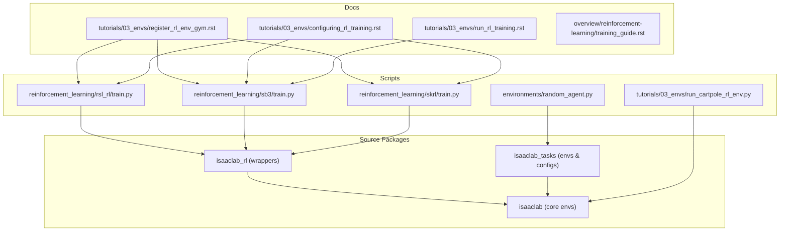
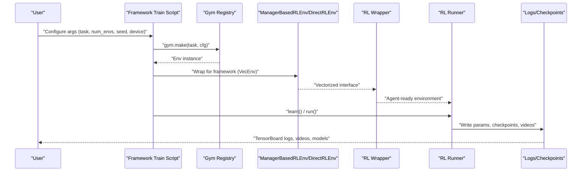
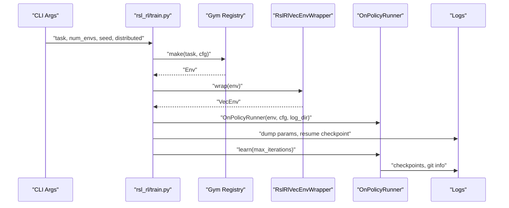
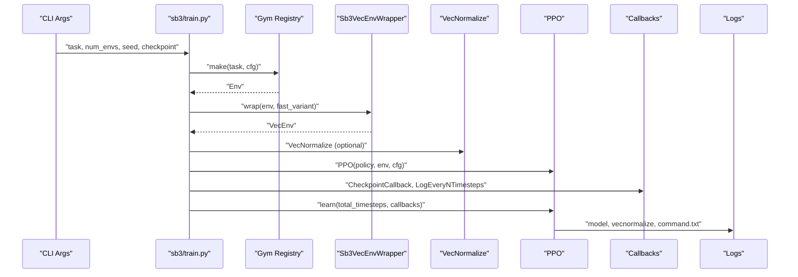
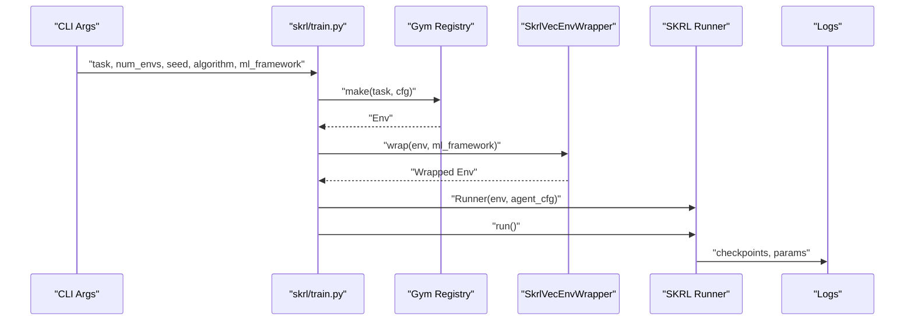
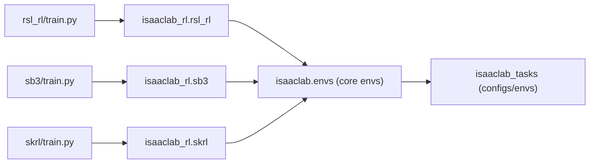

# Training and Experimentation Tutorials

<cite>
**Referenced Files in This Document**
- [configuring_rl_training.rst](file://docs/source/tutorials/03_envs/configuring_rl_training.rst)
- [register_rl_env_gym.rst](file://docs/source/tutorials/03_envs/register_rl_env_gym.rst)
- [run_rl_training.rst](file://docs/source/tutorials/03_envs/run_rl_training.rst)
- [training_guide.rst](file://docs/source/overview/reinforcement-learning/training_guide.rst)
- [rsl_rl/train.py](file://scripts/reinforcement_learning/rsl_rl/train.py)
- [sb3/train.py](file://scripts/reinforcement_learning/sb3/train.py)
- [skrl/train.py](file://scripts/reinforcement_learning/skrl/train.py)
- [rsl_rl/cli_args.py](file://scripts/reinforcement_learning/rsl_rl/cli_args.py)
- [isaaclab_rl.rst](file://source/isaaclab_rl/isaaclab_rl.rst)
- [isaaclab_rl/__init__.py](file://source/isaaclab_rl/__init__.py)
- [isaaclab_rl/sb3.py](file://source/isaaclab_rl/sb3.py)
- [isaaclab_rl/skrl.py](file://source/isaaclab_rl/skrl.py)
- [isaaclab_rl/rsl_rl.py](file://source/isaaclab_rl/rsl_rl.py)
- [isaaclab_rl/test_rl_games_wrapper.py](file://source/isaaclab_rl/test_rl_games_wrapper.py)
- [isaaclab_rl/test_rsl_rl_wrapper.py](file://source/isaaclab_rl/test_rsl_rl_wrapper.py)
- [isaaclab_rl/test_sb3_wrapper.py](file://source/isaaclab_rl/test_sb3_wrapper.py)
- [isaaclab_rl/test_skrl_wrapper.py](file://source/isaaclab_rl/test_skrl_wrapper.py)
- [isaaclab_tasks/manager_based/classic/cartpole/__init__.py](file://source/isaaclab_tasks/isaaclab_tasks/manager_based/classic/cartpole/__init__.py)
- [isaaclab_tasks/direct/cartpole/__init__.py](file://source/isaaclab_tasks/isaaclab_tasks/direct/cartpole/__init__.py)
- [environments/random_agent.py](file://scripts/environments/random_agent.py)
- [tutorials/03_envs/run_cartpole_rl_env.py](file://scripts/tutorials/03_envs/run_cartpole_rl_env.py)
- [docker/utils/container.py](file://docker/utils/container.py)
- [docker/docker-compose.yaml](file://docker/docker-compose.yaml)
- [docker/cluster/submit_job_slurm.sh](file://docker/cluster/submit_job_slurm.sh)
- [docker/cluster/submit_job_pbs.sh](file://docker/cluster/submit_job_pbs.sh)
- [docker/cluster/run_singularity.sh](file://docker/cluster/run_singularity.sh)
- [docker/cluster/cluster_interface.sh](file://docker/cluster/cluster_interface.sh)
</cite>

## Table of Contents
1. [Introduction](#introduction)
2. [Project Structure](#project-structure)
3. [Core Components](#core-components)
4. [Architecture Overview](#architecture-overview)
5. [Detailed Component Analysis](#detailed-component-analysis)
6. [Dependency Analysis](#dependency-analysis)
7. [Performance Considerations](#performance-considerations)
8. [Troubleshooting Guide](#troubleshooting-guide)
9. [Conclusion](#conclusion)
10. [Appendices](#appendices)

## Introduction
This document provides end-to-end tutorials for training and experimentation workflows with reinforcement learning in the project. It covers environment configuration and registration with Gym interfaces, training pipeline orchestration across multiple RL frameworks (RSL-RL, Stable-Baselines3, SKRL), and practical guidance for hyperparameter configuration, monitoring, experiment management, checkpoint handling, and result analysis. It also includes step-by-step recipes for environment modification, reward engineering, and curriculum learning, along with troubleshooting and best practices for reproducible research.

## Project Structure
The repository organizes RL training under:
- Docs: Tutorials and overviews for environment registration, training configuration, and debugging.
- Scripts: Framework-specific training and evaluation scripts plus utilities.
- Source packages: Core environment abstractions, task definitions, and RL wrappers.

**Diagram sources**
- [register_rl_env_gym.rst:1-173](file://docs/source/tutorials/03_envs/register_rl_env_gym.rst#L1-L173)
- [configuring_rl_training.rst:1-141](file://docs/source/tutorials/03_envs/configuring_rl_training.rst#L1-L141)
- [run_rl_training.rst:1-157](file://docs/source/tutorials/03_envs/run_rl_training.rst#L1-L157)
- [training_guide.rst:1-164](file://docs/source/overview/reinforcement-learning/training_guide.rst#L1-L164)
- [rsl_rl/train.py:1-220](file://scripts/reinforcement_learning/rsl_rl/train.py#L1-L220)
- [sb3/train.py:1-230](file://scripts/reinforcement_learning/sb3/train.py#L1-L230)
- [skrl/train.py:1-228](file://scripts/reinforcement_learning/skrl/train.py#L1-L228)
- [isaaclab_rl.rst](file://source/isaaclab_rl/isaaclab_rl.rst)
- [isaaclab_tasks/manager_based/classic/cartpole/__init__.py](file://source/isaaclab_tasks/isaaclab_tasks/manager_based/classic/cartpole/__init__.py)
- [isaaclab_tasks/direct/cartpole/__init__.py](file://source/isaaclab_tasks/isaaclab_tasks/direct/cartpole/__init__.py)
- [environments/random_agent.py:1-173](file://scripts/environments/random_agent.py#L1-L173)

**Section sources**
- [register_rl_env_gym.rst:1-173](file://docs/source/tutorials/03_envs/register_rl_env_gym.rst#L1-L173)
- [configuring_rl_training.rst:1-141](file://docs/source/tutorials/03_envs/configuring_rl_training.rst#L1-L141)
- [run_rl_training.rst:1-157](file://docs/source/tutorials/03_envs/run_rl_training.rst#L1-L157)
- [training_guide.rst:1-164](file://docs/source/overview/reinforcement-learning/training_guide.rst#L1-L164)

## Core Components
- Environment registration and creation via Gym registry for manager-based and direct environments.
- Framework-specific training scripts orchestrating environment creation, wrapping, logging, checkpointing, and video recording.
- RL wrappers bridging the core environment to each library’s expected interface.
- Task configuration entry points stored in environment registrations to select agent configurations.

Key capabilities:
- Register environments with unique IDs and entry points.
- Instantiate vectorized environments with configurable seeds, devices, and rendering modes.
- Train with PPO and other algorithms using RSL-RL, SB3, and SKRL.
- Export IO descriptors, record videos, and manage experiment logs.

**Section sources**
- [register_rl_env_gym.rst:34-173](file://docs/source/tutorials/03_envs/register_rl_env_gym.rst#L34-L173)
- [configuring_rl_training.rst:16-141](file://docs/source/tutorials/03_envs/configuring_rl_training.rst#L16-L141)
- [run_rl_training.rst:34-157](file://docs/source/tutorials/03_envs/run_rl_training.rst#L34-L157)
- [rsl_rl/train.py:119-220](file://scripts/reinforcement_learning/rsl_rl/train.py#L119-L220)
- [sb3/train.py:104-230](file://scripts/reinforcement_learning/sb3/train.py#L104-L230)
- [skrl/train.py:124-228](file://scripts/reinforcement_learning/skrl/train.py#L124-L228)

## Architecture Overview
The training pipeline integrates environment registration, framework wrappers, and training runners. The following diagram maps the major components and their interactions.

**Diagram sources**
- [rsl_rl/train.py:166-209](file://scripts/reinforcement_learning/rsl_rl/train.py#L166-L209)
- [sb3/train.py:155-211](file://scripts/reinforcement_learning/sb3/train.py#L155-L211)
- [skrl/train.py:185-217](file://scripts/reinforcement_learning/skrl/train.py#L185-L217)
- [register_rl_env_gym.rst:120-142](file://docs/source/tutorials/03_envs/register_rl_env_gym.rst#L120-L142)

## Detailed Component Analysis

### Environment Registration with Gym Interfaces
- Manager-based environments: Registered with an entry point pointing to the manager-based RL environment class and include environment configuration entry points.
- Direct environments: Registered with the direct environment implementation class and differentiated by a “-Direct” suffix.
- Creating environments: Import the tasks package to populate the registry, then use gym.make with parsed CLI arguments.

Practical steps:
- Import the tasks package to trigger environment registration.
- Parse task name and optional overrides (e.g., number of environments, device).
- Create environment via gym.make and proceed with wrappers and training.

**Section sources**
- [register_rl_env_gym.rst:34-173](file://docs/source/tutorials/03_envs/register_rl_env_gym.rst#L34-L173)
- [isaaclab_tasks/manager_based/classic/cartpole/__init__.py:79-82](file://source/isaaclab_tasks/isaaclab_tasks/manager_based/classic/cartpole/__init__.py#L79-L82)
- [isaaclab_tasks/direct/cartpole/__init__.py:114-117](file://source/isaaclab_tasks/isaaclab_tasks/direct/cartpole/__init__.py#L114-L117)
- [environments/random_agent.py:127-140](file://scripts/environments/random_agent.py#L127-L140)

### RL Training Configuration and Orchestration
- Agent configuration entry points are stored in environment registrations under kwargs and selected via CLI arguments.
- Training scripts read the environment configuration and the agent configuration entry point, then construct the environment and runner.
- Logging, checkpointing, and video recording are integrated into each training script.

Key configuration patterns:
- Select agent configuration via CLI (e.g., rsl_rl_cfg_entry_point).
- Override runtime parameters (e.g., num_envs, seed, max_iterations).
- Export IO descriptors for manager-based environments.

**Section sources**
- [configuring_rl_training.rst:16-141](file://docs/source/tutorials/03_envs/configuring_rl_training.rst#L16-L141)
- [rsl_rl/train.py:119-220](file://scripts/reinforcement_learning/rsl_rl/train.py#L119-L220)
- [sb3/train.py:104-230](file://scripts/reinforcement_learning/sb3/train.py#L104-L230)
- [skrl/train.py:124-228](file://scripts/reinforcement_learning/skrl/train.py#L124-L228)

### RSL-RL Training Pipeline
- CLI parsing supports video recording, distributed training, and custom agent selection.
- Environment is wrapped with RSL-RL’s vectorized environment wrapper and optionally recorded to video.
- Runner is instantiated with agent configuration and logs are written to a timestamped directory.

**Diagram sources**
- [rsl_rl/train.py:30-220](file://scripts/reinforcement_learning/rsl_rl/train.py#L30-L220)

**Section sources**
- [rsl_rl/train.py:30-220](file://scripts/reinforcement_learning/rsl_rl/train.py#L30-L220)
- [rsl_rl/cli_args.py](file://scripts/reinforcement_learning/rsl_rl/cli_args.py)

### Stable-Baselines3 Training Pipeline
- CLI supports video recording, normalization options, and checkpoint resumption.
- Environment is wrapped with SB3’s vectorized environment wrapper; optional VecNormalize normalization is applied.
- PPO agent is created and trained with callbacks for periodic checkpointing and logging.

**Diagram sources**
- [sb3/train.py:104-230](file://scripts/reinforcement_learning/sb3/train.py#L104-L230)

**Section sources**
- [sb3/train.py:104-230](file://scripts/reinforcement_learning/sb3/train.py#L104-L230)

### SKRL Training Pipeline
- CLI supports algorithm selection (PPO, IPPO, MAPPO, AMP), ML framework choice (torch, jax), and distributed training.
- Environment is wrapped with SKRL’s vectorized environment wrapper; runner is configured according to agent configuration.
- Training is executed via SKRL’s Runner with optional checkpoint loading.

**Diagram sources**
- [skrl/train.py:124-228](file://scripts/reinforcement_learning/skrl/train.py#L124-L228)

**Section sources**
- [skrl/train.py:124-228](file://scripts/reinforcement_learning/skrl/train.py#L124-L228)

### Environment Modification and Reward Engineering
- Modify environment configurations to adjust reward terms, termination conditions, and observation spaces.
- Use environment registration kwargs to point to different agent configurations for comparative studies.
- For curriculum learning, progressively increase difficulty by adjusting task parameters (e.g., terrain, goal speed) and environment randomization.

Recommended practices:
- Keep environment modifications minimal and well-documented.
- Use environment randomization sparingly to avoid instability.
- Validate reward shaping with short runs before scaling up.

[No sources needed since this section provides general guidance]

### Experiment Management, Checkpoint Handling, and Result Analysis
- Logging directories are timestamped and include parameter dumps, checkpoints, and optional videos.
- Resume training from checkpoints using framework-specific loaders.
- Monitor training progress with TensorBoard and review saved videos for qualitative analysis.

**Section sources**
- [rsl_rl/train.py:145-209](file://scripts/reinforcement_learning/rsl_rl/train.py#L145-L209)
- [sb3/train.py:123-222](file://scripts/reinforcement_learning/sb3/train.py#L123-L222)
- [skrl/train.py:151-217](file://scripts/reinforcement_learning/skrl/train.py#L151-L217)
- [training_guide.rst:128-164](file://docs/source/overview/reinforcement-learning/training_guide.rst#L128-L164)

## Dependency Analysis
The RL training scripts depend on:
- Environment registration and task configuration entry points.
- RL wrappers provided by isaaclab_rl for each framework.
- Core environment classes from isaaclab (manager-based and direct RL environments).
- Optional IO descriptor export for manager-based environments.

**Diagram sources**
- [rsl_rl/train.py:105-106](file://scripts/reinforcement_learning/rsl_rl/train.py#L105-L106)
- [sb3/train.py:96-96](file://scripts/reinforcement_learning/sb3/train.py#L96-L96)
- [skrl/train.py:109-109](file://scripts/reinforcement_learning/skrl/train.py#L109-L109)
- [isaaclab_rl.rst](file://source/isaaclab_rl/isaaclab_rl.rst)

**Section sources**
- [isaaclab_rl.rst](file://source/isaaclab_rl/isaaclab_rl.rst)
- [isaaclab_rl/__init__.py](file://source/isaaclab_rl/__init__.py)
- [isaaclab_rl/sb3.py](file://source/isaaclab_rl/sb3.py)
- [isaaclab_rl/skrl.py](file://source/isaaclab_rl/skrl.py)
- [isaaclab_rl/rsl_rl.py](file://source/isaaclab_rl/rsl_rl.py)

## Performance Considerations
- Parallel environments: Increasing num_envs improves data throughput but increases memory and GPU/CPU demands. Simplify collision meshes and reduce rendering resolution to fit more environments.
- Rendering overhead: Prefer headless training; enable off-screen cameras only when necessary.
- Numerical stability: Tune physics parameters, action limits, and solver iterations to prevent NaNs and simulation instabilities.
- Hyperparameter tuning: Balance environment count against iteration time; consider multi-GPU or multi-node setups when memory constrains parallelism.

**Section sources**
- [training_guide.rst:11-51](file://docs/source/overview/reinforcement-learning/training_guide.rst#L11-L51)
- [training_guide.rst:53-62](file://docs/source/overview/reinforcement-learning/training_guide.rst#L53-L62)

## Troubleshooting Guide
Common issues and remedies:
- NaNs in observations: Verify physics parameters, action clipping, and reset states; reduce simulation timestep and increase solver iterations.
- Out-of-memory errors: Reduce num_envs, simplify meshes, disable rendering, or switch to headless mode.
- Version mismatches: Ensure RSL-RL and SKRL meet minimum supported versions; install required versions before training.
- Training stalls: Confirm environment seeds and device settings; validate that environment resets are deterministic.

Monitoring and logs:
- Use TensorBoard to track metrics and inspect training curves.
- Inspect saved videos for qualitative feedback on policy behavior.

**Section sources**
- [training_guide.rst:53-62](file://docs/source/overview/reinforcement-learning/training_guide.rst#L53-L62)
- [training_guide.rst:128-164](file://docs/source/overview/reinforcement-learning/training_guide.rst#L128-L164)
- [rsl_rl/train.py:63-84](file://scripts/reinforcement_learning/rsl_rl/train.py#L63-L84)
- [skrl/train.py:84-92](file://scripts/reinforcement_learning/skrl/train.py#L84-L92)

## Conclusion
This tutorial set demonstrates a complete RL workflow from environment registration to training across multiple frameworks. By leveraging Gym-compatible environments, framework-specific wrappers, and robust experiment management, researchers can rapidly prototype, iterate, and scale training runs. Adhering to best practices for reproducibility, performance, and troubleshooting ensures reliable and efficient research outcomes.

## Appendices

### Step-by-Step Training Recipes

- Configure and run SB3 PPO:
  - Prepare environment registration and agent configuration entry points.
  - Launch training with headless mode and optional video recording.
  - Monitor logs with TensorBoard and evaluate the trained agent.

  **Section sources**
  - [run_rl_training.rst:71-157](file://docs/source/tutorials/03_envs/run_rl_training.rst#L71-L157)
  - [sb3/train.py:104-230](file://scripts/reinforcement_learning/sb3/train.py#L104-L230)

- Configure and run RSL-RL PPO:
  - Select agent configuration entry point via CLI.
  - Enable video recording and export IO descriptors if needed.
  - Resume training from checkpoints and analyze logs.

  **Section sources**
  - [configuring_rl_training.rst:87-141](file://docs/source/tutorials/03_envs/configuring_rl_training.rst#L87-L141)
  - [rsl_rl/train.py:119-220](file://scripts/reinforcement_learning/rsl_rl/train.py#L119-L220)

- Configure and run SKRL PPO/IPPO/MAPPO/AMP:
  - Choose algorithm and ML framework (torch/jax).
  - Set distributed training and checkpoint paths.
  - Export parameters and review training logs.

  **Section sources**
  - [skrl/train.py:124-228](file://scripts/reinforcement_learning/skrl/train.py#L124-L228)

### Cluster and Containerization Notes
- Use containerization utilities and compose files for reproducible environments.
- Submit jobs to SLURM/PBS clusters and run Singularity containers for distributed training.

**Section sources**
- [docker/docker-compose.yaml](file://docker/docker-compose.yaml)
- [docker/cluster/submit_job_slurm.sh](file://docker/cluster/submit_job_slurm.sh)
- [docker/cluster/submit_job_pbs.sh](file://docker/cluster/submit_job_pbs.sh)
- [docker/cluster/run_singularity.sh](file://docker/cluster/run_singularity.sh)
- [docker/cluster/cluster_interface.sh](file://docker/cluster/cluster_interface.sh)
- [docker/utils/container.py](file://docker/utils/container.py)