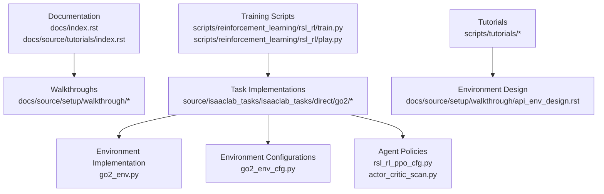
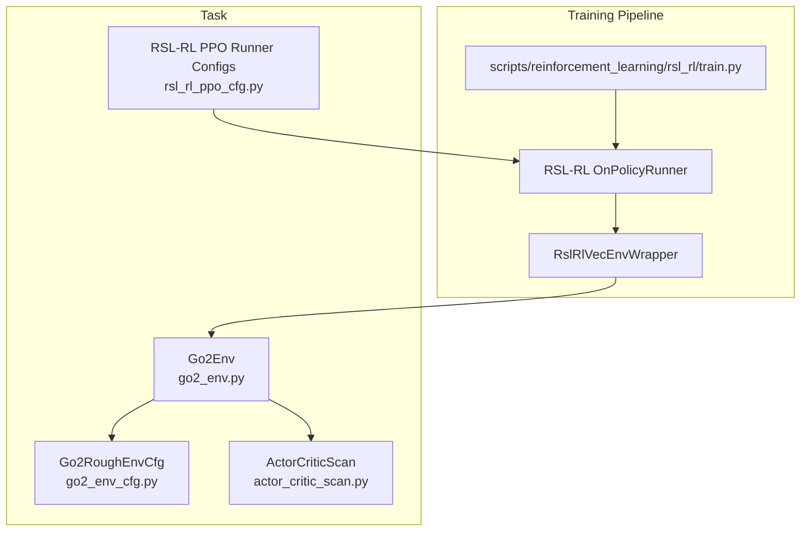
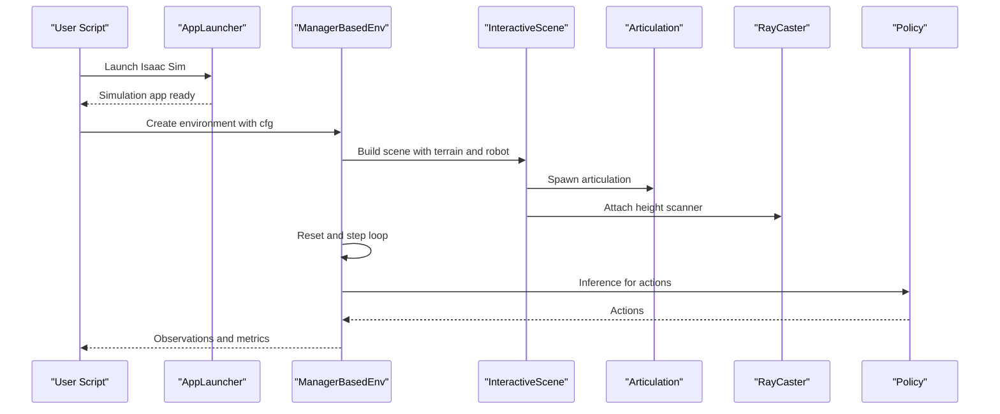
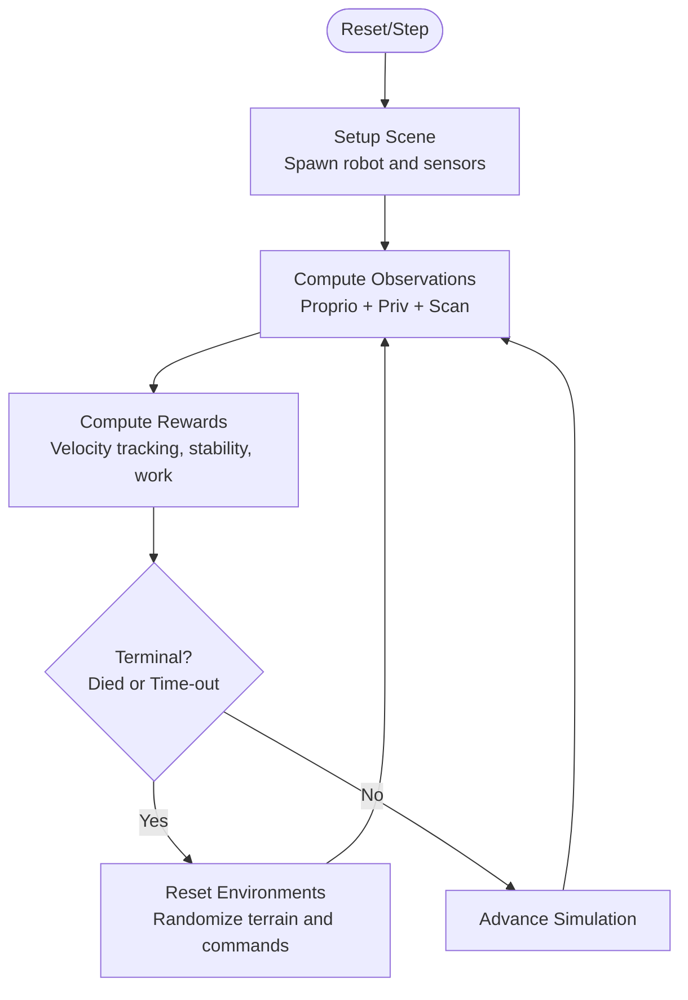
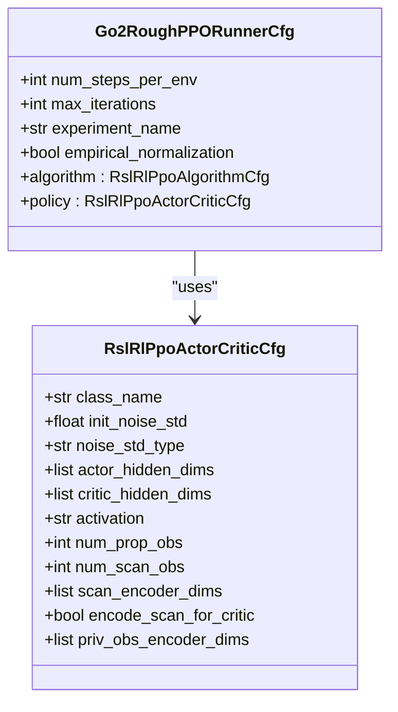
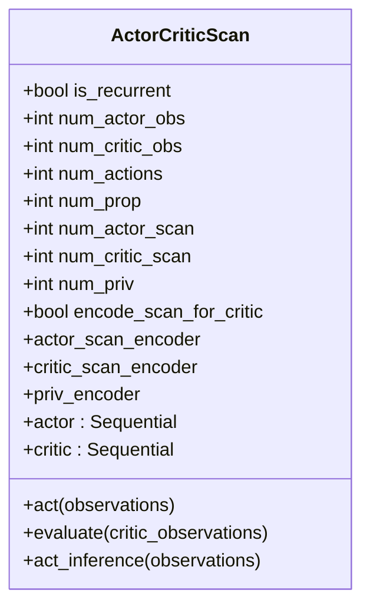
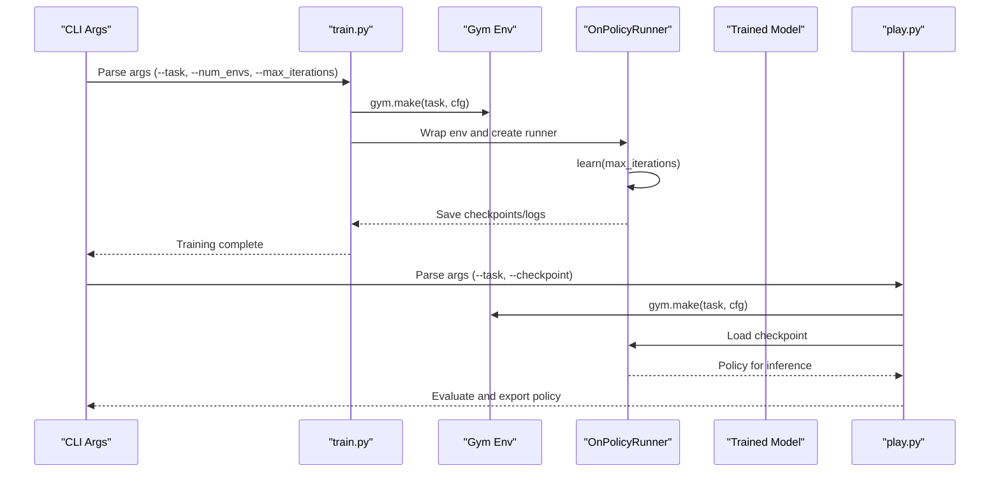
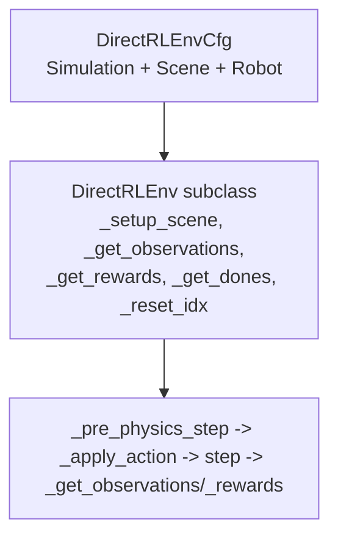
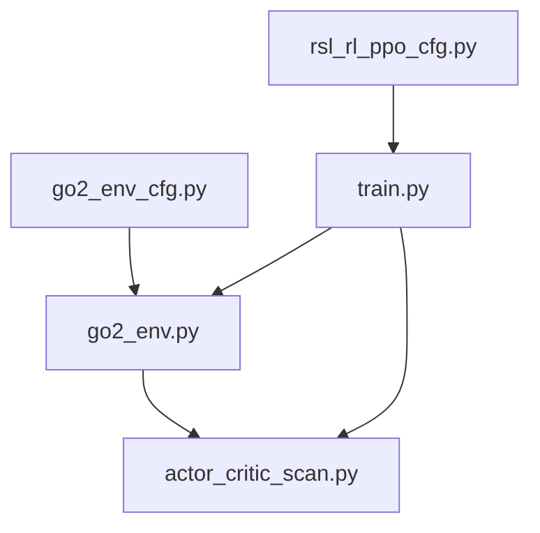

# Tutorials and Examples

<cite>
**Referenced Files in This Document**
- [README.md](file://README.md)
- [index.rst](file://docs/index.rst)
- [tutorials/index.rst](file://docs/source/tutorials/index.rst)
- [create_quadruped_base_env.py](file://scripts/tutorials/03_envs/create_quadruped_base_env.py)
- [go2_env_cfg.py](file://source/isaaclab_tasks/isaaclab_tasks/direct/go2/go2_env_cfg.py)
- [go2_env.py](file://source/isaaclab_tasks/isaaclab_tasks/direct/go2/go2_env.py)
- [rsl_rl_ppo_cfg.py](file://source/isaaclab_tasks/isaaclab_tasks/direct/go2/agents/rsl_rl_ppo_cfg.py)
- [actor_critic_scan.py](file://source/isaaclab_tasks/isaaclab_tasks/direct/go2/agents/actor_critic_scan.py)
- [project_setup.rst](file://docs/source/setup/walkthrough/project_setup.rst)
- [api_env_design.rst](file://docs/source/setup/walkthrough/api_env_design.rst)
- [train.py](file://scripts/reinforcement_learning/rsl_rl/train.py)
- [play.py](file://scripts/reinforcement_learning/rsl_rl/play.py)
</cite>

## Table of Contents
1. [Introduction](#introduction)
2. [Project Structure](#project-structure)
3. [Core Components](#core-components)
4. [Architecture Overview](#architecture-overview)
5. [Detailed Component Analysis](#detailed-component-analysis)
6. [Dependency Analysis](#dependency-analysis)
7. [Performance Considerations](#performance-considerations)
8. [Troubleshooting Guide](#troubleshooting-guide)
9. [Conclusion](#conclusion)
10. [Appendices](#appendices)

## Introduction
This document provides end-to-end tutorials and examples for setting up and operating the extreme quadruped parkour research workflow in Isaac Lab. It covers environment setup, asset integration, scene creation, environment configuration, training configuration, sensor integration, control system customization, experiment management, and advanced research methodologies. Practical examples demonstrate environment modification, reward function customization, and training pipeline configuration. The content is structured to be accessible to beginners, while offering intermediate and advanced customization paths for researchers.

## Project Structure
The repository organizes tutorials, documentation, training scripts, and task-specific environment and agent implementations. The key areas relevant to this tutorial are:
- Tutorials and walkthroughs for simulation setup, asset spawning, scene creation, environment design, sensor integration, and controller usage.
- Task-specific environment and agent implementations for the Go2 quadruped on rough terrain.
- Training and playback scripts for RSL-RL with ablation configurations.

**Diagram sources**
- [index.rst:1-176](file://docs/index.rst#L1-L176)
- [tutorials/index.rst:1-111](file://docs/source/tutorials/index.rst#L1-L111)
- [train.py:1-220](file://scripts/reinforcement_learning/rsl_rl/train.py#L1-L220)
- [play.py:1-206](file://scripts/reinforcement_learning/rsl_rl/play.py#L1-L206)
- [go2_env.py:1-635](file://source/isaaclab_tasks/isaaclab_tasks/direct/go2/go2_env.py#L1-L635)
- [go2_env_cfg.py:1-353](file://source/isaaclab_tasks/isaaclab_tasks/direct/go2/go2_env_cfg.py#L1-L353)
- [rsl_rl_ppo_cfg.py:1-155](file://source/isaaclab_tasks/isaaclab_tasks/direct/go2/agents/rsl_rl_ppo_cfg.py#L1-L155)
- [actor_critic_scan.py:1-262](file://source/isaaclab_tasks/isaaclab_tasks/direct/go2/agents/actor_critic_scan.py#L1-L262)

**Section sources**
- [index.rst:1-176](file://docs/index.rst#L1-L176)
- [tutorials/index.rst:1-111](file://docs/source/tutorials/index.rst#L1-L111)

## Core Components
This section highlights the core components used throughout the tutorials and examples:
- Environment configuration classes that define simulation, scene, robot, terrain, and reward parameters.
- Environment implementation that builds the scene, computes observations, rewards, termination conditions, and resets.
- Agent policy configurations and neural network architecture supporting scan and privileged observation encoders.
- Training and playback scripts orchestrating environment instantiation, policy training, and evaluation.

Key implementation references:
- Environment configuration: [Go2RoughEnvCfg:172-314](file://source/isaaclab_tasks/isaaclab_tasks/direct/go2/go2_env_cfg.py#L172-L314)
- Environment implementation: [Go2Env:20-635](file://source/isaaclab_tasks/isaaclab_tasks/direct/go2/go2_env.py#L20-L635)
- Policy configuration: [RSL-RL PPO Runner Configs:78-155](file://source/isaaclab_tasks/isaaclab_tasks/direct/go2/agents/rsl_rl_ppo_cfg.py#L78-L155)
- Neural network architecture: [ActorCriticScan:13-262](file://source/isaaclab_tasks/isaaclab_tasks/direct/go2/agents/actor_critic_scan.py#L13-L262)
- Training script: [train.py:119-213](file://scripts/reinforcement_learning/rsl_rl/train.py#L119-L213)
- Playback script: [play.py:93-200](file://scripts/reinforcement_learning/rsl_rl/play.py#L93-L200)

**Section sources**
- [go2_env_cfg.py:172-314](file://source/isaaclab_tasks/isaaclab_tasks/direct/go2/go2_env_cfg.py#L172-L314)
- [go2_env.py:20-635](file://source/isaaclab_tasks/isaaclab_tasks/direct/go2/go2_env.py#L20-L635)
- [rsl_rl_ppo_cfg.py:78-155](file://source/isaaclab_tasks/isaaclab_tasks/direct/go2/agents/rsl_rl_ppo_cfg.py#L78-L155)
- [actor_critic_scan.py:13-262](file://source/isaaclab_tasks/isaaclab_tasks/direct/go2/agents/actor_critic_scan.py#L13-L262)
- [train.py:119-213](file://scripts/reinforcement_learning/rsl_rl/train.py#L119-L213)
- [play.py:93-200](file://scripts/reinforcement_learning/rsl_rl/play.py#L93-L200)

## Architecture Overview
The system integrates environment configuration, environment implementation, sensor data, reward computation, and policy training. The training pipeline uses RSL-RL with configurable runner and agent policies.

**Diagram sources**
- [train.py:119-213](file://scripts/reinforcement_learning/rsl_rl/train.py#L119-L213)
- [go2_env_cfg.py:172-314](file://source/isaaclab_tasks/isaaclab_tasks/direct/go2/go2_env_cfg.py#L172-L314)
- [go2_env.py:20-635](file://source/isaaclab_tasks/isaaclab_tasks/direct/go2/go2_env.py#L20-L635)
- [rsl_rl_ppo_cfg.py:78-155](file://source/isaaclab_tasks/isaaclab_tasks/direct/go2/agents/rsl_rl_ppo_cfg.py#L78-L155)
- [actor_critic_scan.py:13-262](file://source/isaaclab_tasks/isaaclab_tasks/direct/go2/agents/actor_critic_scan.py#L13-L262)

**Section sources**
- [train.py:119-213](file://scripts/reinforcement_learning/rsl_rl/train.py#L119-L213)
- [go2_env_cfg.py:172-314](file://source/isaaclab_tasks/isaaclab_tasks/direct/go2/go2_env_cfg.py#L172-L314)
- [go2_env.py:20-635](file://source/isaaclab_tasks/isaaclab_tasks/direct/go2/go2_env.py#L20-L635)
- [rsl_rl_ppo_cfg.py:78-155](file://source/isaaclab_tasks/isaaclab_tasks/direct/go2/agents/rsl_rl_ppo_cfg.py#L78-L155)
- [actor_critic_scan.py:13-262](file://source/isaaclab_tasks/isaaclab_tasks/direct/go2/agents/actor_critic_scan.py#L13-L262)

## Detailed Component Analysis

### Environment Design and Configuration
This tutorial demonstrates creating a manager-based environment with a robot, terrain, and a height-scan sensor. It shows how to define scene entities, actions, observations, and event terms, and how to instantiate and run the environment with a policy.

**Diagram sources**
- [create_quadruped_base_env.py:204-245](file://scripts/tutorials/03_envs/create_quadruped_base_env.py#L204-L245)

**Section sources**
- [create_quadruped_base_env.py:1-246](file://scripts/tutorials/03_envs/create_quadruped_base_env.py#L1-L246)

### Environment Implementation Details
The environment implementation encapsulates:
- Scene setup with robot and sensors.
- Observation computation combining proprioceptive and scan data.
- Reward computation tailored for rough terrain parkour.
- Curriculum-based terrain difficulty progression.
- Reset logic and command generation.

**Diagram sources**
- [go2_env.py:212-635](file://source/isaaclab_tasks/isaaclab_tasks/direct/go2/go2_env.py#L212-L635)

**Section sources**
- [go2_env.py:212-635](file://source/isaaclab_tasks/isaaclab_tasks/direct/go2/go2_env.py#L212-L635)

### Training Configuration and Ablations
The training configuration supports multiple ablations by toggling scan usage and encoder architectures. The RSL-RL runner is configured with experiment names, iteration counts, normalization, and algorithm hyperparameters.

**Diagram sources**
- [rsl_rl_ppo_cfg.py:78-155](file://source/isaaclab_tasks/isaaclab_tasks/direct/go2/agents/rsl_rl_ppo_cfg.py#L78-L155)

**Section sources**
- [rsl_rl_ppo_cfg.py:78-155](file://source/isaaclab_tasks/isaaclab_tasks/direct/go2/agents/rsl_rl_ppo_cfg.py#L78-L155)

### Neural Network Architecture for Sensor Fusion
The policy network supports:
- Proprioceptive observations.
- Optional scan encoding for actor and/or critic.
- Optional privileged observation encoding for the critic.
- Independent encoder configurations for actor and critic scan inputs.

**Diagram sources**
- [actor_critic_scan.py:13-262](file://source/isaaclab_tasks/isaaclab_tasks/direct/go2/agents/actor_critic_scan.py#L13-L262)

**Section sources**
- [actor_critic_scan.py:13-262](file://source/isaaclab_tasks/isaaclab_tasks/direct/go2/agents/actor_critic_scan.py#L13-L262)

### Training and Playback Workflows
The training and playback scripts orchestrate environment creation, policy loading, and evaluation. They handle device selection, logging, checkpoint loading, and optional video recording.

**Diagram sources**
- [train.py:119-213](file://scripts/reinforcement_learning/rsl_rl/train.py#L119-L213)
- [play.py:93-200](file://scripts/reinforcement_learning/rsl_rl/play.py#L93-L200)

**Section sources**
- [train.py:119-213](file://scripts/reinforcement_learning/rsl_rl/train.py#L119-L213)
- [play.py:93-200](file://scripts/reinforcement_learning/rsl_rl/play.py#L93-L200)

### Environment Design Principles and API Usage
The environment design follows a configuration-driven approach:
- Simulation configuration controls time-stepping and rendering intervals.
- Scene configuration defines environment replication and spacing.
- Robot configuration uses asset definitions with prim-path replacement.
- Environment class implements lifecycle hooks for setup, action application, observation, reward, termination, and reset.

**Diagram sources**
- [api_env_design.rst:19-159](file://docs/source/setup/walkthrough/api_env_design.rst#L19-L159)

**Section sources**
- [api_env_design.rst:19-159](file://docs/source/setup/walkthrough/api_env_design.rst#L19-L159)

### Practical Examples and How-To Guides
- Project setup and task registration: [project_setup.rst:1-112](file://docs/source/setup/walkthrough/project_setup.rst#L1-L112)
- Environment walkthrough and API design: [api_env_design.rst:1-159](file://docs/source/setup/walkthrough/api_env_design.rst#L1-L159)
- Simulation setup tutorials: [tutorials/index.rst:19-33](file://docs/source/tutorials/index.rst#L19-L33)
- Asset integration tutorials: [tutorials/index.rst:34-51](file://docs/source/tutorials/index.rst#L34-L51)
- Scene creation tutorial: [tutorials/index.rst:52-64](file://docs/source/tutorials/index.rst#L52-L64)
- Environment design tutorials: [tutorials/index.rst:65-84](file://docs/source/tutorials/index.rst#L65-L84)
- Sensor integration tutorial: [tutorials/index.rst:86-98](file://docs/source/tutorials/index.rst#L86-L98)
- Controller tutorials: [tutorials/index.rst:99-111](file://docs/source/tutorials/index.rst#L99-L111)

**Section sources**
- [project_setup.rst:1-112](file://docs/source/setup/walkthrough/project_setup.rst#L1-L112)
- [api_env_design.rst:1-159](file://docs/source/setup/walkthrough/api_env_design.rst#L1-L159)
- [tutorials/index.rst:19-111](file://docs/source/tutorials/index.rst#L19-L111)

## Dependency Analysis
The training pipeline depends on:
- Environment configuration classes to define simulation and scene parameters.
- Environment implementation to compute observations, rewards, and resets.
- Agent policy configurations to define neural network architectures and training hyperparameters.
- RSL-RL runner to orchestrate training and evaluation.

**Diagram sources**
- [go2_env_cfg.py:172-314](file://source/isaaclab_tasks/isaaclab_tasks/direct/go2/go2_env_cfg.py#L172-L314)
- [go2_env.py:20-635](file://source/isaaclab_tasks/isaaclab_tasks/direct/go2/go2_env.py#L20-L635)
- [actor_critic_scan.py:13-262](file://source/isaaclab_tasks/isaaclab_tasks/direct/go2/agents/actor_critic_scan.py#L13-L262)
- [rsl_rl_ppo_cfg.py:78-155](file://source/isaaclab_tasks/isaaclab_tasks/direct/go2/agents/rsl_rl_ppo_cfg.py#L78-L155)
- [train.py:119-213](file://scripts/reinforcement_learning/rsl_rl/train.py#L119-L213)

**Section sources**
- [go2_env_cfg.py:172-314](file://source/isaaclab_tasks/isaaclab_tasks/direct/go2/go2_env_cfg.py#L172-L314)
- [go2_env.py:20-635](file://source/isaaclab_tasks/isaaclab_tasks/direct/go2/go2_env.py#L20-L635)
- [actor_critic_scan.py:13-262](file://source/isaaclab_tasks/isaaclab_tasks/direct/go2/agents/actor_critic_scan.py#L13-L262)
- [rsl_rl_ppo_cfg.py:78-155](file://source/isaaclab_tasks/isaaclab_tasks/direct/go2/agents/rsl_rl_ppo_cfg.py#L78-L155)
- [train.py:119-213](file://scripts/reinforcement_learning/rsl_rl/train.py#L119-L213)

## Performance Considerations
- Use headless mode for large-scale training to reduce rendering overhead.
- Adjust environment count and simulation parameters to balance throughput and stability.
- Optimize sensor update rates and observation concatenation order to minimize compute overhead.
- Leverage GPU devices and consider multi-GPU training for scalability.

[No sources needed since this section provides general guidance]

## Troubleshooting Guide
Common issues and resolutions:
- Environment registration errors: Ensure the task is registered via gym in the project’s initialization file before running training or playback scripts.
- Checkpoint loading failures: Verify the checkpoint path and experiment directory structure; confirm the correct task name and run/checkpoint identifiers.
- Simulation rendering or camera issues: Confirm rendering modes and camera enablement flags when recording videos.
- Policy export problems: Validate the policy network and normalizer compatibility for ONNX/JIT export.

**Section sources**
- [project_setup.rst:104-111](file://docs/source/setup/walkthrough/project_setup.rst#L104-L111)
- [play.py:114-170](file://scripts/reinforcement_learning/rsl_rl/play.py#L114-L170)

## Conclusion
This tutorial and example suite provides a complete workflow from environment setup to advanced research applications. It demonstrates how to configure environments, integrate sensors, customize reward functions, manage experiments, and scale training using RSL-RL. Researchers can use the provided ablation configurations and sensor fusion patterns as baselines and extend them for novel control systems and experimental designs.

[No sources needed since this section summarizes without analyzing specific files]

## Appendices

### Appendix A: Environment Modification Examples
- Modify observation composition by adjusting the observation groups and terms in the environment configuration.
- Customize reward scales and penalties to emphasize specific behaviors (e.g., stability, velocity tracking).
- Integrate additional sensors by extending the scene configuration and observation computation.

**Section sources**
- [go2_env_cfg.py:172-314](file://source/isaaclab_tasks/isaaclab_tasks/direct/go2/go2_env_cfg.py#L172-L314)
- [go2_env.py:293-355](file://source/isaaclab_tasks/isaaclab_tasks/direct/go2/go2_env.py#L293-L355)

### Appendix B: Training Pipeline Configuration
- Configure training iterations, batch sizes, and learning rates via the RSL-RL runner configuration.
- Select ablation variants by choosing the appropriate runner configuration and experiment name.
- Export trained policies for deployment using the provided export utilities.

**Section sources**
- [rsl_rl_ppo_cfg.py:78-155](file://source/isaaclab_tasks/isaaclab_tasks/direct/go2/agents/rsl_rl_ppo_cfg.py#L78-L155)
- [train.py:145-213](file://scripts/reinforcement_learning/rsl_rl/train.py#L145-L213)
- [play.py:165-170](file://scripts/reinforcement_learning/rsl_rl/play.py#L165-L170)

### Appendix C: Sensor Fusion and Control System Integration
- Height-scan sensor integration enables perception-based locomotion; adjust sensor parameters and observation concatenation order.
- Control system customization can be achieved by modifying action application and command generation logic in the environment.

**Section sources**
- [create_quadruped_base_env.py:104-112](file://scripts/tutorials/03_envs/create_quadruped_base_env.py#L104-L112)
- [go2_env.py:233-242](file://source/isaaclab_tasks/isaaclab_tasks/direct/go2/go2_env.py#L233-L242)