# Visualization and Analysis

<cite>
**Referenced Files in This Document**
- [record_demos.py](file://scripts/tools/record_demos.py)
- [replay_demos.py](file://scripts/tools/replay_demos.py)
- [hdf5_to_mp4.py](file://scripts/tools/hdf5_to_mp4.py)
- [mp4_to_hdf5.py](file://scripts/tools/mp4_to_hdf5.py)
- [merge_hdf5_datasets.py](file://scripts/tools/merge_hdf5_datasets.py)
- [benchmark_cameras.py](file://scripts/benchmarks/benchmark_cameras.py)
- [benchmark_load_robot.py](file://scripts/benchmarks/benchmark_load_robot.py)
- [robust_eval.py](file://scripts/imitation_learning/robomimic/robust_eval.py)
- [episode_data.py](file://source/isaaclab/isaaclab/utils/datasets/episode_data.py)
- [hdf5_dataset_file_handler.py](file://source/isaaclab/isaaclab/utils/datasets/hdf5_dataset_file_handler.py)
- [dataset_file_handler_base.py](file://source/isaaclab/isaaclab/utils/datasets/dataset_file_handler_base.py)
- [env_benchmark_test_utils.py](file://source/isaaclab_tasks/test/benchmarking/env_benchmark_test_utils.py)
- [forge_env.py](file://source/isaaclab_tasks/isaaclab_tasks/direct/forge/forge_env.py)
- [README.md](file://assets/videos/README.md)
</cite>

## Table of Contents
1. [Introduction](#introduction)
2. [Project Structure](#project-structure)
3. [Core Components](#core-components)
4. [Architecture Overview](#architecture-overview)
5. [Detailed Component Analysis](#detailed-component-analysis)
6. [Dependency Analysis](#dependency-analysis)
7. [Performance Considerations](#performance-considerations)
8. [Troubleshooting Guide](#troubleshooting-guide)
9. [Conclusion](#conclusion)
10. [Appendices](#appendices)

## Introduction
This document describes the Visualization and Analysis tools that support the ablation study framework. It covers:
- Video recording system for capturing agent demonstrations across different terrain types and ablation architectures
- Data export and analysis workflows including HDF5 dataset handling, video conversion procedures, and performance metrics extraction
- Benchmarking tools for camera performance, robot loading times, and simulation efficiency analysis
- Visualization pipeline for training progress monitoring, policy evaluation, and comparative analysis across ablation variants
- Statistical analysis procedures for comparing agent performance, significance testing, and result interpretation
- Practical examples of video capture configuration, data export workflows, and performance analysis procedures
- Visualization optimization, data storage strategies, and integration with external analysis tools

## Project Structure
The visualization and analysis capabilities are implemented across several modules:
- Tools for recording, replaying, converting, and merging datasets
- Benchmarks for camera and robot performance
- Dataset abstractions and handlers
- Evaluation and benchmarking utilities

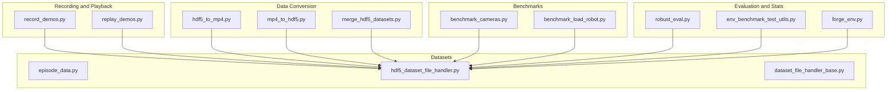

**Diagram sources**
- [record_demos.py:1-536](file://scripts/tools/record_demos.py#L1-L536)
- [replay_demos.py:1-248](file://scripts/tools/replay_demos.py#L1-L248)
- [hdf5_to_mp4.py:1-210](file://scripts/tools/hdf5_to_mp4.py#L1-L210)
- [mp4_to_hdf5.py:1-173](file://scripts/tools/mp4_to_hdf5.py#L1-L173)
- [merge_hdf5_datasets.py:1-47](file://scripts/tools/merge_hdf5_datasets.py#L1-L47)
- [benchmark_cameras.py:1-800](file://scripts/benchmarks/benchmark_cameras.py#L1-L800)
- [benchmark_load_robot.py:1-177](file://scripts/benchmarks/benchmark_load_robot.py#L1-L177)
- [episode_data.py:1-177](file://source/isaaclab/isaaclab/utils/datasets/episode_data.py#L1-L177)
- [hdf5_dataset_file_handler.py:1-197](file://source/isaaclab/isaaclab/utils/datasets/hdf5_dataset_file_handler.py#L1-L197)
- [dataset_file_handler_base.py:1-64](file://source/isaaclab/isaaclab/utils/datasets/dataset_file_handler_base.py#L1-L64)
- [robust_eval.py:140-216](file://scripts/imitation_learning/robomimic/robust_eval.py#L140-L216)
- [env_benchmark_test_utils.py:66-133](file://source/isaaclab_tasks/test/benchmarking/env_benchmark_test_utils.py#L66-L133)
- [forge_env.py:368-383](file://source/isaaclab_tasks/isaaclab_tasks/direct/forge/forge_env.py#L368-L383)

**Section sources**
- [record_demos.py:1-536](file://scripts/tools/record_demos.py#L1-L536)
- [replay_demos.py:1-248](file://scripts/tools/replay_demos.py#L1-L248)
- [hdf5_to_mp4.py:1-210](file://scripts/tools/hdf5_to_mp4.py#L1-L210)
- [mp4_to_hdf5.py:1-173](file://scripts/tools/mp4_to_hdf5.py#L1-L173)
- [merge_hdf5_datasets.py:1-47](file://scripts/tools/merge_hdf5_datasets.py#L1-L47)
- [benchmark_cameras.py:1-800](file://scripts/benchmarks/benchmark_cameras.py#L1-L800)
- [benchmark_load_robot.py:1-177](file://scripts/benchmarks/benchmark_load_robot.py#L1-L177)
- [episode_data.py:1-177](file://source/isaaclab/isaaclab/utils/datasets/episode_data.py#L1-L177)
- [hdf5_dataset_file_handler.py:1-197](file://source/isaaclab/isaaclab/utils/datasets/hdf5_dataset_file_handler.py#L1-L197)
- [dataset_file_handler_base.py:1-64](file://source/isaaclab/isaaclab/utils/datasets/dataset_file_handler_base.py#L1-L64)
- [robust_eval.py:140-216](file://scripts/imitation_learning/robomimic/robust_eval.py#L140-L216)
- [env_benchmark_test_utils.py:66-133](file://source/isaaclab_tasks/test/benchmarking/env_benchmark_test_utils.py#L66-L133)
- [forge_env.py:368-383](file://source/isaaclab_tasks/isaaclab_tasks/direct/forge/forge_env.py#L368-L383)

## Core Components
- Video recording and replay: capture demonstrations with teleoperation and replay them deterministically
- HDF5 dataset abstraction: unified interface for episode data and dataset operations
- Conversion utilities: transform between HDF5 and MP4 for visualization and augmentation
- Benchmarking suite: camera throughput, robot loading, and simulation performance
- Evaluation and statistics: robust evaluation metrics and KPI aggregation for ablation studies

Key responsibilities:
- Recording: configure environment, teleop device, and dataset export; enforce success conditions; export episodes
- Replay: load episodes, optionally validate states, and step through actions
- Conversion: read/write camera modalities (RGB, segmentation, normals, shaded segmentation, depth) to/from MP4
- Benchmarking: measure timing and system utilization; auto-tune camera counts; measure robot load times
- Evaluation: compute success rates and aggregate KPIs for comparative analysis

**Section sources**
- [record_demos.py:169-224](file://scripts/tools/record_demos.py#L169-L224)
- [replay_demos.py:116-176](file://scripts/tools/replay_demos.py#L116-L176)
- [hdf5_to_mp4.py:98-164](file://scripts/tools/hdf5_to_mp4.py#L98-L164)
- [mp4_to_hdf5.py:96-134](file://scripts/tools/mp4_to_hdf5.py#L96-L134)
- [benchmark_cameras.py:581-732](file://scripts/benchmarks/benchmark_cameras.py#L581-L732)
- [benchmark_load_robot.py:96-170](file://scripts/benchmarks/benchmark_load_robot.py#L96-L170)
- [robust_eval.py:156-216](file://scripts/imitation_learning/robomimic/robust_eval.py#L156-L216)
- [env_benchmark_test_utils.py:66-133](file://source/isaaclab_tasks/test/benchmarking/env_benchmark_test_utils.py#L66-L133)

## Architecture Overview
The visualization and analysis pipeline integrates recording, storage, conversion, and benchmarking:

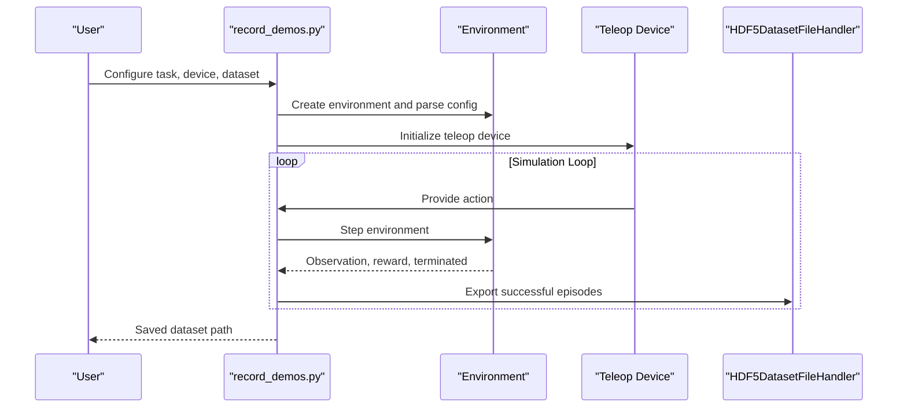

**Diagram sources**
- [record_demos.py:379-490](file://scripts/tools/record_demos.py#L379-L490)
- [hdf5_dataset_file_handler.py:32-37](file://source/isaaclab/isaaclab/utils/datasets/hdf5_dataset_file_handler.py#L32-L37)

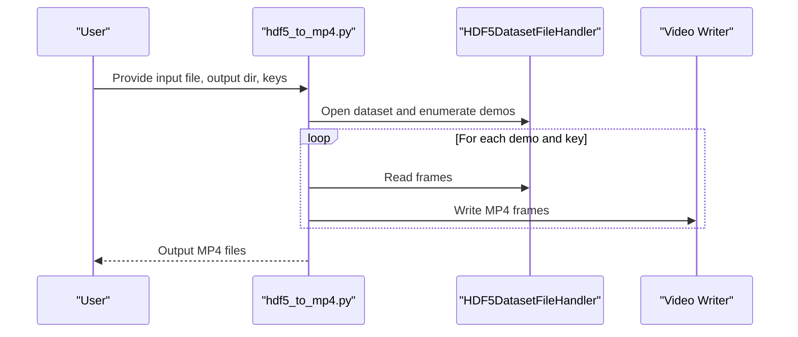

**Diagram sources**
- [hdf5_to_mp4.py:180-206](file://scripts/tools/hdf5_to_mp4.py#L180-L206)
- [hdf5_dataset_file_handler.py:32-37](file://source/isaaclab/isaaclab/utils/datasets/hdf5_dataset_file_handler.py#L32-L37)

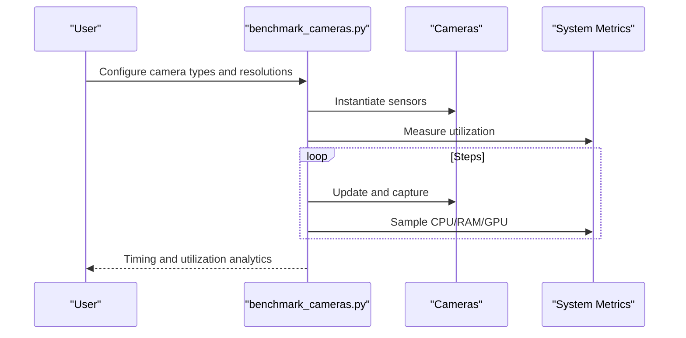

**Diagram sources**
- [benchmark_cameras.py:581-732](file://scripts/benchmarks/benchmark_cameras.py#L581-L732)

## Detailed Component Analysis

### Video Recording System
The recording system captures demonstrations with teleoperation, exports successful episodes, and supports XR configurations.

Key behaviors:
- Environment configuration: disable timeouts, enable action/state recording, set export mode
- Teleop device setup: keyboard, spacemouse, or handtracking (XR)
- Success condition handling: marks episodes successful after sustained success steps
- Rate limiting: optional FPS control for deterministic capture

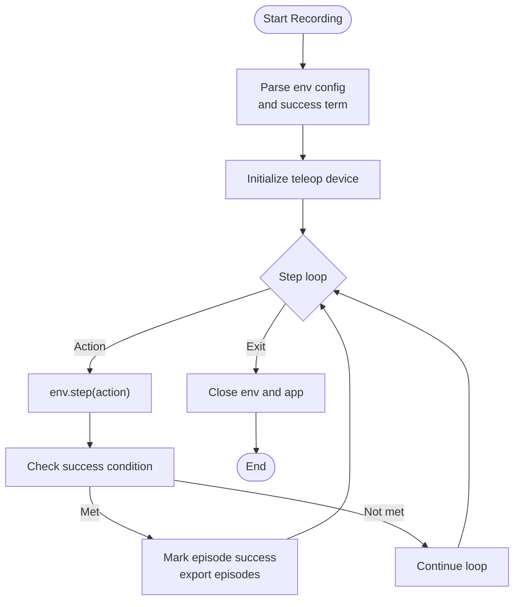

**Diagram sources**
- [record_demos.py:379-490](file://scripts/tools/record_demos.py#L379-L490)

Practical configuration examples:
- Select teleop device and dataset path
- Set stepping rate and success step threshold
- Enable XR and DLSS antialiasing for VR

**Section sources**
- [record_demos.py:34-60](file://scripts/tools/record_demos.py#L34-L60)
- [record_demos.py:169-224](file://scripts/tools/record_demos.py#L169-L224)
- [record_demos.py:318-350](file://scripts/tools/record_demos.py#L318-L350)
- [record_demos.py:493-536](file://scripts/tools/record_demos.py#L493-L536)

### Dataset Abstraction and Handlers
Unified dataset interface for reading and writing episodes.

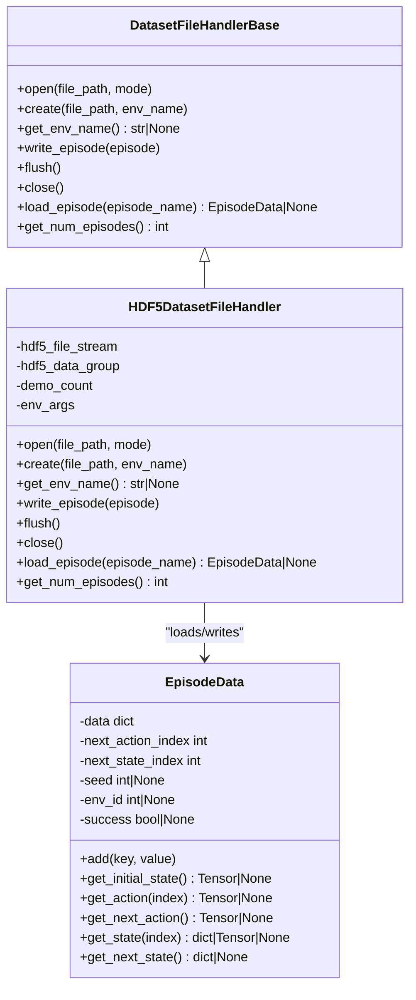

**Diagram sources**
- [dataset_file_handler_base.py:18-64](file://source/isaaclab/isaaclab/utils/datasets/dataset_file_handler_base.py#L18-L64)
- [hdf5_dataset_file_handler.py:22-37](file://source/isaaclab/isaaclab/utils/datasets/hdf5_dataset_file_handler.py#L22-L37)
- [episode_data.py:16-177](file://source/isaaclab/isaaclab/utils/datasets/episode_data.py#L16-L177)

**Section sources**
- [hdf5_dataset_file_handler.py:32-37](file://source/isaaclab/isaaclab/utils/datasets/hdf5_dataset_file_handler.py#L32-L37)
- [episode_data.py:92-124](file://source/isaaclab/isaaclab/utils/datasets/episode_data.py#L92-L124)

### Video Conversion Workflows
Two-way conversion between HDF5 demonstrations and MP4 videos.

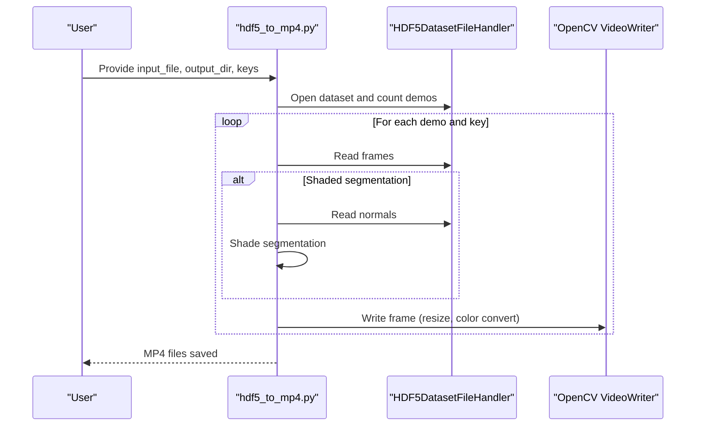

**Diagram sources**
- [hdf5_to_mp4.py:98-164](file://scripts/tools/hdf5_to_mp4.py#L98-L164)

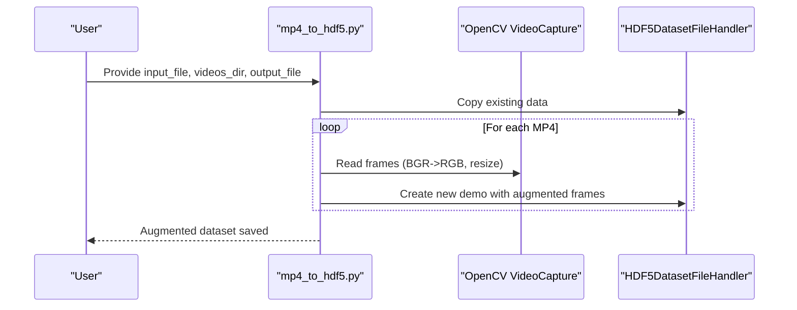

**Diagram sources**
- [mp4_to_hdf5.py:96-134](file://scripts/tools/mp4_to_hdf5.py#L96-L134)

Practical usage:
- Convert specific modalities (RGB, segmentation, normals, shaded segmentation, depth)
- Control output resolution and framerate
- Merge multiple datasets into a single HDF5

**Section sources**
- [hdf5_to_mp4.py:51-95](file://scripts/tools/hdf5_to_mp4.py#L51-L95)
- [hdf5_to_mp4.py:180-206](file://scripts/tools/hdf5_to_mp4.py#L180-L206)
- [mp4_to_hdf5.py:32-56](file://scripts/tools/mp4_to_hdf5.py#L32-L56)
- [mp4_to_hdf5.py:136-173](file://scripts/tools/mp4_to_hdf5.py#L136-L173)
- [merge_hdf5_datasets.py:23-43](file://scripts/tools/merge_hdf5_datasets.py#L23-L43)

### Benchmarking Tools
Performance measurement for cameras, robot loading, and simulation efficiency.

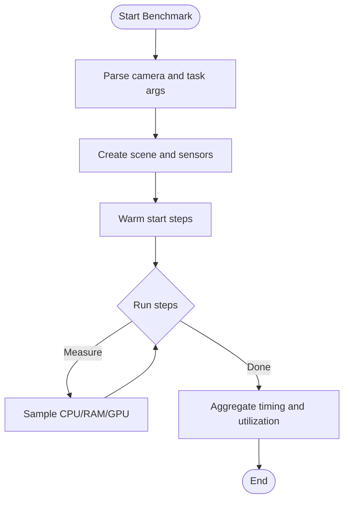

**Diagram sources**
- [benchmark_cameras.py:581-732](file://scripts/benchmarks/benchmark_cameras.py#L581-L732)

Key capabilities:
- Camera throughput: tiled, standard, and ray-caster cameras
- Auto-tuning: incrementally increase camera count until thresholds
- Robot loading: measure per-step time across robot types and env counts
- Simulation efficiency: step timing and system utilization

**Section sources**
- [benchmark_cameras.py:34-100](file://scripts/benchmarks/benchmark_cameras.py#L34-L100)
- [benchmark_cameras.py:735-751](file://scripts/benchmarks/benchmark_cameras.py#L735-L751)
- [benchmark_load_robot.py:143-170](file://scripts/benchmarks/benchmark_load_robot.py#L143-L170)

### Policy Evaluation and Comparative Analysis
Robust evaluation and KPI aggregation for ablation comparisons.

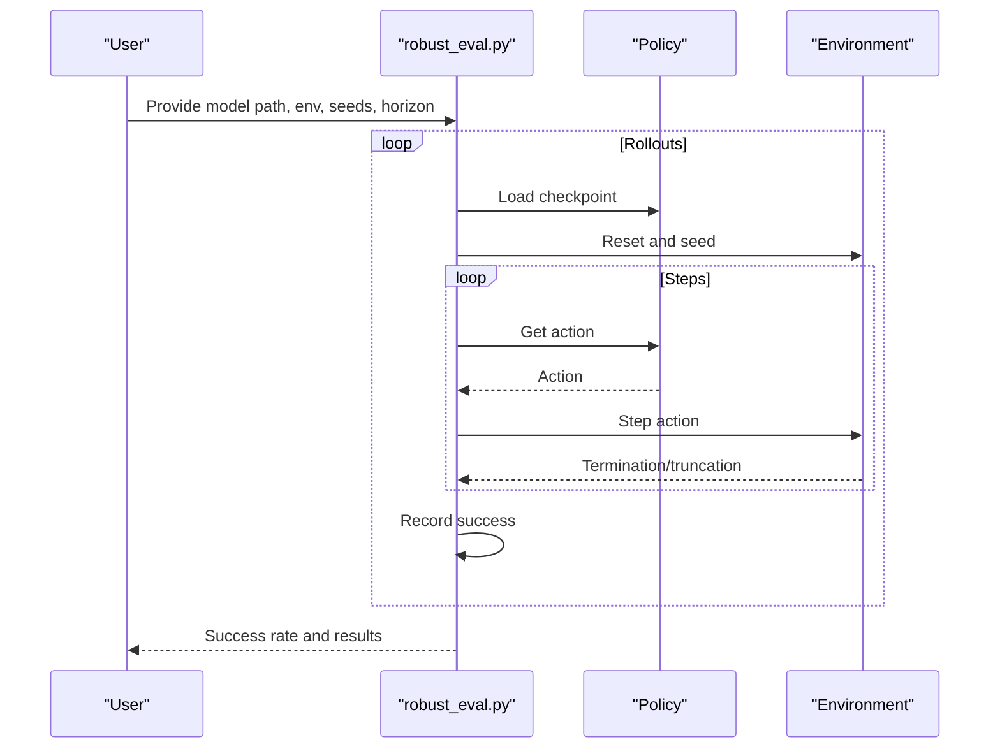

**Diagram sources**
- [robust_eval.py:156-216](file://scripts/imitation_learning/robomimic/robust_eval.py#L156-L216)

KPI aggregation and thresholds:
- Aggregate success/failure counts across workflows
- Normalize rewards and compare against thresholds
- Tag and timestamp results for traceability

**Section sources**
- [robust_eval.py:156-216](file://scripts/imitation_learning/robomimic/robust_eval.py#L156-L216)
- [env_benchmark_test_utils.py:66-98](file://source/isaaclab_tasks/test/benchmarking/env_benchmark_test_utils.py#L66-L98)
- [env_benchmark_test_utils.py:101-133](file://source/isaaclab_tasks/test/benchmarking/env_benchmark_test_utils.py#L101-L133)

### Statistical Analysis Procedures
Statistical tests and result interpretation for ablation variants.

Recommended procedures:
- Compare success rates across ablation groups using appropriate statistical tests (e.g., proportion tests)
- Evaluate early termination metrics (precision/recall) for early success detection
- Aggregate KPIs and compute confidence intervals for robustness analysis

Example metrics:
- Early termination precision/recall at thresholds
- Normalized reward and threshold comparisons
- Success rate distributions across models

**Section sources**
- [forge_env.py:368-383](file://source/isaaclab_tasks/isaaclab_tasks/direct/forge/forge_env.py#L368-L383)
- [env_benchmark_test_utils.py:66-98](file://source/isaaclab_tasks/test/benchmarking/env_benchmark_test_utils.py#L66-L98)

## Dependency Analysis
Inter-module dependencies and coupling:

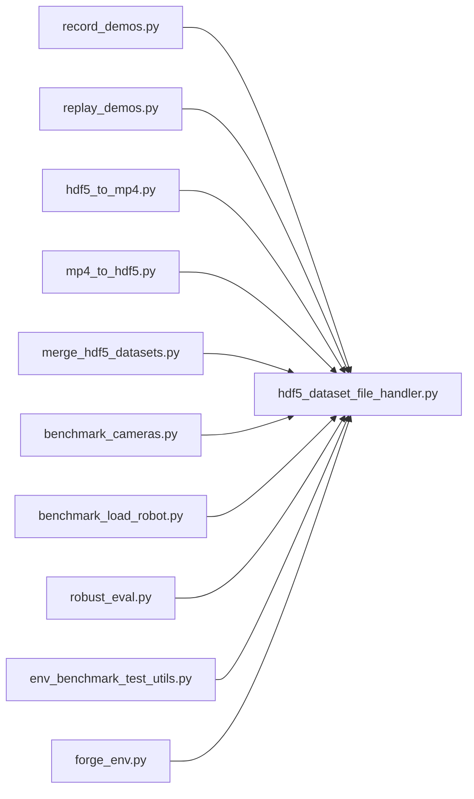

**Diagram sources**
- [record_demos.py:104-110](file://scripts/tools/record_demos.py#L104-L110)
- [replay_demos.py:65-71](file://scripts/tools/replay_demos.py#L65-L71)
- [hdf5_to_mp4.py:26-32](file://scripts/tools/hdf5_to_mp4.py#L26-L32)
- [mp4_to_hdf5.py:23-29](file://scripts/tools/mp4_to_hdf5.py#L23-L29)
- [merge_hdf5_datasets.py:6-8](file://scripts/tools/merge_hdf5_datasets.py#L6-L8)
- [benchmark_cameras.py:252-263](file://scripts/benchmarks/benchmark_cameras.py#L252-L263)
- [benchmark_load_robot.py:53-59](file://scripts/benchmarks/benchmark_load_robot.py#L53-L59)
- [robust_eval.py:156-186](file://scripts/imitation_learning/robomimic/robust_eval.py#L156-L186)
- [env_benchmark_test_utils.py:66-98](file://source/isaaclab_tasks/test/benchmarking/env_benchmark_test_utils.py#L66-L98)
- [forge_env.py:368-383](file://source/isaaclab_tasks/isaaclab_tasks/direct/forge/forge_env.py#L368-L383)

Observations:
- Strong cohesion around dataset abstractions; all tools depend on HDF5 handlers
- Low coupling between conversion and benchmarking modules
- Clear separation of concerns: recording/replaying vs. conversion vs. benchmarking

**Section sources**
- [hdf5_dataset_file_handler.py:22-37](file://source/isaaclab/isaaclab/utils/datasets/hdf5_dataset_file_handler.py#L22-L37)
- [episode_data.py:16-27](file://source/isaaclab/isaaclab/utils/datasets/episode_data.py#L16-L27)

## Performance Considerations
- Camera throughput: use a single camera type per benchmark; leverage DLSS for XR; tune resolution and data types
- Robot loading: scale env counts and measure per-step time; cache assets and use fabric I/O where applicable
- Dataset I/O: compress datasets with gzip; chunk large arrays; prefer streaming reads/writes
- Conversion: batch process demos; reuse resized frames when possible; choose appropriate codecs

[No sources needed since this section provides general guidance]

## Troubleshooting Guide
Common issues and resolutions:
- Missing environment name in dataset: ensure dataset is created with proper env metadata
- Zero episodes found: verify dataset path and demo IDs
- State mismatch during replay: single-env validation only; ensure identical initial states
- Camera benchmark conflicts: benchmark one camera type at a time; adjust thresholds
- Robot load timeouts: reduce env count or simplify assets; verify device selection

**Section sources**
- [hdf5_dataset_file_handler.py:208-214](file://source/isaaclab/isaaclab/utils/datasets/hdf5_dataset_file_handler.py#L208-L214)
- [replay_demos.py:120-140](file://scripts/tools/replay_demos.py#L120-L140)
- [benchmark_cameras.py:738-751](file://scripts/benchmarks/benchmark_cameras.py#L738-L751)
- [benchmark_load_robot.py:143-170](file://scripts/benchmarks/benchmark_load_robot.py#L143-L170)

## Conclusion
The visualization and analysis toolkit provides a complete pipeline for ablation studies:
- Reliable recording and replay of demonstrations
- Flexible conversion between HDF5 and MP4 for visualization and augmentation
- Comprehensive benchmarking for camera and robot performance
- Robust evaluation and KPI aggregation for comparative analysis

These components integrate seamlessly with the broader ablation framework to support reproducible research and efficient experimentation.

[No sources needed since this section summarizes without analyzing specific files]

## Appendices

### Practical Examples

- Video capture configuration
  - Select teleoperation device and dataset path
  - Set stepping rate and success step threshold
  - Enable XR and DLSS antialiasing for VR

  **Section sources**
  - [record_demos.py:34-60](file://scripts/tools/record_demos.py#L34-L60)
  - [record_demos.py:169-224](file://scripts/tools/record_demos.py#L169-L224)

- Data export workflows
  - Convert HDF5 to MP4 for visualization
  - Merge multiple datasets into a single HDF5
  - Augment existing datasets with visually enhanced videos

  **Section sources**
  - [hdf5_to_mp4.py:180-206](file://scripts/tools/hdf5_to_mp4.py#L180-L206)
  - [merge_hdf5_datasets.py:23-43](file://scripts/tools/merge_hdf5_datasets.py#L23-L43)
  - [mp4_to_hdf5.py:136-173](file://scripts/tools/mp4_to_hdf5.py#L136-L173)

- Performance analysis procedures
  - Benchmark camera throughput with controlled settings
  - Measure robot loading times across env counts
  - Analyze simulation efficiency and system utilization

  **Section sources**
  - [benchmark_cameras.py:581-732](file://scripts/benchmarks/benchmark_cameras.py#L581-L732)
  - [benchmark_load_robot.py:96-170](file://scripts/benchmarks/benchmark_load_robot.py#L96-L170)

- Visualization optimization and storage
  - Use appropriate resolutions and framerates
  - Compress datasets and chunk arrays
  - Store MP4s with consistent naming conventions

  **Section sources**
  - [hdf5_to_mp4.py:75-91](file://scripts/tools/hdf5_to_mp4.py#L75-L91)
  - [mp4_to_hdf5.py:117-134](file://scripts/tools/mp4_to_hdf5.py#L117-L134)
  - [assets/videos/README.md](file://assets/videos/README.md)