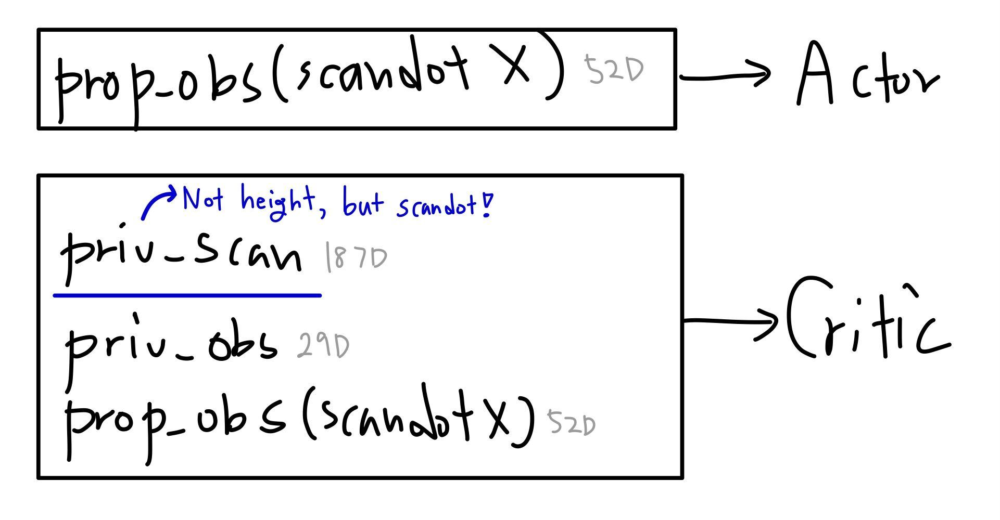
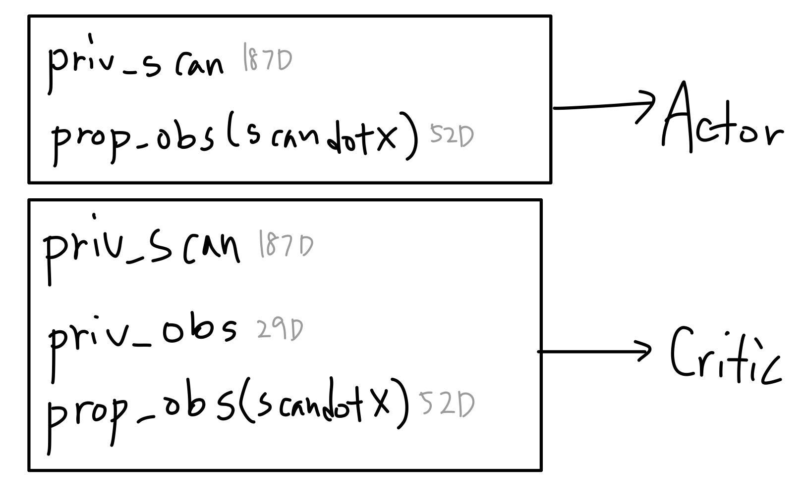
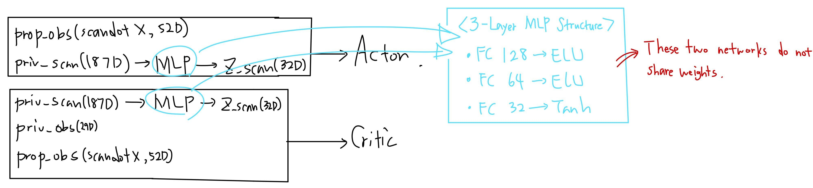
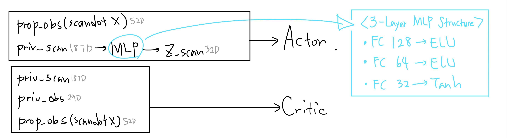
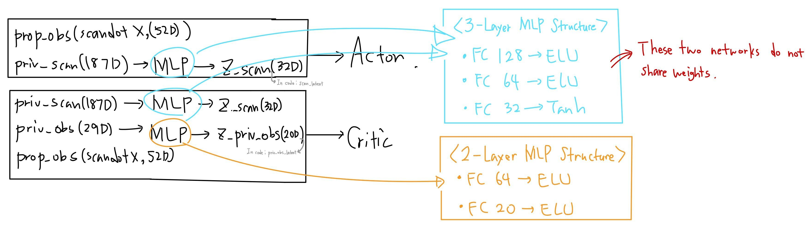

# Go2 Extreme Parkour Network Ablation (Unified)

This branch consolidates the five Parkour Step network ablations into one codebase and exposes them as task IDs.

## Task IDs (Train / Play)
- Abl 1: `Go2-Rough-Direct-Abl1-v0` 
- Abl 2.5: `Go2-Rough-Direct-Abl2_5-v0` 
- Abl 3.5: `Go2-Rough-Direct-Abl3_5-v0` 
- Abl 4.0: `Go2-Rough-Direct-Abl4_0-v0` 
- Abl 7.0: `Go2-Rough-Direct-Abl7_0-v0` 

## Ablation Mapping
- Abl 1: Actor = prop_obs only; Critic = prop_obs + priv_obs + raw scan
- Abl 2.5: Actor = prop_obs + raw scan; Critic = prop_obs + priv_obs + raw scan
- Abl 3.5: Actor = prop_obs + scan encoding; Critic = prop_obs + priv_obs + scan encoding
- Abl 4.0: Actor = prop_obs + scan encoding; Critic = prop_obs + priv_obs + raw scan
- Abl 7.0: Actor = prop_obs + scan encoding; Critic = prop_obs + priv_obs encoding + scan encoding

## Network Diagrams
Ablation-specific network diagrams are shown below.

| Abl 1 | Abl 2.5 | Abl 3.5 |
| --- | --- | --- |
| <a href="assets/diagrams/Abl1-NetworkDiagram.jpg"></a> | <a href="assets/diagrams/Abl2.5-NetworkDiagram.jpg"></a> | <a href="assets/diagrams/Abl3.5-NetworkDiagram.jpg"></a> |

| Abl 4.0 | Abl 7.0 |  |
| --- | --- | --- |
| <a href="assets/diagrams/Abl4.0-NetworkDiagram.jpg"></a> | <a href="assets/diagrams/Abl7.0-NetworkDiagram.jpg"></a> | &nbsp; |

## Prerequisites
- Isaac Lab 2.2.0 (see `VERSION`) and a compatible Isaac Sim install
- Python 3.11 (see `environment.yml`)
- GPU recommended; 4096 envs is heavy, reduce `--num_envs` if needed
- Optional visuals: set `NVIDIA_NUCLEUS_DIR` to resolve the terrain material MDL path

## Setup
```bash
./isaaclab.sh -c
./isaaclab.sh -i
```
Use your existing Isaac Lab environment if you already have one configured.

## Project Layout
- `source/isaaclab_tasks/isaaclab_tasks/direct/go2/go2_env_cfg.py`: terrain generator, reward scales, curriculum/command defaults, ablation env toggles
- `source/isaaclab_tasks/isaaclab_tasks/direct/go2/go2_env.py`: observations, rewards, curriculum logic, DR buffers
- `source/isaaclab_tasks/isaaclab_tasks/direct/go2/agents/rsl_rl_ppo_cfg.py`: PPO runner configs, ablation policies, experiment names
- `source/isaaclab_tasks/isaaclab_tasks/direct/go2/agents/actor_critic_scan.py`: scan and priv_obs encoder model
- `source/isaaclab_tasks/isaaclab_tasks/direct/go2/__init__.py`: Gym task registrations

## Observation and Reward Specs
Obs dimensions
- prop_obs: 52D (joint pos(12D)/vel(12D), projected gravity(3D), root lin vel(3D)/ang vel(3D), commands(3D), last action(12D), foot contacts(4D))
- priv_obs (critic only): 29D (mass(1D), COM(3D), friction coeff(1D), P gain scale(12D), D gain scale(12D))
- scan_obs: 187D height grid (1.6 x 1.0 m, 0.1 m resolution)

Ordering
- Default: policy = prop || scan; critic = prop || priv || scan
- Abl 2.5: scan-first for both policy and critic

Rewards
- Tracking + penalties with a positive-work clamp (only positive work is penalized)
- Base height uses mean ground height on rough terrain

## Notes
- Training defaults: fixed command (1.0, 0.0, 0.0) with heading range fixed to 0; change in `Go2RoughEnvCfg` if needed
- Play config exists (curriculum off, seed 424242), but experiments here used training task IDs instead of the `-Play` tasks

## Related Work / References
This study is informed by prior work on rough-terrain locomotion and parkour.
- Extreme Parkour with Legged Robots (arXiv 2309.14341): https://arxiv.org/abs/2309.14341
  - Project page: https://extreme-parkour.github.io/
- RMA: Rapid Motor Adaptation for Legged Robots (arXiv 2107.04034): https://arxiv.org/abs/2107.04034
  - Project page: https://ashish-kmr.github.io/rma-legged-robots/

## Supplementary Notes (personal)
- RMA Network analysis (personal Notion notes, access required):
  https://www.notion.so/25-11-19-RMA-Network-Analysis_Yobel-2f5e984087b58013b2dacfeee267bea0?source=copy_link
- Extreme Parkour Network diagram summary (Google Drive, access required):
  https://drive.google.com/file/d/1aBpNZQSTxw7dldBADfKyijppc1p9bI52/view?usp=drive_link

## Ablation 3.5 (Best) — Videos on Hardest Terrains
Representative clips are shown below. Full-length videos are available in [assets/videos](assets/videos), or via the [YouTube playlist](https://youtube.com/playlist?list=PLMfdNA5tlSuF_zqpKWSvuehUrbpUF3B6v&si=zDtuemx5VZ0MdzE0).
- Parkour Step (level 9)
  - 

- Gap (level 9)
  - 

## Results Summary 
Common setup
- Terrain: 18 columns (7 types) x 10 levels; hardest tiles are Gap + Parkour Step
- Train: 4096 envs, 20000 iterations; heading fixed (0 rad); collisions enabled; curriculum learning
- Reward: Test25 scale; positive-work clamp to avoid rewarding negative work

Terrain types (generator mix)
| Terrain | Description | Ranges / Params (m) |
| --- | --- | --- |
| boxes | scattered box bumps | bump height: 0.025-0.10 |
| random_rough | noisy rough surface | noise amp: 0.01-0.06 (step 0.01) |
| debris_field | sparse rocks/boxes/cylinders | count: 20-40; box L/W/T: 0.5-2.0 / 0.2-0.6 / 0.05-0.25; cyl R/L: 0.05-0.20 / 0.5-2.0 |
| gap_bar | run-up then gaps | gap width: 0.1-0.8; landing: 0.45; run-up: 8.0 |
| hurdle_strip | repeated hurdles | hurdle height: 0.05-0.30; gap: 0.7-2.0; thickness: 0.2; run-up: 3.0 |
| stairs_strip | up/down stairs | step height: 0.05-0.23; segment: 5.0; steps: 10; run-up: 3.0 |
| parkour_step | extreme stepping stones | step height: 0.1-0.45; step length: 0.3-1.5; steps: 6; run-up: 3.0 |

Findings
- Abl 3.5 yields the **best mean reward and velocity tracking**; most stable in sim on Gap + Parkour Step (Hardest Terrains)
- Abl 1 fails due to blind walking (no scan access)
- Abl 2.5 struggles with high-dimensional raw scan (feature extraction issue)
- Abl 4.0 degrades due to critic receiving raw scan (noisy value estimation)
- Abl 7.0 degrades due to priv_obs encoding (constants overfitting)

Conclusion
- Use scan encoding for both actor and critic
- Avoid priv_obs encoding for critic

## Train (for lighter training without rendering, add --headless)
- Abl 1: Actor = prop_obs only; Critic = prop_obs + priv_obs + raw scan
  ```bash
  ./isaaclab.sh -p scripts/reinforcement_learning/rsl_rl/train.py \
    --task Go2-Rough-Direct-Abl1-v0 \
    --num_envs 4096
  ```

- Abl 2.5: Actor = prop_obs + raw scan; Critic = prop_obs + priv_obs + raw scan
  ```bash
  ./isaaclab.sh -p scripts/reinforcement_learning/rsl_rl/train.py \
    --task Go2-Rough-Direct-Abl2_5-v0 \
    --num_envs 4096
  ```

- Abl 3.5(**Best**): Actor = prop_obs + scan encoding; Critic = prop_obs + priv_obs + scan encoding
  ```bash
  ./isaaclab.sh -p scripts/reinforcement_learning/rsl_rl/train.py \
    --task Go2-Rough-Direct-Abl3_5-v0 \
    --num_envs 4096
  ```

- Abl 4.0: Actor = prop_obs + scan encoding; Critic = prop_obs + priv_obs + raw scan
  ```bash
  ./isaaclab.sh -p scripts/reinforcement_learning/rsl_rl/train.py \
    --task Go2-Rough-Direct-Abl4_0-v0 \
    --num_envs 4096
  ```

- Abl 7.0: Actor = prop_obs + scan encoding; Critic = prop_obs + priv_obs encoding + scan encoding
  ```bash
  ./isaaclab.sh -p scripts/reinforcement_learning/rsl_rl/train.py \
    --task Go2-Rough-Direct-Abl7_0-v0 \
    --num_envs 4096
  ```

## Play / Validate (Change the Abl Number OR num_envs)
```bash
./isaaclab.sh -p scripts/reinforcement_learning/rsl_rl/play.py \
  --task Go2-Rough-Direct-Abl3_5-v0 \
  --num_envs 50 \
  --load_run <run_dir_name> \
  --checkpoint <checkpoint_file>
```
> Notes : You can change the max_init_terrain_level just by adding "env.terrain.max_init_terrain_level=9"

## Logs and Checkpoints
- Logs: `logs/rsl_rl/<experiment_name>/` (see `source/isaaclab_tasks/isaaclab_tasks/direct/go2/agents/rsl_rl_ppo_cfg.py`)
- Use `--load_run` and `--checkpoint` with `play.py` to evaluate a specific run
